# C++ 树进阶系列之平衡二叉查找树AVL的自平衡算法


## 1. 前言

**树的深度与性能的关系。**

在`二叉排序树`上进行查找时，其`时间复杂度`理论上接近`二分算法`的时间复杂度`O(logn)`。

但是，这里有一个问题，如果数列中的数字顺序不一样时，构建出来的二叉排序树的深度会有差异性，对最后评估时间性能会有影响。

如有数列 `[36,45,67,28,20,40]`，其构建的二叉排序树如下图。

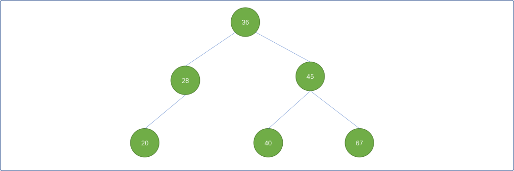

基于上面的树结构，查询任何一个结点的次数不会超过 `3` 次。

稍调整一下数列中数字的顺序 `[20,28,36,40,45,67]`，由此构建出来的树结构会出现一边倒的现象，即增加了树的深度。此棵树的深度为`6`，最多查询次数是 `6` 次。

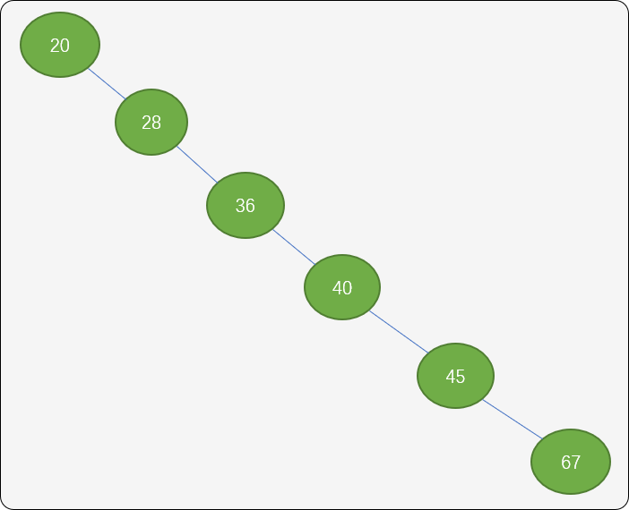

可知，**二叉树上的查询时间与树的深度有关**，所以，减少查找次数的最好办法，就是尽可能维护树左右子树之间的对称性，也就让其有平衡性。

**什么是平衡二叉排序树？**

所谓`平衡二叉排序树`，顾名思义，基于二叉排序树的基础之上，维护任一结点的左子树和右子树之间的深度之差不超过 `1`。把二叉树上任一结点的左子树深度减去右子树深度的值称为该结点的`平衡因子`。

我们经常说的平衡树指`AVL树`，是`Adelson-Velskii`和`Landis`在`1962`年提出的，它的定义如下：

- 一颗空的二叉树就`AVL`树。
- 如果`T`是一颗非空的二叉树，`TL`和`TR`是其左子树和右子树，如果`TL`和`TR`是`AVL`树且`|hL-hR|<=1`，其中`hL和hR`指`TL`和`TR`的高。那么`T`树一定是平衡二叉树。

平衡树的平衡因子只可能是：

- `0` ：左、右子树深度一样。
- `1`：左子树深度大于右子树。
- `-1`：左子树深度小于右子树。

如下图，就是`平衡二叉排序树`，根结点的左右子树深度相差为 `0`， 结点 `28` 的左右子树深度为 `1`，结点 `45` 的左右子树深度相差为 `0`。

> **Tips：** 叶结点的平衡因子为`0`。

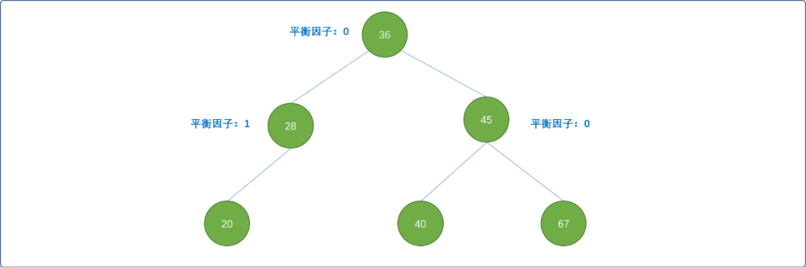

**平衡树的意义何在？**

平衡二叉树能保证在树上操作的时间复杂度始终为`O(logn)`。

平衡二叉排序树本质还是二叉排序树，在此基础之上，其 `API` 多了维持平衡的算法。

## 2. 平衡算法

### 2.1  平衡二叉排序树的抽象数据结构

**结点类：**

```cpp
#include <iostream>
using namespace std;
/*
*结点类
*/
template<typename T>
struct TreeNode {
 //结点上附加的值
 T value;
 //左子结点
 TreeNode<T>* leftChild;
 //右子结点
 TreeNode<T>* rightChild;
 //平衡因子，默认值为 0
 int  balance;
 //无参构造
 TreeNode() {
  this->leftChild=NULL;
  this->rightChild=NULL;
  this->balance=0;
 }
 //有参构造
 TreeNode(T value) {
  this->value=value;
  this->leftChild=NULL;
  this->rightChild=NULL;
  this->balance=0;
 }
};
```

**二叉平衡排序树类：** 主要强调维持自平衡的特征函数。

```cpp
/*
*树类
*/
template<typename T>
class BalanceTree {
 private:
  //根结点
  TreeNode<T>* root;
 public:
  
  BalanceTree(T value) {
   this->root=new TreeNode<T>(value);
  }
  
  TreeNode<T>* getRoot(){
   return this->root;
  }

  /*
  *LL型调整
  */
  TreeNode<T>* llRotate(TreeNode<T>* node);

  /*
  *RR 型调整
  */
  TreeNode<T>* rrRotate(TreeNode<T>* node);

  /*
  *LR型调整
  */
  TreeNode<T>* lrRotate(TreeNode<T>* node);

  /*
  *RL型调整
  */
  TreeNode<T>* rlRotate(TreeNode<T>* node);

  /*
  *插入新结点
  */
  void insert(T value);

  /*
  *中序遍历
  */
  void inorderTraversal(TreeNode<T>* root);

  bool isEmpty() {
   return this->root==NULL;
  }
};
```

在插入或删除结点时，如果导致树结构发生了不平衡性，则需要调整让其达到平衡。这里的方案可以有 `4`种。

### 2.2  `LL`型调整（顺时针）

**左边不平衡时，向右边旋转。**

如下图所示，现在根结点 `36` 的平衡因子为 `1`。

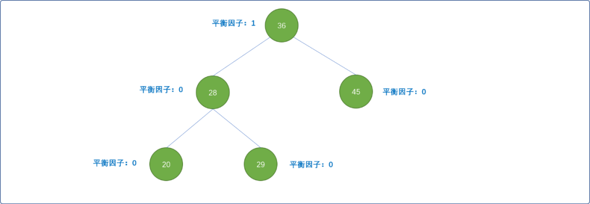

当插入值为 `18` 结点，定然是要作为结点 `20` 的左子结点，才能维持二叉排序树的有序性，但是破坏了根结点的平衡性。根结点的左子树深度变成 `3`，右子树深度为`1`，平衡性被打破，结点 `36` 的平衡因子变成了`2`。

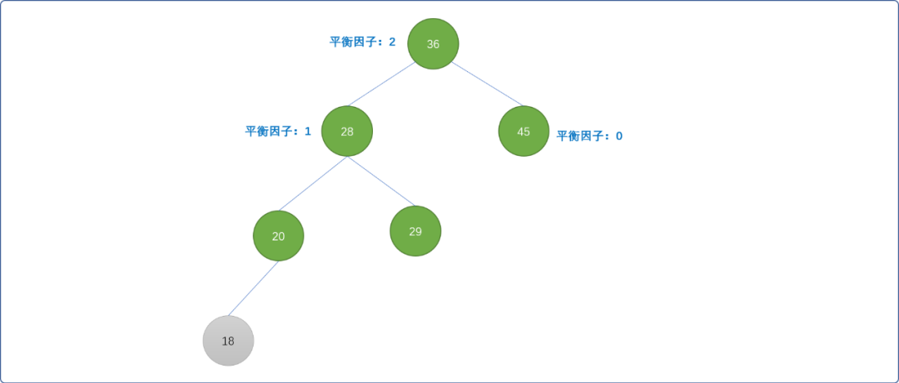

怎样旋转才能让树继续保持平衡？

旋转思路是既然左边不平衡，必然是左高右低，向右旋转（顺时针）方能维持平衡。

- 让结点 `28` 成为新根结点，结点`36`成为结点`28`的左子结点（降维左子树）。

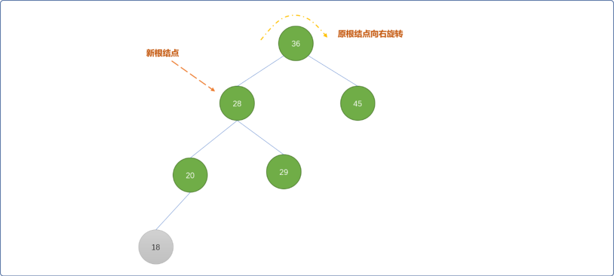

- 新根结点的右子树`29`成为原根结点`36`的新左子结点。


- 原根结点成为新根结点的右子树。

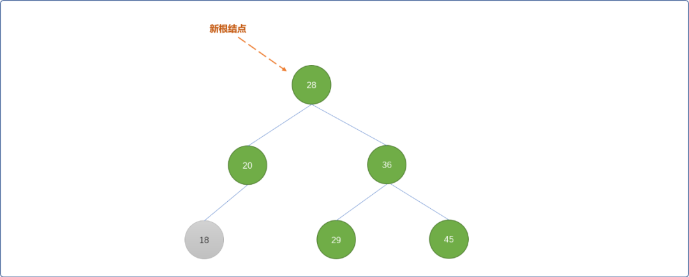

旋转后，树结构即满足了有序性，也满足了平衡性。

**`LL` 旋转算法具体实现：**

```cpp
/*
*LL型调整
*/
template<typename T>
TreeNode<T>* BalanceTree<T>::llRotate(TreeNode<T>* parentRoot) {
 //原父结点的左子结点成为新父结点
 TreeNode<T>*  newparentRoot =parentRoot->leftChild;
 // 新父结点的右子结点成为原父结点的左子结点
 parentRoot->leftChild = newparentRoot->rightChild;
 // 原父结点成为新父结点的右子结点
 newparentRoot->rightChild =parentRoot;
 // 重置平衡因子
 parentRoot->balance = 0;
 newparentRoot->balance = 0;
 return newparentRoot;
}
```

### 2.3  RR 型调整(逆时针旋转)

`RR`旋转和 `LL`旋转的算法差不多，只是当右边不平衡时，向左边旋转。

如下图所示，结点 `50` 插入后，树的平衡性被打破。

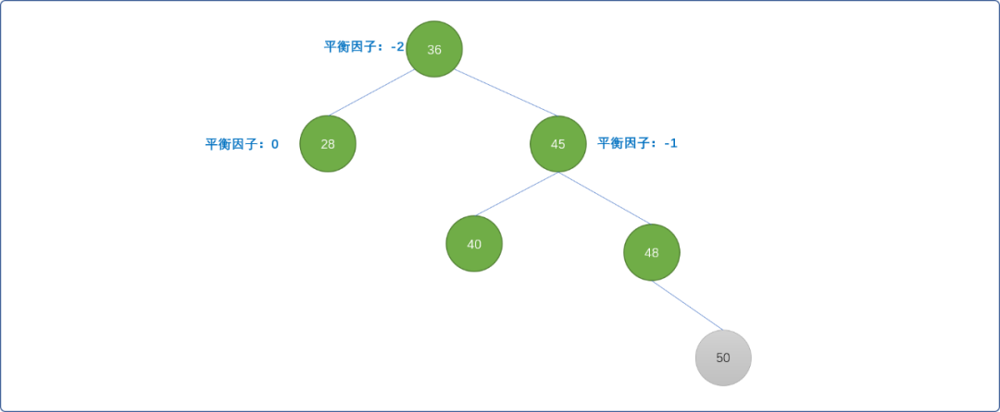

这里使用左旋转（逆时针）方案。

- 结点`45`成为新根结点，原根结点 `36`向左旋转，将成为根结点 `45` 的左子结点。


- 先将结点`45` 原来的左子结点成为结点`36`的右子结点。

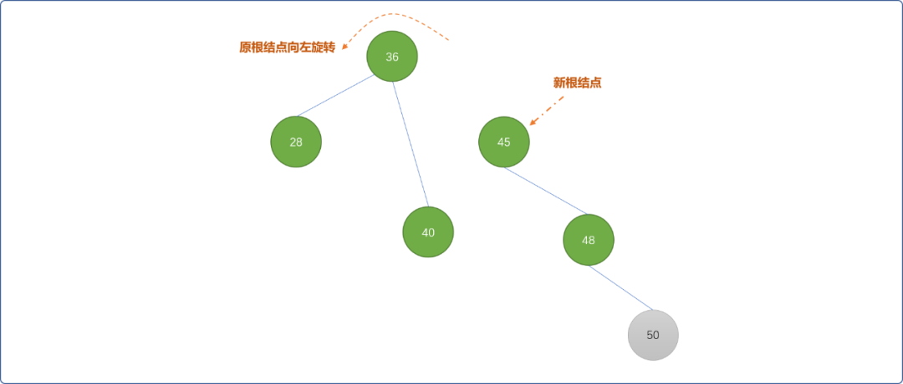

- 再将原根结点作为新根结点的左子结点。逆时针旋转后，结点`45`的平衡因子为 `0`，结点`36`的平衡因子为`0`，结点 `48` 的平衡因子为 `-1`。树的有序性和平衡性得到保持。

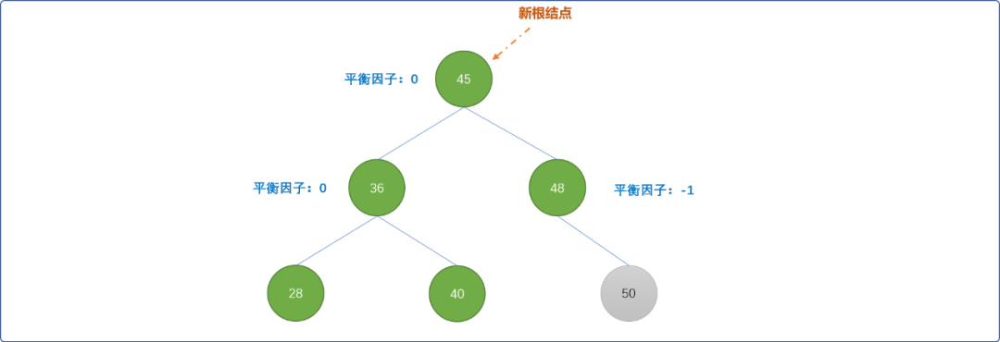

`RR` 旋转算法具体实现：

```cpp
/*
*RR 型调整
*/
template<typename T>
TreeNode<T>* BalanceTree<T>::rrRotate(TreeNode<T>* parentNode) {
 // 右子结点
 TreeNode<T>* newParentNode = parentNode->rightChild;
 parentNode->rightChild = newParentNode->leftChild;
 //原父结点成为新父结点的左子树
 newParentNode->leftChild = parentNode;
 // 重置平衡因子
 parentNode->balance = 0;
 newParentNode->balance = 0;
 return newParentNode;
}
```

### 2.4  LR型调整（先逆后顺）

如下图当插入结点 `28` 后，结点 `36` 的平衡因子变成 `2`，则可以使用 `LR` 旋转算法。

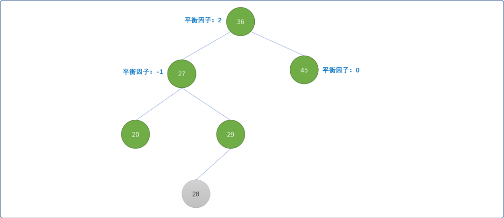

- 以结点 `29` 作为新的根结点，结点`27`以结点`29`为旋转中心，逆时针旋转。

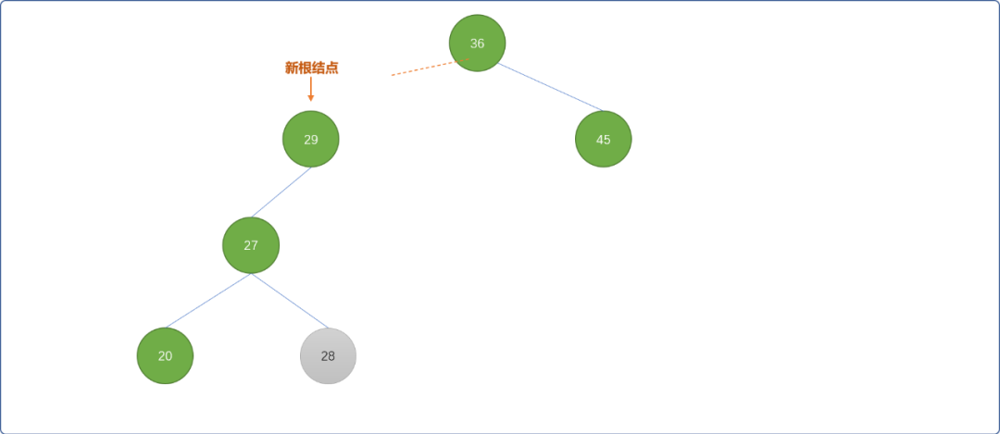

- 结点`36`以结点`29`为旋转中心向顺时针旋转。

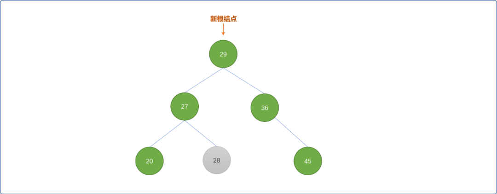

最后得到的树还是一棵`二叉平衡排序树`。

`LR` 旋转算法实现：

```cpp
/*
*LR型调整
*/
template<typename T>
TreeNode<T>* BalanceTree<T>::lrRotate(TreeNode<T>* p_node) {
 // 原根结点的左子结点
 TreeNode<T>* b = p_node->leftChild;
 //得到新的根结点
 TreeNode<T>* new_p_node = b->rightChild;
 //更新原根结点的左子结点
 p_node->leftChild = new_p_node->rightChild;
 b->rightChild = new_p_node->leftChild;
 //更新新根结点的左子结点
 new_p_node->leftChild = b;
 // 更新新根结点的右子结点
 new_p_node->rightChild = p_node;
 //重置平衡因子
 if (new_p_node->balance == 1) {
  p_node->balance = -1;
  b->balance = 0;
 } else if (new_p_node->balance == -1) {
  p_node->balance = 0;
  b->balance = 1;
 } else {
  p_node->balance = 0;
  b->balance = 0;
 }
 new_p_node->balance = 0;
 return new_p_node;
}
```

### 2.5  RL型调整

如下图插入结点`39` 后，整棵树的平衡打破，这时可以使用 `RL` 旋转算法进行调整。

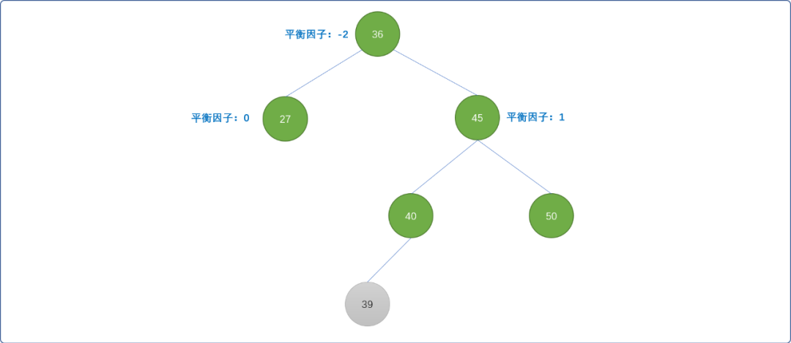

- 把结点`40`设置为新的根结点，结点`45`以结点 `40` 为中心点顺时针旋转，结点`36`逆时针旋转。

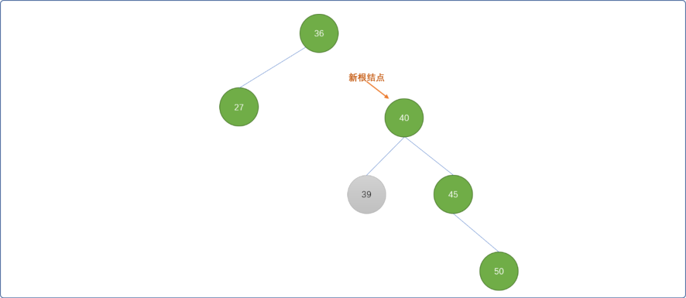

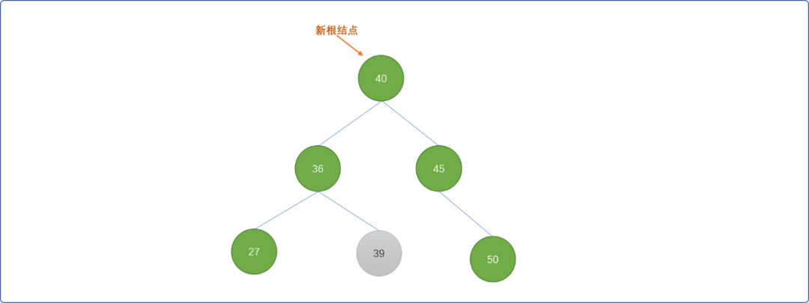

**`RL` 算法具体实现：**

```cpp
/*
*RL型调整
*/
template<typename T>
TreeNode<T>* BalanceTree<T>::rlRotate(TreeNode<T>* p_node) {
 //原根结点的右子树
 TreeNode<T>* b = p_node->rightChild;
 //新根结点
 TreeNode<T>* new_p_node = b->leftChild;
 //更新右子树
 p_node->rightChild = new_p_node->leftChild;
 b->leftChild = new_p_node->rightChild;
 new_p_node->leftChild = p_node;
 new_p_node->rightChild = b;
 if (new_p_node->balance == 1) {
  p_node->balance = 0;
  b->balance = -1;
 } else if (new_p_node->balance == -1) {
  p_node->balance = 1;
  b->balance = 0;
 } else {
  p_node->balance = 0;
  b->balance = 0;
 }
 new_p_node->balance = 0;
 return new_p_node;
}
```

### 2.6 插入算法

编写完平衡算法后，就可以编写插入算法。在插入新结点时，需要检查是否破坏二叉平衡排序树的的平衡性，否则调用平衡算法。

当插入一个结点后，为了保持平衡，需要找到最小不平衡子树。

**什么是最小不平衡子树？**

指离插入结点最近，且平衡因子绝对值大于 `1` 的结点为根结点构成的子树。

如下图所示，树结构整体上是平衡的，但根结点的平衡因子是 `1`，其实是一个脆弱的临界值，插入或删除操作就有可能打破这个平衡因子。


如插入值为  `20` 的结点，因为小于根结点的值，必然会导致从插入位置一路向上，一直到根结点所有直接、间接父结点的平衡因子发生变化。此时，可以把根结点到插入的新结点之间的树称为`最小不平衡子树`。

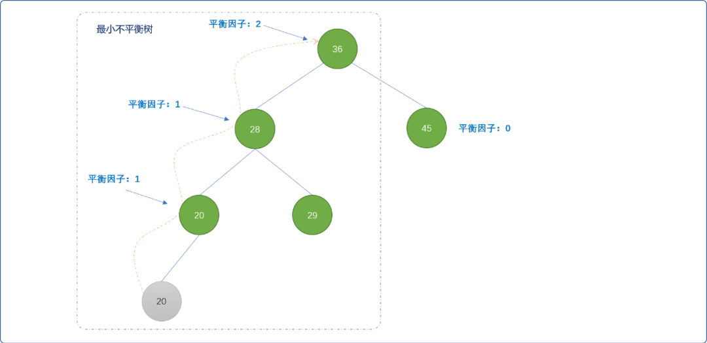

出现了最小不平衡树，就要考虑怎么旋转，方能维持平衡。

```cpp
/*
*插入新结点
*/
template<typename T>
void BalanceTree<T>::insert(T value) {
 // 创建新结点
 TreeNode<T>* new_node =new TreeNode<T>(value);
 if (BalanceTree<T>::root==NULL) {
  //如果是空树
  BalanceTree<T>::root = new_node;
  return;
 }
 //初始设定根结点为最小平衡树
 TreeNode<T>* min_b = BalanceTree<T>::root;
 //存储前驱结点
 TreeNode<T>* f_node = NULL;
 //移动指针
 TreeNode<T>* move_node = this->root;
 TreeNode<T>* f_move_node = NULL;
 //查找
 while (move_node!=NULL) {
  if (move_node->value == value)
   //结点已经存在
   return;
  if (move_node->balance != 0) {
   // 记录最小不平衡子树
   min_b = move_node;
   //记录其前驱
   f_node = f_move_node;
  }
  //移动之前，记录前驱
  f_move_node = move_node;

  if (new_node->value < move_node->value)
     //向左边移动 
            move_node = move_node->leftChild;
  else
            //向右边移动
   move_node = move_node->rightChild;
 }

 if (new_node->value < f_move_node->value)
        //插入在左边
  f_move_node->leftChild = new_node;
 else
        //插入在右边
  f_move_node->rightChild = new_node;
    
    //开始更新最小不平衡树上各父结点的平衡因子
 move_node = min_b;
 // 修改相关结点的平衡因子
 while (move_node != new_node) {
  if (new_node->value < move_node->value) {
   move_node->balance++;
   move_node = move_node->leftChild;
  } else {
   move_node->balance--;
   move_node = move_node->rightChild;
  }
 }

 if (min_b->balance > -2 && min_b->balance < 2)
  //插入结点后没有破坏平衡性
  return;

 TreeNode<T>* b=NULL;
 if (min_b->balance == 2) {
  b = min_b->leftChild;
  if (b->balance == 1)
            //打破平衡，且左边高
   move_node = BalanceTree<T>:: llRotate(min_b);
  else
            //打破平衡，右边高
   move_node = BalanceTree<T>::lrRotate(min_b);
 } else {
  b = min_b->rightChild;
  if (b->balance == 1)
   move_node = BalanceTree<T>::rlRotate(min_b);
  else
   move_node = BalanceTree<T>::rrRotate(min_b);
 }
 if (f_node==NULL)
  BalanceTree<T>::root = move_node;
 else if (f_node->leftChild == min_b)
  f_node->leftChild = move_node;
 else
  f_node->rightChild = move_node;
}
```

也可以在结点类中添加一个指向父指针的成员变量，插入数据后，由下向上查找且更新平衡因子。

**中序遍历：** 二叉平衡排序树本质还是二树排序树，使用中序遍历输出的数字应该是有序的。

```cpp
/*
*中序遍历
*/
template<typename T>
void BalanceTree<T>::inorderTraversal(TreeNode<T>* root) {
 if (root==NULL)
  return;
 BalanceTree<T>::inorderTraversal(root->leftChild);
 cout<<root->value<<"->";
 BalanceTree<T>::inorderTraversal(root->rightChild);
}
```

测试代码。

```cpp
int main(int argc, char** argv) {
    int nums[] = {3, 12, 8, 10, 9, 1, 7};
    BalanceTree<int>* tree=new BalanceTree<int>(3);
    for (int i=1;i<sizeof(nums)/4;i++)
        tree->insert(nums[i]);
    // 中序遍历    
    tree->inorderTraversal(tree->getRoot());
 return 0;
}
```

**输出结果：**

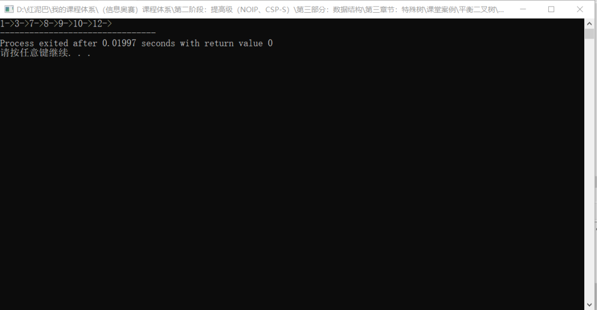

## 3. 总结

利用`二叉排序树`的特性，可以实现`动态查找`。在添加、删除结点之后，理论上查找到某一个结点的时间复杂度与树的结点在树中的深度是相同的。

但是，在构建二叉排序树时，因原始数列中数字顺序的不同，则会影响二叉排序树的深度。

这里引用二叉平衡排序树，用来保持树的整体结构的平衡性，方能保证查询的时间复杂度为 `Ologn`(`n` 为结点的数量)。


