# DFS序和欧拉序的降维打击


## 1. DFS 序和时间戳

### 1.1 DFS 序

定义：树的每一个节点在深度优先遍历中进、出栈的时间序列。

如下树的 `dfs` 序就是`[1,2,8,8,5,5,2,4,3,9,9,3,6,6,4,7,7,1]`。

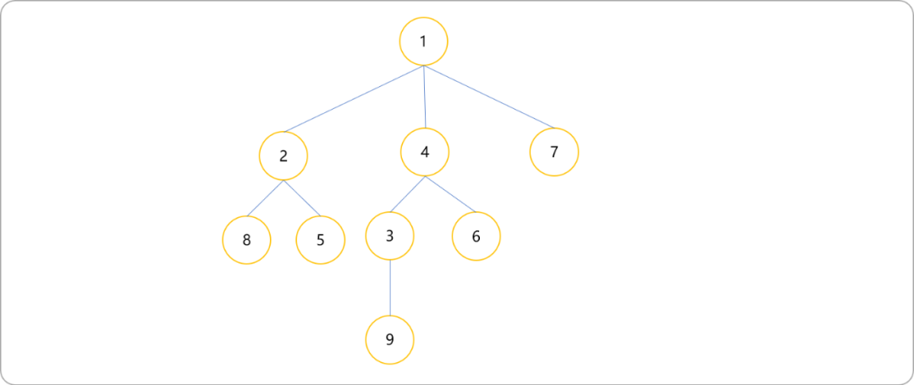

下图为生成`DFS`的过程。对于一棵树进行`DFS`序，除了进入当前节点时对此节点进行记录，同时在回溯到当前节点时对其也记录一下，所以`DFS`序中一个节点的信息会出现两次。

> **Tips：** 因为在树上深度搜索时可以选择从任一节点开始，所以`DFS`序不是唯一的。

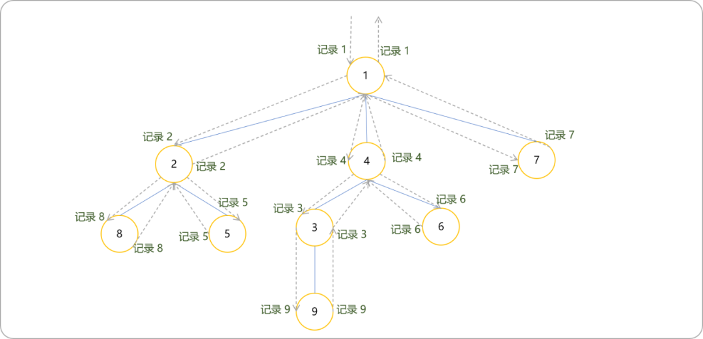

`DFS`序的特点：

- **可以把树数据结构转换为线性数据结构，从而可以把基于线性数据的算法间接用于处理树上的问题。堪称降维打击。**

- 相同编号之间的节点编号为以此编号为根节点的子树上的所有节点编号。

  `[2,8,8,5,5,2]`表示编号 `2`为根节点的子树中所有节点为`8,5`。

  `[4,3,9,9,3,6,6,4]`表示编号 `4`为根节点的子树中所有节点为 `3,9,6`。

- 如果一个节点的编号连续相同，则此节点为叶节点。

- 树的`DFS`序的长度是`2N`（`N`表示节点的数量）。

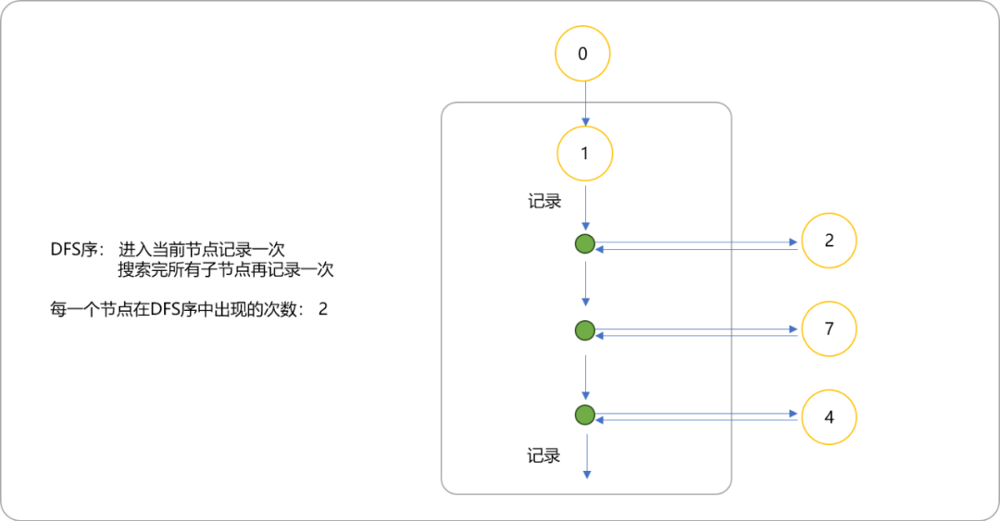

求`DFS序`的代码：

```cpp
#include <cstdio>
using namespace std;
const int maxn=1e5+10;
int n;
int tot,to[maxn<<1],nxt[maxn<<1],head[maxn];
int id[maxn],cnt;
void add(int x,int y)
{
    to[++tot]=y;
    nxt[tot]=head[x];
    head[x]=tot;
}
void dfs(int x,int f)
{
    id[++cnt]=x;
    for(int i=head[x];i;i=nxt[i])
    {
        int y=to[i];
        if(y==f)
            continue;
        dfs(y,x);
    }
    id[++cnt]=x;
}
int main()
{
    scanf("%d",&n);
    for(int i=1;i<n;i++)
    {
        int x,y;
        scanf("%d%d",&x,&y);
        add(x,y);
        add(y,x);
    }
    dfs(1,0);
    for(int i=1;i<=cnt;i++)
        printf("%d ",id[i]);
    return 0;
}
```

测试数据：

```cpp
9
1 2
1 4
1 7
2 8
2 5
4 3
4 6
3 9
```

### 1.2 时间戳

按照深度优先遍历的过程，按每个节点第一次被访问的顺序，依次给予这些节点`1−N`的标记，这个标记就是时间戳。如果一个点的起始时间和终结时间被另一个点包括，这个点肯定是另一个点的子节点（简称括号化定理）。每棵子树 x 在 `DFS` 序列中一定是连续的一段，结点 x 一定在这段的开头。

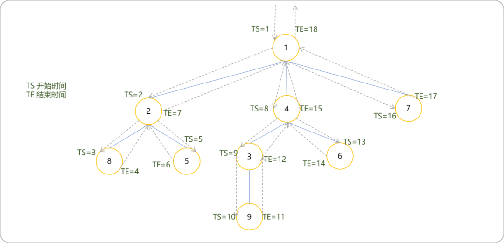

`dfs`与时间戳的关系，对应列表中索引号和值的关系。

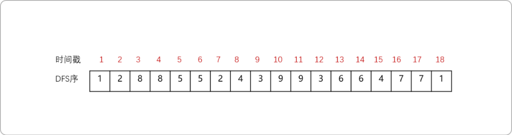

在`dfs`代码中添加进入节点时的顺序和离开节点时的顺序。

```cpp
//……
//in 开始时间 out 结束时间
int in[maxn],out[maxn];
//……
void dfs(int x,int f) {
 //节点的 dfs 序
 id[++cnt]=x;
 //开始时间
 in[x]=cnt;
 for(int i=head[x]; i; i=nxt[i]) {
  int y=to[i];
  if(y==f)
   continue;
  dfs(y,x);
 }
 id[++cnt]=x;
 //结束时间
 out[x]=cnt;
}
//……
```

## 3. DFS 序的应用

### 3.1 割点

**什么是割点？**

如果去掉一个节点以及与它连接的边，该点原来所在的图被分成两部分，则称该点为割点。如下图所示，删除 2号节点，剩下的节点之间就不能两两相互到达了。例如 `4`号不能到`5`号，`6`号也不能到达`1`号等等。一个连通分量变成两个连通分量！

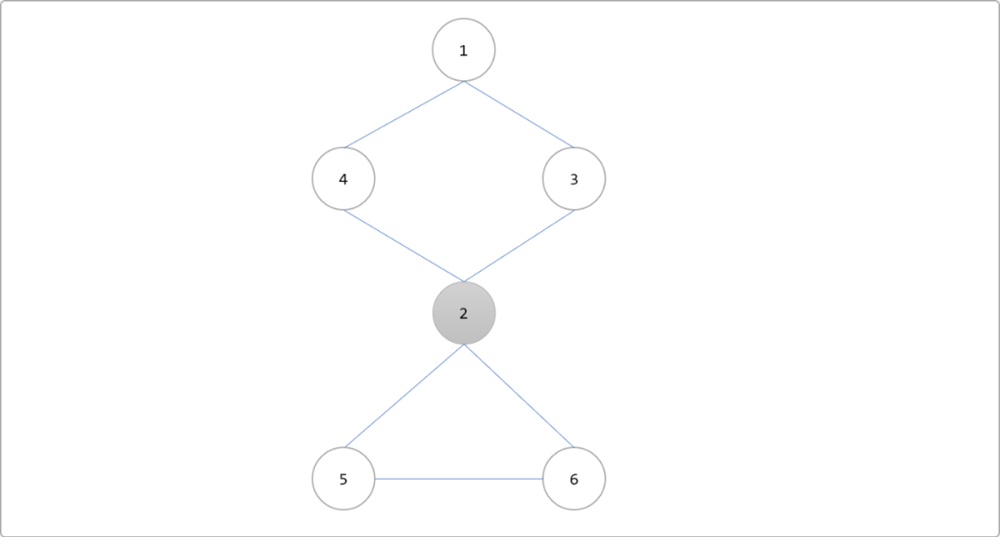

怎么判断图是否存在割点以及如何找出图的割点？

`Tarjan` 算法是图论中非常实用且常用的算法之一，能解决强连通分量、双连通分量、割点和割边（桥）、求最近公共祖先（`LCA`）等问题。

`Tarjan`算法求解割点的核心理念：

- 在深度优先遍历算法访问到`k`点时，此时图会被`k`点分割成已经被访问过的点和没有被访问过的点。
- 如果`k`点是割点，则没有被访问过的点中至少会有一个点在不经过`k`点的情况下，是无论如何再也回不到已访问过的点了。则可证明`k`点是割点。

下图是深度优先遍历访问到`2`号顶点的时候。没有被访问到的顶点有`4、5、6`号顶点。

> **Tips：** 节点边上的数字表示时间戳。

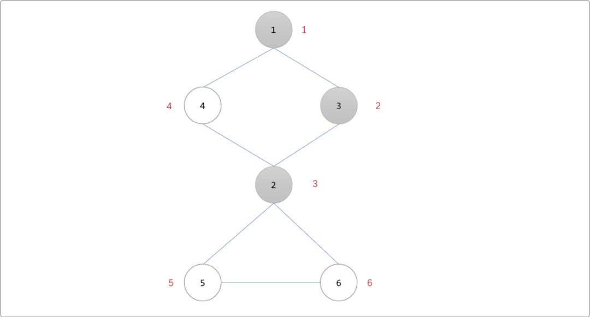

其中`5`和`6`号顶点都不可能在不经过`2`号顶点的情况下，再次回到已被访问过的顶点(`1`和`3`号顶点)，因此`2`号顶点是割点。

问题变成如何在深度搜索到 `k`点时判断，没有被访问过的点是否能通过此`k`或者不能通过此`k`点回到曾经访问过的点。

**算法中引入了回溯值概念。**

回溯值表示从当前节点能回访到时间戳最小的祖先，回溯值一般使用名为 `low`的数组存储，`low[i]`表示节点 `i`的回溯值。

如下演示如何初始化以及更新节点的 `low`值。

- 定义`3` 个数组。`vis[i]`记录节点是否访问过、`dfn[i]`记录节点的时间戳、`low[i]`记录节点的回溯值。如下图所示，从 `1`号节点开始深搜，搜索到`4`号节点时，`3`个数组中的值的变化如下。也就是说，初始，节点的 `low`值和`dfn`值相同。或者说此时，回溯值还不能确定。

  > Tips：注意一个细节，由`1->3`，认为 `1`是`3`的父节点。


- 搜索到`4`号时，与`4`号相连的边有`4->1`，`4->1`是没有访问过的边，且`1`号节点已经标记过访问过，也就是说通过`4`号点又回到了`1`号点。所以说`4->1`是一条回边，或者说 `1-……-4`之间存在一个环。则`4`号点的 `low[4]=min( low[4],dfn[1] )=1`

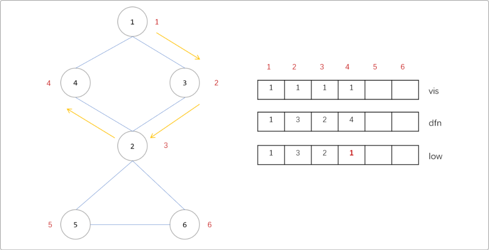

- 因为 `2`是`4`的父节点，显然也是能通过`4`号点回到`1`号点，所以也需要更新其`low`值，更新表达式为 `low[2]=min(low[2],low[4])`。同理`3`号点是`2`号点的父节点，也能通过 `3->2->4->1`回到`1`号点。所以`3`号点的`low`也需要更新。`low[3]=min(low[2],low[3])`。

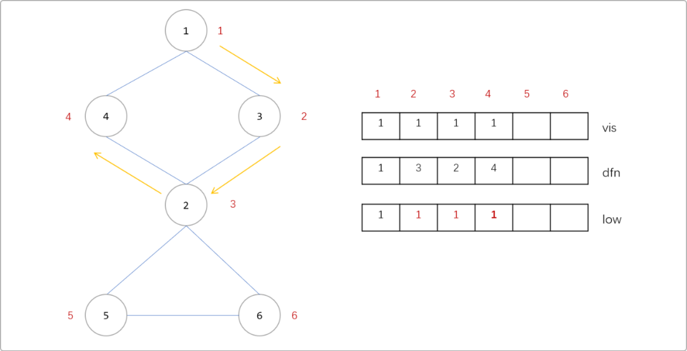

- 继续更新`5、6`号节点的`low`值。

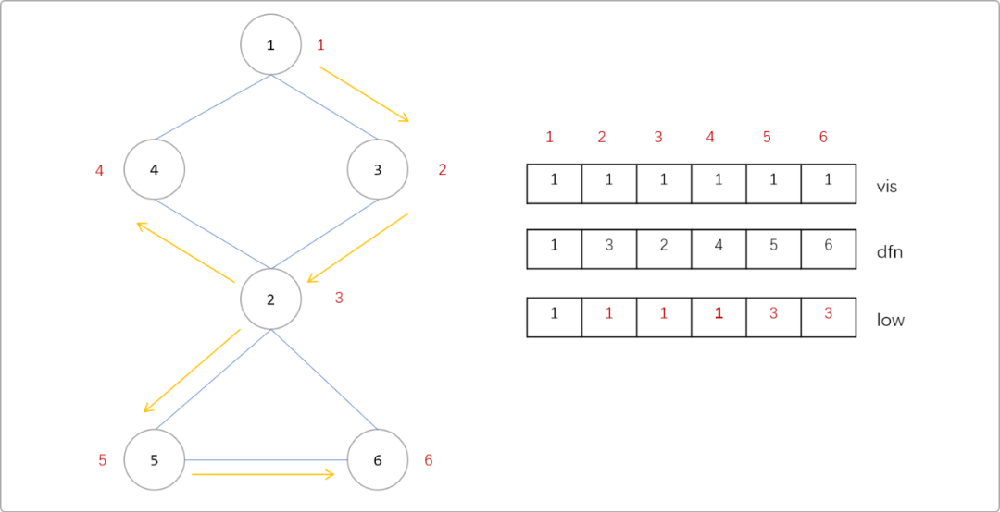

根据这些信息，如何判断割点。

- 如果当前点为根节点时，若子树数量大于一，则说明该点为割点（子树数量不等于与该点连接的边数）。
- 如果当前点不为根节点，若存在一个儿子节点的`low`值大于或`等于`该点的`dfn`值时（`low[子节点] >= dfn[父节点]`），该点为割点（即子节点，无法通过回边，到达某一部分节点（这些节点的`dfn`值小于父亲节点））。这个道理是很好理解的，说明子节点想重回树的根节点是无法绕开父节点。

### 3.2 割边

定义：即在一个无向连通图中，如果删除某条边后，图不再连通。如下图删除`2-5`和`5-6`后，图不再具有连通性。

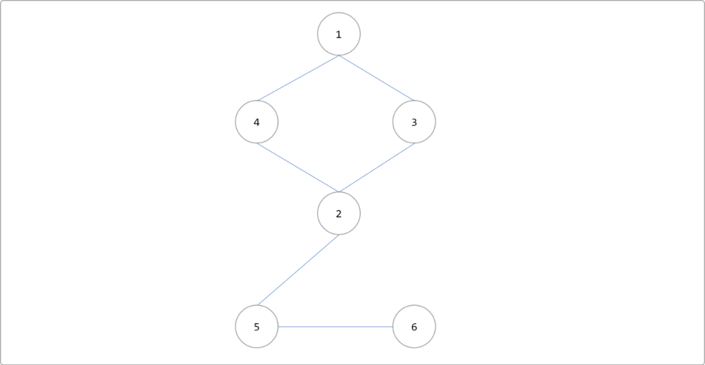

删除`2-5`和`5-6`边后。

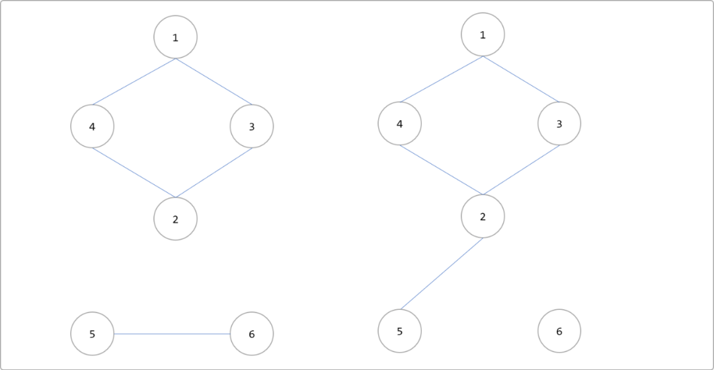

那么如何求割边呢？

只需要将求割点的算法修改一个符号就可以。只需将`low[v]>=num[u]`改为`low[v]>num[u]`，取消一个等于号即可。因为`low[v>=num[u]`代表的是点`v` 是不可能在不经过父亲结点`u`而回到祖先（包括父亲）的，所以顶点`u`是割点。

如果`low[y]和num[x]`相等则表示还可以回到父亲，而`low[v]>num[u]`则表示连父亲都回不到了。倘若顶点`v`不能回到祖先，也没有另外一条路能回到父亲，那么 `w-v`这条边就是割边，

### 3.3 `Tarjan` 算法

```cpp
#include <iostream>
#include <string.h>
#include <string>
#include <algorithm>
#include <math.h>
#include <vector>
using namespace std;
const int maxn = 123456;
int n, m, dfn[maxn], low[maxn], vis[maxn], ans, tim;

bool cut[maxn];
vector<int> edge[maxn];

void cut_bri(int cur, int pop) {
 vis[cur] = 1;// 1表示正在访问中
 dfn[cur] = low[cur] = ++tim;
 int children = 0; //子树数量
 for (int i : edge[cur]) { //对于每一条边
  if (i == pop || vis[cur] == 2)
   continue;
  if (vis[i] == 1) //遇到回边
   low[cur] = min(low[cur], dfn[i]); //回边处的更新 (有环)
  if (vis[i] == 0) {
   cut_bri(i, cur);
   children++;  //记录子树数目
   low[cur] = min(low[cur], low[i]); //父子节点处的回溯更新
   if ((pop == -1 && children > 1) || (pop != -1 && low[i] >= dfn[cur])) { //判断割点
    if (!cut[cur])
     ans++;   //记录割点个数
    cut[cur] = true; //处理割点
   }
   if(low[i]>dfn[cur]) { //判断割边
    edge[cur][i]=edge[i][cur]=true;  //low[i]>dfn[cur]即说明(i,cur)是桥(割边)；
   }
  }
 }
 vis[cur] = 2; //标记已访问
}
int main() {
 scanf("%d%d", &n, &m);
 for (int i = 1; i <= m; i++) {
  int x, y;
  scanf("%d%d", &x, &y);
  edge[x].push_back(y);
  edge[y].push_back(x);
 }
 for (int i = 1; i <= n; i++) {
  if (vis[i] == 0)
   cut_bri(i, -1); //防止原来的图并不是一个连通块
  //对于每个连通块调用一次cut_bri
 }
 printf("%d\n", ans);
 for (int i = 1; i <= n; i++) //输出割点
  if (cut[i])
   printf("%d ", i);
 return 0;
}
```

## 4.欧拉序

定义：进入节点时记录，每次遍历完一个子节点时，返回到此节点记录，得到的 `2 ∗ N − 1` 长的序列；

欧拉序和`DFS`序的区别，前者在每一个子节点访问后都要记录自己，后者只需要访问完所有子节点后再记录一次。如下图的欧拉序就是：`1 2 8 2 5 2 1 7 1 4 3 9 3 4 6 4 1`。每个点在欧拉序中出现的次数等于这个点的度数，因为`DFS`到的时候加进一次，回去的时候也加进。

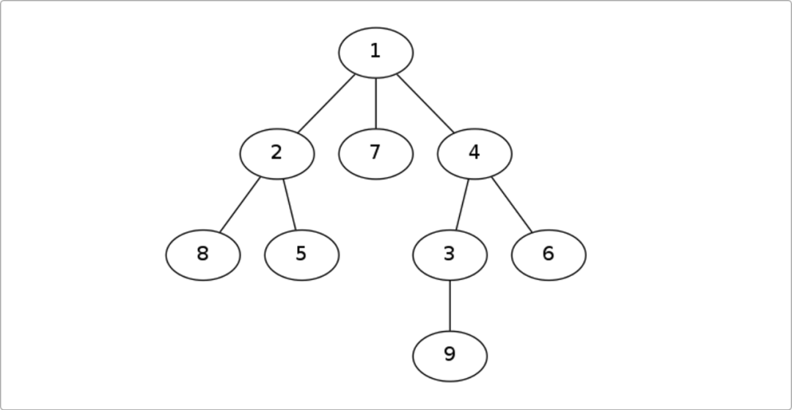

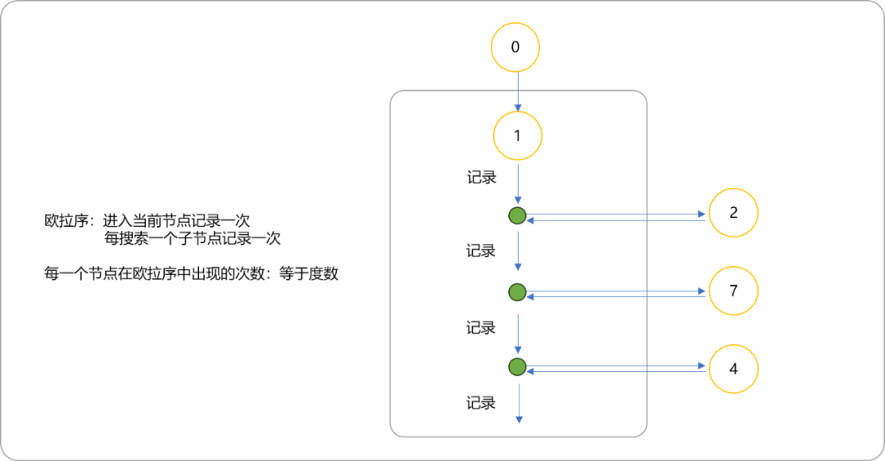

性质：

- 节点 `x` 第一次出现与最后一次出现的位置之间的节点均为 `x` 的子节点；
- 任意两个节点的 `LCA` 是欧拉序中两节点第一次出现位置中深度最小的节点。两个节点第一次出现的位置之间一定有它们的`LCA`，并且，这个`LCA`一定是这个区间中深度最小的点。

根据欧拉序的性质，可以用来求解`CLA`。如上图，求解 `LCA(9,6)`。

- 在欧拉序中找到`9`和`6`第一次出现的位置。

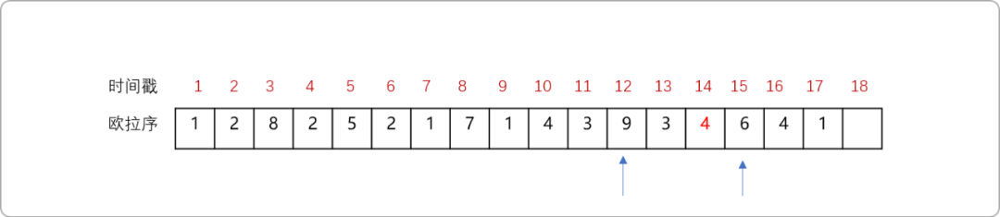

- 直观比较，知道`4`号节点是其`LCA`，特征是`9`和`6`之间深度最小的节点。

欧拉序求`LCA`，先求图的欧拉序、时间戳（可以记录进入和离开节点的时间）以及节点深度。有了这些信息，理论上足以求出任意两点的`LCA`。变成了典型的`RMQ`问题。

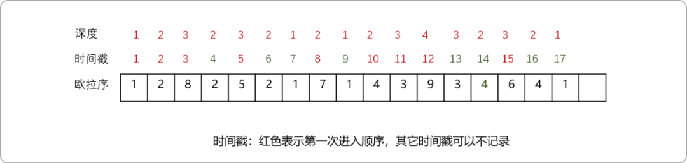

为了提升多次查询性能，可以使用`ST`表根据节点的深度缓存节点的信息。`j=0`时如下图所示。

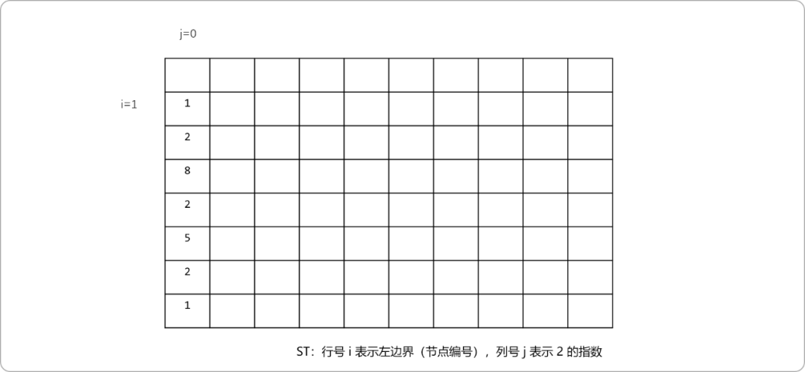

`j=1`表示区间长度为 `2`，值为区间长度为 `1`的两个子区间的深度值小的节点。

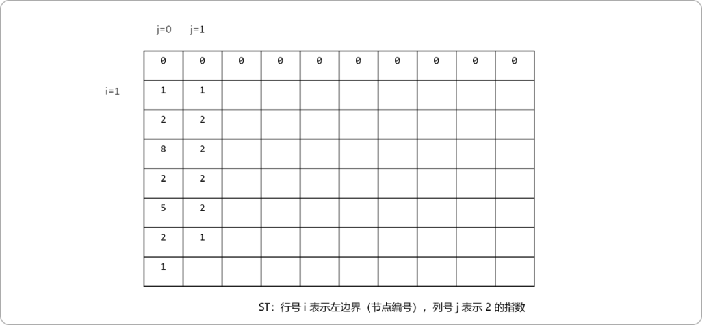

**欧拉序求`LCA`**

```cpp
#include <iostream>
#include <string.h>
#include <string>
#include <algorithm>
#include <math.h>
#include <vector>
using namespace std;
const int maxn = 10000;
int n, m, dfn[maxn], dep[maxn], tim;
int ol[maxn];
int st[maxn][maxn],lg2[maxn];
vector<int> edge[maxn];
void dfs(int cur, int fa) {
 ol[++tim]=cur;
 dfn[cur]=tim;
 dep[cur]=dep[fa]+1;
 for (int v : edge[cur]) { //对于每一条边
  if(v==fa)continue;
  dfs(v,cur);
  ol[++tim]=cur;
 }
}

void stPreprocess() {
 lg2[0] = -1;  // 预处理 lg 代替库函数 log2 来优化常数
 for (int i = 1; i <= (n << 1); ++i) {
  lg2[i] = lg2[i >> 1] + 1;
 }
 for (int i = 1; i <= (n << 1) - 1; ++i) {
  st[i][0] = ol[i];
 }
 for (int j = 1; j <= lg2[(n << 1) - 1]; ++j) {
  for (int i = 1; i + (1 << j) - 1 <= ((n << 1) - 1); ++i) {
   st[i][j] = dep[ st[i] [ j - 1 ] ] < dep[ st[ i + (1 << j - 1)][j - 1 ]    ]  ? st[i][j - 1 ] : st[ i + (1 << j - 1)][j - 1 ];
  }
  cout<<endl;
 }
}

int getlca(int u, int v) {
 if(dfn[u]>dfn[v])swap(u,v);
 u=dfn[u],v=dfn[v];
 int d=lg2[v-u+1];
 int f1=st[ u ][d  ];
 int f2=st[v-(1<<d)+1 ][ d ];
 return dep[f1]<dep[f2]?f1:f2;
}

int main() {
 scanf("%d%d", &n, &m);
 for (int i = 1; i <= m; i++) {
  int x, y;
  scanf("%d%d", &x, &y);
  edge[x].push_back(y);
  edge[y].push_back(x);
 }
 dfs(1, 0);
 for (int i = 1; i <= 2*n-1; i++) //输出割点
  printf("%d-%d  ", ol[i],dfn[ ol[i] ]);

 stPreprocess();
 int u,v;
 cin>>u>>v;
 int res=getlca(u,v);
 cout<< res;
 return 0;
}
```

## 5. 总结

`DFS`序和欧拉序并不难理解，却能四两拨千斤，却能解决很多复杂的问题。

