# 深度剖析倍增算法求解最近公共祖先（LCA）的细枝末节


## 1. LCA（最近公共祖先）

倍增算法的基本思想在前面的博文中有较详细的介绍，本文不再复述。此文仅讲解如何使用倍增算法求解多叉树中节点之间的最近公共祖先问题。

什么是最近公共祖先问题？

字面而言，指在树上查询两个（也可以是两个以上）节点的祖先，且是离两个节点最近的祖先。如下图所示：

- 节点 `12`和节点`11`的公共祖先有节点`4`和节点`1`。
- 节点`4`是离`12和11`最近的祖先。即`12`和`11`的最近公共祖先是`4`。也可描述为`LCA(12,11)=3`。

> **Tips：** `LCA`是（`Lowest Common Ancestor` 最近公共祖先）的简称。

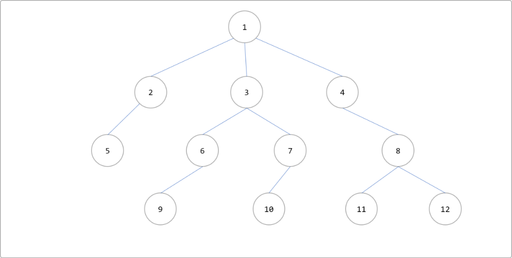

**`LCA`有如下几个特性：**

- `LCA(u)=u`。单个节点的的最近公共祖先为自己。如上图节点 `12`的最近公共祖先为 `12`，即`LCA(12)=12`。

- 如果 `u`是`v`的祖先，当且仅当`LCA(u,v)=u`。如上图，`LCA(1,2)=1`。

- 如果 `u`不是`v` 的祖先，并且 `v` 不是 `u` 的祖先，那么 `u,v` 分别处于 `LCA(u,v)` 的两棵不同子树中。如`LCA(6,7)=3`，因节点`6`和节点`7` 互不为祖先，节点`6`在`LCA(6,7)`的左子树中，节点`7`在`LCA(6,7)`的右子树中。

- 前序遍历中，`LCA(S)` 出现在所有`S` 中元素之前，后序遍历中 `LCA(S)` 则出现在所有 `S` 中元素之后。这个很好理解。

- 两点集并的最近公共祖先为两点集分别的最近公共祖先的最近公共祖先，即`LCA(A U B )=LCA( LCA(A),LCA(B) )`。如下图，点集`A={6,7}`，则`LCA(A)=3`。点集`B={11,12}`，则`LCA(B)=8`。则`c=A U B`的`LCA(c)=LCA(3,8)=1`。利用这个性质，可以求解任意多节点之间的最近公共祖先。

  

- 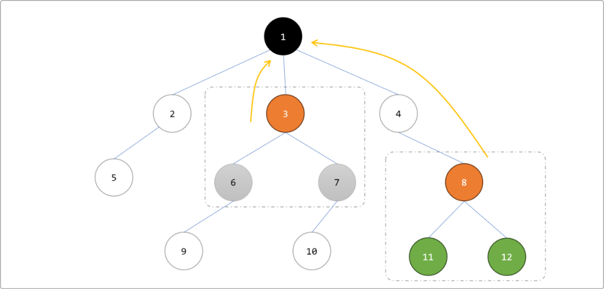

- **两点的最近公共祖先必定处在树上两点间的最短路上**。如下图，节点`9`和`7`之间的最短路径一定经过其最近公共祖先。这个很好理解，自行参悟。

  

- 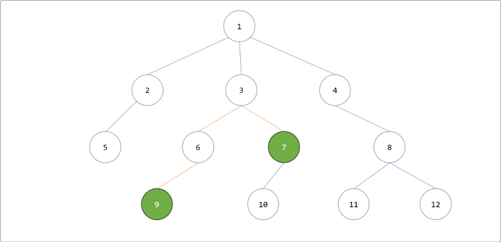

- `d(u,v)=h(u)+h(v)-2h(LCA(u,v))`。其中 `d` 是树上两点间的距离，`h` 代表某点到树根的距离。即，`u,v`两点之间的距离可以是`u`到根节点的距离+`v`到根节点的距离- 减去`u,v`最近公共祖先到根节点的距离`*2`。如下图所示，`d(6,7)`距离。

  

- 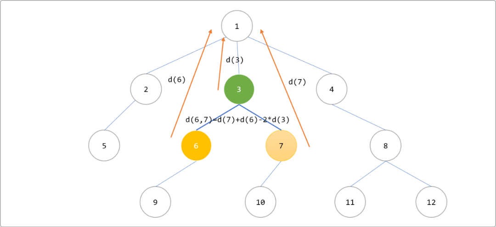

## 2. LCA 朴素算法

知道了什么是`LCA`后，再来了解怎么得到给定的任意 `2` 点的最近公共祖先。

### 向上标记法

向上标记法的思想很简单，如求节点`9`和`7`的最近公共祖先。

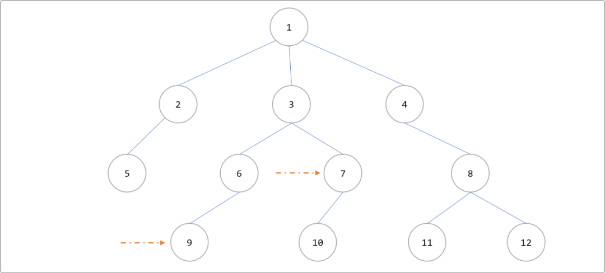

- 先以节点 `9`（也可以选择节点7）为起点，向上沿着根节点方向查询，并一路标记访问过的节点，如下图红色节点。

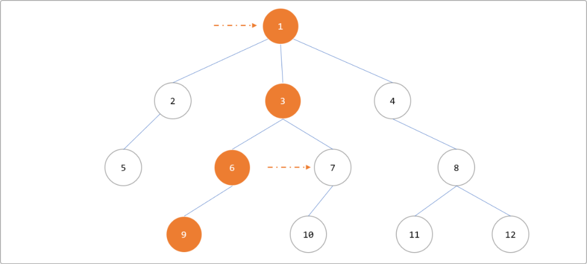

- 再让节点`7`向着根节点访问，遇到的第一个标记的节点即为`LCA(9,7)=3`。

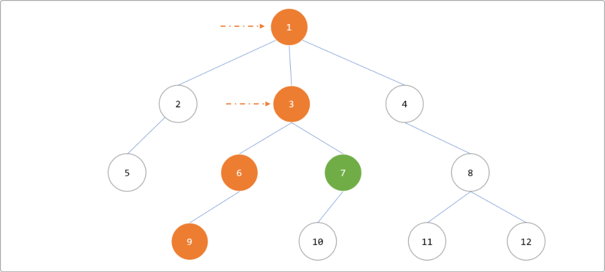

**同步移位法**

- 首先在树上定位`u`和`v`的位置。

- 如果`u`和`v`的深度不一样，则需要让深度大的节点向上跳跃直到其深度和深度小的节点一致。如查询`9`和`7`两节点的祖先。如下图所示，`9`的深度为`4`，`7`的深度为`3`。先移动指向`9`的指针，让其移动和`7`深度一致的节点`6`。然后，同时移动两个指针，直到遇到相同节点`3`。

  > **Tips：** 根节点深度为 `1`。

  

- 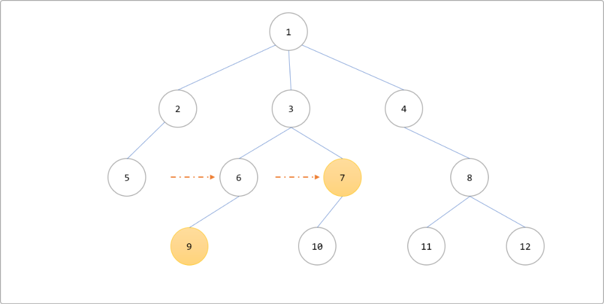

使用矩阵存储树信息，可以很方便写出相应算法。使用邻接表存储树时，为了方便，可以为每一个节点设置一个指向父节点的指针。上述算法可统称为朴素算法，其特点在于算法实现过程中，需要一步一步的移动指针。

本文主要讲解使用培增法求解最近公共祖先。

## 3.  LCA 倍增算法

倍增算法的本质还是补素算法，在其基础上改变了向上跳跃的节奏。不采用一步一步向上跳，而是以`2`的幂次方向上跳。比如先跳20步、再跳21步……

也就先跳 `1`步，然后`2` 步，再然后`4` 步，再然后`8`步，再然后`16`步……

如同前文的同步移位算法思想一样，可先让深度大的节点向上跳，跳到两个节点的深度一致，然后再一起向上跳。

**由大到小跳，还是由小到大跳？**

由小到大跳，指在移动指针时，先移`1`位，再移`2`位，再移` 4` 位……

下图为由小到大跳的方式实现把指向节点`11`的指针移到根节点，红色标注为其轨迹点。先  20`=1` 步到节点`8`，再21`=2`步跳到节点 `3`，下一步再跳时越过根节点，需要在回溯过程中修正。到达根节点，需要跳 `3` 次。

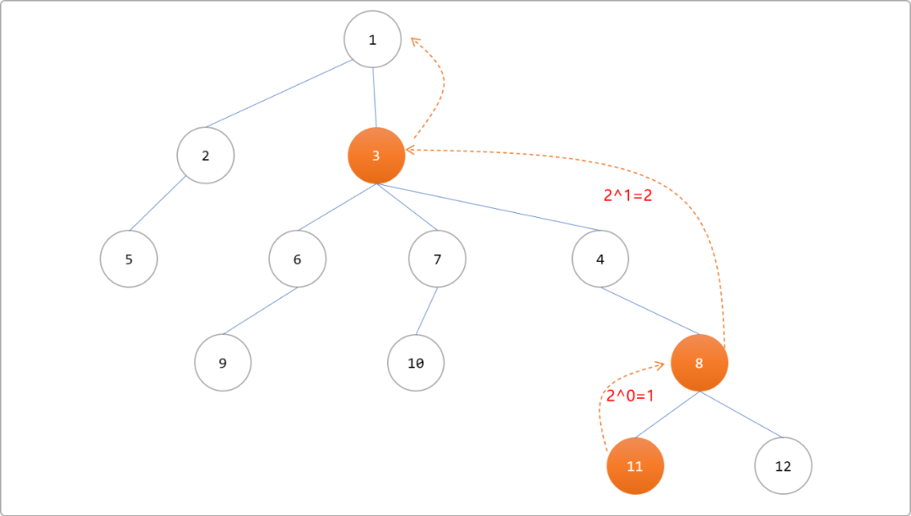

如下图是由大到小跳的轨迹点，跳22=4步直接到根节点。

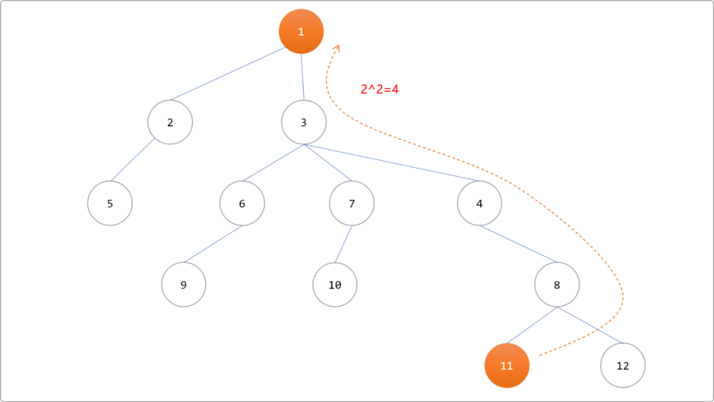

如上所述，在向上跳跃时，采取由大到小的方案更能提升查询性能。也就是说，在向上跳跃过程中，尽可能一步迈大点。

**向上跳几次？**

现在继续探讨另一个问题，一个节点向上跳到其父节点，需要跳几次。跳少了肯定是跳不到目标，跳多了会越过目标。比如刚才说，由节点 `11`跳到根节点`1`，跳一次就足了。多了无益，少了不能到。

如从节点`9`跳到根节点，直观而言，可以先跳21=2步。先到达节点`3`，再跳一步，即跳20步，便到达了根节点。也就是向上跳`2`次，那么，这个`2`次是如何得知的？

**答案是根据节点到根节点的深度。**

如节点`11`到根节点的深度为 `5`，一般认定根节点的深度为 `1`，除掉节点本身的深度，如果采用朴素算法的一步一步向上跳，要向上跳 `4`次，但是使用倍增法向上跳，因为 22=4，所以理论上跳一次就可以。

如节点`9`到根节点的深度为 `4`，除掉本身深度，理论是要跳 `3`次， 但是`3`可以拆分成 21+20。倍增法方案可以先跳 `2` 步，再跳 `1` 步，`2` 次可达目标。

所以，要使用倍增算法，先要求解出每一个节点在树上的深度。具体可以使用`DFS`或`BFS`实现，后文再详细介绍。

**缓存节点的祖先：**

为了方便找到节点的祖先，可以缓存节点到根节点这条路径上所有的祖先。但是，缓存如下图节点 `14`的祖先时，并不是把沿着根节点向上所有祖先`13、12、8、4、1`都缓存下来。

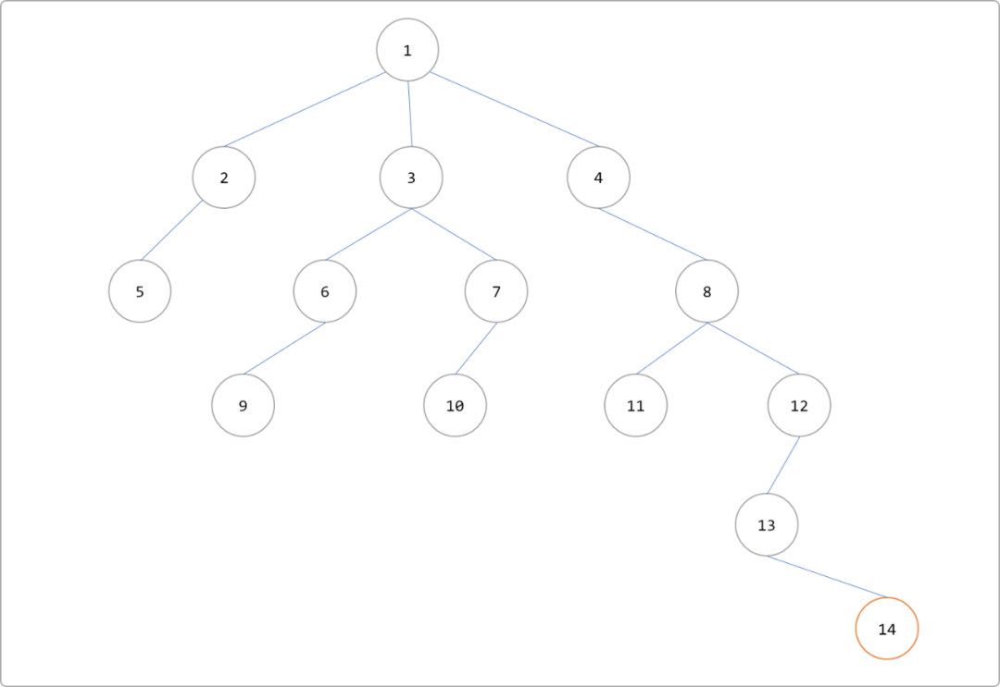

而是按如下图中的倍增方式缓存，仅缓存了`13、12、4`几个祖先。

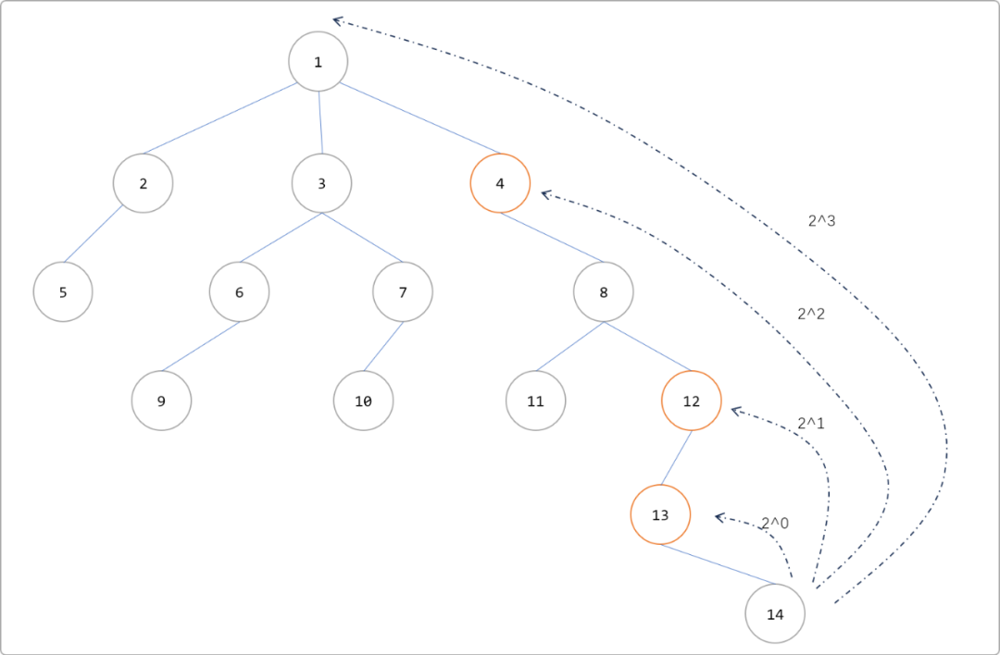

因每一个节点都需要缓存其祖先信息，显然需要一个二维数组记录这些信息。现设定数组名为 `father[i][j]`，`i`表示节点的编号，`j`表示 `2` 的指数。

如 `father[14][0]`表示节点 `14`的第 20 个祖先，即，`father[14][0]=13`。

`father[14][1]`表示节点 `14`的第 21 个祖先，即，`father[14][1]=12`。

`father[14][2]`表示节点 `14`的第 22 个祖先，即，`father[14][2]=4`。

……

那么，这些祖先之间有什么样的逻辑关系，先画一个线性图观察一下。

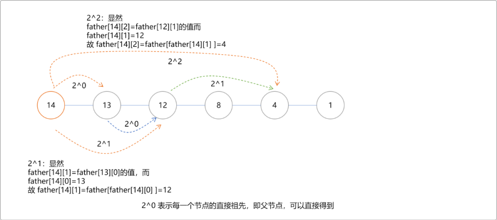

如上图所示，可得到通过的转移方程式：

- 当 `j=0`时，`father[i][0]=直接父节点`。
- 当`j>0`时，`father[i][j]= father[ father[i][j-1]][j-1]`。

其实这个道理也简单，在以`2` 倍增的表达式中满足：

21=20+20。

22=21+21。

23=22+22。

……

2j=2j-1+2j-1。

所以 `i` 的 2j-1 级祖先的 2j−1 级祖先就是 `i` 的 `j` 级祖先。

**具体流程：**

准备工作到此结束，查询任意 `2` 个节点的最近公共祖先时，如果 `2` 个节点的深度不一样，则需要先把 `2` 个节点深度调整到一样。如下图求解节点`5`和`14`的`LCA`时，需要先把节点`14`向上移动，找到和节点`5`深度一样的祖先节点。

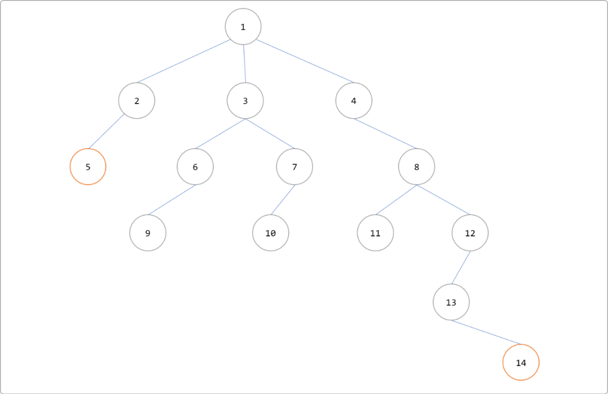

同步深度的流程：

- 计算节点 `14`和节点`5`的深度之差，节点`14`深度为 `6`，节点`5`的深度为`3`。深度之差为 `3`。
- 因为 21<3<22 。根据前面缓存信息，跳 22步，即跳到 `father[14][2]=4`的祖先节点。

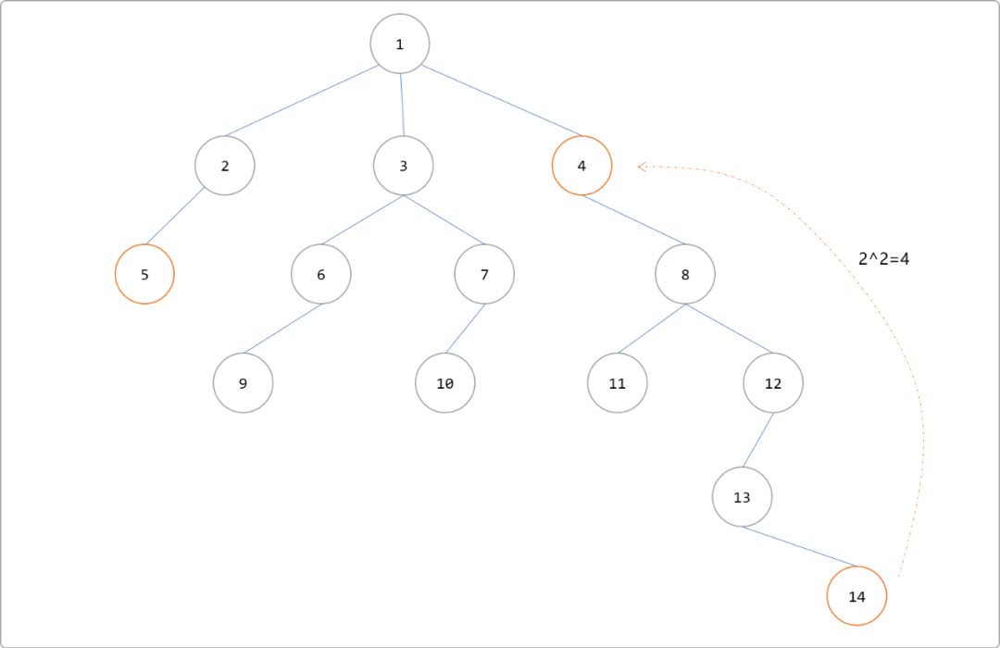

- 因为节点 `4`的深度小于节点`5`的深度，说明跳过头了。需要减少增量，重新以 21 步向上跳。跳到节点`12`位置。

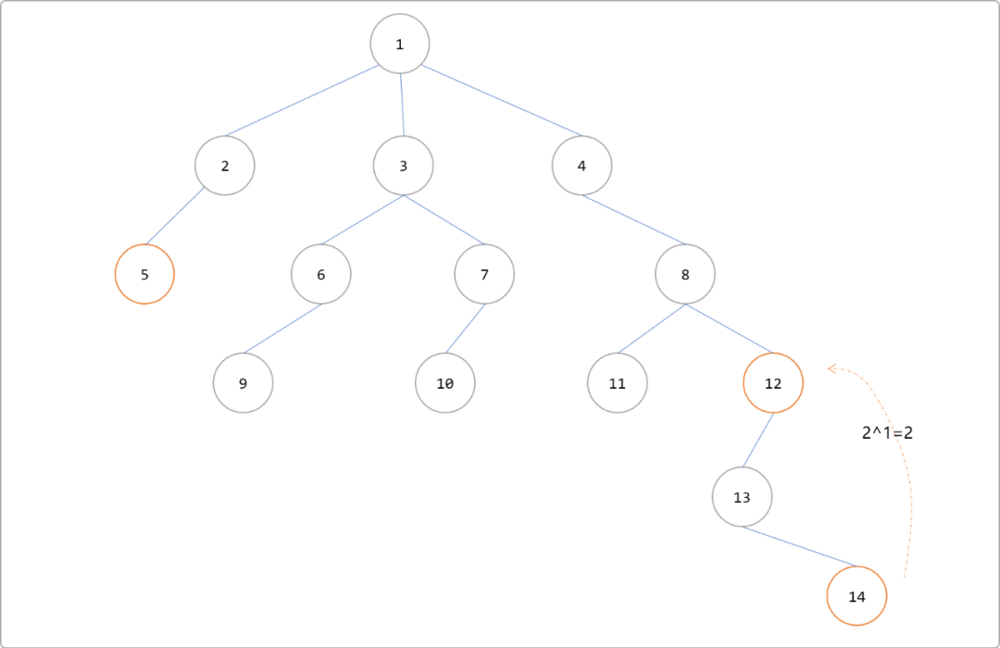

- 节点`12`的深度大于节点`5`的深度，则设置节点`12`为新起点，继续向上跳 20=1 步。此时，节点 `8`和节点`5`深度相同。

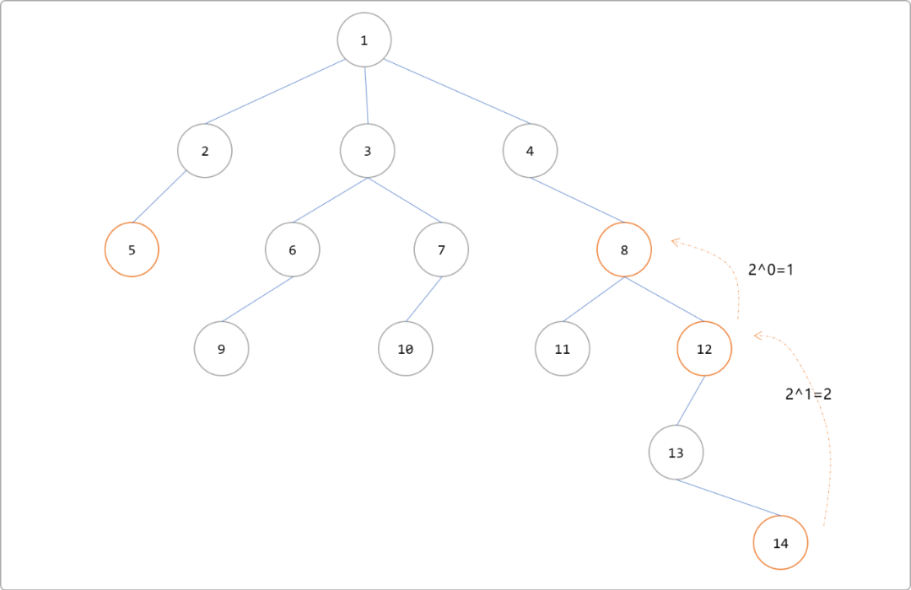

当 `2` 个节点的深度一致，则继续让 `2` 个节点同时一起向上跳。如下的节点`9、10`。

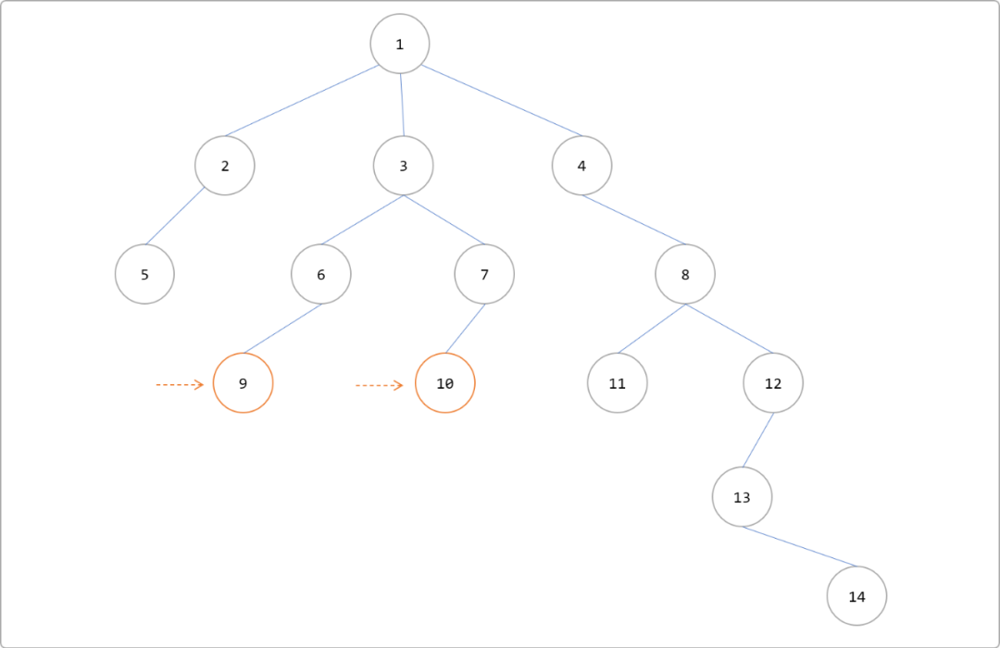

向上跳的策略前文说过，从大到小的方向跳。具体实施如下。

- 两者深度为`4`，因 4=22。以 `j=2`向上跳，则到达根节点之外。

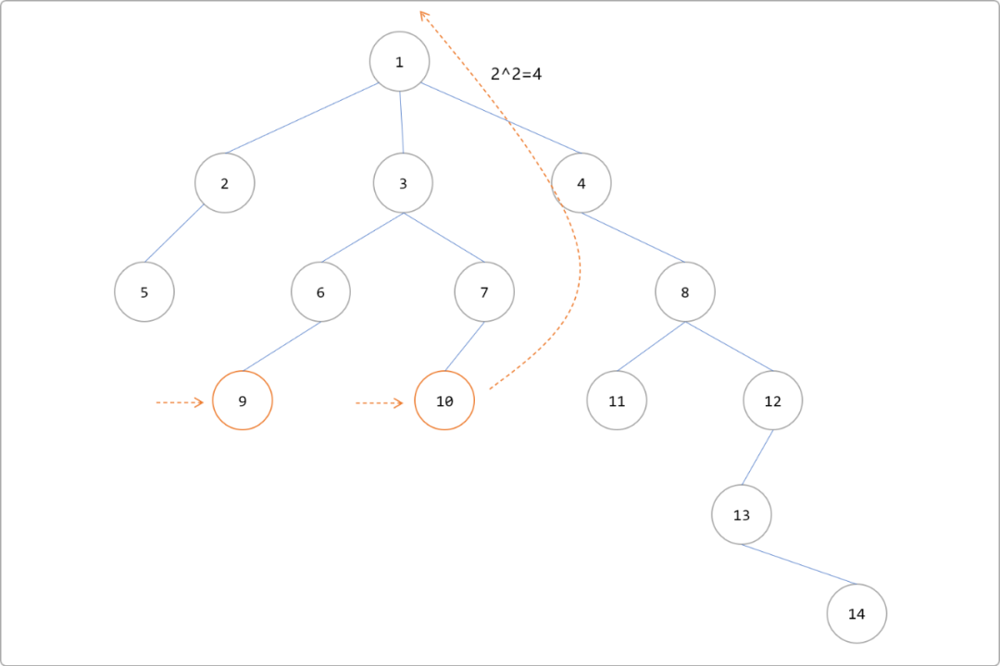

- 向下减小指数 `j`的值为 `1`，重新向上跳 21=2 步。

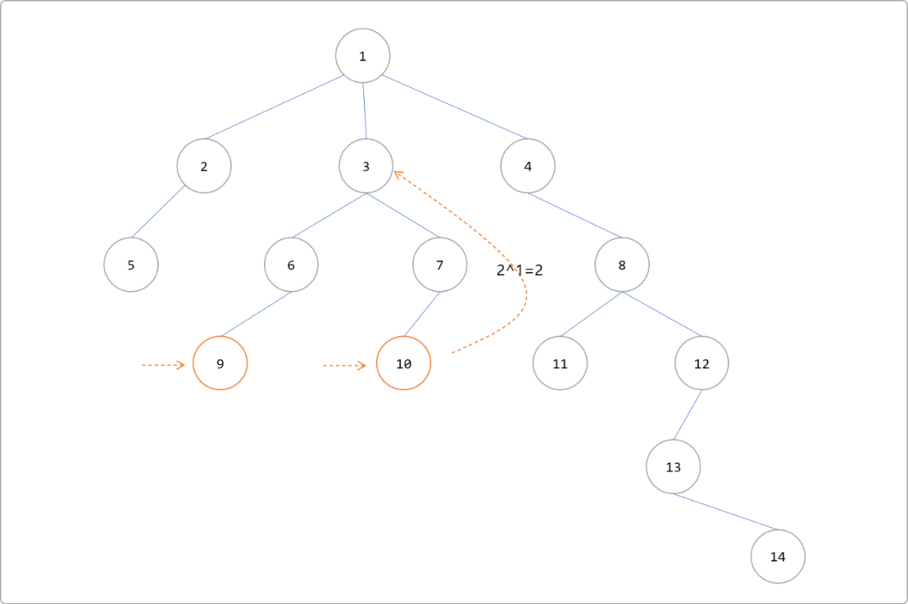

- 直观来讲，节点`3`是`LCA`，但是程序不能就此做出判断，只能说明找到了公共祖先，但是不能说明是`LCA`。所以还得修正成向上跳 20=1步。得到 `2` 个节点的祖先是不相同，此时，可得到结论，节点`3`是`LCA`。

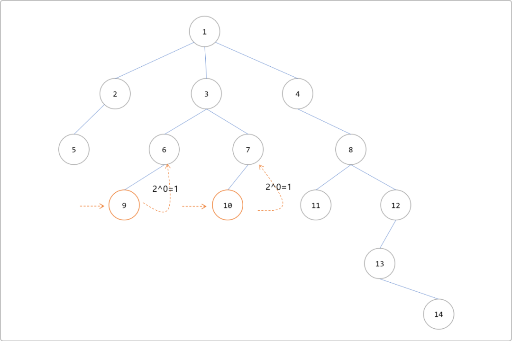

总结如下：

- 当跳到的节点是 `2` 个节点的共同祖先时，则需要再减少指数，重新跳。
- 当跳到的节点不相同，可以再重新计算深度，继续向上跳。

**知道了节点在树上的深度后，如何计算出处于不同深度的节点应该跳多次（也就是 j 指数的取值范围）？**

前文举例说明过，如果深度为 `3` ，取 `3`的对数，因  21<3<22。向上取整，即向上跳 2 次，也就是 j 范围为[2,1,0]。可以使用 `C++ math`库中提供的 `lg`函数，注意，此函数是以 `e`为底数，所以需要进行修改。或者自定义`lg`生成过程。

可以使用预处理`lg`数组，`lg[i]`代表深度为`i`的节点一次性跳多少步可以到达根节点。

```cpp
for (int i = 1; i <= 10; i++)
    lg[i] = lg[i - 1] + (1 << lg[i - 1] == i);
```

可以输出`lg[0~100]`的值。

```cpp
0 1 2 2 3 3 3 3 4 4 4 4 4 4 4 4 5 5 5 5 5 5 5 5 5 5 5 5 5 5 5 5 6 6 6 6 6 6 6 6 6 6 6 6 6 6 6 6 6 6 6 6 6 6 6 6 6 6 6 6 6 6 6 6 7 7 7 7 7 7 7 7 7 7 7 7 7 7 7 7 7 7 7 7 7 7 7 7 7 7 7 7 7 7 7 7 7 7 7 7 7 
```

举一个例子，如下图所示，有 `2` 个深度为 `11`的 `u和v`节点，开始同时向上跳。其过程如下所述：

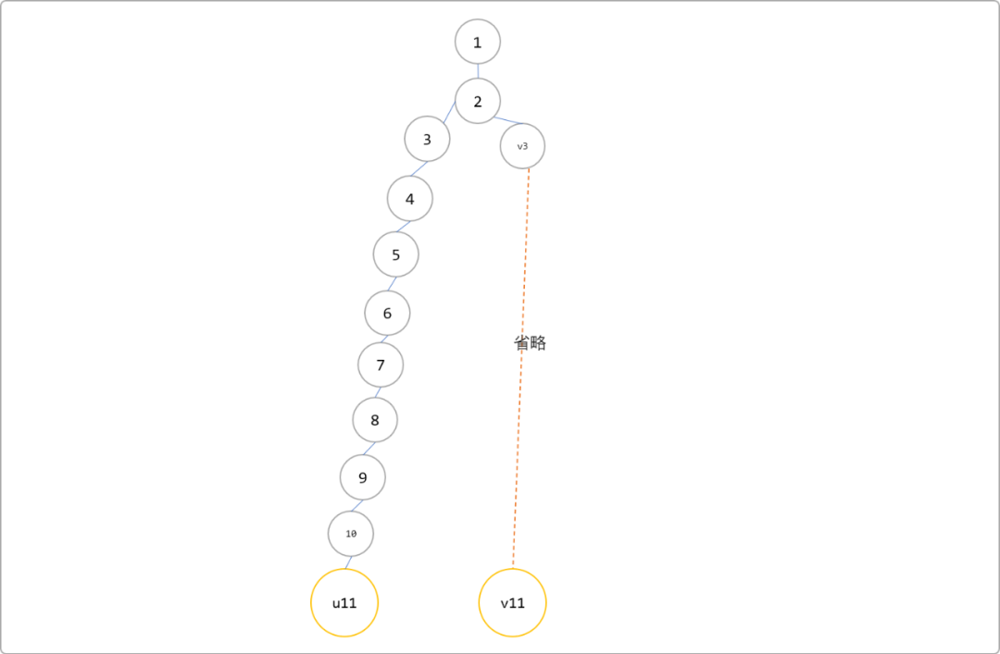

- 根据 `lg`函数计算深度 `11`的值，因  23<11<24 ，可得 `lg[11]=4`。这里的 `4` 表示 `j`的值即 `2` 的指数最大值为 `4`。这里可以先跳 24=16，会发现超过根节点，其实这里可以先跳 24-1=`8`步，先到达如下图所示位置。

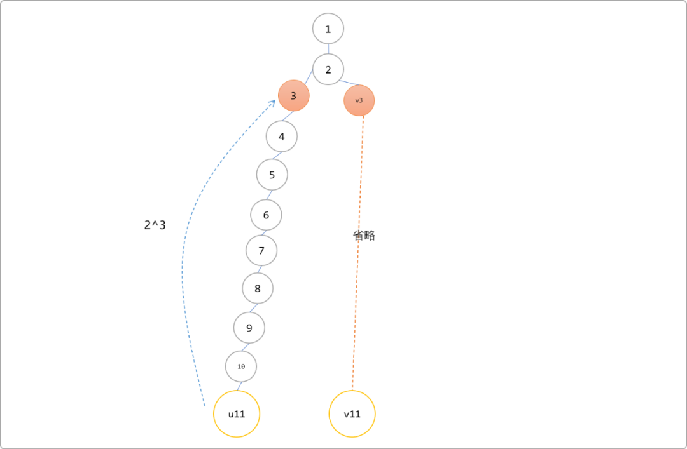

- 更新`u,v`的位置到红色节点标记处，然后向上跳 21=2步。到达根节点位置，因相同，再减少指数，跳 20=1步，到达节点 `2`位置，还是相同，因为已经没有指数可以修改。所以节点 `2`为`LCA`。

**编码实现**

`DFS`搜索。

```c++
#include <bits/stdc++.h>
using namespace std;
//边
struct Edge {
 int t, nex;
} e[500010 << 1];
//头
int head[500010], tot;

void add(int x, int y) {
 e[++tot].t = y;
 e[tot].nex = head[x];
 head[x] = tot;
}
//记录节点在树上的深度
int depth[500001];
//记录节点的祖先
int father[500001][30];
//存储对数值
int lg[500001];

//now表示当前节点，fa表示它的父亲节点
void dfs(int now, int fa) {
 //记录当前节点的直接父节点
 father[now][0] = fa;
 //当前节点的深度为父节点深度加 1
 depth[now] = depth[fa] + 1;

 //指数范围为 1 ~  lg[depth[now]]
 for(int i = 1; i <= lg[depth[now]]; ++i)
  //动态转移方程式，当前节点的 2^j 祖先是 2^(j-1)祖先的 2^(j-1)祖先
  father[now][i] = father[father[now][i-1]][i-1];
 //递归深度搜索
 for(int i = head[now]; i; i = e[i].nex)
  if(e[i].t != fa) dfs(e[i].t, now);
}

//LCA 求解
int LCA(int x, int y) {
 //不妨设x的深度 >= y的深度
 if(depth[x] < depth[y])
  swap(x, y);
 while(depth[x] > depth[y])
  //先跳到同一深度，注意 depth[x]-depth[y] ] - 1 避免跳过头
  x = father[x][ lg[ depth[x]-depth[y] ] - 1];

 if(x == y)
  //如果x是y的祖先，那他们的LCA肯定就是x了
  return x;

 //按指数由大到小跳
 for(int k = lg[depth[x]] - 1; k >= 0; --k)
  if(father[x][k] != father[y][k])
   //因为我们要跳到它们LCA的下面一层，所以它们肯定不相等，如果不相等就跳过去。
   x = father[x][k], y = father[y][k];
 //返回父节点
 return father[x][0];
}
int main() {
// freopen("bz.in","r",stdin);
 int n, m, s;
 scanf("%d%d%d", &n, &m, &s);
 for(int i = 1; i <= n-1; ++i) {
  int x, y;
  scanf("%d%d", &x, &y);
  add(x, y);
  add(y, x);
 }
    //自定义 2 为底数的对数计算 
 for(int i = 1; i <= n; ++i)
  lg[i] = lg[i-1] + (1 << lg[i-1] == i);

 dfs(s, 0);
 for(int i = 1; i <= m; ++i) {
  int x, y;
  scanf("%d%d",&x, &y);
  printf("%d\n", LCA(x, y));
 }
 return 0;
}
```

`BFS`实现。

```c++
const int MAXN=5e4+10;
const int DEG=20;
struct Edge{
    int to,next;
}edge[MAXN<<1];
int head[MAXN],tot;
void addedge(int u,int v){
    edge[tot]=(Edge){v,head[u]};
    head[u]=tot++;
    edge[tot]=(Edge){u,head[v]};
    head[v]=tot++;
}
void init(){
    tot=0;
    memset(head,-1,sizeof(head));
}
int fa[MAXN][DEG];
int dep[MAXN];
void bfs(int r){
    dep[r]=0;
    fa[r][0]=r;
    queue<int> Q;
    Q.push(r);
    while(!Q.empty()){
        int u=Q.front();Q.pop();
        for (int i=1;i<DEG;++i)
            fa[u][i]=fa[fa[u][i-1]][i-1];
        for (int i=head[u];~i;i=edge[i].next) {
            int v=edge[i].to;
            if (v==fa[u][0]) continue;
            dep[v]=dep[u]+1;
            fa[v][0]=u;
            Q.push(v);
        }
    }
}
int LCA(int u,int v){
    if (dep[u]>dep[v]) swap(u,v);
    int hu=dep[u],hv=dep[v];
    int uu=u,vv=v;
    for (int det=hv-hu,i=0;det;det>>=1,++i)
        if(det&1) vv=fa[vv][i];
    if (uu==vv) return uu;
    for (int i=DEG-1;i>=0;--i){
        if (fa[uu][i]==fa[vv][i]) continue;
        uu=fa[uu][i];
        vv=fa[vv][i];
    }
    return fa[uu][0];
}
```

## 4. 总结

`LCA`的求解算法较多，本文详细介绍了倍增算法解决 `LCA`问题中的细枝末节。

