# C++ 树进阶系列之探讨深度搜索算法查找基环树中环的细枝末节

## 1. 前言

对于`基环树`的讲解，分上、下 `2` 篇，上篇以理解连通分量、环以及使用深度搜索算法检查连通性和环为主，下篇以基于基环树结构的应用为主。

**什么是基环树？**

**所谓基环树指由`n`个节点`n`条边所构建而成的连通图**。

如下图所示，树结构中共有 `7` 个节点， `6` 条边。此时在树结构上添加一条边，必然会形成一个树环。因树结构中有环，故得此名。基环树也称为环套树。


如下图基环树结构中有 `7` 个节点，`7` 条边。


上述为无向边基环树。针对于有向边，基环树分：

- **内向树**：树中每个点有且仅有一条出边(或者说每个节点的出度为 `1`)。

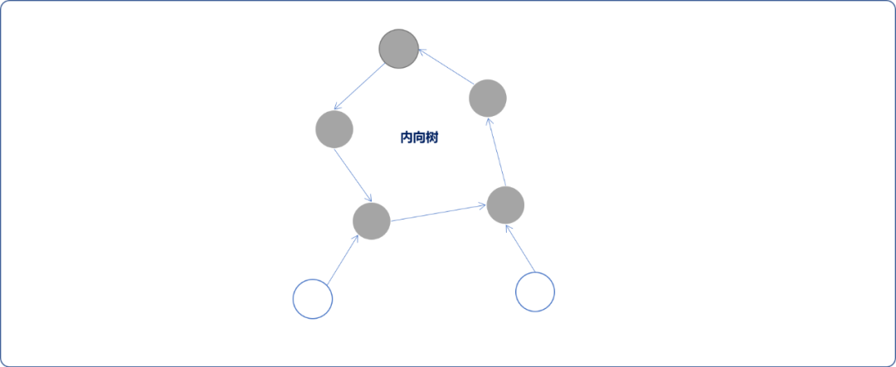

- **外向树**：树中每个点有且仅有一条入边(或者说每个点的入度为 `1`)。

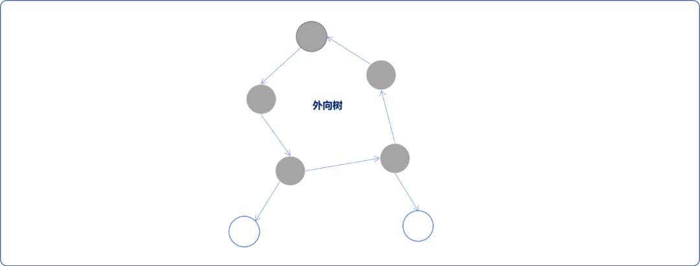

基于`基环树`有一项基本操作，寻找`基环树`上的`环`。

**下文将深入讲解如何使用深度搜索算法在无向图中查找环结构。**

## 2. 查找环

在图中查找`环`的常用的算法有：

- 深度搜索算法。
- 广度搜索算法。
- 并查集。
- 拓扑排序算法。

`广度`和`深度`搜索是原生算法，面对较复杂的`图结构`时，略显拙劣。较优的方案是使用优化过的`并查集`和`拓扑排序算法`，其在性能和技巧上都很精妙。

> **Tips：** 关于并查集和拓扑排序算法可查阅我的相关博文。

### 2.1  问题分析

起点和终点相同的路径称为`回路`或称为`环（Cycle）`，除第一个顶点与最后一个顶点之外，其他顶点不重复出现的回路称为`简单回路`，本文仅对简单回路进行讨论。

> **Tips：** 一般而言，回路至少需要 `3` 个顶点。

**图中是否有环的前提条件：边数至少要等于顶点数。**

所以对于有 `n`个顶点的无向（有向）图，是否存在环，可以先检查边的数量 `m`与顶点数量之间的关系。

> **Tips：** 本文主要以无向图为讨论对象。

1. 如果 `m=n-1`。可以是下面的几种情况。

- 一个连通分量图情况。可以理解为以任何一个顶点为根节点构建成的树结构，此时连通分量为`1`，显然此情况无法成环。

  > **Tips：** 所谓连通图，指任意两个顶点之间都有路径的图。


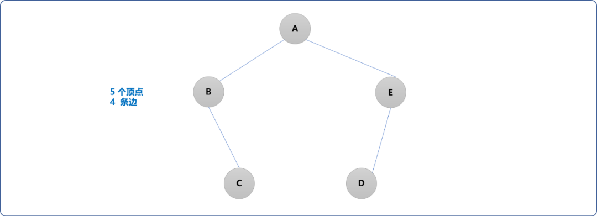


- 上文说过，如果存在回路，**顶点数量和边数至少要相等**，这句话不能狭义地诠释为如果边数小于顶点数，则图中无环。

  当 `m=n-1`时，顶点数可以拆分成 `n=m+1`。这里遵循一个拆分原则，尽可能在已有边数的基础上成全图中某些顶点成环的要求。

  如下图所示，连通分量有 `2`个，其中一个子图中存在一个环。

  所以当**边数少于顶点数时**，需要讨论是否存在子图。

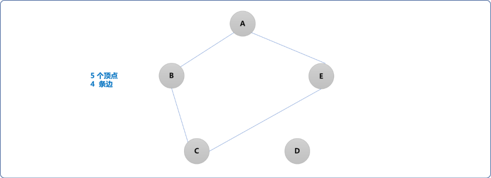


**也可以是如下几种图形：**

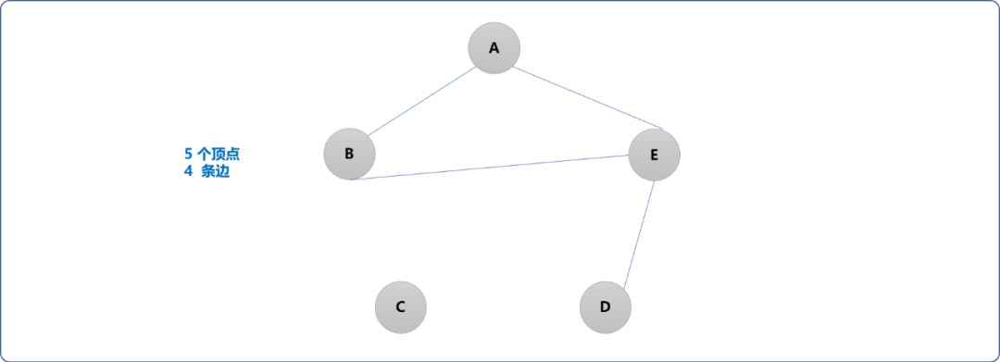


1. `m<n-1`时，如果 `m<=2`则无法构建成环。其它情况下都能构建出一个有环的子图。


1. 当 `m>=n` 因为边数已经大于顶点数，显然图中有环。

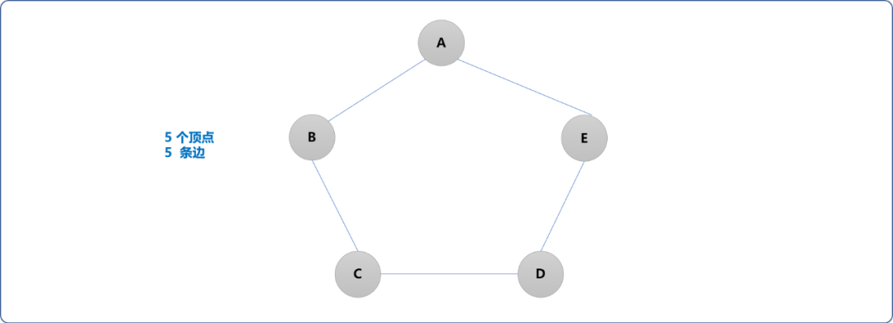


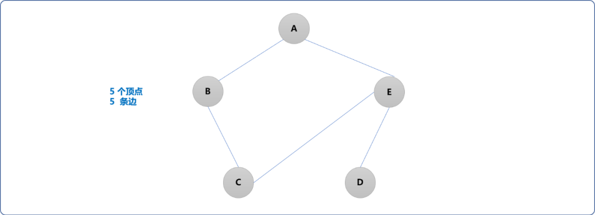


### 2.2  深度搜索算法思想

#### 2.2.1 连通分量

可以使用深度搜索算法查找图中是否有环，先了解一下深度搜索算法的搜索流程。

> **Tips：** 深度搜索算法可以使用递归和非递归实现。本质是使用栈进行数据存储。

- 先创建一个栈(非递归实现)，用来存储搜索到的顶点。

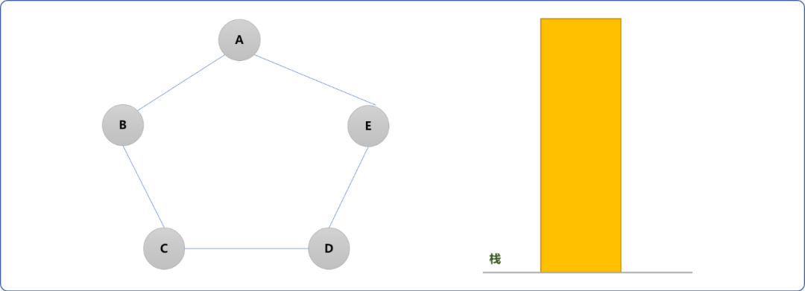


- 以`A`顶点为出发点，且把`A`顶点压入栈中，用于初始化栈。并在图的`A`顶点上做已入栈的标志。

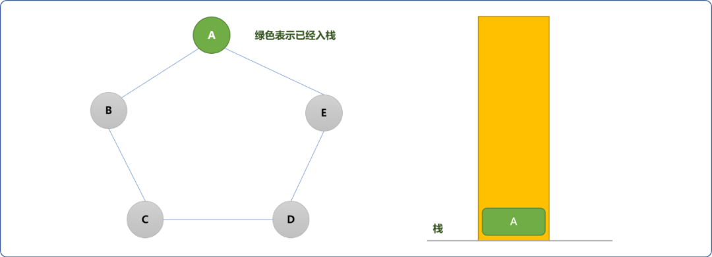


- 查询出与`A`顶点相邻的顶点`B、E`，并且压入栈中。

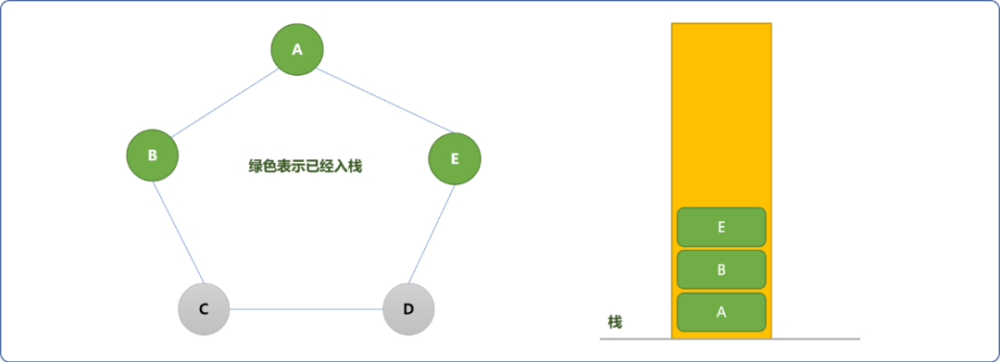


- 继续查询与`E`顶点相邻的顶点（即入栈操作完成后，再查询与栈顶元素相邻的顶点）`D`，且压入栈中。

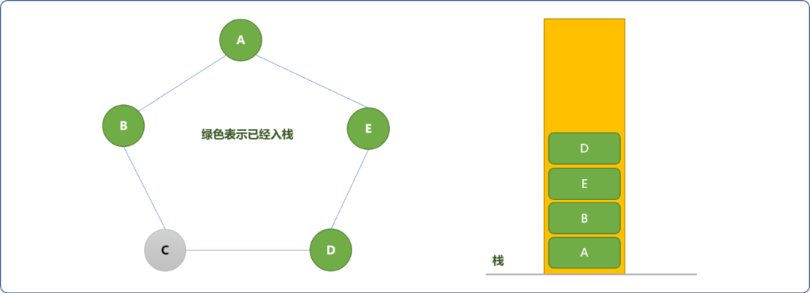


- 检查与`D`顶点相邻的顶点`C`，且压入栈中。

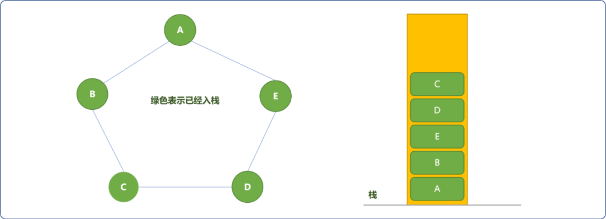


**经过上述操作后，可发现`图结构`中所有顶点全部被压入栈中，此时，能证明什么？**

至少有一点是可以证明的：**栈中的顶点在一个集合或在一个连通分量上。**

**使用如上搜索方案时，是否能找到此连通分量上的所有顶点？**

先看下图的搜索结果：

当查询与 `D`顶点相邻的顶点时，因 `D`和`C`没有连通性，故`C`无法入栈。栈中的顶点在一个连通分量上，是不容质疑的，而实际上 `C`也是此连通分量上的一份子。

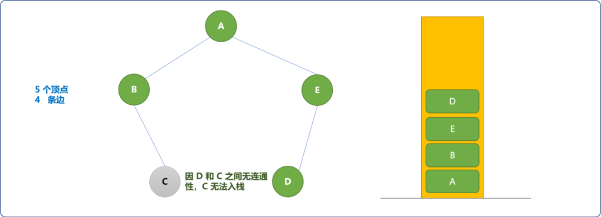


**所以，使用仅入栈不出栈的搜索方案，无法找到同一个连通分量上的所有顶点。**

可以把深度搜索方案改一下，**采用入栈、出栈形式。**

- 初始 `A`入栈。

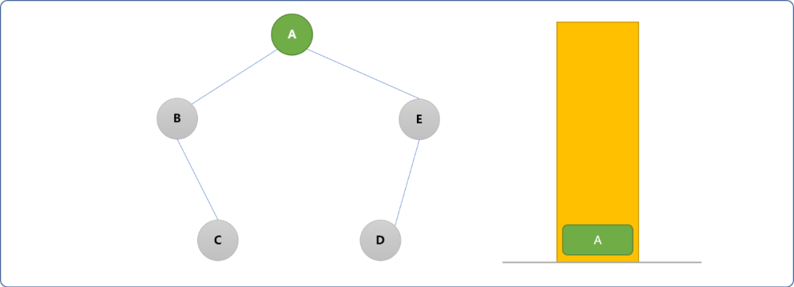


- `A`出栈，找到与`A`相邻的顶点`B、E`，且入栈。

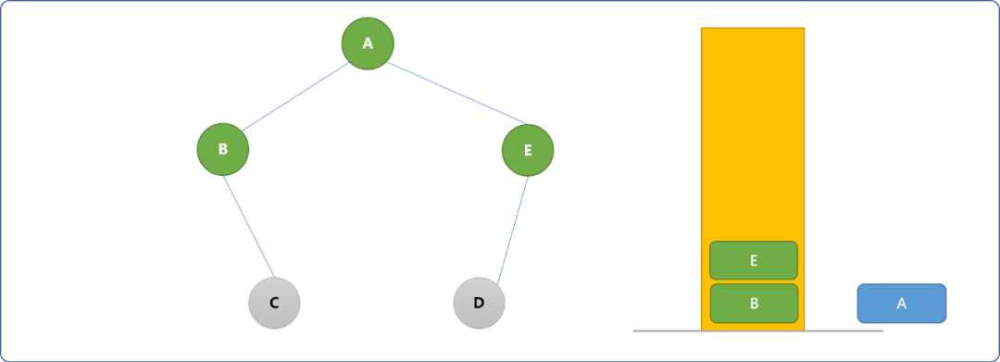


- `E`出栈，找到与`E`相邻的`D`顶点，且让其入栈。

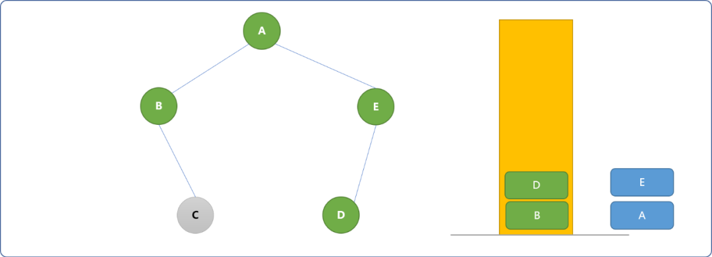


- `D`出栈，因没有与`D`相邻的顶点（每个顶点只能入一次栈）可入栈。继续`B`出栈，因`C`是与之相邻的顶点且没有入过栈，`C`入栈。

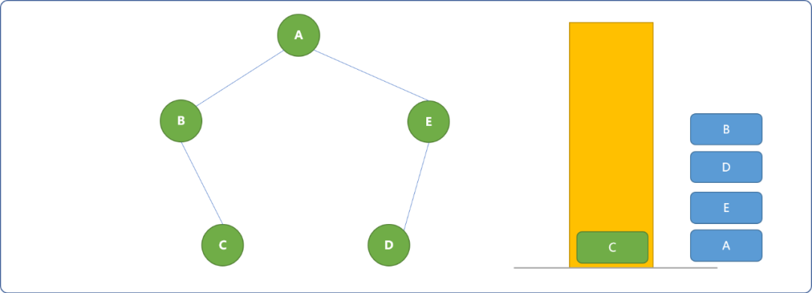


- 最后`C`出栈，栈空。

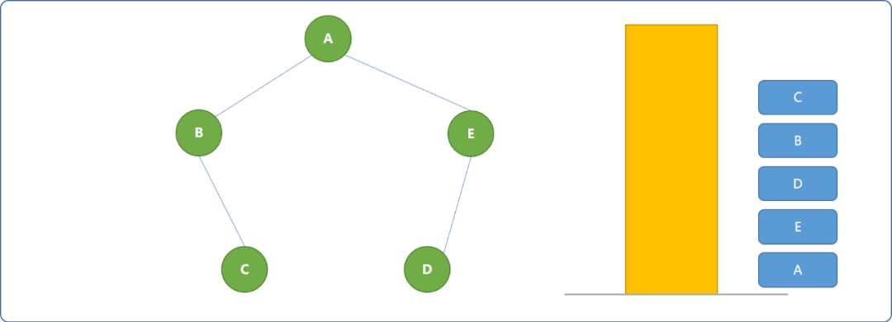


**至此，可以得到一个结论：**

- **在一次深度搜索过程中，入过栈的顶点都在一个集合中（或一个连通分量上）。**
- **使用出栈、入栈方案时，可以保证搜索到一个连通分量上的所有顶点。**

> Tips： 使用广度搜索一样能找到一个连通分量上的所有顶点。

原理很简单，深度搜索是按纵深方式进行搜索的`(类似于一条线上的蚂蚱)`，在互相有关联的纵深线上的顶点能被搜索到。

如下图所示：从`A`开始，有左、右两条纵深线，在搜索完左边的纵深线后。

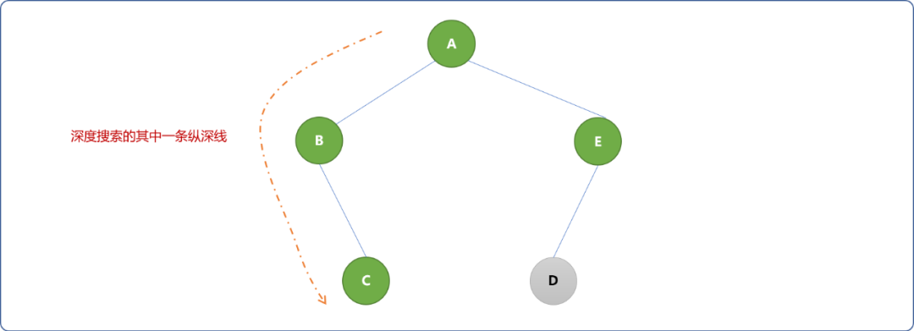


可以继续搜索另一条纵深线。

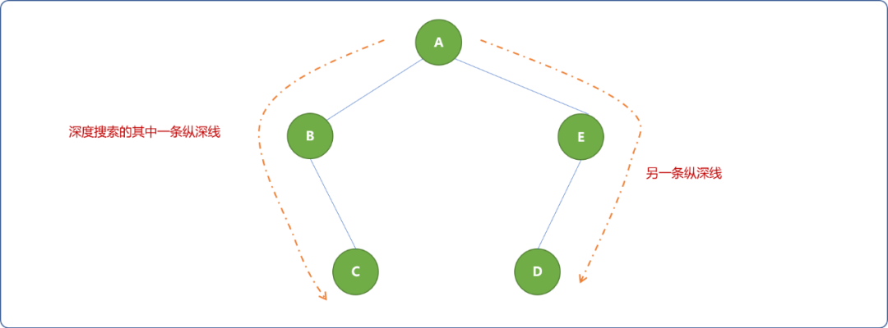


一次深度搜索只能检查到一条连通分量。如果图中存在多个连通分量时，需要使用多次深度搜索算法。如下图所示：

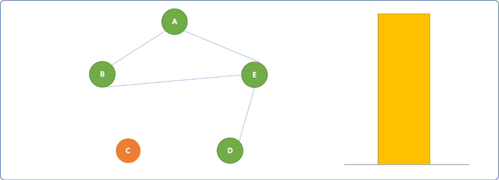


**连通分量与找环有什么关系？**

连通分量与环之间有很一个简单的关系：`环`一定是存在一个连通分量上。找环之前，先要确定目标顶点是不是在一个连通分量上。否则，都不在一起，还找什么环？

**是否在一个连通分量上的顶点一定有环？**

如下图，所有顶点都在一个连通分量中，实际情况是，图没有环。**所以，仅凭顶点全部在一个连通分量上，是无法得到图中一定有环的结论。**


**那么，使用深度搜索算法在图中搜索时，怎么证明图中有环？**

根据前面的推断，可以得出结论：

- 所有搜索的顶点在**一个连通分量上**，且图或子图边数大于或等于顶点数时，那么图或子图中必然存在环。


**那么？环上的顶点有什么特点？**

如果图中存在环，那么，环上每个顶点必然至少有 `2`条边分别和环上另 `2` 个顶点相连，边的数量决定与其相邻顶点的数量。

> **Tips**：道理很简单，如果有 `n`个人通过手牵手围成一个圈，如果其中有一个人只原意伸出一只手，则圈是无法形成的。可以把此人移走，剩余人可以围成一个圈。

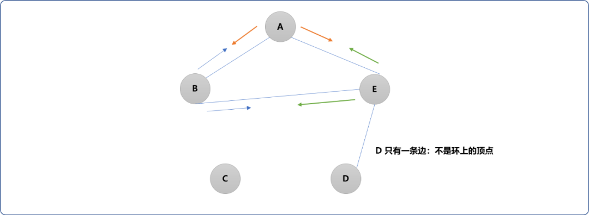


#### 2.2.2 小结

查询环上的顶点时，需要满足如下几个要求：

- 所有顶点在一个连通分量上。
- 连通分量上的边数要大于或等于顶点数。
- 环上至少有 `2` 条边的顶点可认定是环上的顶点。

### 2.3 编码实现

**顶点类：**

```cpp
#include <iostream>
#include <vector>
#define MAXVERTEX  10
using namespace std;
/*
*顶点类
*/
struct Vertex {
 //编号
 int vid;
 //数据
 char val;
 //与之相邻的边数
 int edges;
 //是否访问过
 bool isVisited;
 //前驱节点编号 
 int pvid; 
    
 Vertex() {
  this->vid=-1;
  this->edges=0;
  this->isVisited=false;
 }

 Vertex(int vid,char val) {
  this->vid=vid;
  this->edges=0;
  this->val=val;
  this->isVisited=false;
 }
};
```

**图类：** 先在图类提供常规`API（对顶点的维护函数，添加顶点和添加顶点之间的关系）`。

```cpp
/*
* 图类
*/
class Graph {
 private:
  //所有顶点
  Vertex allVertex[MAXVERTEX];
  //二维矩阵，存储顶点关系（边）
  int matrix[MAXVERTEX][MAXVERTEX];
  //顶点数量
  int num;
 public:
  Graph() {
   this->num=0;
   for(int i=0; i<MAXVERTEX; i++) {
    for(int j=0; j<MAXVERTEX; j++) {
     this->matrix[i][j]=0;
    }
   }
  }
  /*
  *添加顶点,返回顶点编号
  */
  int addVertex(char val) {
   Vertex ver(this->num,val);
   this->allVertex[this->num]=ver;
   return this->num++;
  }

  /*
  *添加顶点之间的关系
  */
  void addEdge(int from,int to) {
   //无向图中，需要双向添加
   this->allVertex[from].edges++;
   this->matrix[from][to]=1;
   this->allVertex[to].edges++;
   this->matrix[to][from]=1;
  }

  /*
  *深度搜索算法找环
  */
  void findCycle() { }
  /*
  *显示矩阵中边信息
  */
  void showEdges() {
   for(int i=0; i<this->num; i++) {
    for(int j=0; j<this->num; j++) {
     cout<<this->matrix[i][j]<<"\t";
    }
    cout<<endl;
   }
  }
};
```

下图的子图`A、B、E、D`就是基环树。现使用代码构建下图：


```cpp
//测试
int main() {
 Graph graph;//=new Graph();
 //添加顶点
 int aid= graph.addVertex('A');
 int bid= graph.addVertex('B');
 int cid= graph.addVertex('C');
 int did= graph.addVertex('D');
 int eid= graph.addVertex('E');
 //添加顶点之间关系
 graph.addEdge(aid,bid);  //A ---- B
 graph.addEdge(aid,eid);  //A  --- E
 graph.addEdge(bid,eid);  //B ---- E
 graph.addEdge(did,eid);  // E----D
 graph.showEdges();
 return 0;
}
```

确认图的构建是否正确。

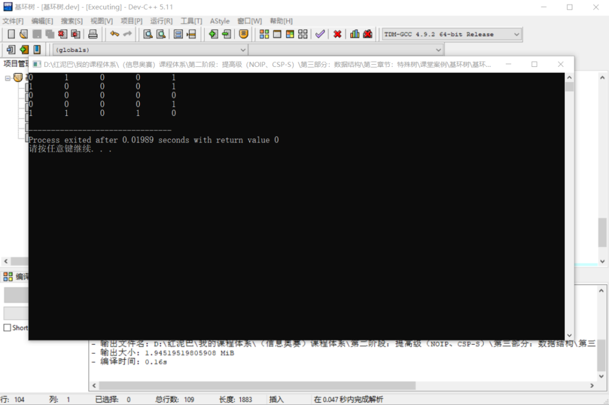


**核心函数：** 使用深度搜索算法检查图中是否存在环。

```cpp
/*
*深度搜索算法找环
*/
void findCycle(int from) {
    //记录连通分量中的边数
    int sides=0;
    //栈
    stack<int> myStack;
    //初始化栈
    myStack.push(from);
    //标志已经入过栈
    this->allVertex[from].isVisited=true;
    //存储搜索过的顶点
    vector<int> vers;

    //出栈操作
    while( !myStack.empty() ) {
        //出栈
        int vid= myStack.top();
        //存储搜索顶点
        vers.push_back(vid);
        //删除
        myStack.pop();
        //检查相邻节点
        for(int i=0; i<this->num; i++ ) {
            if( this->matrix[vid][i]==1 ) {
                // i 是 from 的相邻顶点
                sides++;
                //标志此边已经被记录
                this->matrix[vid][i]=-1;
                if(this->allVertex[i].isVisited==false ) {
                    //边对应顶点是否入过栈
                    myStack.push(i);
                    this->allVertex[i].isVisited=true;
                }
            }
        }
    }

    //输出搜索结果
    cout<<"输出连通分量中的顶点:"<<endl;
    for(int i=0; i<vers.size(); i++)
        cout<< this->allVertex[vers[i]].val<<"\t";
    cout<<endl;
    //存储搜索结果 
    allConns.push_back(vers);

    //检查环
    if(sides>=vers.size() && vers.size()>3 )  {
        //边数大于或等于搜索过的顶点数。表示搜索过的顶点在一个集合中，且有环
        cout<<"存在环："<<endl;
        for(int i=0; i<vers.size(); i++) {
            if( this->allVertex[vers[i]].edges>=2 ) {
                cout<<this->allVertex[vers[i]].val<<"->\t";
            }
        }
        cout<<endl;
    }

    //检查是否还有其它连通分量
    for(int i=0; i<this->num; i++) {
        bool isExist=false;
        //是否已经搜索
        for(int j=0; j<allConns.size(); j++) {
            auto res = find( begin( allConns[j] ), end( allConns[j] ),this->allVertex[i].vid  );
            if(res!=end(allConns[j] )  ) {
                //搜索过
                isExist=true;
                break;
            }
        }
        if(!isExist) {
            findCycle(this->allVertex[i].vid );
        }
    }
}
//显示图中所有连通分量
void showConn() {
    cout<<"图中存在"<<allConns.size()<<"个连通分量"<<endl;
}
```

测试：

```cpp
int main() {
    //省略……
 graph.showEdges();
 graph.findCycle(0);
 graph.showConn();
 graph.showEdges();
 return 0;
}
```

**输出结果：**

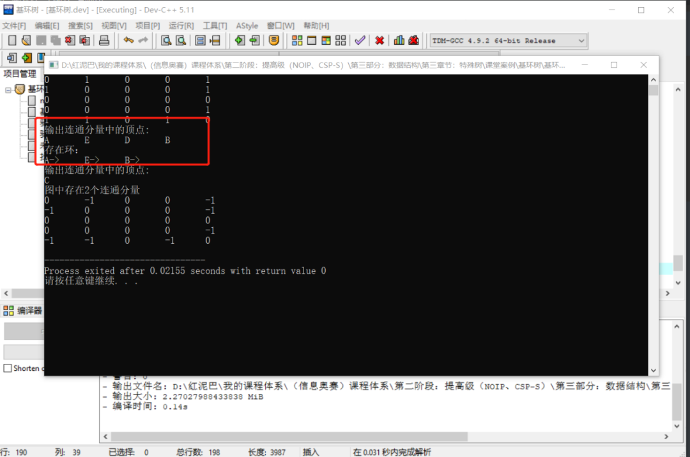


## 3. 总结

本文讲解怎么使用深度搜索算法在无向图中查找环，当然，也可以使用广度搜索算法实现。

检查图中连通性的最好的方案是使用并查集。


