# C++ 树进阶系列之细聊树状数组的点睛之处


## 1. 前言

`树状数组`也称`二叉索引树`，由`Peter M. Fenwick`于`1994`发明，也可称为`Fenwick树`。

树状数组的设计非常精巧，多用于求解数列的前缀和、区间和等问题，为`区间类型`问题提供了模板式解决方案。

数状数组简单易用，但对于初学者，初接触时会有理解上的壁垒，本文将深入细节，深入浅出还原数状数组的全貌。

## 2. 树状数组思想

树状数组，如名所义，本质上还是数组，但其内在有着树一样的灵魂。或者说数组中的数据之间存在树所描述的逻辑结构，即一对多的关系。

简单理解，`树状数组`是对另一个`普通数组`的映射。这里必然会引出 `2` 个值得思考的问题：

- 映射的目的是什么？
- 怎么映射才算完美？

下面带着这 `2` 个问题一一展开叙述。

### 2.1 映射目的

目的可以从一个简单的需求开始。

现有数组 `arr`，如下图所示：


求解从给定的`起始位置`至`终止位置`区间内数组中数据之和。如 `sum[5:10]=arr[5]+arr[6]+arr[7]+arr[8]+arr[9]+arr[10]`。

> **Tips：** `sum[5:10]`表示区间求和，第一个数字表示起始位置，第二个数字表示结束位置。


显然，这个问题是简单的，一个循环便能解决，时间复杂度为`O(n)`。

如果对于任意区间求和是一个频率较高的操作。必然会出现后一次的计算中会包括前一次的计算流程，如前一次求解`sum[5:10]`，后一次求解`sum[5:11]`，显然会出现重复计算`sum[5:10]`的过程。

能否缓存曾经求解过的结果，方便在另一次求解时直接使用。

自然的想法：使用一个缓存数组存储原数组中前面一段区间的和（也称前缀和）。如下图所示：

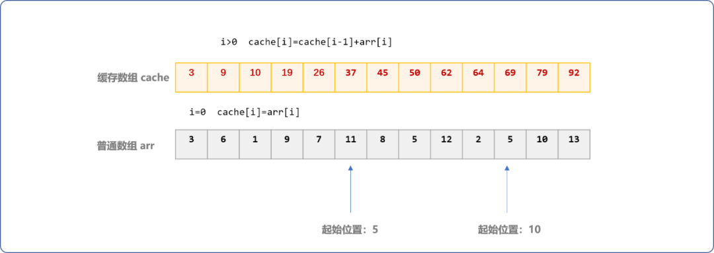

有了缓存数据，此时`sum[5:10]=cache[10]-cache[4]`，求解`sum[5:11]=cache[11]-cache[4]`。当求解任意区间和时，不会出现对某个高频率区间的和重复计算。缓存后求和时间复杂度可以达到`O(1)`。

但是，初始化缓存数组的时间复杂度为`O(n)`。

```cpp
#include <iostream>
using namespace std;
//原数组
int arr[13]= {3,6,1,9,7,11,8,5,12,2,5,10,13};
//缓存数组
int cache[13];
int main(int argc, char** argv) {
 for(int i=0; i<13; i++) {
  if(i==0)
   cache[i]=arr[i];
  else
   cache[i]=cache[i-1]+arr[i];
  cout<<cache[i]<<"\t";
 }
 return 0;
}
```

再就是，当`arr`数组中的值更新后，如`arr[2]=arr[2]+2`后，`cache`数组从索引号为`2`之后位置的值需要全部更新。

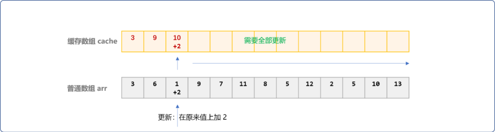

如果这种更新是频繁的，如有`m`次，则时间复杂度会变成`O(m*n)`。

所以说，这种方案可以说是一种方案，但不能算是完美的方案。时间复杂度高，不适用于性能要求高的应用场景。

**性能瓶颈的原因何在**

`cache`数组的每一个位置都缓存了原数组此位置之前的和，当原数组中某个位置的值发生变化后，则缓存数组此位置之后的缓冲值都要更新。

其实，可以采用化整为零思想，把原数组分成很多区间，缓存这些区间的和便可，如需要更新，也只需区间更新。

在求某区间和时，如果能直接找到此区间的缓存值，自然很好，如果找不到，可以累加多个子区间的和。

于是问题就转化为怎么划分区间，树状数组帮助我们完美地解决了这个问题。

### 2.2 二进制索引映射

`树状数组`，利用二进制的特性，对原数组进行了化整为零的区间划分，无论更新还是求和的时间复杂度均保持在`O(logn)`。

平时使用数组时，数组的索引号常用十进制描述。现在改一下习惯，换成二进制表示，为什么要这样，先可以不用管，而精彩部分也是从这里开始。如下图：

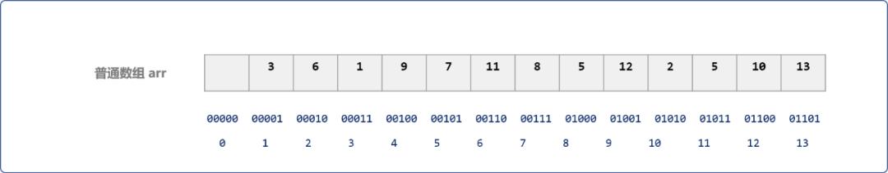

同样，提供一个缓存数组，命名为`bit`。

刚说过，树状数组采用区间缓存。区间的划分就很重要，现在利用在二进制上的进位操作进行魔幻性的区间划分。

首先从`arr`数组索引号为`1`的位置开始划分且更新缓存数据。

> **Tips：** 如下括号内的数字表示数组编号，括号外的数字表示进制。

- `(1)10`的二进制为`(00001)2`。把`(00001)2+(1)2=(00010)2=(2)10`。则第一个区间范围为`(1,2)10`或`(00001,00010)2`。
- 继续在`(00010)2+(10)2=(00100)2=(4)10`，则第二个区间范围为 `(2,4)10`或`(00010,00100)2`。
- 继续在`(00100)2+(100)2=(01000)2=(8)10`，则第三个区间范围为 `(4,8)10`或`(00100,01000)2`。
- 继续直到小于等于数组的最大索引号，本文只研究到数组中编号为 `8`位置。

如下图所示，以索引号`1`作为起始边界，分别划分出  `3` 个子区间，在`bit`数组的区间边界位置中缓存`arr[1]`中的值。

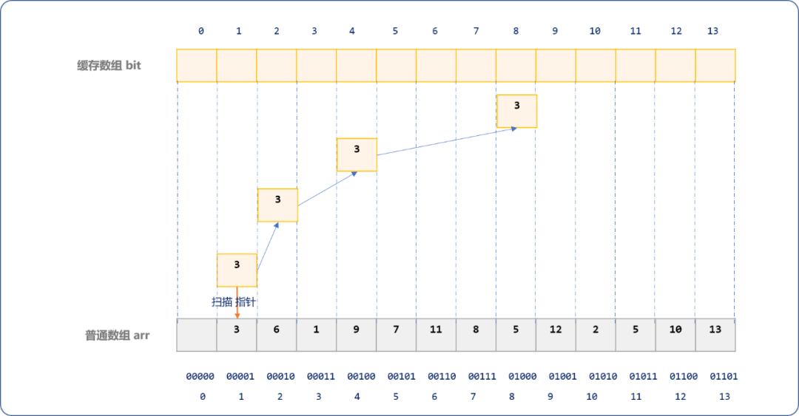

**这里会有一个问题，在划分区间的过程中，二进制递增的值`1，10，100`是怎么来的？**

如下图所示，本质是在低位第一个`1`的位置向高位做进位操作。


再在`arr`数组索引号为`2`的位置开始划分且更新。

根据前面的划分规则，其区间分别是`(2,4)10`或`(00010,00100)2`、`(4,8)10`或`(00100,01000)2`。且更新此区间中的值。也意味着这 `2` 个区间被更新了 `2` 次。


在每一次划分和更新操作时，如果出现区间重复划分，则此区间内的缓存值会如波峰一样一层一层叠加。

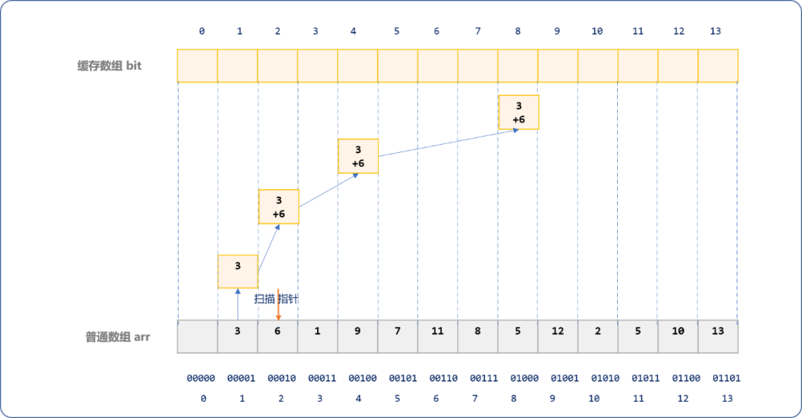

再在`arr`数组索引号为`3`的位置开始划分且更新。


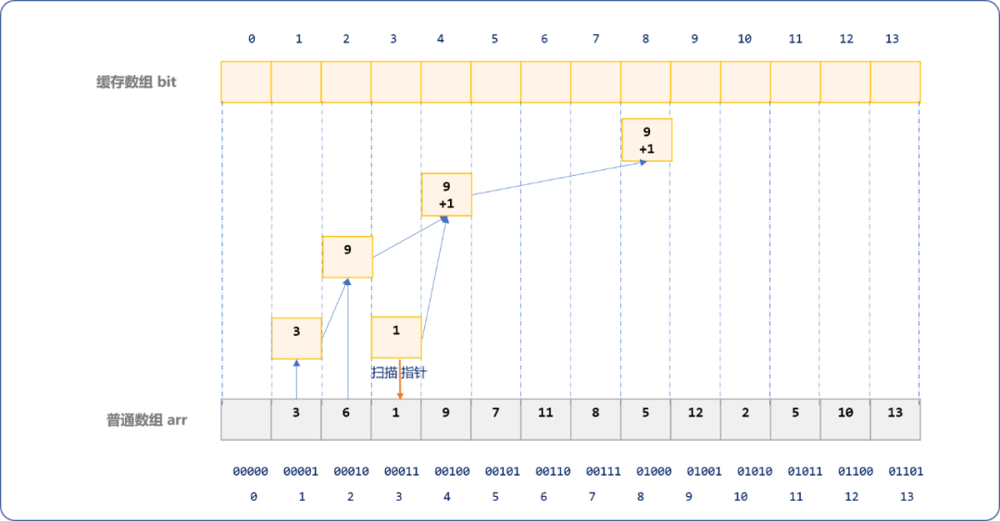

再扫描到`arr`数组索引号为`4`的位置开始划分且更新。

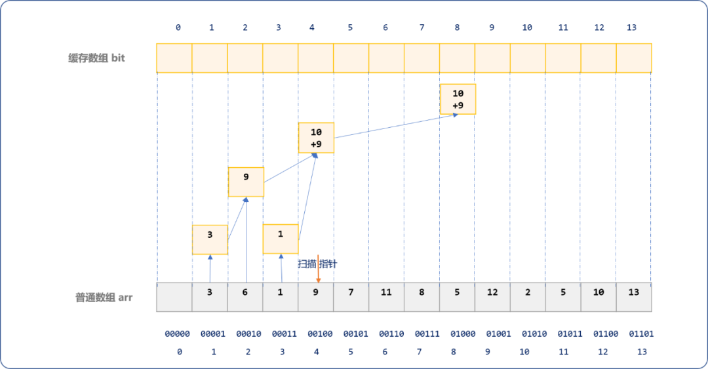

再扫描到`arr`数组索引号为`5`的位置开始划分且更新。

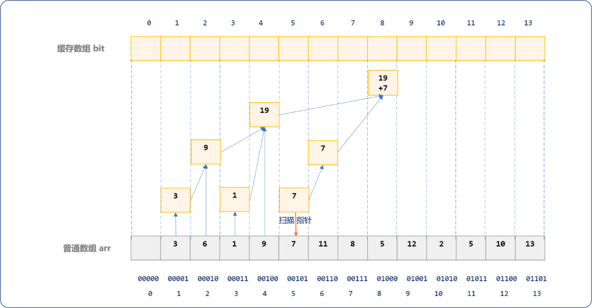

如下是扫描到`arr`数组索引号为 `6`时的演示图。

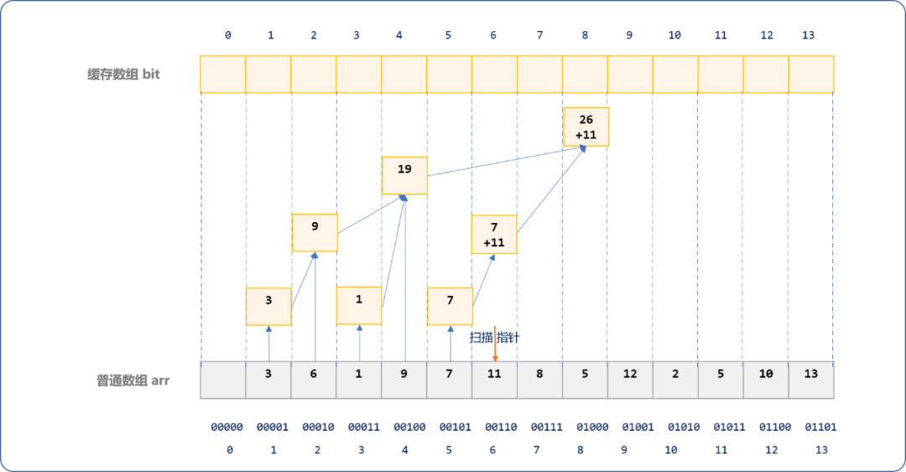

如下是扫描到`arr`数组索引号为 `7`时的演示图。

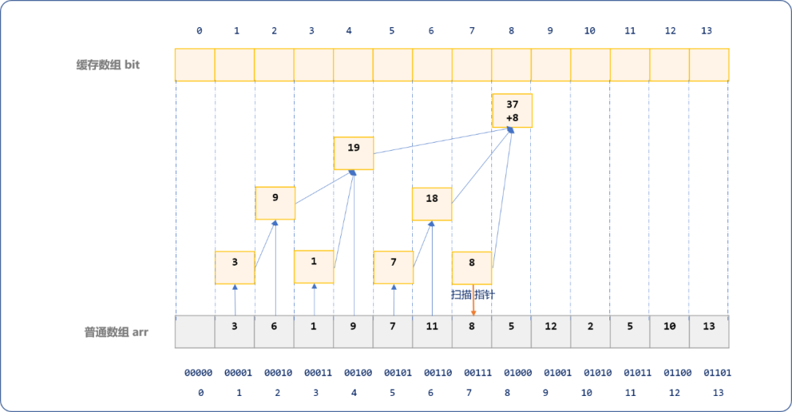

如下是当扫描到`arr`数组索引号为 `8`时的演示图。

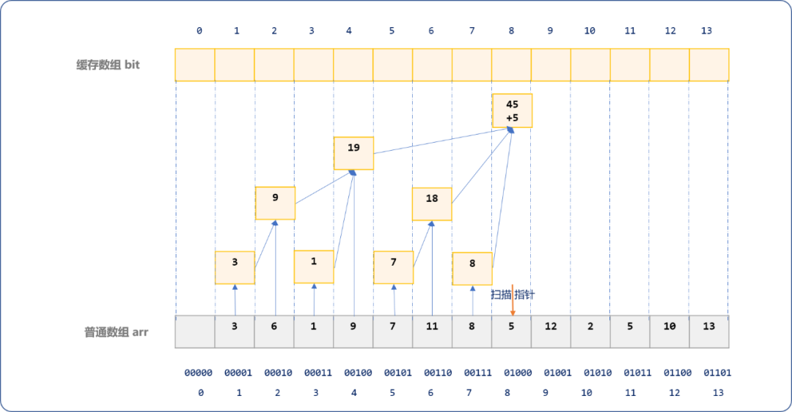

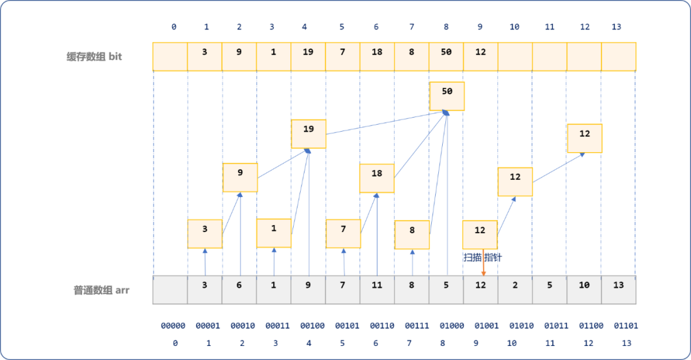

最后可以看到，`bit`数组中的数据之间呈现出树形逻辑结构，这也是树状数组的由来。

缓存过程，犹如一层一层波浪，由子结点向根结点向上蔓延叠加。

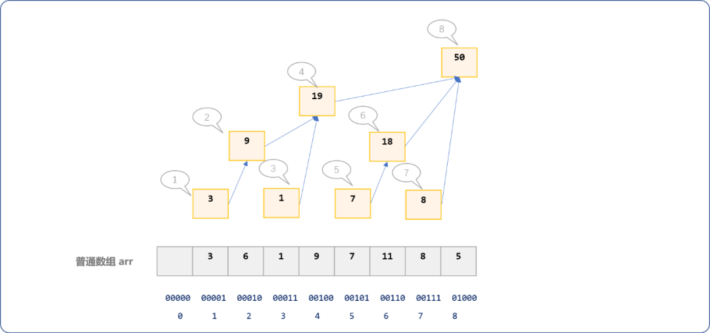

有了不同区间的缓存数据，下面就可以求解给定区间内数字之和了。

**求和过程是更新过程的逆操作，**

更新是根据起始位置计算区间的结束位置，而求和是根据结束位置计算区间的起始位置。

`bit[8]`缓存了`arr`数组前 `8` 个位置中所有数字之和，因为对`arr`中的数值缓存时，最终都会跳跃到此位置。如下图所示：


但是如果求解`arr`数组前 `7` 个位置的和，需要累加如下 `3` 个区间的值， `sum=bit[7]+bit[7]+bit[4]`。如下图演示区间的跳跃过程。

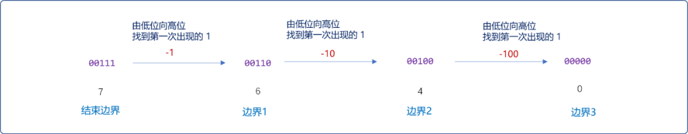

在长度为 `8` 的数组中，无论是一次或多次跳跃，向上都会跳跃到 `8` 这个位置，向下都会跳跃到 `0` 这个位置。无论是`更新`还是`求和`，都是利用二进制的这种跳跃特性，真是令人惊叹。

## 3. 树状数组的 API

树状数组最优秀或让人惊艳的地方在于通过二进制的进位划分区间的思想，故树状数组也称为`Binary Indexed Tree`，算是求仁得仁。

树状数组中有一个核心的`API`，如何找到二进制中低位上第一次出现的 `1`。这个函数通常命名为 `lowbit(x)`。也是树状数组典型的象征。

另外至少还应该包含缓存（更新）函数和区间求和函数。

```cpp
#include <iostream>
using namespace std;
class BinaryIndexedTree {
 private:
  //树状数组
  int* bit;
  //大小
  int size;
 public:
  BinaryIndexedTree(int size):size(size) {
   this->bit=new int[size]{0}; 
  }
  /*
  * 二进制计算
  */
  int lowbit(int x);

  /*
  *缓存或更新
  */
  void update(int i,int val);

  /*
  *区间求和
  */
  int getSum(int upBound,int lowBound);

  /*
  *输出缓存数据
  */
  void showBit() {
   for(int i=1; i<this->size; i++)
    cout<<this->bit[i]<<"\t";
  }
};
```

`lowbit`函数：有 `2` 种实现方案。

注意：是查找低位上第一个 `1` 以及后面的数字，如`10001`返回`(1)2=(1)10`，`10010`返回`(10)2=(2)10`，`10100`返回`(100)2=(4)10`，`101000`返回`(1000)2=(8)2`……

- 消掉最后一位`1`，然后再用原数减去消掉最后一位`1`后的数。

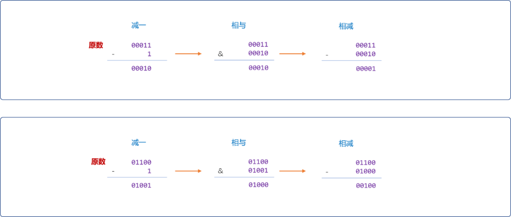

```cpp
int BinaryIndexedTree::lowbit(int x) {
 return x - (x & (x - 1));
}
```

- 求负数的补码。

```cpp
int BinaryIndexedTree::lowbit_(int x) {
 return x & -x;
}
```

`update`函数：此函数实现就较简单。

```cpp
/*
* 参数说明
* i 数组索引号
* val 需要更新的值
*/
void BinaryIndexedTree::updata(int i,int val) {   
 while(i <= this->size) {
        //缓存数据
  bit[i] += val;
         //区间的下一个边界
  i += lowbit(i);
 }
}
```

`getSum`函数：区间求和与更新过程互为逆操作。

```cpp
/*
* 参数说明
* upBound 区间的上边界,包含 
* lowBound 区间的下边界，包含 
*/
int BinaryIndexedTree::getSum(int upBound,int lowBound) {
 //上边界之和
    int sum=0;
 for(int i=upBound; i>0; i-=this->lowbit(i) ) {
  sum+=this->bit[i];
 }
    //下边界之和
 int sum_=0;
 for(int i=lowBound-1; i>0; i-=this->lowbit(i) ) {
  sum_+=this->bit[i];
 }
    //区间之差
 return sum-sum_;
}
```

**测试更新：**

```cpp
int main(int argc, char** argv) {
 int arr[9]= {0,3,6,1,9,7,11,8,5};
 BinaryIndexedTree bt(9);
 for(int i=1; i<9; i++) {
  bt.update(i,arr[i]);
 }
 cout<<"原数组"<<endl;
 for(int i=1; i<9; i++) {
  cout<<arr[i]<<"\t";
 }
 cout<<"\n树状数组"<<endl;
 bt.showBit();
 return 0;
}
```

**输出 bit 结果：**

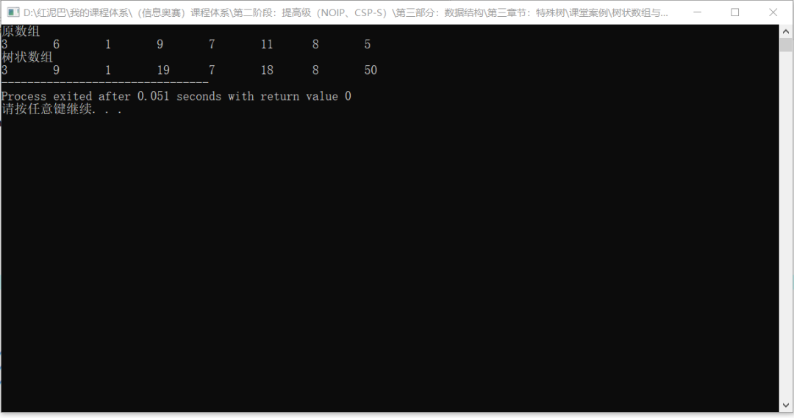

**测试区间求和：**

```cpp
int main(int argc, char** argv) {
    //省略……
 int sum= bt.getSum(8,4);
 cout<<"\n区间[4:8]之和"<<sum;
 cout<<endl;
 return 0;
}
```

**输出结果：**

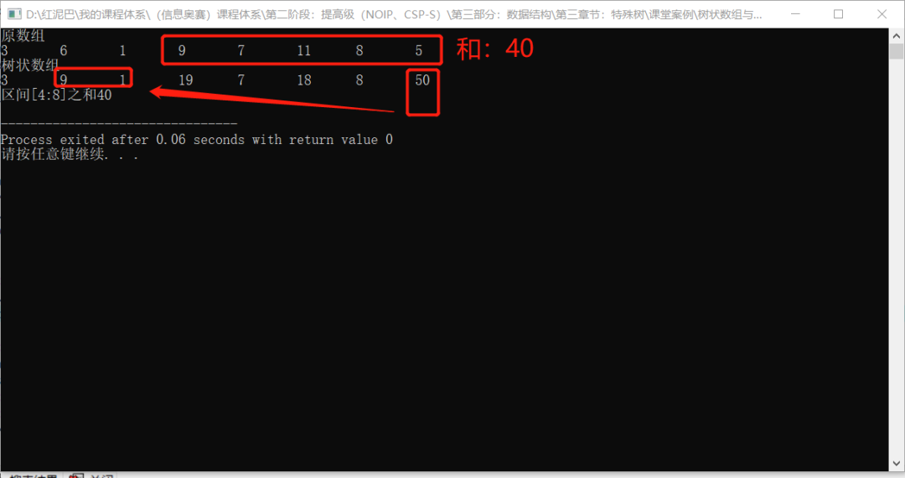

## 4. 总结

树状数组不仅用于区间求和，也可以用于区间求最值。只需要在更新是保证每次更新值最大（小）即可。

```cpp
void BinaryIndexedTree::update(int i,int val) {
 while(i < this->size) {
  if(val>this->bit[i])
      //保证每次更新值是最大的 
   this->bit[i] = val;
  i +=this->lowbit(i);
 }
}
```

再在树状数组中添加一个`getMax(int pos)`函数。

```cpp
int BinaryIndexedTree::getMax(int pos) {
 int mx= 1<<31;
 for(int i=pos; i>0; i-=this->lowbit(i) ) {
  if(this->bit[i]>mx)
   mx=this->bit[i];
 }
 return mx;
}
```

便能求解指定区间的最大值。测试代码就留给大家自行实现。

当你洞穿了树状数组的原理，在应用场景必然会想起它。


