# C++ 树进阶系列之深入线段树和它的延迟更新


## 1. 前言

`线段树`和`树状数组`有相似之处，可以用于解决`区间类型`的问题。

但两者又各个千秋，树状数组本质是数组，有着树的形，可以借用树的一些概念。线段树是典型的二叉树结构，无论神和形都是树，可以应用树的所有理论。

本文将详细聊聊线段树。

## 2. 问题驱动

与树状数组一样，线段树可以缓存区间内具有特殊性质的数据（如：区间和，区间最值、…），以提高操作性能。

现通过一个案例理解`线段树`的初衷。

如有如下数组，现有求任意区间内最大值的需求。最简单的解决方案是使用`穷举法`求最值，时间复杂度`O(n)`。


如果求某个区间中的最值是一个高频率操作，每次都使用穷举法计算，累积的时间代价是非常大的。

在代码中，当需要对相同的计算频繁调用时，首当其冲的想法必然是缓存机制。针对本题可以使用简单动态规划思想，缓存原数组中每一个位置的最大值。

```cpp
#include <bits/stdc++.h>
using namespace std;
int main() {
 //原数组
 int nums[8]= {3,6,1,9,7,11,8,5};
 //最大值缓存数组
 int cache[8]= {0};
 cout<<"原数组中数据"<<endl;
 for(int i=0; i<8; i++)
  cout<<nums[i]<<"\t";
 cout<<endl;
 cout<<"缓存数据"<<endl;
 for(int i=0; i<8; i++) {
  if(i==0)
   cache[i]=nums[i];
  else
   cache[i]=max(cache[i-1],nums[i]);
  cout<<cache[i]<<"\t";
 }
 cout<<endl;
 //求前 5 位数中的最大值
 cout<<"求前 5 位数中的最大值"<<endl;
 cout<<cache[4]<<endl;
 cout<<"求前 [3~7] 区间中的最大值"<<endl;
 cout<<max(cache[2],cache[6]  )<<endl;
 return 0;
}
```

**输出结果：**

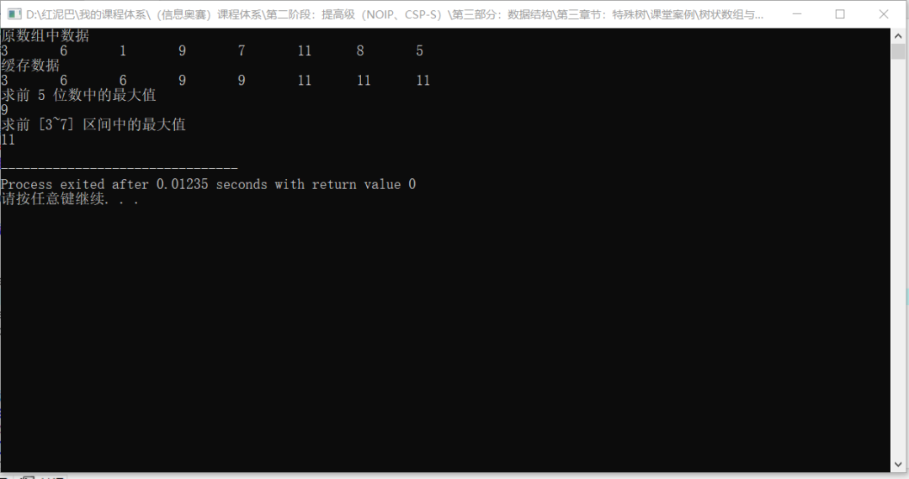

缓存时间复杂度是`O(n)`，求最值时间复杂度为`O(1)`，如果原数组中的数据是稳定的，不失为一种良好的方案。

但是，如果原数组中的数据有频繁更新需求时，则需要随时联动更新整个缓存数组，时间性能会变得较大。

线段树的基本思路和树状数组一样，仅对区间信息缓存，更新也仅针对区间进行，线段树的时间复杂度为`O(logn)`。

## 3. 线段树的构建流程

在探讨线段树的构建之前，先看一下最终线段树的形状。

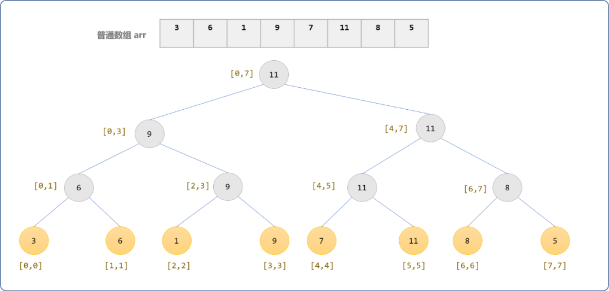

分析结果图可知：

- 原数组`arr`中的每一个数据都是线段树的叶结点。
- 非叶结点的值是在其左、右子结点的值中选择了较大哪个。
- 结点至少包含 `3` 个信息`(值或称权重，左、右边界值)`。且叶结点的区间特征是左、右边界值相同。
- 整个数组就是一个大区间，区间边界从`0`到`7`，可统一描述格式为`[0,7]`。

根据分析，构建的基本思路：

- 父结点向左、右子结点发送请求，获取左、右子结点上的值。
- 如果左、右子结点不是叶结点，则继续向自己的左、右子结点发送值的请求。
- 如果左、右子结点是叶结点，则把值回送给父结点。
- 父结点获取到左、右子结点值后，求两者中的最大值作为自己的值。

上面的过程显然符合递归的向后请求、向上回溯的执行模式。下面根据原数组提供的信息，使用递归思想构建出完整的线段树。

- 构建根结点，区间信息为 `[0,7]`，值未知。


- 构建根结点的左、右子结点。对根结点的区间`[0,7]`使用二分思想，划分成左、右 `2` 个子区间，左区间范围`[0,7/2]`，右区间范围`[7/2+1,7]`，此时，左、右子结点点值任然未知。


- 以此类推，继续对非叶结点的区间信息采用二分思想，以子区间信息构建子结点。

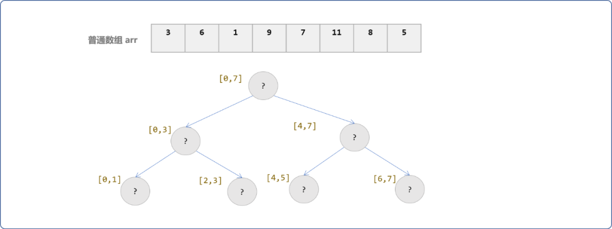

- 直到区间不能再分（左、右边界相同），此时构建出来的结点是叶结点。以叶结点的区间值为索引号，从原数组中获取值。

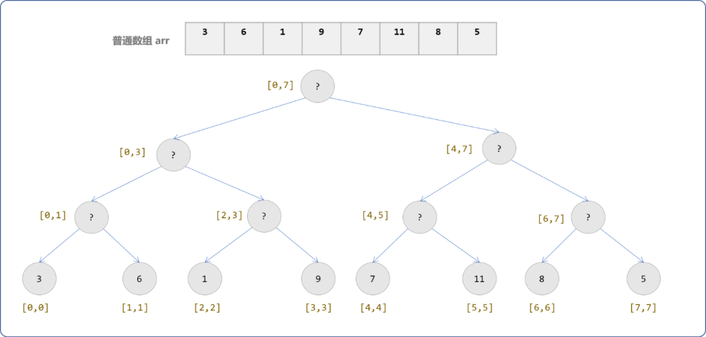

- 然后把值向父结点提供，父结点会选择较大的值作为自己的值。

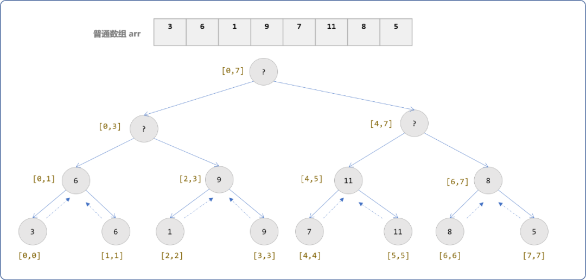

- 一路向上，直到根结点的值被填充。

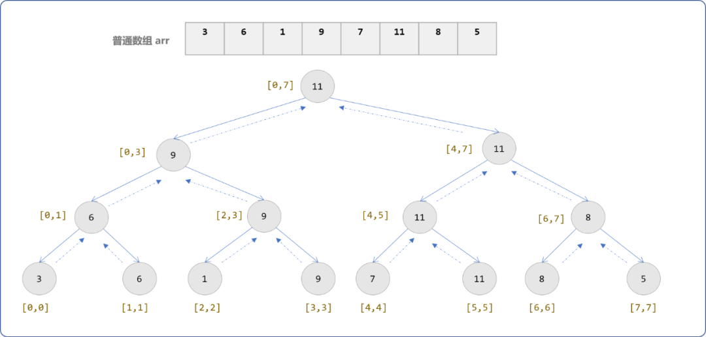

最终可以看到构建出了一个满二叉树。

**是不是对于任意一个数列中的数据都能构建出满二叉树？**

不一定，只能说是一棵近似的完全二叉树。

因本例中数组恰好有 `8` 个数据。

根据二叉树的原理。树的深度为`logn+1`，`n=8`时，深度`h=4`。

而又知，二叉树的最后一层的结点数最多为 2h-1，把`h=4`代入后可知值为`8`。当最后一层达到最大数量时，此二叉树方为满二叉树。如果原数组中的数据只有 `5` 或其它个数，最后一层是不可能达到满二叉树所要的数量。

## 4. 线段树的 API

原数组中的数据个数不同，所构建出来的线段树不一定是满二叉树，或者说一定是完全二叉树，但也是一棵近似完全二叉树。因为完全二叉树中父结点和子结点的存在如下的位置关系。

- 如果父结点的位置为 `i`。
- 如果存在左、右子结点，则左子结点的位置为 `i*2`、右子结点的位置为 `2*i+1`。
- 如果已知子结点的位置`i`，则父结点的位置是 `i/2`。根结点的父结点位置为 `0`。

有了这个良好的数学关系，线段树常使用数组方式进行存储。

线段树的抽象`API`。

### 4.1 结点类

结点类中有一个`lazy`属性，称为延迟更新值，延迟更新是线段树的一个显著的特点。暂且不表，在线段树的区间更新时再深聊。

```c++
#include <bits/stdc++.h>
#include <cmath>
using namespace std;
struct TreeNode {
 //编号,与结点存储位置对应
 int code;
 //结点的值（权重）
 int value;
 //左边界
 int left;
 //右边界
 int right;
 //延迟更新值
 int lazy; 
 /*
 *无参构造 
 */
 TreeNode() {
  this->code=0;
  this->lazy=0;
 }
 /*
 *有参构造 
 */ 
 TreeNode(int code,int value,int left,int right) {
  this->code=code;
  this->value=value;
  this->left=left;
  this->right=right;
  this->lazy=0;
 }
 /*
 *自我显示 
 */ 
 void desc() {
  cout<<"结点存储位置："<<this->code<<"，区间：["<<this->left<<","<<this->right<<"]，值："<<this->value<<endl;
 }
};
```

### 4.2 线段树类

```cpp
class SegmentTree {
 private:
  //使用数组存储线段树的结点
  TreeNode** st;
         //线段树大小
  int size;
 public:
  SegmentTree(int size):size(size) {
   //树的深度
   int h=ceil(log2(size)) +1;
             //数组的大小
   this->size=pow(2,h);
   this->st=new TreeNode*[this->size] {NULL};
  }
  /*
  * 初始化线段树
  * arr: 原数组
  * pos: 线段树中的位置
  * left：左区间
  * right：右区间
  */
  int initTree(int* arr,int pos, int left,int right);
  /*
  * 查找指定区间的最大值
  */
  int getMax(int left,int right);
  /*
  *单点更新
  */
  int update(int pos,int index,int val);
  /*
  *区间更新
  */
  int queryUpdate(int pos,int left,int right,int val);
        /*
        *显示树结点
        */
  void showAll() {
   for(int i=0; i<this->size; i++) {
    if(this->st[i]!=NULL)
     this->st[i]->desc();
   }
  }
};
```

#### 4.2.1 初始化函数

使用递归初始化整个线段树。

```cpp
int SegmentTree::initTree(int* arr,int pos, int left,int right) {
 if(left==right) {
  //如果左、右边界相同
  this->st[pos]=new TreeNode(pos,arr[left],left,right);
        //叶结点是递归出口
  return arr[left];
 }
    //二分思想划分左右区间
 int mid=(right+left)/2;
 //初始左子结点 
 int lVal= initTree(arr,2*pos,left,mid);
 //初始右子结点
 int rVal= initTree(arr,2*pos+1,mid+1,right);
 //找左、右子结点中的较大值
 int val=max(lVal,rVal);
 //以较大值创建结点
 this->st[pos]=new TreeNode(pos,val,left,right);
 return val;
}
```

**测试构建线段树：**

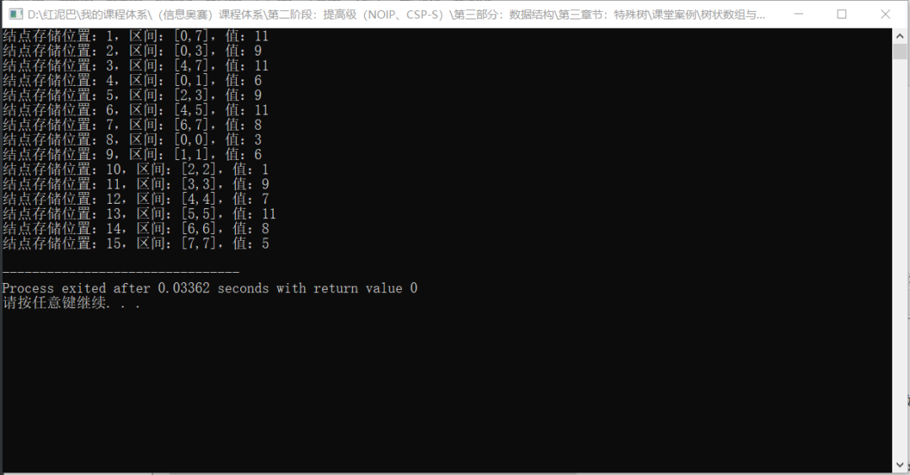

#### 4.2.2 区间查询

查询指定区间中的最大值，需分几种情况讨论。

- 无效区间。如下图所示，`[left,right]`中的`left>7`或`right<0`时。返回无解。

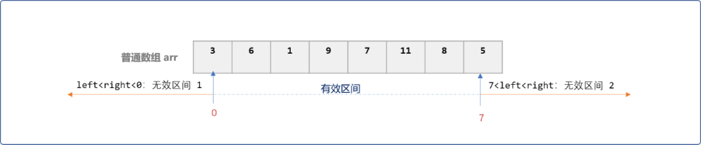

- 完整包含。当`[left,right]`中的`left<=0 and right>=7`时。返回`[0,7]`区间的最大值。


- 匹配左或右子区间。查找左、或右子空间中的最大值。


- 与左、右子空间相集。为左、右子空间中较大的值，即为`[0,7]`区间最大值。


```cpp
/*
*区间查找
*/
int SegmentTree::getMax(int left,int right) {
    //从根结点开始查找
    int pos=1;
    //移动指针
    TreeNode* move=NULL;
    while(1) {
        move=this->st[pos];
        if (left>move->right || right<move->left )
            //无效区间
            return 1>>31;
        else if( left<=move->left && right>=move->right )
            //查找区间恰好包含在此区间
            return move->value;
        else {
            //中间位置
            int mid=(move->left+move->right)/2;
            if( right<=mid )
                //左边查找
                pos=move->code*2;
            else if(left>=mid )
                //右边查找
                pos=move->code*2+1;
            else
                return move->value;
        }
    }
}
```

测试区间查找：

```cpp
int main() {
 //省略……
 int res= segmentTree.getMax(2,7);
 cout<<"区间[2,7]最大值："<<endl;
 cout<<res<<endl;
 res= segmentTree.getMax(1,3);
 cout<<"区间[1,3]最大值："<<endl;
 cout<<res<<endl;
 return 0;
}
```

输出结果：

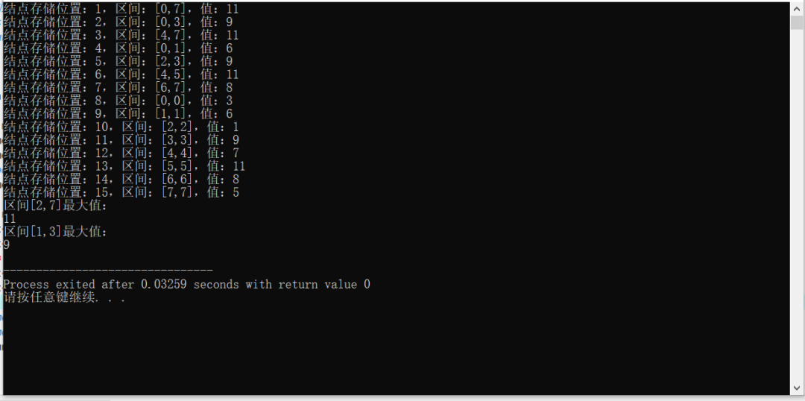

#### 4.2.3 单点更新

单点更新某一个叶结点上的值。使用递归方案一路向下查询到叶结点，再在回溯过程中更新非叶结点。和初始线段树的逻辑相似。

```cpp
/*
*单点更新
*/
int update(int pos,int index,int val) {
    TreeNode* move=this->st[pos];
    if( move->left== move->right ) {
        //如果是叶结点，直接更新
        this->st[pos]->value+=val;
        return  this->st[pos]->value;
    }
    //不是叶结点
    int mid= (move->left+move->right)/2;
    int lVal=0;
    int rVal=0;
    int mx=0;
    if( index<=mid ) {
        //更新左边子区间
        lVal=update(pos*2,index,val);
        //在更新后的左子区间和右子区间中找出较大的值
        mx=max(lVal,this->st[pos*2+1]->value );
    } else {
        //更新右子空间
        rVal=update(pos*2+1,index,val);
        //在更新后的右子区间和左子区间中找出较大的值
        mx=max(this->st[pos*2]->value, rVal);
    }
    //更新当前位置
    this->st[pos]->value=mx;
    return mx;
}
```

测试单点更新：

```cpp
int main() {
    //省略……
   cout<<"\n索引号为 3 位置的值增加 5(原来是 9，增加后为 14) \n"<<endl; 
 segmentTree.update(1,3,5);
 segmentTree.showAll();
 return 0;
}
```

输出结果：

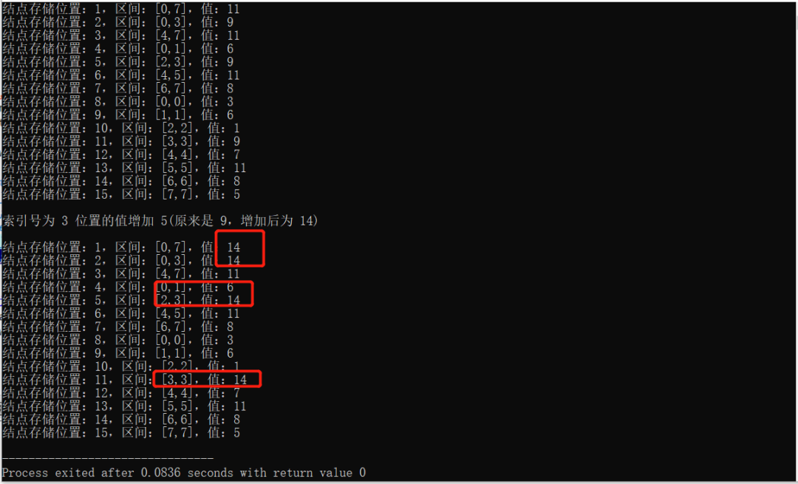

当同时需要更新的叶结点较多时，因为单点更新的时间复杂度为`O(logn)`，如果逐次调用单点更新函数，需要能达到最终结点，时间复杂度为`O(n*logn)`。

线段树提供了延迟更新策略，算是线段树最高光之处。

### 4.2.4 区间更新

区间更新并不要求一步到位，而是利用了积累的力量。基本思想是边查询边更新，查询到哪里更新到哪里。

如下图所示，线段树上的每一个结点都有一个`lazy`延迟更新属性，初始值为 `0`。

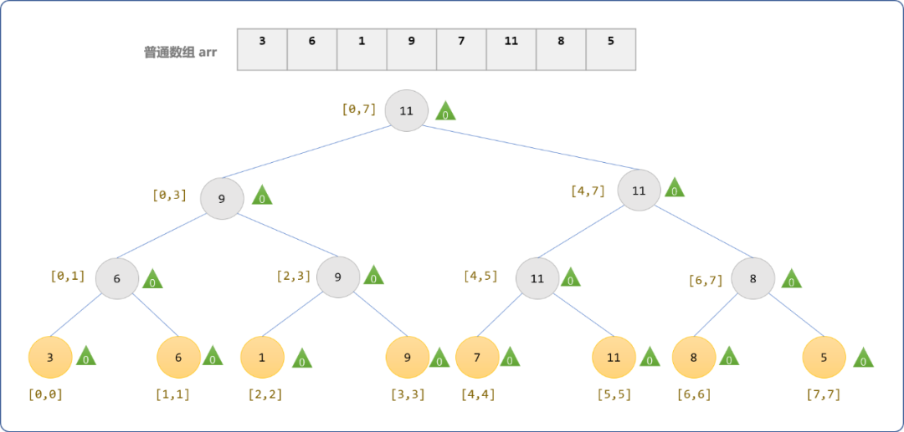

- 当需要让`[0,3]`区间内所有叶结点值`+5`时。更新会延迟到当某次需要查询`[0,3]`区间的最大值时，这时从根结点向下查询到`[0,3]`结点`9`。让结点 `9`的值增加为 `14`，且结点 9 的 `lazy`属性存储增量`5`后再把 `14` 返回给根结点，让根结点更新为`14`。

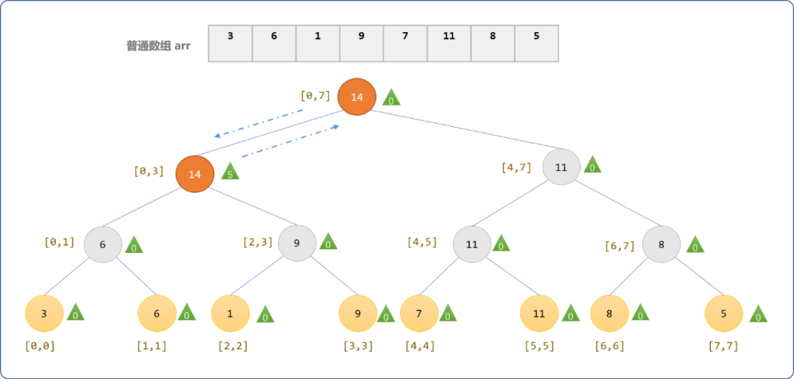

- 当下次需要查询`[0,1]`区间内最大值时。当查询到`[0,3]`且发现其`lazy`属性值不等于`0`。则会把此值向左、右子结点传递。

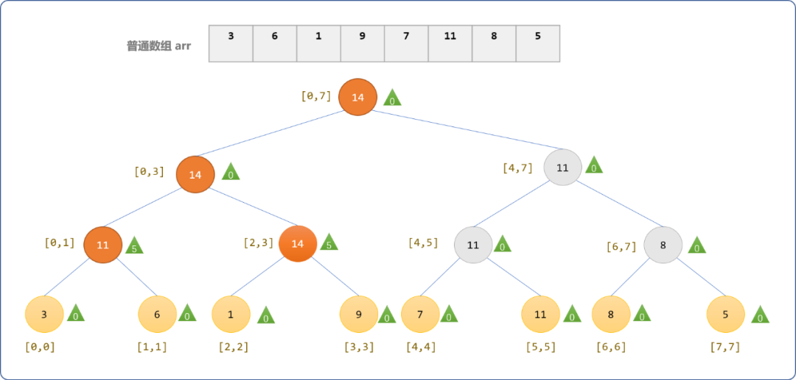

```cpp
/*
*区间更新
*/
int SegmentTree::queryUpdate(int pos,int left,int right,int val) {
    //移动指针
    TreeNode* move=this->st[pos];
    if (left>move->right || right<move->left )
        //无效区间
        return 1>>31;
    if( left<=move->left && right>=move->right ) {
        //查找区间恰好包含在此区间
        move->lazy+=val;
        move->value+=move->lazy;
        //叶结点，清除延迟值
        move->lazy=move->left==move->right?0:move->lazy;
        return move->value;
    }
    //中间位置
    int mid=(move->left+move->right)/2;
    int lVal=0;
    int rVal=0;
    int mx=0;
    if(move->lazy!=0) {
        //延迟值向左、右子结点传递
        this->st[pos*2]->lazy=move->lazy;
        this->st[pos*2+1]->lazy=move->lazy;
        //清零
        move->lazy=0;
    }
    if(right<=mid ) {
        //查询左边
        lVal= queryUpdate(pos*2,left,right,val);
        this->st[pos]->value=max(move->value, lVal);
        return lVal;
    } else if(left>=mid ) {
        //右边查找
        rVal=queryUpdate(pos*2+1,left,right,val);
        this->st[pos]->value=max(move->value, rVal);
        return rVal;
    } else {
        //查找区间恰好包含在此区间
        move->lazy+=val;
        move->value+=move->lazy;
        //叶结点，清除延迟值
        move->lazy=move->left==move->right?0:move->lazy;
        return move->value;
    }
}
```

测试区间更新：

```cpp
int main() {
 //省略……
 cout<<"\n对区间[0,3]的结点值加 5，查询时更新： \n"<<endl;
 //segmentTree.update(1,3,5);
 int res= segmentTree.queryUpdate(1,0,3,5);
 cout<<"[0,3]最大值"<<res<<endl;
 segmentTree.showAll();
 cout<<"\n对区间[0,1]的结点值加 9，查询时更新： \n"<<endl;
 res=segmentTree.queryUpdate(1,0,1,9);
 cout<<"[0,1]最大值"<<res<<endl;
 segmentTree.showAll();
 cout<<"\n对区间[0,0]的结点值加 9，查询时更新： \n"<<endl;
 res=segmentTree.queryUpdate(1,0,0,9);
 cout<<"[0,0]最大值"<<res<<endl;
 segmentTree.showAll();
    return 0;
}
```

**输出结果：**可以看到[，当查询到`[0,0]`结点时，些结点才一次性全部更新。

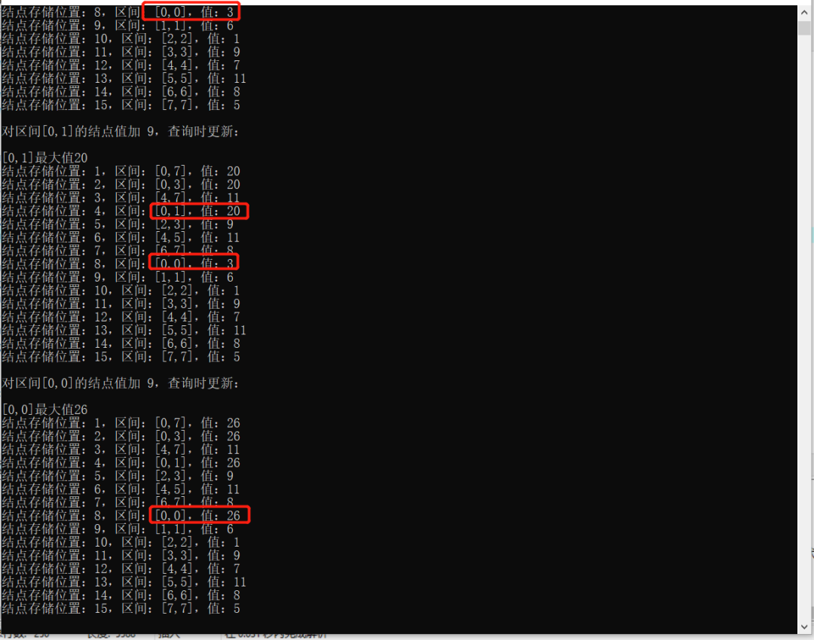

## 5. 总结

线段树是很有个性的数据结构，常用于解决区间类型问题。线段树有一个延迟更新理念，查询深度不同，更新到的深度也不一样。


