# C++ 树进阶系列之深度剖析字典（trie）树


## 1. 前文

本文和大家一起聊聊字典树，从字典二字可知，于功能而言，字典树是类似于`英汉字典`的一棵信息树。字典树有 `2` 大特点：

- 有容乃大，能存储大量的数据信息。
- 提供有基于关键字的查询、检索机制。

常用`字典树`存储字符串（单词）信息，使用`字典树`能方便实现进行字符串的存储、查询、统计、排序……一系列操作。

## 2. 字典树特点

`字典树`是树结构的典型应用，如下图所示，为一棵字典树。`字典树`的叶结点起标志性作用，标记字符串的结束，类似于`C++`字符串的结束符号`\0`。

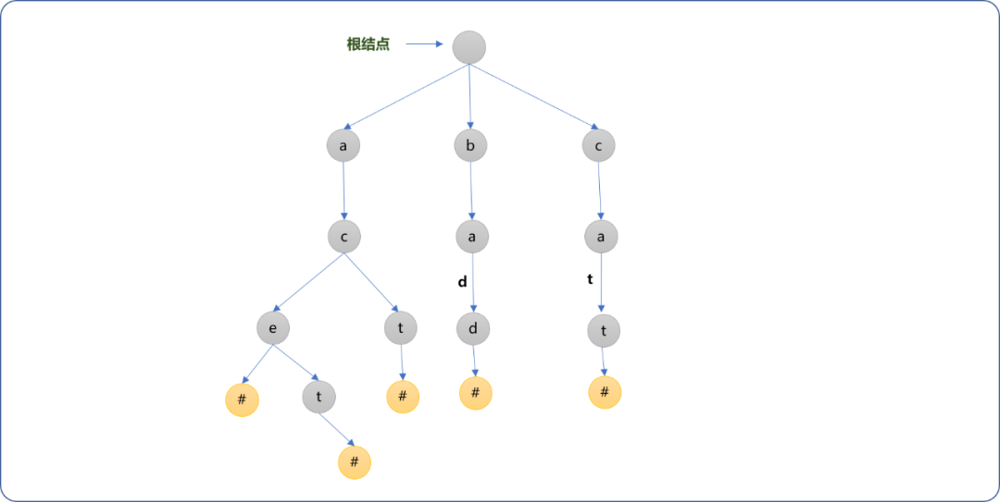

通过观察，可以大致了解字典树的几个特点：

- 字典树不是`二叉树`，字典树的每一个结点可以有多个子结点，除根结点外每个结点存储一个字符信息(常用于字符信息存储，但不仅限于字符信息)。
- 顺着根结点向子结点连接，可以找到一个`字符串`信息。只因为这个特性，字典树如其名，可存储大量的单词。如从根结点开始，找到它的第一个子结点`a`，然后找到`a`的子结点`c`，再顺着 `c`找到`e`。这样就能得到子符串`ace`。
- 具有`公共前缀`的字符串不需要重复存储，公用共同的祖先，如`ace`和`act`的公共祖先结点是`ac`。这也是字典树的一大特点，相比较其它的存储方案，具有高度的空间利用率。

## 3. 字典树的物理存储

字典树的常用`API`有`插入`和`查询`，其它可根据应用场景的需要进行扩展。字典树的物理实现可以使用`矩阵`和`链式`存储 `2` 种方案，本文分别探讨这 `2` 种方案的实现过程。

### 3.1 链式存储

为了简化操作，实现过程中使用了`STL`的`vector`容器存储任一结点的子结点，当然，也可以使用带有头结点的链表。

#### 3.1.1 结构类型

**结点类型：** 描述字典树的结点信息。

```cpp
#include <iostream>
#include <vector>
using namespace std;
/*
*字典树结点
*/
struct TrieNode {
 //结点对应字符
 char data;
 //所有子结点指针
 vector<TrieNode*> childs;
    TrieNode(){
  this->data='#';
 } 
};
```

**字典类：** 维护字典的常用`API`，此处先提供基本的`API`，后面根据需要再扩展。

```cpp
/*
*字典树类
*/
class Trie {
 private:
  //根结点
  TrieNode* root;
  //字典树上所有字符串(单词)
  vector<string> words;
 public:
  /*
  *构建函数
  */
  Trie() {
   //初始化根结点
   this->root=new TrieNode();
  }
  /*
  *返回根结点
  */
  TrieNode* getRoot() {
   return this->root;
  }
  /*
  * 查询结点是否包括值为 ch 的子结点
  */
  TrieNode* findChild(TrieNode* parent,char ch);
  /*
  *插入新的单词（字符串）
  */
  void insert(string word);
  /*
  *查询字典树是否存在指定的字符串（单词）
  */
  TrieNode* search(string word);
  /*
  * 查询字典树上所有字符串（单词）
  */
  void getAllWords(TrieNode *node,string word);
  /*
  *显示字典树上的所有单词
  */
  void showAllWords()
}
```

#### 3.1.2  常规 `API`

##### 3.1.2.1 `insert`函数

**功能描述：** 提供添加字符串（单词）的功能，是构建字典树的第一重要环节。

**实现流程：**现以添加`abc`字符串为例，讲解添加函数的实现过程。

- 首先构建根结点。根结点不需要存储具体的数据信息。


- 分解字符串`abc`，且读入字符`a`，以根结点为当前结点，查询当前结点是否存在值为`a`的子结点。


- 因字典树刚创建，此子结点不存在，则为根结点新建值为`a`的子结点，并且`当前结点指针`指向新建的结点。

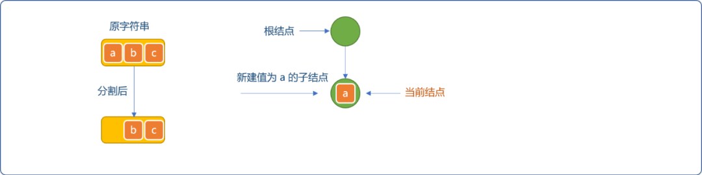

- 继续从字符串中分割出字符`b`，检查当前结点是否存在值为`b`的子结点。没有则为当前结点创建值为`b`的新结点，重设当前结点的指针为新建结点。

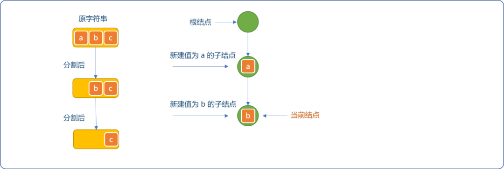

- 同理，分割出`c`，因当前结点不存在值为`c`的子结点，为当前结点构建新结点。且重设当前结点的指针。

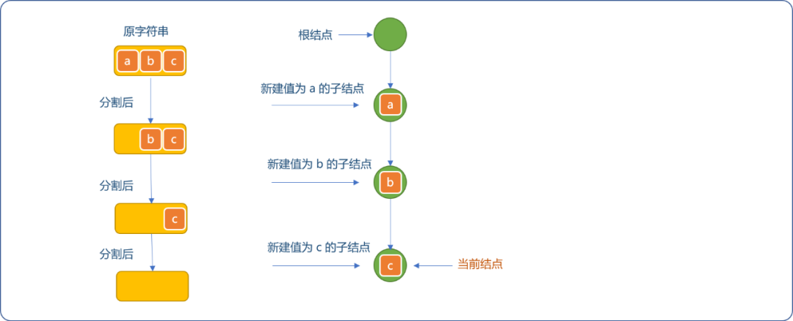

- 当字符串分割完毕后，最后添加值为`#`的叶结点作为结束标志符。

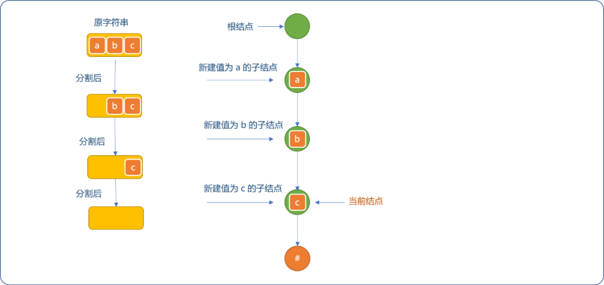

- 在现有字典树上继续添加`abd`字符串（单词）。当前结点需要重置为根结点，分割`abd`字符串时，因为值为`a`和`b`的结点已经存在，则仅让当前结点向下滑动。

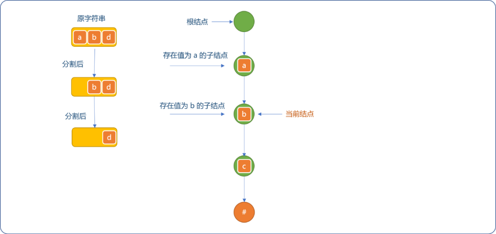

- 分割出`d`字符，因当前结点不存在值为`d`的子结点，新建值为`d`的子结点。且因字符串已经分割完毕，为`d`结点添加结束子结点。如下图所示。

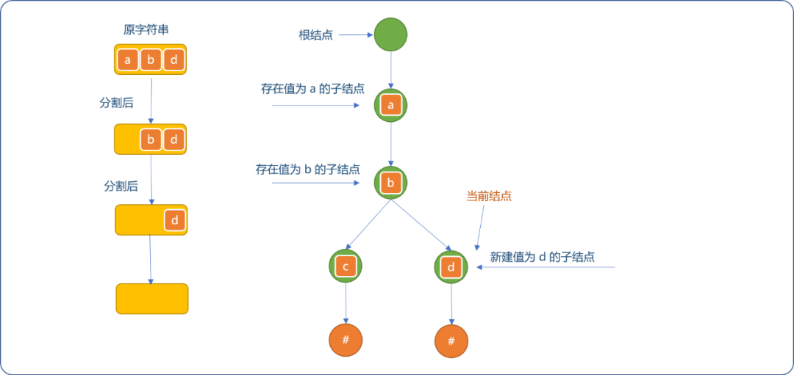

**编码实现：**

实现辅助函数`findChild`：

```cpp
/*
* 查询结点是否包括值为 ch 的子结点
*/
TrieNode* Trie::findChild(TrieNode* parent,char ch){
    //获取当前结点的所有子结点
    vector<TrieNode*> childs= parent->childs;
    //遍历查询
    for(int i=0; i<childs.size(); i++) {
        if( childs[i]->data==ch  ) {
            //存在
            return childs[i];
        }
    }
    //不存在
    return NULL;
}
```

**实现`insert`函数：**

```cpp
/*
* 插入新的单词（字符串）
* 参数：word 需要添加的字符串
*/
void Trie::insert(string word) {
    //从根结点开始
    TrieNode* currentNode=this->root;
    //分割字符串
    for(int i=0; i<word.size(); i++  ) {
        //查询子结点是否存在
        TrieNode* childNode= Trie::findChild(currentNode,word[i]);
        if(childNode==NULL  ) {
            //子结点不存在，构建新结点
            TrieNode* newNode=new TrieNode();
            newNode->data=word[i];
            //成为当前结点的子结点
            currentNode->childs.push_back(newNode);
            //重设当前结点
            currentNode= newNode;
        } else {
            //结点存在
            currentNode= childNode;
        }
    }
    //分割完毕，添加标志性结点
    TrieNode* flagNode=new TrieNode();
    currentNode->childs.push_back(flagNode);
}
```

**测试插入函数：**

```cpp
int main(int argc, char** argv) {
 Trie* trie=new Trie();
 trie->insert("abc");
 trie->insert("abd");
 TrieNode* root=trie->getRoot();
 cout<<"根结点的子结点："<<root->childs[0]->data<<endl;
 cout<<"根结点的子结点的子结点："<<root->childs[0]->childs[0]->data<<endl;
 cout<<"结点的子结点的子结点的子结点:"<<root->childs[0]->childs[0]->childs[0]->data<<endl;
 cout<<"结点的子结点的子结点的子结点:"<<root->childs[0]->childs[0]->childs[1]->data<<endl;
 return 0;
}
```

**输出结果：**

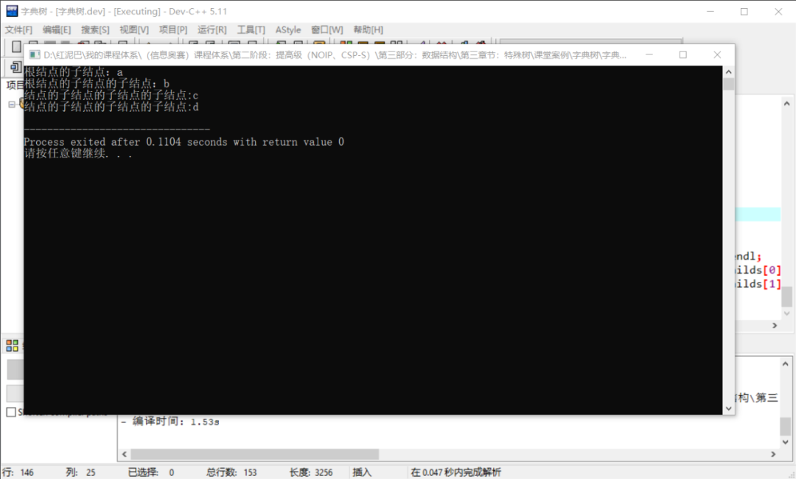

##### 3.1.2.2 `search`函数

**功能描述：** 查询给定的字符串（单词）是否存在于字典树中。

**实现流程：** 查询和插入流程相似。如果检查到存在与分割出来的字符值相等的子结点便继续向下查询，否则，认为查询失败。

不要求一定的是完整字符串（单词），仅是前缀也可以。

如下图所示，虽然字典树中不存在`ab`字符串（单词），因为存在`ab`前缀，也认为是存在的。

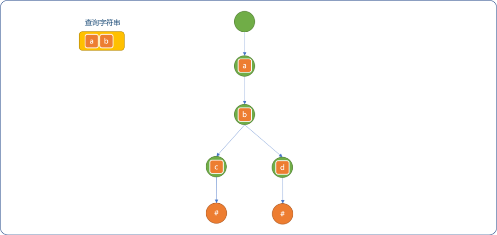

**编码实现：**

```cpp
/*
* 查询字典树是否存在指定的字符串（单词）
*/
TrieNode* Trie::search(string word) {
    //从根结点开始
    TrieNode* currentNode=this->root;
    //分割需要查询的字符串
    for(int i=0; i<word.size(); i++) {
        //子结点是否存在
        TrieNode* childNode= Trie::findChild(currentNode,word[i]);
        if(childNode!=NULL) {
            //继续查询
            currentNode=childNode;
        } else {
            //不存在
            return NULL;
        }
    }
    //查询成功，只要字符串和字典树上的字符一一对应便可
    return currentNode;
}
```

**测试查询：**

```cpp
int main(int argc, char** argv) {
 Trie* trie=new Trie();
 trie->insert("abc");
 trie->insert("abd");
 TrieNode* root=trie->getRoot();
 TrieNode* node= trie->search("ab");
 if(node!=NULL){
  cout<<"字典树中存在 ab"<<endl; 
 }else{
  cout<<"字典树上不存 ab"<<endl;
 }
 return 0;
}
```

**输出结果：**

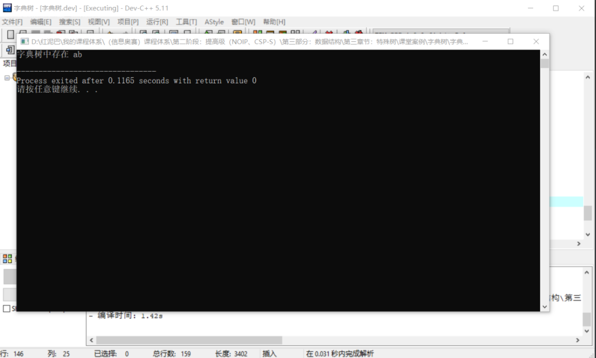

##### 3.1.2.3 `getAllWords`函数

**功能描述：** 返回字典树上的所有字符串（单词）。

**实现流程：** 对于整棵树的搜索常用的方案有`深度`和`广度`搜索。针对此需求使用`深度`搜索便能查询出树上的所有单词。

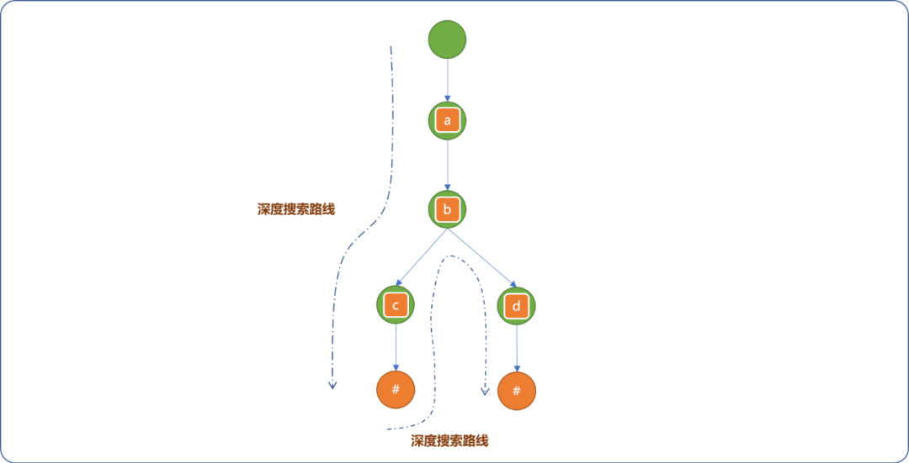

**编码实现：**

实现辅助函数 `showAllWords`：显示字典树上的所有单词。

```cpp
/*
*显示所有单词
*/
void showAllWords() {
    cout<<"字典树上的所有单词:"<<endl; 
    for(int i=0; i<this->words.size(); i++) {
        cout<<this->words[i]<<endl;
    }
}
```

**实现`getAllWords`函数：**

```cpp
/*
* 显示字典树上所有字符串
*/
void Trie::getAllWords(TrieNode *node,string word) {
    //当前结点
    TrieNode* currentNode=node;
    //当前结点的子结点
    vector<TrieNode*> childs=currentNode->childs;
    for(int i=0; i<childs.size(); i++) {
        if(childs[i]->data=='#') {
            //如果结点值为结束符号，则获取到了完整单词
            this->words.push_back(word);
        } else {
            //否则，继续递归
            string word_=word;
            word_.append( {childs[i]->data} );
            getAllWords(childs[i], word_ );
        }
    }
}
```

**测试代码：**

```cpp
int main(int argc, char** argv) {
 Trie* trie=new Trie();
 trie->insert("abc");
 trie->insert("abd");
 TrieNode* root=trie->getRoot();
 trie->getAllWords(root,"");
 trie->showAllWords();
 return 0;
}
```

**输出结果：**

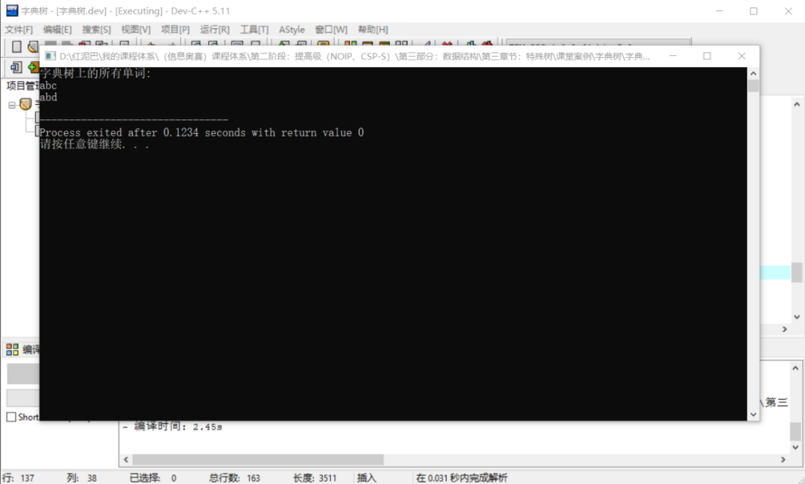

### 3.2 矩阵存储

使用`矩阵`存储树结点之间的关系也是一种常见方案。

基本存储思想：

- 对每一个结点进行编号。
- 以父结点的编号为矩阵的行号，子结点的编号为列号，行与列对应的单元格中存储结点的关系描述（或值、权重）。

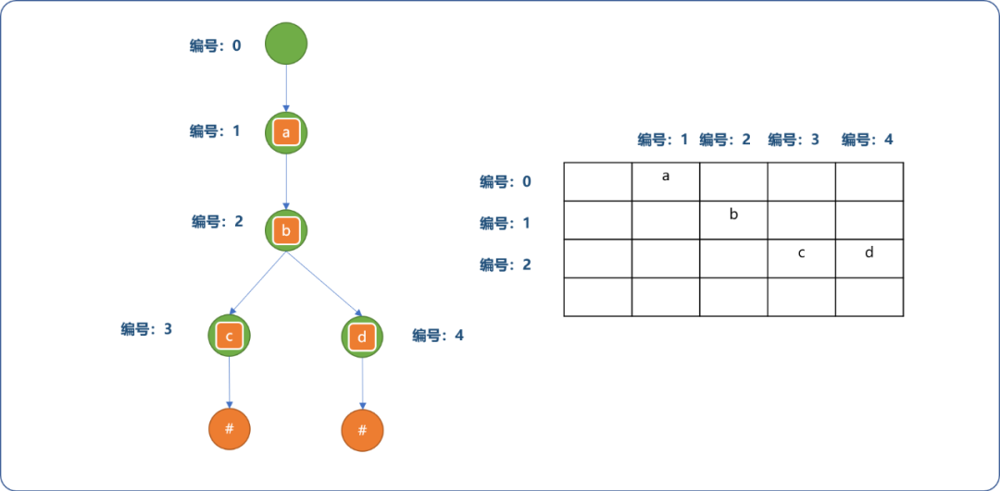


在存储字典树信息时，对上述的存储方案可以稍加改进一下。

- 如先确定根结点的编号为`0`，但是子结点`a`在矩阵中的列号由其对应的`ASCII`码决定，当然，会对其范围缩小。

  对应单元格中存储字符出现的顺序编号，并以此编号为此结点的标志符号。

  这个编号与字符添加顺序有关，与字符本身无关。如下图所示：

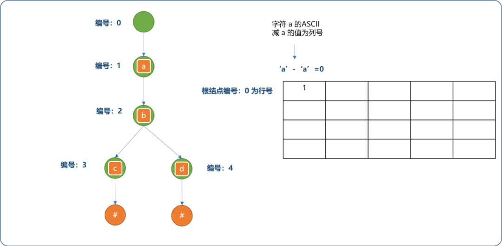


- 字符`b`是字符`a`的子结点。添加过程如下图所示。

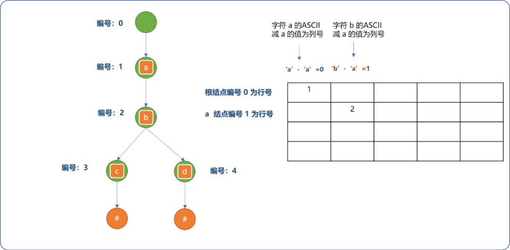


- 继续完成其它结点关系的存储。

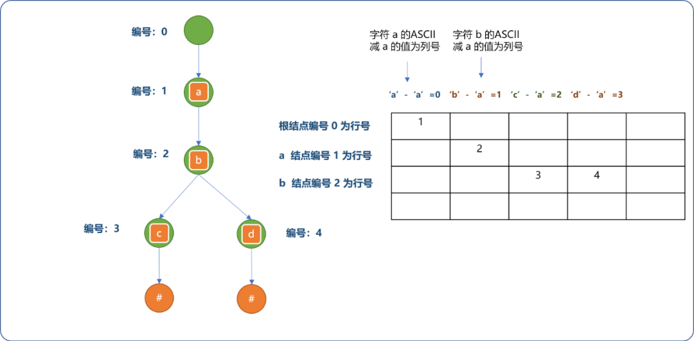


上述存储的优点：

- 可以把矩阵的列数限制在 `26` 之内。
- 查询任一结点的子结点时，可以根据字符本身所携带信息找到其存储位置。如果`b`结点下还有字符`w`的子结点，便能轻易知道其存储位置是 `[2]['w'-'a']`并能获取`w`结点的编号。

**编码实现：**

与前文的链式存储相毕较，仅是改变了存储方式，逻辑是没有发生任何变化。

```cpp
#include <iostream>
#include <vector>
using namespace std;
/*
* 字典树类
*/
class Trie {
 private:
  /*
  * 矩阵：存储结点之间的关系
  * 1、矩阵的行数由结点数量决定， 简化问题，此处设置为 100
  * 2、矩阵的列数由字符数量决定
  */
  int matrix[100][26];
  //所有结点由内部统一编号
  int number;
  //字符串的结束标志
  char endFlag[100];
  //存储字典树上的所有单词
  vector<string> allWords;
 public:
        /*
        * 初始化
        */
  Trie() {
   this->number=0;
   for(int i=0; i<100; i++)
    for(int j=0; j<26; j++)
     matrix[i][j]=0;
  }
  /*
  * 插入函数
  */
  int insert(string word) {
   //当前结点指向根结点
   int current=0;
   //遍历字符串
   for(int i=0; i<word.size(); i++) {
    //检查当前结点下是否存在值为 word[i] 的子结点
    if( matrix[current][ word[i]-'a' ]==0 ) {
     //不存在
     matrix[current][ word[i]-'a' ]=++this->number;
    }
    //重设当前结点
    current=matrix[current][ word[i]-'a' ];
   }
   //添加结束标志
   endFlag[current]='#';
  }

  /*
  *查询指定的字符串是否存在字典树中
  */
  int search(string word) {
   //从根结点开始
   int current=0;
   //遍历字符串
   for(int i=0; i<word.size(); i++) {
    if( matrix[current][ word[i]-'a' ]==0 ) {
     //没找到
     return -1;
    }
    //继续
    current= matrix[current][ word[i]-'a' ];
   }
   return current;
  }

  /*
  * 使用深度搜索算法获取树上的所有单词
  */
  void getAllWords(int parent,string word) {
   int current=parent;
   //查询所有子结点
   for(int i=0; i<26; i++) {
    if(matrix[current][i]!=0  ) {
     if( endFlag[matrix[current][i]]=='#'  ) {
                         //注意此处需要添加一下
      word.append( {  char(i+'a')  } );
      this->allWords.push_back(word);
                          //恢复
      word.pop_back();
     } else {
      string word_=word;
      word_.append( {  char(i+'a')  } );
                          //递归调用
      getAllWords( matrix[current][i], word_);
     }
    }
   }
  }
  /*
  *显示字典树上的所有单词
  */
  void showAllWords() {
   cout<<"字典树上的所有单词:"<<endl;
   for(int i=0; i<this->allWords.size(); i++ )
    cout<<this->allWords[i]<<endl;
        }
};
//测试
int main() {
 Trie*  trie=new Trie();
 trie->insert("abc");
 trie->insert("abd");
 int res= trie->search("ab");
 cout<<res<<endl;
 trie->getAllWords(0,"");
 trie->showAllWords();
 return 0;
}
```

**输出结果：**

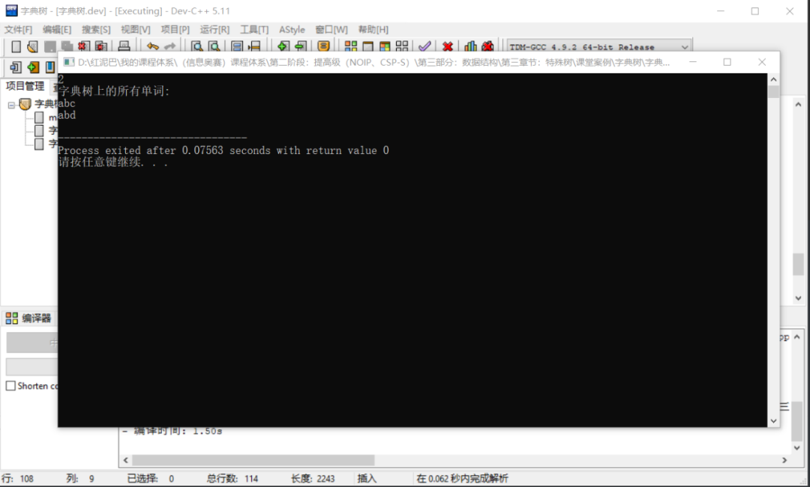


使用数组存储的优点：

- 查询所有单词时，会自动对其按字典进行排序。
- 实现起来较直观，易理解。

## 4. 字典树的应用

到些，想必对字典树有了较好的理解，下文再提供 `2` 个案例 ，带你更深入体会字典树的神奇之处。

### 4.1 自动补全

所谓自动补全：指只要用户输入单词前缀，则会显示所有与此前缀有关联的单词。此功能在关键字搜索应用中经常可以看到。

如果字典树中存在单词集`["cat","caton","cater","this"]`，当用户输入`cat`时，则自动显示所有以`cat`为前缀的单词：`caton`、`cater`。

实现原理：

- 在字典树中查找前缀是否存在。
- 如果存在，以此前缀最后一个字符的结点为当前结点进行深度搜索。

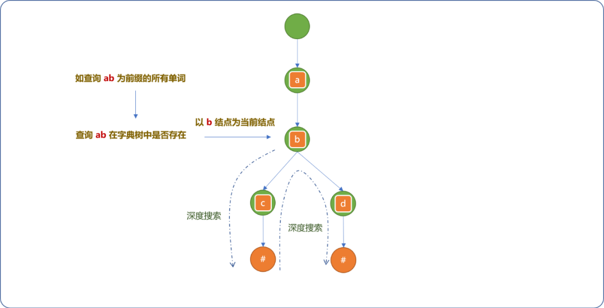


**编码实现：**

在前文的矩阵实现方案中添加如下函数。

```cpp
class Trie{
    //省略…… 
    /*
    *自动补全函数
    */
    void autoComplete(string prefix) {
        //查询前缀字符串在字典树中是存在
        int nodeId= this->search(prefix);
        if(nodeId==-1) {
            return;
        }
        //存在，则从此结点开始进行深度搜索
        this->getAllWords(nodeId,prefix);
    }
    //省略……
}
//测试
int main() {
 Trie*  trie=new Trie();
 trie->insert("cat");
 trie->insert("caton");
 trie->insert("cater");
 trie->insert("this");
 trie->autoComplete("cat");
 trie->showAllWords();
 return 0;
}
```

**输出结果：**

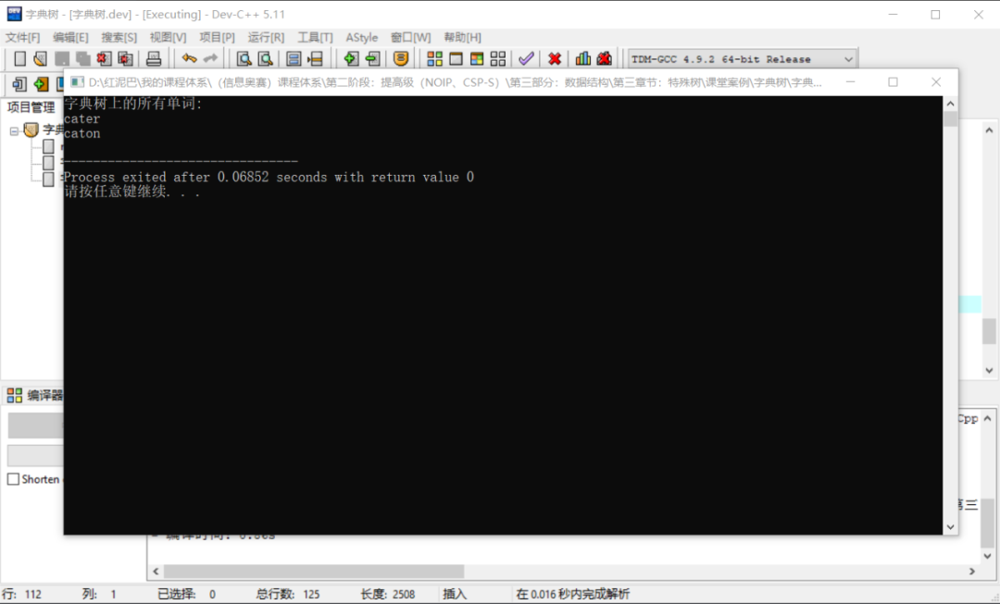


### 4.2  求 2 个字符串的最长公共前缀

所谓字符串的公共前缀指字符串前面相同的部分。如`caton`和`cater`的公共前缀是`cat`。与自动补全功能是相逆的操作。

基本思想：

- 使用字典树存储所有字符串。
- 两个字符串的最长公共前缀的长度即他们所在的结点的公共祖先个数，于是，问题就转化为求公共祖先问题。

在树中求解结点的公共祖先问题可以有多种方案，本文侧重于字典树的理解，仅提供下面的穷举算法。其它方案可以自行查阅相关书籍。

```cpp
/*
* 穷举算法求解 2 个字符串的求公共前缀
*/
string getMaxPrefix(string word,string word_) {
    string prefix="";
    //指向根结点
    int current=0;
    int idx=0;
    //最多查询结点数
    int len=word.size()>word_.size()?word_.size():word.size();
    while(idx<len) {
        int ok=false;
        //查询当前结点的子结点
        for(int i=0; i<26; i++) {
            if(matrix[current][i]==0)continue;
            //存在子结点，且为同一个结点
            if( matrix[current][ word[idx]-'a' ]!=0 &&  matrix[current][ word[idx]-'a' ]==matrix[current][ word_[idx]-'a' ]  ) {
                ok=true;
                prefix.append({ word[idx] });
                current=matrix[current][ word[idx]-'a' ];
                break;
            }
        }
        if(!ok)
            break;
        idx++;
    }
    return prefix;
}
```

**测试：**

```cpp
int main() {
 Trie*  trie=new Trie();
 trie->insert("cat");
 trie->insert("caten");
 trie->insert("cater");
 trie->insert("this");
 string prefix=trie->getMaxPrefix("caten","cater");
 cout<<"公共前缀："<<prefix;
 return 0;
}
```

**输出结果：**

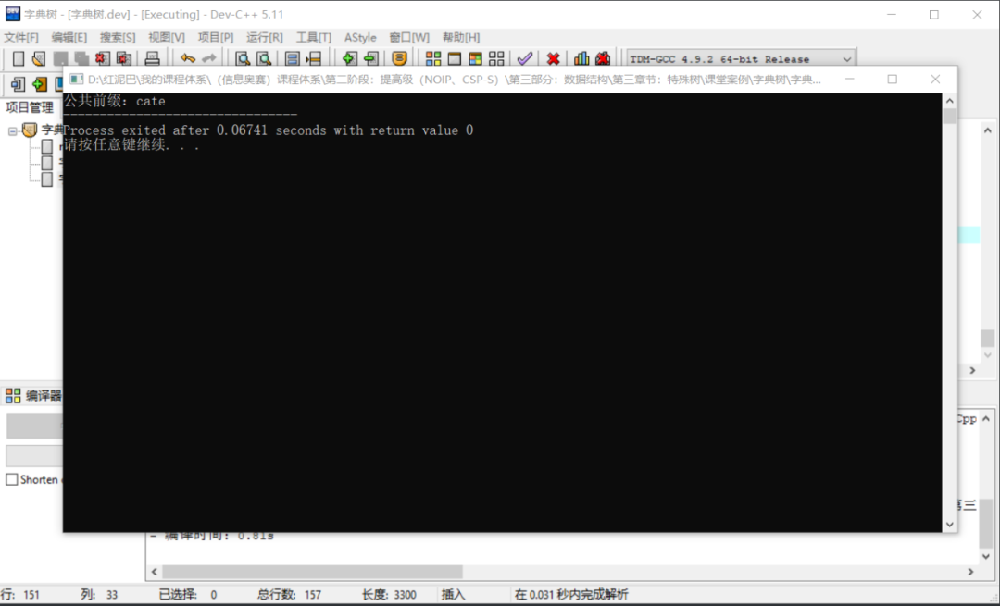


## 5. 总结

本文介绍了字典树的逻辑结构，并且使用链式和矩阵`2`种方案实现了字典的物理存储。并且通过 `2`个具有代表性的案例让大家更深入理解字典树的实际应用。


