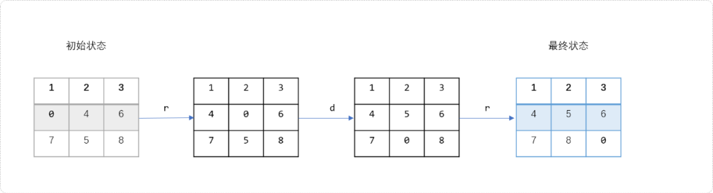
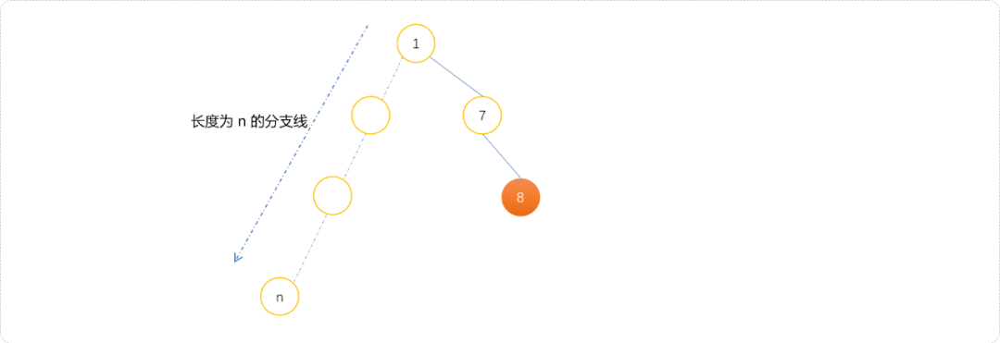
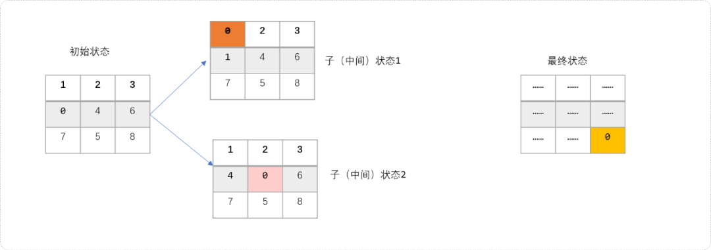
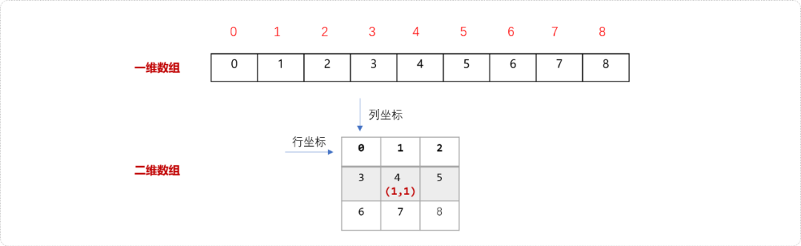
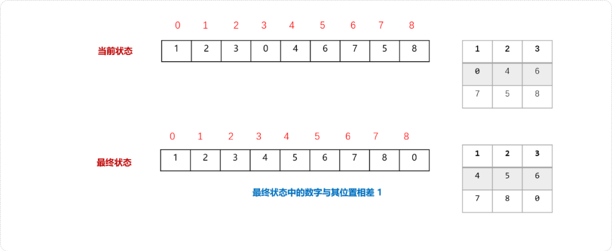
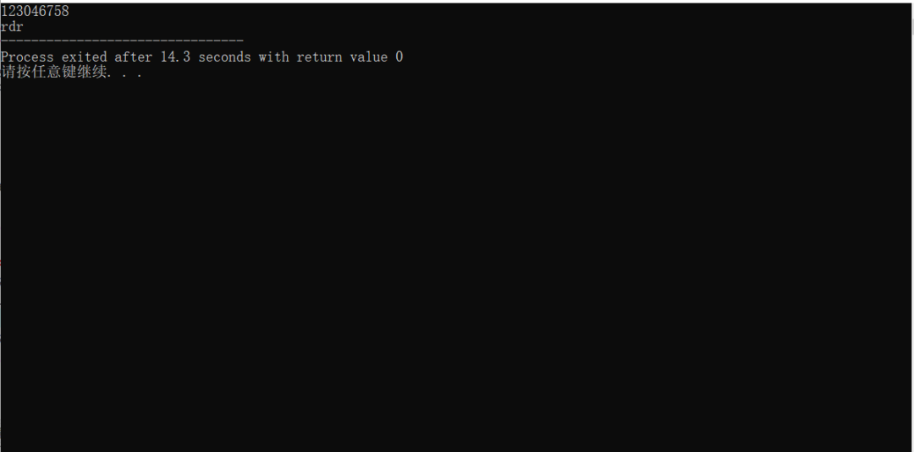

# C++ 八数码问题理解 IDA* 算法原则：及时止损，缘尽即散


## **1.前言**

八数码是典型的状态搜索案例。如字符串转换问题、密码锁问题都是状态搜索问题。

状态搜索问题指由一种状态转换到到最终状态，求解中间需要经过多少步转换，或者说最小需要转换多少步，或者说有多少种转换方案。本文和大家聊聊八数码问题的IDA*算法解决方案，也是想通过此问题，深入理解`IDA*`算法的的底层思维逻辑。

## **2. 八数码问题**

**问题描述：**

八数码问题，也称为拼图问题。指由`9`块可滑动的方块构成一个`3×3`的二维拼图，在每一块上都有一个`1～9`的数字，其中一块方块丢失，称之为`0`方块。通过`0`方块与上、下、左、右四个方向的方块交换位置实现移动，求解经过最少的步数实现拼图由最初状态转换到最终状态的路径。如下为八数码问题的最终状态：

```cpp
1 2 3
4 5 6
7 8 0 
```

**输入描述：**

输入一个初始状态。如下所示：

```cpp
1 2 3
0 4 6
7 5 8    
```

**输出描述：**

如果没有答案，则输出`unsolvable`，否则输出由字母`r、l、u、和d`组成的字符串，描述需要经过的一系列转换操作。

**样例解释：**

如上的初始状态只需要经过`rdr`三步就能转换到最终状态。




**问题分析：**

八数码问题中的每一种状态可以看成一个节点，节点与节点之间最终构建的是一棵树模型。八数码问题本质上就是最短路径搜索问题。可以使用深度搜索或者广度搜索进行查找。

对于当前状态，有`4`个方向可以选择，无论使用广度或者深度搜索，必然会有些搜索的方向会与目标方向背道而驰。背道而驰意味着无谓的消耗。可以使用`A*`或者`IDA*`、`双向BFS`进行优化。本文使用`IDA*`算法优化。

### **2.1 IDA\*算法**

`IDA*`算法本质还是`DFS`算法。

我们知道，树的特点就是分支繁杂，而答案往往只可能在众多分支中的一条分支上。可以使用剪枝操作，剪掉不必要的分支，这是提高深度搜索性能的最基础优化方案。

深度搜索一旦在一条分支上搜索不到目标时自己会回溯，然后再搜索另一条分支。如果一条分支的深度很深，而此分支上又没有我们所需要的答案，显然，深度搜索会陷入一个无底深渊。所以，需要采用一种策略，及时阻止这种无劳的搜索，让其提前回溯。

如下图所示，`DFS`正在搜索长度为`n`的分支线，答案是另一条分支上的值为`8`的节点。因为搜索的无目性，它会一根筋式的不见黄河不死心向前走。因此`DFS`会在无效分支线上浪费大量的时间。最好的方式，就是让它及时悬崖勒马，及时止损。




`D*`算法的设计目标就是提前阻止这种无底深渊式的搜索。`IDA*`算法是带有评估函数的迭代加深`DFS`算法。通俗而言，在搜索过程中设置深度`(depth)`限制，一旦超过这个深度，便回溯。

迭代加深只有在状态呈指数级增长时才有较好的效果（如八数码问题共有 `9!`种状态），而`A*`就是为了防止状态呈指数级增长的。`IDA*`算法其实是同时运用迭代加深与全局最优性剪枝。`IDA*`算法发明出来后，可以应用在生活的各个方面，小到你看电脑的屏幕节能，大到`LED`灯都采用了此算法，加进了`LED`灯的研发，举个例子，计算机的节能，使用了`IDA*`算法根据光亮调整亮度，可以减少蓝光辐射以保护长时间盯着电脑的人们，保护了诸如程序员，`OIer`等等。**---摘抄自百度百科。**

**评估函数`f(x)`**

`IDA*`算法会初始一个默认最小深度，期待在这个最小深度能搜索到目标。如果找不到，会逐步增加搜索深度。

怎么计算当前的搜索是否能在指定深度内找到或找不到？

`IDA*`算法通过评估函数`f(x)`的值评估当前搜索深度的合理性。`f(x)=`当前深度+未来估计步数。当`f(x)>depth（指定深度）`时立即回溯。`f(x)`函数中的当前深度为当前搜索的层次，此值易得。那么未来估计步数怎么计算？

可以使用曼哈顿距离。如下图所示，初始状态可以向如下的 `2` 个子状态转换。这两个子状态的搜索深度都为`1`。




最终状态是当`0`在原来数字`8`所在位置。站在上帝视角，知道子状态`1`离最终状态很远，如果继续基于这个状态朝更远的方向搜索是没有必要。可以在搜索过程计算子状态与目标状态的曼哈顿距离判断是否继续还是提前中止。

**曼哈顿距离**指两点所在的横坐标的绝对值加上坚坐标的绝对值，其值越大，表示两点间隔的较远。如下图子状态中值`1`和值`8`的曼哈顿值为`4`。


除了`0`滑块，计算当前状态和目标状态中每个位置的曼哈顿距离之和。注意，不需要计算`0`滑块之间的距离。`0`所在位置可以认为是一个空的位置，空的位置不存在距离。

**平面坐标与线性坐标的转换**

拼图可以使用二维数组也可以使用一维数组存储。本文使用一维数组存储，拼图从逻辑结构上是二维数组。所以，就需要把物理上的一维数组坐标转换为逻辑上的二维坐标。

如下图，一维数组中数字`4`的线性坐标为`4`。


与一维数组相对应的二维数组如下图所示。数字`4`在二维数组中的坐标为`(1,1)`。




其转换公式如下：

- `4(一维数中的坐标) / 3=1（二维数组中的行坐标）`。
- `4(一维数中的坐标) % 3=1（二维数组中的列坐标）`。

一维数组中`4`的位置转换后在二维数组中的位置为`(1,1)`。

二维数组中的坐标转换为一维数组中的坐标为上面表达式的逆运算。

- `3*1（二维数组中的行从标）+1（二维数组中的列坐标）=4(一维数组中的坐标)`

**编码实现**

前期准备：

```cpp
#include <iostream>
#include <cmath>
using namespace std;
//存储拼图的当前状态
int a[9]= {0};
//能移动的四个方向
int dir[4][2]= {{-1,0},{0,1 },{1,0},{0,-1}};
//记录答案
char ans[100];
//D*算法初始设定的DFS最大深度
int depth=0;
//方向的字符描述
string dirChar="urdl";
```

曼哈顿距离求解流程：

- 找到当前状态中的数字（除 `0` 数字）在最终状态中的位置。如下用一维数组描述了当前状态和最终状态。




- 计算两者之间的距离。
- 累加当前状态中每一个数字的曼哈顿距离之和。

编码实现：

```cpp
//启发函数，曼哈顿距离(行列差的绝对值之和)
int mhd() {
 // 距离之和
 int dis=0;
 //遍历当前状态中的每一个数字
 for(int i=0; i<9; i++) {
        //0 位置不计算其曼哈顿距离
  if(a[i]!=0) {
             //累加每一个数字的曼哈顿距离
   dis+=abs( i/3 -  (a[i]-1)/3  )+abs( i%3-  (a[i]-1)%3  ) ;
  }
 }
 return dis;
}
```

深度搜索算法：

```cpp
/*
* space：0 所在的位置，即可移动位置
* curDep: 当前递归的深度
* pre: 的上一个状态中 0 所在位置
*/
bool dfs(int space,int curDep,int pre) {
 //计算曼哈顿位置
 int t=mhd();
 if(t==0) {
  //找到，结束
  ans[curDep]='\0';
  return 1;
 }
 //如果深度超过指定的值,则说明在这个深度上无法搜索目标，不必要再继续搜索
 if(curDep+t>depth)return 0;
 //向 4 个方向搜索
 for(int i=0; i<4; i++) {
        //一维坐标转换为二维坐标
  int row=space/3+dir[i][0];
  int col=space%3+dir[i][1];
        //二维坐标转换为一维坐标
  int newx=row*3+col;
        //检查坐标是否越界以及是否回流
  if(row<0||row>2||col<0||col>2|newx==pre) continue;
        //交换得到新的状态
  swap(a[newx],a[space]);
        //记录状态的转换信息
  ans[curDep]=dirChar[i];
        //进入新状态
  if(dfs(newx,curDep+1,space))return 1;
  //交换回来，回溯
  swap(a[newx],a[space]);
 }
 return 0;
}
```

`D*`算法：

```cpp
/*D* 算法
* space 初始 0 所在位置
*/
void idaStart(int  space) {
 while(++depth) {
         //一步一步设置可搜索的深度
  if( dfs(space,0,-1) )break;
 }
}
```

测试代码：

```cpp
int main(int argc, char** argv) {
 string s;
 int space;
 cin>>s;
 for(int i=0; i<9; i++) {
  a[i]=s[i]-'0';
  if(s[i]=='0')space=i;
 }
 idaStart(space);
 cout<<ans;
 return 0;
}
```




优化`D*`算法。`D*`会为`DFS`搜索设定深度，如果在指定深度内无法搜索到目标，则以步长值为 `1` 方式增加深度。其实可以从初始状态到目标状态的曼哈顿距离开始，每次都增加上一次搜索失败的最小深度，从而提高搜索效率。

重构上述代码的核心逻辑：

```cpp
int minDep=999;//初始设定为一个较大值
/*
* x：x的当前位置
* d: 当前搜索的深度
* pre: x 的上一个位置
*/
bool dfs(int space,int curDep,int pre) {
 //曼哈顿位置
 int t=mhd();
 if(t==0) {
  //找到
  ans[curDep]='\0';
  return 1;
 }
 //如果深度超过可能的值,则说明在这个深度上无法搜索目标，不必要在继续搜索
 if(curDep+t>depth) {
  minDep=min(minDep,curDep+t) ;
  return 0;
 }
 //向 4 个方向搜索
 for(int i=0; i<4; i++) {
  int row=space/3+dir[i][0];
  int col=space%3+dir[i][1];
  int newx=row*3+col;//转换为数字
  if(row<0||row>2||col<0||col>2|newx==pre) continue;
  swap(a[newx],a[space]);
  ans[curDep]=dirChar[i];
  if(dfs(newx,curDep+1,space))return 1;
  //交换回来，回溯
  swap(a[newx],a[space]);
 }
 return 0;
}

void idaStart(int x) {
 //初始设定为当前状态到最终状态的曼哈顿距离 
 depth=mhd();
 while(true) {
  if( dfs(x,0,-1) )break;
  //如果没有搜索到，指定上一次失败的深度
  depth=minDep;
 }
}
```

## **3. 总结**

行文之初，本是想同时使用`A*`、`双向BFS`、`IDA*`算法解决八数码问题。如果仅在文中抛出`IDA*`的代码，行文的意义不大。内心终究是想借此题来深度研究算法细节，探讨此算法的精妙之处。


一枚大果壳

![赞赏二维码](https://mp.weixin.qq.com/s?__biz=MzU2NDgzNjgzNw==&mid=2247489233&idx=1&sn=d425af0f1e8568e25621a748a1c45d86&chksm=fdb706f8f269f5c3daac8393708e17d0952650b5572100b911a6b0754bd765bc9ab241a5eae8&scene=126&sessionid=1729004096&subscene=7&clicktime=1729006331&enterid=1729006331&key=daf9bdc5abc4e8d097c77212777edc22183887e7f813564ba940ee968ec98426024cbd1849909cebd0e5bb5741e94d733b9183a122e826ea045b4e1439ff2ca6ef837762aa8d7760e5918eadf794cd6246cb13762ecb98c94b53813d6f63e3ac09b24b1f6841d955b3ce894d9a518d745c1631a9f1270c341361a3022d737784&ascene=0&uin=NjUxMzM2MTA4&devicetype=Windows+10+x64&version=63090c11&lang=zh_CN&countrycode=CN&exportkey=n_ChQIAhIQx6t8LX%2Fh%2BqYo4S0cAE58%2FhLmAQIE97dBBAEAAAAAAAXIDrY7JdkAAAAOpnltbLcz9gKNyK89dVj0VOclnr2rewXUJZJQob3yWptWjwZQOSKFGfm7W83otaK4q6qApMo%2B5DzAy8cRQrhLJsx1tKxqNrpEbztoIFRBjDgfyD%2Fz1Zqzww4%2BCIYWHKEugJhKSDlzdqyNY%2FXuX1x2p5J6K7SR5jzYjIWudys0i%2Feo9fHaYW1Tbe2yhnBLP8c5E7BKmrb9BGVNBNKo0GQxOgtT7R2V56SCuO4N6pBkfm3bu5EwkREcf%2B86MzWaqPpQgd%2BiUQWJi0CnVp4lHNrM&acctmode=0&pass_ticket=ki9ki%2BVbzABDp%2FfRuEpoH2X5MpS%2BmVs18mP2bnMNmjnuftJB%2BvtF4JlC7BpQ2lPC&wx_header=1&fasttmpl_type=0&fasttmpl_fullversion=7428020-zh_CN-zip&fasttmpl_flag=1)[喜欢作者](javascript:;)

阅读 149

