# C++ 双向广度搜索，嚯嚯！不就是双指针理念吗？


## **1. 前言**

在线性数据结构中搜索时，常使用线性搜索算法，但其性能偏低下，其性能改善方案常有二分搜索和双指针或多指针搜索算法。在复杂的数据结构如树和图中，常规搜索算法是深度和广度搜索。在深度搜索算法过程中常借助剪枝或记忆化方案提升搜索性能。广度搜索算法过程中常见的性能优化方案为双向广度搜索和启发式搜索。双向广度搜索可以认为是图论中的双指针搜索方案，本文将和大家深入探讨其算法细节。

图中常见的操作为最短路径查找。如在下面的无向无权重图中查找节点`1`到节点`6`之间的最短路径，可以直接使用广度搜索算法找到。

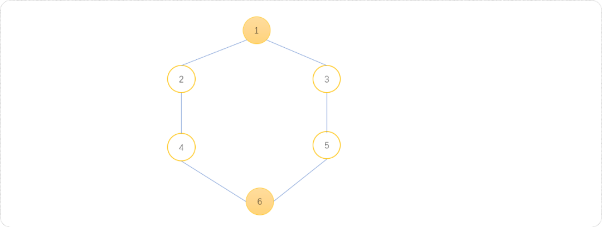

无向无权重图中，直接使用广度搜索算法查找节点之间的最短路径的基本模板代码：

```cpp
#include <iostream>
#include <queue>
using namespace std;
//邻接矩阵
int graph[100][100];
//记录是否被访问过
int vis[100];
//边数与顶点数
int n ,m;
//节点距离起始点的最短路径
int dis[100];
void init() {
 for(int i=1; i<=n; i++) {
  for(int j=1; j<=n; j++) {
   graph[i][j]=0;
  }
  dis[i]=0;
  vis[i]=0;
 }
}
void addEdge() {
 int f,t;
 for(int i=1; i<=m; i++) {
  cin>>f>>t;
  graph[f][t]=1;
  graph[t][f]=1;
 }
}

//广度搜索
void bfs(int start,int end) {
 //队列
 queue<int> myq;
 //初始化队列
 myq.push(start);
 vis[start]=1;
 dis[start]=0;
 while( !myq.empty() ) {
  int size=myq.size();
  //找到队列中的所有节点
  for(int i=0; i<size; i++) {
   int t= myq.front();
   myq.pop();
   //搜索到终点 
   if(t==end)return;
   //扩展所有子节点入队列
   for(int j=1; j<=n; j++) {
    if(graph[t][j]==1 &&  vis[j]==0) {
     myq.push(j);
     vis[j]=1;
     dis[j]=dis[t]+1;
    }
   }
  }
 }
}
void show() {
 for(int i=1; i<=n; i++)
  cout<<i<<"-"<<dis[i]<<"\t";
}
int main(int argc, char** argv) {
 cin>>n>>m;
 init();
 addEdge();
 bfs(1,n);
 show();
 return 0;
}
```

测试结果：

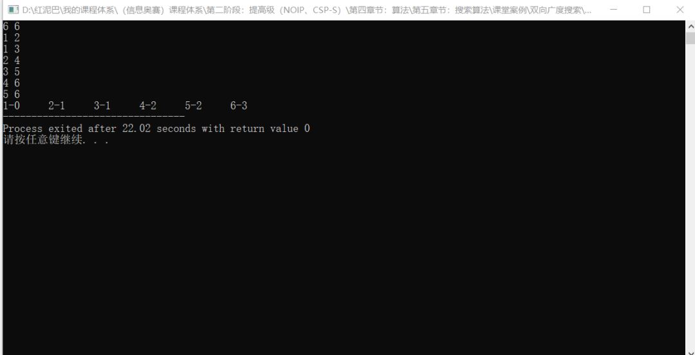

当图中的节点很多，关系较复杂时，直接使用广度搜索其时间复杂度非常大。对于上述问题，既然已经知道了起点和终点，可以使用类似于双指针的方案，让搜索分别从起点和终点开始，从两端相向进行。这样可以减少一半的搜索量，此种搜索方案称为双向广度搜索。

## **2. 初识双向广度搜索**

不是任何时候都可以使用双向广度搜索，只有当起点和终点已知情况方可使用。如下图所示，从起点向终点方向的搜索称为正向搜索，从终点向起点方向的搜索称为逆向搜索。

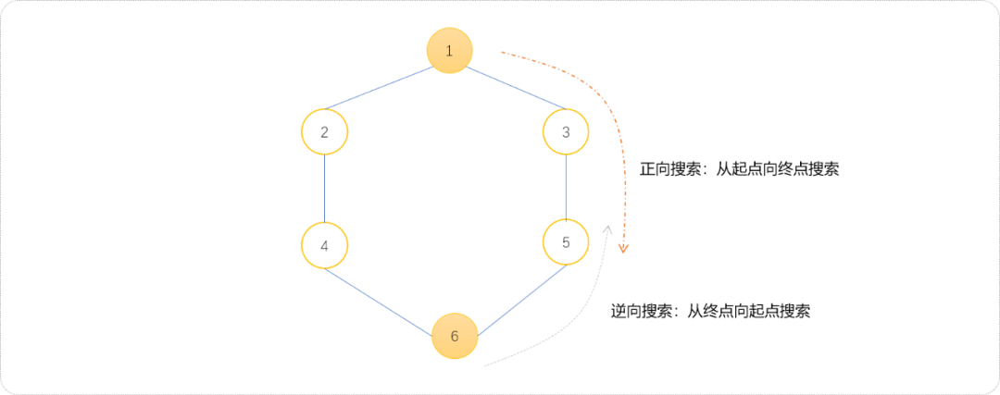

下面演示双向搜索的过程。

- 双向广度搜索实现过程中，可以使用`2`个队列，也可以仅使用`1`个队列。这里先使用 `2`个队列的方案。正向搜索方向的队列命名为`q1`，逆向搜索方向的队列命名为`q2`。

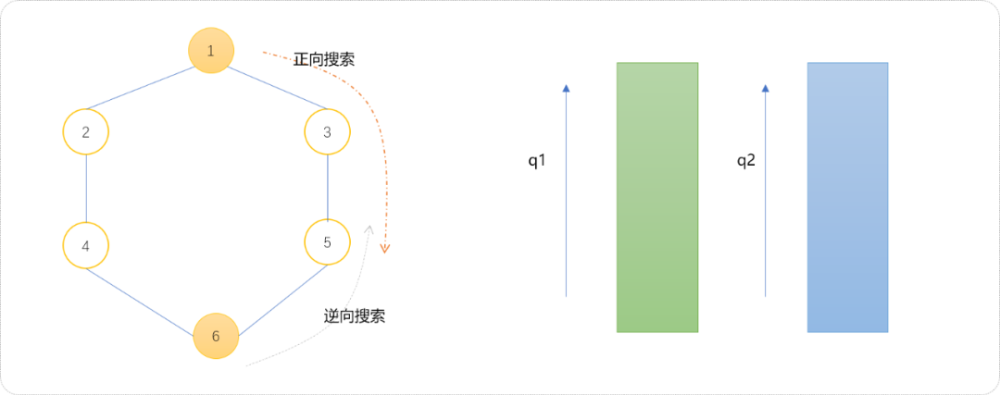

- 初始化`2`个队列。`q1`中压入起点，`q2`中压入终点。

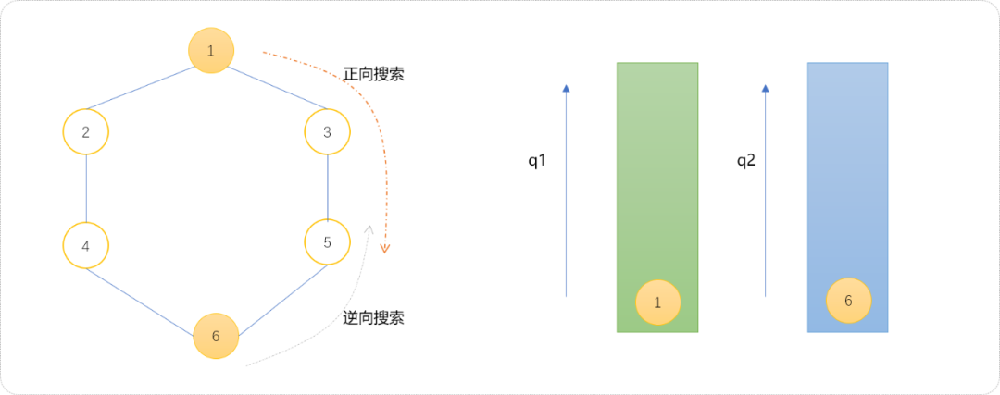

- 扩展方案。如果`q1`的尺寸小于`q2`，则扩展`q1`队列，否则，扩展`q2`队列。初始`q1`和`q2`两个队列的尺寸相同，此时可以选择扩展`q1`队列。扩展后的结果如下图所示。

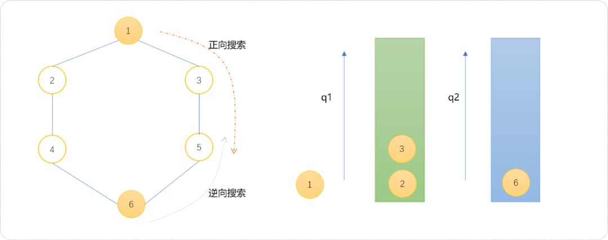

- 下面扩展`q2` 队列。

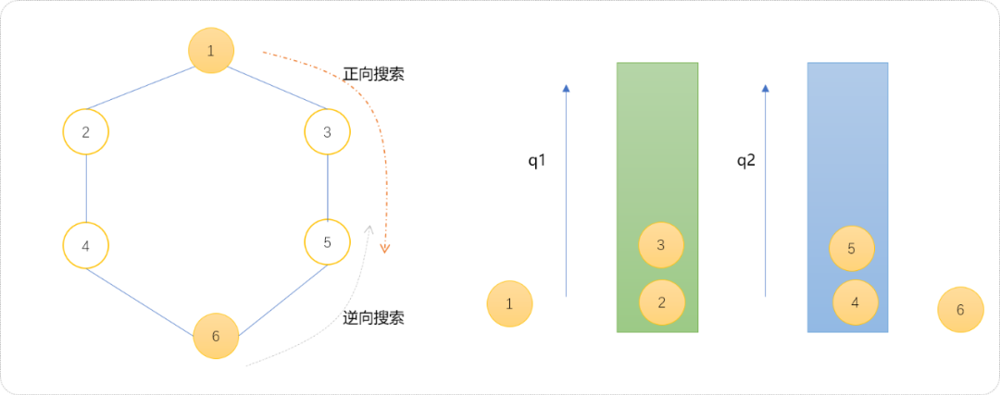

- 至此，继续扩展`q1`队列。发现节点`3`和节点`2`的子节点`4、5`已经被访问过，且存放在`q2`中，可以此判断双向搜索相遇，可以认定双向搜索结束。

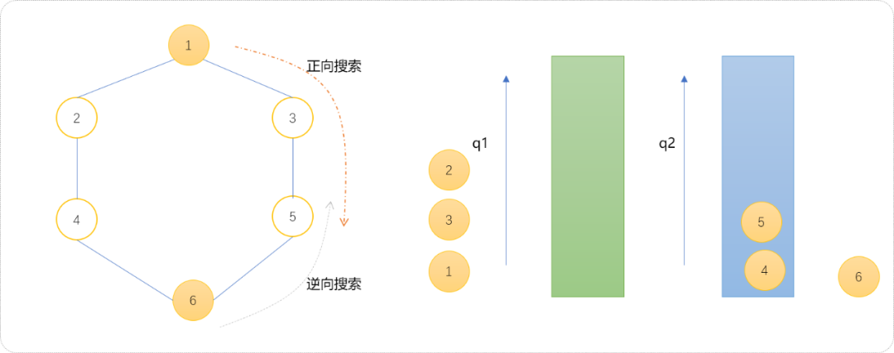

对于相遇条件总结一下。

当对一个队列中的节点进行扩展时，发现此节点的子节点已经被另一个搜索队列扩展，可以认定两个搜索过程相遇。类似于两个施工队相向方向挖一条壕沟时，两者一定是相遇到对方挖通的位置，也就是说当一方挖到了对方正在挖的位置。

也可以在搜索结束后，查看那一个队列不为空，不空的队列中的节点即为相遇的节点。

如面使用代码描述上述的整个流程。

```cpp
#include <iostream>
#include <queue>
using namespace std;
//邻接矩阵
int graph[100][100];
//边数与顶点数
int n ,m;
//正向搜索时，节点距离起始点的最短路径，也可以记录节点是否被访问过
int dis[100];
//逆向搜索时，节点距离终点的最短路径
int dis_[100];
//初如化
void init() {
 for(int i=1; i<=n; i++) {
  for(int j=1; j<=n; j++) {
   graph[i][j]=0;
  }
        //因为节点和自己的距离为 0，用-1 表示没有被访问，
  dis[i]=-1;
  dis_[i]=-1;
 }
}
//构建图
void addEdge() {
 int f,t;
 for(int i=1; i<=m; i++) {
  cin>>f>>t;
  graph[f][t]=1;
  graph[t][f]=1;
 }
}

//广度搜索
int bfs(int start,int end) {
 //正向队列
 queue<int> q1;
 //逆向队列
 queue<int> q2;
 //初始化队列
 q1.push(start);
 dis[start]=0;
 q2.push(end);
 dis_[end]=0;
     //任意队列为空时结束
 while( !q1.empty() && !q2.empty() ) {
         //计算队列的尺寸
  int s1=q1.size();
  int s2=q2.size();
  if(s1<=s2) {
   //扩展 q1
   for(int i=0; i<s1; i++) {
    int t= q1.front();
    q1.pop();
    //扩展所有子节点入队列
    for(int j=1; j<=n; j++) {
                      //不是子节点或者被访问过都跳过
     if(graph[t][j]==0 ||  dis[j]!=-1)continue;
                      //入队
     q1.push(j);
                      //计算距离
     dis[j]=dis[t]+1;
                      //如果出现在对方队列中，搜索结束
     if( dis_[j]!=-1)return dis[t]+dis_[j]+1;
    }
   }
  } else {
   //扩展 q2
   for(int i=0; i<s2; i++) {
    int t= q2.front();
    q2.pop();
    //扩展所有子节点入队列
    for(int j=1; j<=n; j++) {
     if(graph[t][j]==0 ||  dis_[j]!=-1)continue;
     q2.push(j);
     dis_[j]=dis_[t]+1;
     if(  dis[j]!=-1)return dis_[t]+dis[j]+1;
    }
   }
  }
 }
}
int main(int argc, char** argv) {
 cin>>n>>m;
 init();
 addEdge();
 int d= bfs(1,n);
 cout<<d;
 return 0;
}
```

也可以使用一个队列实现双向搜索算法。下面演示使用一个队列实现双向搜索流程。为了区分节点是属于正向还逆向搜索到的节点，用两种颜色分别表示，红色表示正向搜索到的节点，绿色表示逆向搜索到的节点。

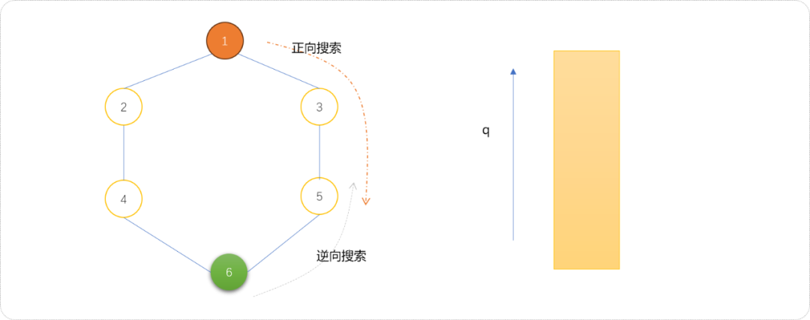

- 初始化队列。把起点和终点分别压入队列中。

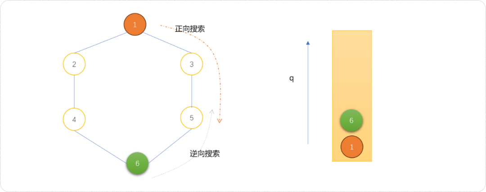

- 按正常流程对队列中的节点进行扩展。如下，扩展节点`6`的子节点`4、5`入队列。

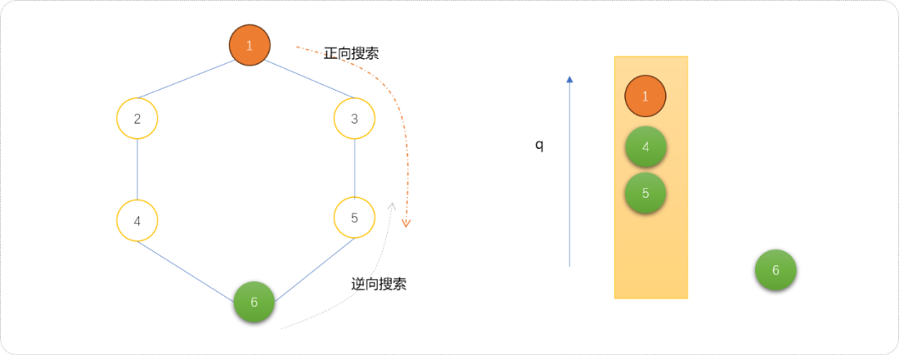

- 继续扩展节点`1`的子节点`2、3`入队列。

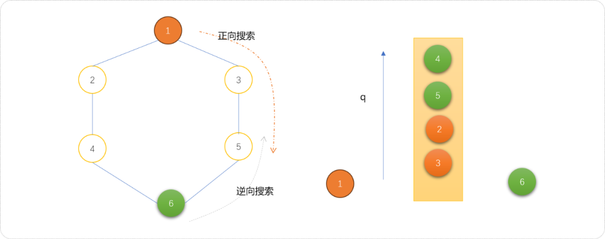

- 继续扩展时，发现需要扩展的子节点已经存在于队列中，说明，已经相遇了。

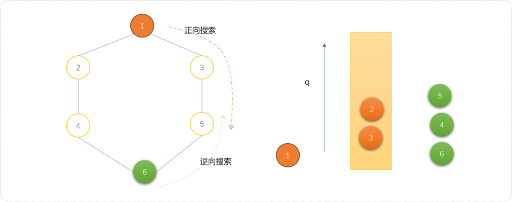

## **3. 深度理解**

下面通过几个案例让大家更深入的理解双向广度搜索。

### **3.1 字串变换，**

题目来自于`https://www.luogu.com.cn/problem/P1032`。

**题目描述**

已知有两个字串 `A、B` 及一组字串变换的规则（至多 `6` 个规则），形如：

- `A`1->`B`1。
- `A`2->`B`2。

规则的含义为：在 `A` 中的子串 `A`1 可以变换为 `B`1，`A`2 可以变换为 `B`2……。

例如：`A=abcd`，`B＝xyz`，

变换规则为：

- `abc->xu,ud->y,y->yz`。

则此时，`A` 可以经过一系列的变换变为 `B`，其变换的过程为：

- `abcd->xud->xy->xyz`。

共进行了 `3` 次变换，使得 `A` 变换为 `B`。

**输入格式**

第一行有两个字符串 `A,B`。

接下来若干行，每行有两个字符串 `A`i,`B`i，表示一条变换规则。

**输出格式**

若在 `10` 步（包含 `10` 步）以内能将 `A` 变换为 `B`，则输出最少的变换步数；否则输出 `NO ANSWER!`。

**样例 #1**

**样例输入 #1**

```cpp
abcd xyz
abc xu
ud y
y yz
```

**样例输出 #1**

```cpp
3
```

算法分析：

根据样例绘制转换流程图。

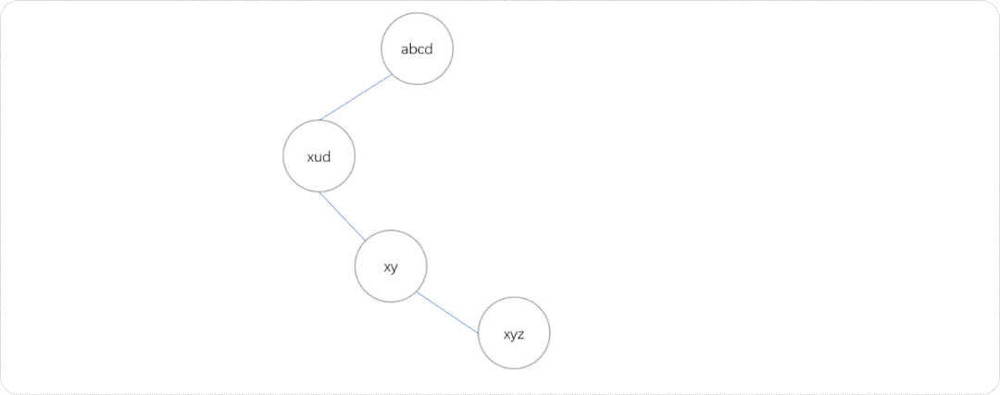

虽然根据样例绘制出来是线性数据结构，但因规则可以很多，如果再添加如下几条新规则，则转换流程图就可能是图结构。

- `cd->z`
- `ab->xy`

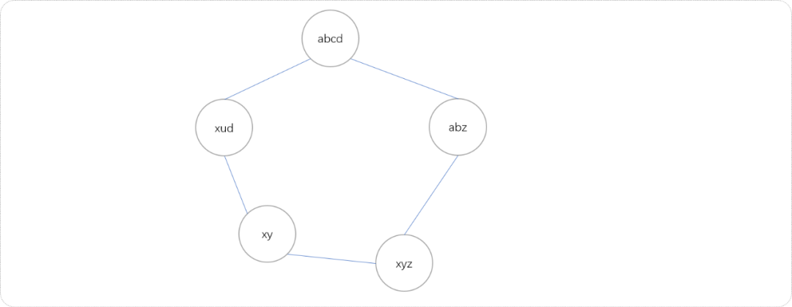

以最大可能性考虑此题，其转换过程就是一个无向无权重图结构，且本质就是在图中查找起点到终点的最短路径。可以直接使用`BFS`算法，当数据量较大时，可以使用双向`BFS`搜索算法。下面代码使用双向广度搜索方案。

```cpp
#include <iostream>
#include <queue>
#include <map>
using namespace std;
//开始和结束字符串
string s,e;
//存储转换规则
map<string,string> rule;
//存储节点至起点的距离
map<string,int> sdis;
//存储节点至能终点的距离
map<string,int>  edis;
//记录规则数量
int size=0;

int extend(queue<string> &q,map<string,int> &dis,map<string,int> &dis_,int type) {
 //队列的大小
 int size=q.size();
 //遍历队列
 for(int i=0; i<size; i++) {
  string t=q.front();
  string t1=t;
  q.pop();
  //查找可以转换的状态
  map<string,string>::iterator begin=rule.begin();
  map<string,string>::iterator end=rule.end();
  while(begin!=end) {
   string first= begin->first,second=begin->second;
   //如果是逆向搜索，规则也要改成逆向 
   if(type)first=begin->second,second=begin->first;
   //查找是否有可以转换的子串
   int pos= t1.find(  first );
   if(pos!=-1) {
    //得到可转换字符串
    t1.replace(pos,first.size(),second);
    //已经访问过
    if( dis[t1] ) continue;
    //没有访问过
    q.push(t1);
    dis[t1]=dis[t]+1;
    if(dis_[t1] )
     return dis_[t1]+dis[t]-1;
    t1=t;
   }
   begin++;
  }
 }
 return 0;
}

int bfs() {
 //正向队列
 queue<string> zxq;
 //反向队列
 queue<string> fxq;
 //初始化队列
 zxq.push(s);
 fxq.push(e);
 //即表示距离也表示访问过 
 sdis[s]=1; 
 edis[e]=1;
 int res=0;

 while( !zxq.empty() &&  !fxq.empty() ) {
  int size1=zxq.size();
  int size2=fxq.size();
  if( size1<=size2 ) res= extend(zxq,sdis,edis,0); //扩展正向队列
  else res=  extend(fxq,edis,sdis,1); //扩展反向队列
  if(res!=0)break;
 }

 return res;
}


int main() {
 cin>>s>>e;
 string f,t;
 while(cin>>f>>t) {
  rule[f]=t;
  size++;
 }
 int res=bfs();
 cout<<res;
 return 0;
}
```

### **3.2 八数码问题**

**题目描述：**

八数码问题是典型的状态图搜索问题。在一个`3×3`的棋盘上放置编号为`1~8`的`8`个方块，每个占一格，另外还有一个空格。与空格相邻的数字方块可以移动到空格里。

任务1：指定初始棋局和目标棋局，计算出最少的移动步数；

任务2：输出数码的移动序列。

此题可以使用双向广度搜索算法查找到结果。因为正向和逆向搜索的扩展数量是相同的，可以使用一个队列实现，且正向搜索过的节点状态用`1`表示，逆向搜索过的节点状态用`2`表示。当节点和子节点的状态值之和为 `3`的时表示当正向和逆向搜索相遇。

```cpp
#include <bits/stdc++.h>
using namespace std;
typedef long long ll;

int ed=123804765,st,f[10][5]={{0,1},{1,0},{-1,0},{0,-1}},s[5][5];
map<int,int> vis,d;
int bfs(int a,int b)
{
    queue<int> q;
    //正向搜索状态设置为 1
    vis[a]=1,d[a]=0;
    //逆向搜索状态设置为 2
    vis[b]=2,d[b]=0;
    //入队列
    q.push(a);
    q.push(b);
    while(!q.empty())
    {
        int u=q.front();
        q.pop();
        int v=u,x,y;
        //将数放入二维数组
        for(int i=3;i>=1;i--)
            for(int j=3;j>=1;j--)
            {
                s[i][j]=v%10;//分解数字
                v/=10;
                if(!s[i][j]) x=i,y=j;//找出0的位置
            }
        //将0进行移动
        for(int i=0;i<4;i++)
        {
            //向四周搜索
            int sx=x+f[i][0],sy=y+f[i][1];
            //越界检查
            if(sx<1||sx>3||sy<1||sy>3) continue;
            //得到新状态
            swap(s[x][y],s[sx][sy]);
            v=0;//还原成数字状态
            for(int i=1;i<=3;i++)
                for(int j=1;j<=3;j++)
                    v=v*10+s[i][j];
            if(vis[v]==vis[u])
            {
                //如果已经访问过
                swap(s[x][y],s[sx][sy]);
                continue;
            } 
            //如果相遇
            if(vis[v]+vis[u]==3) return d[u]+1+d[v];//起点为1，终点为2，相加为3
            d[v]=d[u]+1;
            vis[v]=vis[u];
            q.push(v);
            swap(s[x][y],s[sx][sy]);
        }
    }
    return -1;
}
int main ()
{
    cin>>st;
    if(st==ed) cout<<0<<"\n";
    else cout<<bfs(st,ed)<<"\n";
    return 0;
}
```

## **4. 总结**

本文讲解了双向广度搜索算法，和双指针算法一样，让搜索双向同时进行，可以减沙近一半的搜索范围，提升搜索性能。记住，双向搜索算法要求在已知起点和终点的条件方可使用。


