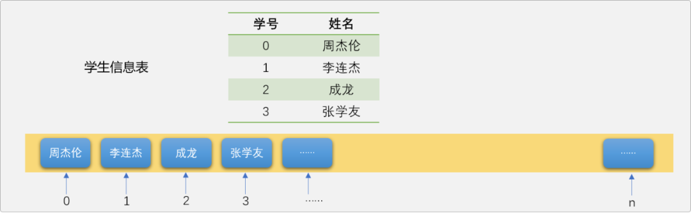
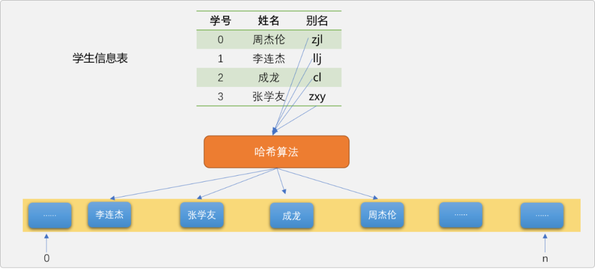
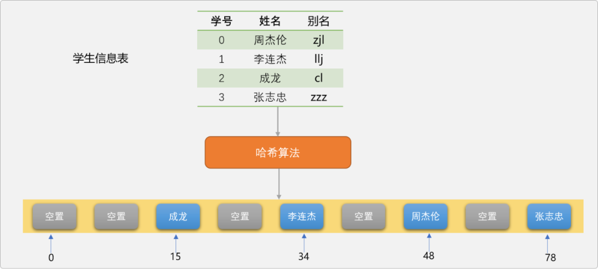
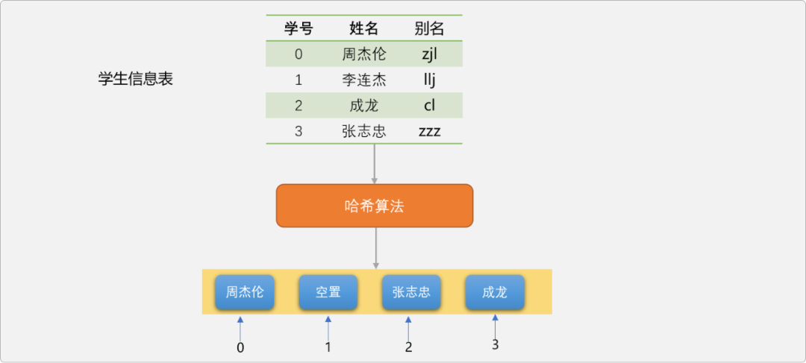
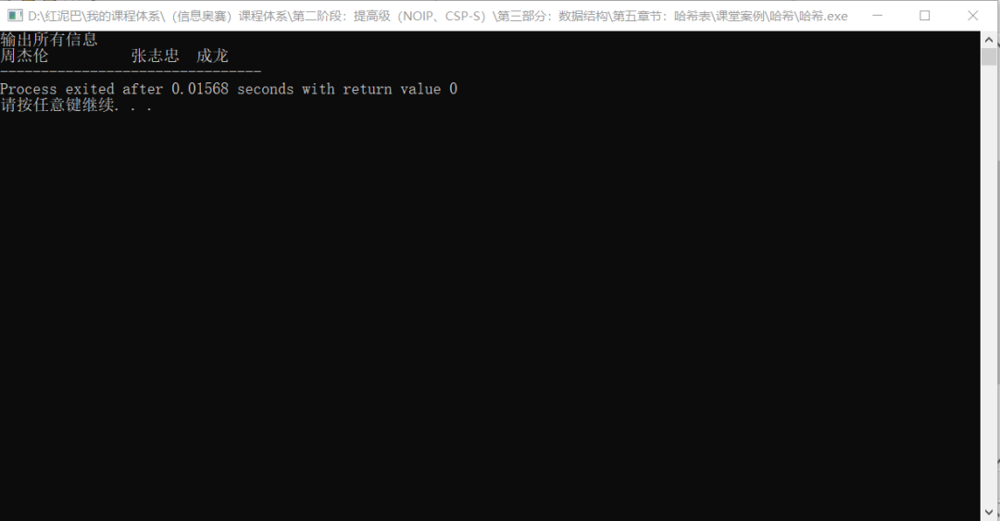
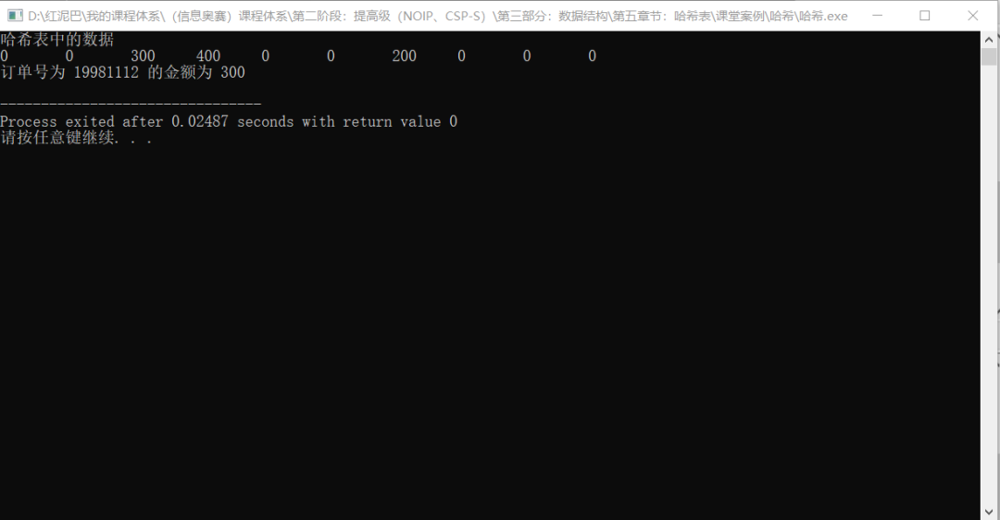
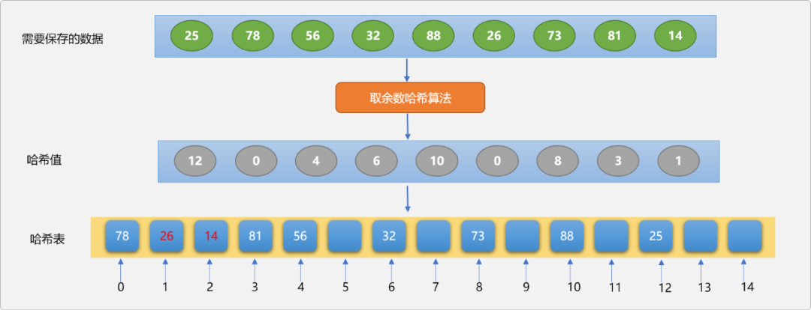
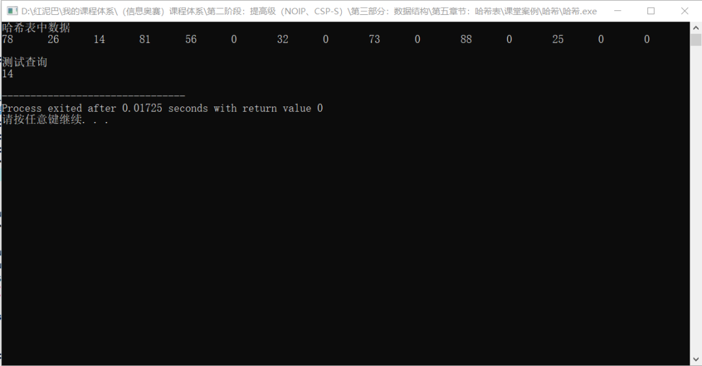
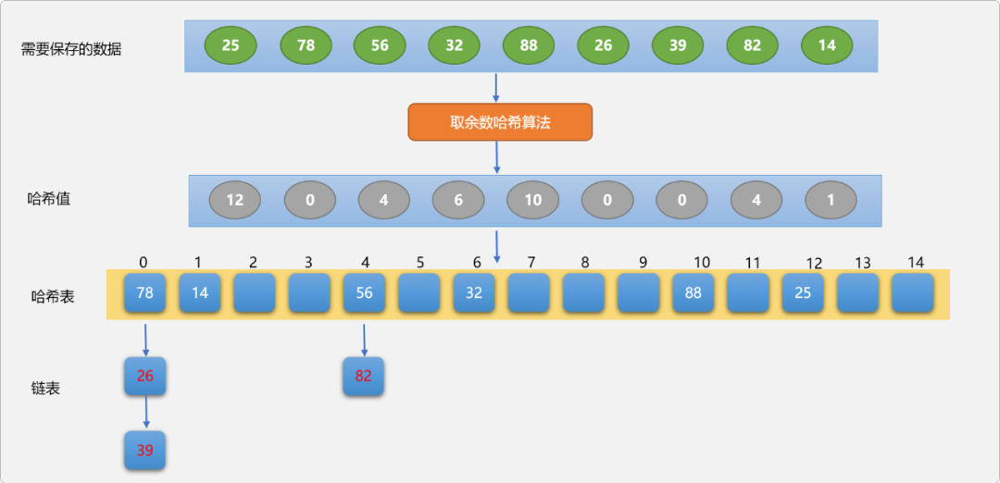
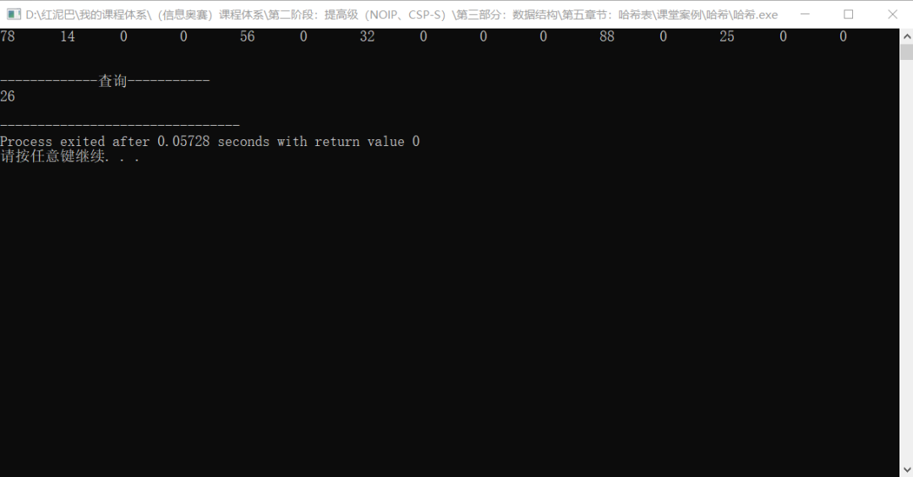

# C++ 哈希表查询_进入哈希函数结界的世界


## 1. 前言

`哈希表`或称为`散列表`，是一种常见的、使用频率非常高的数据存储方案。

`哈希表`属于抽象数据结构，需要开发者按`哈希表`数据结构的存储要求进行 `API` 定制，对于大部分高级语言而言，都会提供已经实现好的、可直接使用的 `API`，如 `JAVA` 中有 `MAP` 集合、`C++` 中的 `MAP` 容器，`Python` 中的字典……

使用者可以使用 `API` 中的方法完成对`哈希表`的增、删、改、查……一系列操作。

**如何学习哈希表？**

可以从 `2` 个角度开始：

- **使用者角度：**只需要知道`哈希表`是基于`键`、`值`对存储解决方案，另需要熟悉不同计算机语言提供的基于`哈希表`数据结构的 `API`实现，学会使用 `API`。
- **开发者的角度**：知道`哈希表`底层实现原理，以及实现过程中需要解决的各种问题。本文将站在开发者的角度，带着大家一起探究`哈希`的世界。

## 2. 哈希表

**什么是哈希表？**

`哈希表`是基于`键`、`值`对存储的数据结构，底层一般采用的是`数组`。众所知之，`数组`的查询速度非常快，时间复杂度是常量级别 `O（1）`。

数组的内存存储结构是连续区域，只要给定数据在数组中的位置，就能直接查询到数据。理论上是这么回事，但在实际操作过程，查询数据的时间复杂度并不一定总是常量级别。

如存储下面的学生信息，学生信息包括学生的姓名和学号。在存储学生数据时，如果把学号为 `0` 的学生存储在列表 `0` 位置，学号为 `1` 的学生存储在列表 `1` 位置……



因学生的学号和数组的索引号相映射，一旦知道了学生的`学号`也就知道了学生数据的存储位置，此时查询时间复杂度为 `O(1)`。

> **Tips：** 之所以可以达到常量级，是因为这里有信息关联（学生学号关联到数据的存储位置）。另，学生的学号是公开信息也是常用信息，很容易获取。

但是，不是存储任何数据时，都可以找到与位置相关联的信息。比如存储英文单词，不可能为每一个英文单词编号，即使编号了，编号仅仅只是流水号，没有数据含义的编号对于使用者来讲是不友好的，谁也无法记住哪个英文单词对应哪个编号。

如果使用数组存储英文单词，因没有单词的存储位置。查询时，还得使用诸如`线性`、`二分`……之类的查询方法，这时的时间复杂度由具体的查询算法的时间复杂度决定。

同样，如果对上述存储在数组中的学生信息进行了`插入`、`删除`……等操作，改变了数据原来的位置后，因破坏了学号与位置关联信息，再查询时也只能使用其它查询算法，不可能达到常量级。

**是否存在一种方案，能最大化地优化数据的存储和查询？**

通过上述的分析，可以得出一个结论，要提高查询的速度，得想办法把`数据`与`位置`进行关联。而`哈希表`的核心思想便是如此。

### 2.1 哈希函数

`哈希表`引入了`关键字`概念，`关键字`可以认为是数据的别名。如上表，可以给每一个学生起一个别名，这个就是`关键字`。


有了`关键字`后，再把`关键字`映射成列表中的一个有效位置，映射方法就是`哈希表`中最重要的概念`哈希函数`。

> **Tips：** `关键字`是一个桥梁，尽可能让`关键字`描述数据的含义。 这里的`关键字`是姓名的`拼音`缩写，`关键字`和`数据`的关联性较强，这样即关联到真正数据又关联到哈希表中的位置，方便记忆和查询。`关键字`也可以是`数据`本身。

`哈希函数`的功能：提供把`关键字`映射到`列表`中的位置算法，是`哈希表`存储数据的核心所在。如下图，演示`数据`、`哈希函数`、`哈希表`之间的关系，可以说`哈希函数`是数据进入`哈希表`的入口。



数据最终会存储在数组中的哪一个位置，完全由`哈希算法`决定。

当需要查询学生数据时，同样需要调用`哈希函数`对`关键字`进行换算，计算出数据在列表中的位置后就能很容易查询到数据。

如果忽视`哈希函数`的时间复杂度，基于`哈希表`的数据存储和查询时间复杂度是 `O(1)`。

**如此说来`哈希函数`算法设计的优劣是影响`哈希表`性能的关键所在。**

### 2.2  哈希算法

`哈希算法`决定了数据的最终存储位置，不同的`哈希算法`设计方案，也关乎`哈希表`的整体性能，所以，`哈希算法`就变得的尤为重要。

下文将纵横比较几种常见的 `哈希算法`的设计方案。

> **Tip：** 无论使用何种`哈希算法`，都有一个根本，`哈希`后的结果一定是一个数字，表示哈希表中的一个有效位置。也称为`哈希值`。

使用`哈希表`存储数据时，`关键字`可以是数字类型也可以是非数字类型，其实，`关键字`可以是任何一种类型。这里先讨论当`关键字`为非数字类型时设计`哈希算法`的基本思路。

如前所述，已经为每一个学生提供了一个以姓名的拼音缩写的`关键字`。

**现在如何把`关键字`映射到`数组`的一个有效位置？**

这里可以简单地把拼音看成英文中的字母，先分别计算每一个字母在字母表中的位置，然后相加，得到的一个数字。

使用上面的`哈希思想`对每一个学生的`关键字`进行哈希：

- `zjl`的哈希值为 `26+10+12=48`。
- `llj`的哈希值为 `12+12+10=34`。
- `cl` 的哈希值为 `3+12=15`。
- `zxy`的哈希值为 `26+25+24=75`。

前文说过`哈希值`是表示数据在列表中的存储位置，现在假设一种理想化状态，学生的姓名都是 `3` 个汉字，意味着`关键字`也是 `3` 个字母，采用上面的的`哈希算法`，最大的`哈希值`应该是`zzz=26+26+26=78`，意味着至少应该提供一个长度为 `78`的哈希表 。

即使现在仅仅只存储 `4` 名学生，因无法保证学生的`关键字`不出现`zzz`，所以列表长度还是需要 `78`。如下图所示。



采用这种`哈希算法`会导致列表的空间浪费严重，最直观想法是对`哈希值`再做约束，如除以 `4` 再取余数，把`哈希值`限制在 `4` 之内，`4` 个数据对应 `4` 个哈希值。我们称这种取余数方案为`取余数算法`。

> **Tips：** 取余数法中，除数一般选择小于哈希表长度的素数。本文介绍其它哈希算法时，也会使用取余数法对哈希值进行适当范围的收缩。

重新对 `4` 名学生的关键字进行哈希。

- `zjl`的哈希值为 `26+10+12=48`，`48` 除以 `4` 取余数，结果是`0`。
- `llj`的哈希值为 `12+12+10=34`，`34` 除以 `4` 取余数，结果是`2`。
- `cl` 的哈希值为 `3+12=15`，`15` 除以 `4` 取余数，结果是`3`。
- `zzz`的哈希值为 `26+26+26=78`，`78` 除以 `4` 取余数，结果是`2`。



演示图上出现了一个很奇怪的现象，没有看到`李连杰`的存储信息。

`4`个存储位置存储 `4`学生，应该是刚刚好，但是，只存储了 `3`名学生。且还有 `1`个位置是空闲的。现在编码验证一下，看是不是人为因素引起的。

```cpp
#include <iostream>
using namespace std;
/*
*哈希函数
*/
int hashCode(string key) {
 // 设置字母 A 的在字母表中的位置是 1
 int pos = 0;
 for(int i=0; i<key.size(); i++) {
  char myChar= key[i];
  if(myChar>='A' && myChar<='Z')
   myChar+=32;
  pos+= myChar-97+1;
 }
 return pos % 4;
}
```

**测试代码：**

```cpp
int main(int argc, char** argv) {
 // 哈希表
 string hashTable[4];
 // 计算关键字的哈希值
 int idx = hashCode("zjl");
 // 根据关键字换算出来的位置存储数据
 hashTable[idx] = "周杰伦";
 idx = hashCode("llj");
 hashTable[idx]  = "李连杰";
 idx = hashCode("cl");
 hashTable[idx]= "成龙";
 idx = hashCode("zzz");
 hashTable[idx] = "张志忠";
 cout<<"输出所有信息"<<endl;
 for(int i=0; i<4; i++) {
  cout<<hashTable[i]<<"\t";
 }
 return 0;
}
```

执行代码，输出结果，依然还是没有看到`李连杰`的信息。



**原因何在？**

这是因为`李连杰`和`张志忠`的哈希值都是 `2` ，导致在存储时，后面存储的数据会覆盖前面存储的数据，这就是哈希中的典型问题，`哈希冲突问题`。

所谓`哈希冲突`，指不同的`关键字`在进行`哈希算法`后得到相同的`哈希值`，这意味着，不同`关键字`所对应的数据会存储在同一个位置，这肯定会发生数据丢失，所以需要提供解决冲突的算法。

> **Tip：** 研究`哈希表`，归根结底，是研究如何计算`哈希值`以及如何解决`哈希值冲突`的问题。

针对上面的问题，有一种想当然的冲突解决方案，扩展列表的存储长度，如把列表扩展到长度为 `8`。

> **Tips：** 直观思维是：扩展列表长度，哈希值的范围会增加，冲突的可能性会降低。

```cpp
int hashCode(string key) {
 // 省略……
 return pos % 8;
}
int main(int argc, char** argv) {
 // 哈希表
 string hashTable[8];
    // 省略……
 for(int i=0; i<8; i++) {
  cout<<hashTable[i]<<"\t";
 }
 return 0;
}
```


貌似解决了冲突问题，其实不然，当试着设置列表的长度为`6`、`7`、`8`、`9`、`10`时，只有当长度为 `8`时没有发生冲突，这还是在要存储的数据是已知情况下的尝试。

如果数据是动态变化的，显然这种扩展长度的方案绝对不是本质解决冲突的方案。即不能解决冲突，且产生大量空间浪费。

如何解决`哈希冲突`，会在后文详细介绍，这里还是回到`哈希算法`上。

综上所述，我们对`哈希算法`的理想要求是：

- 为每一个`关键字`生成一个唯一的`哈希值`，保证每一个数据都有只属于自己的存储位置。
- 哈希算法的性能时间复杂度要低。

现实情况是，同时满足这 `2` 个条件的`哈希算法`几乎是不可能有的，面对数据量较多时，`哈希冲突`是常态。所以，只能是尽可能满足。

因冲突的存在，即使为 `100` 个数据提供 `100` 个有效存储空间，还是会有空间闲置。这里把实际使用空间和哈希表提供的有效空间相除，得到的结果，称之为哈希表的`占有率（载荷因子）`。

如上述，当列表长度为 `4`时， 占有率为 `3/4=0.75`，当列表长度为 `8` 时，占有率为 `4/8=0.5`，一般要求占率控制 在`0.6~0.9`之间。

### 2.3 常见哈希算法

前面在介绍什么是`哈希算法`时，提到了`取余数法`，除此之外，还有几种常见的`哈希算法`。

#### 2.3.1  折叠法

**折叠法：**将`关键字`分割成位数相同的几个部分（最后一部分的位数可以不同）然后取这几部分的叠加和（舍去进位）作为哈希值。

折叠法又分`移位叠加`和`间界叠加`。

- **移位叠加**：将分割后的每一部分的最低位对齐，然后相加。
- **间界叠加**：从一端沿分割线来回折叠，然后对齐相加。

因有相加求和计算，折叠法适合数字类型或能转换成数字类型的关键字。假设现在有很多商品订单信息，为了简化问题，订单只包括订单编号和订单金额。

现在使用用`哈希表`存储订单数据，且以订单编号为`关键字`，订单金额为`值`。

|  订单编号  | 订单金额 |
| :--------: | :------: |
| `20201011` | `400.00` |
| `19981112` | `300.00` |
| `20221212` |  `200`   |

**移位叠法换算关键字的思路：**

**第一步：**把订单编号 `20201011` 按每`3`位一组分割，分割后的结果：`202、010、11`。

> **Tips：**按 `2` 位一组还是 `3` 位一组进行分割，可以根据实际情况决定。

**第二步：** 把分割后的数字相加 `202+010+11`，得到结果：`223`。再使用取余数法，如果哈希表的长度为 `10`，则除以 `10`后的余数为`3`。

> **Tips：** 这里除以 `10` 仅是为了简化问题细节，具体操作时，很少选择列表的长度。

**第三步：**对其它的`关键字`采用相同的处理方案。

|   关键字   | 哈希值 |
| :--------: | :----: |
| `20201011` |  `3`   |
| `19981112` |  `2`   |
| `20221212` |  `6`   |

**编码实现保存商品订单信息：**

```cpp
#include <iostream>
using namespace std;
/*
*移位叠加哈希算法
*/
int hashCode(int key,int hashTableSize) {
 // 转换成字符串
 string keyS =to_string(key);
 // 保存求和结果
 int s = 0;
 int idx=0;
 while(idx<keyS.size()) {
  // 截取子字符串
  string subStr= keyS.substr(idx,3);
  s+=stoi(subStr);
  idx+=3;
 }
 return s % hashTableSize;
}

//测试
int main(int argc, char** argv) {
 // 商品信息
 double products[3][2] = {{20201011, 400.00}, {19981112, 300}, {20221212, 200}};
 // 哈希表长度
 int hash_size = 10;
 // 哈希表
 double hash_table[10] = {0.0};
 // 以哈希表方式进行存储
 for(int i=0; i<3; i++) {
  int  key = hashCode(products[i][0], hash_size);
  hash_table[key] =products[i][1];
 }
 cout<<"哈希表中的数据"<<endl;
 for(int i=0; i<10; i++)
  cout<< hash_table[i]<<"\t";
 cout<<endl;
 // 根据订单号进行查询
 int hash_val = hashCode(19981112, hash_size);
 double val = hash_table[hash_val];
 cout<<"订单号为 "<<19981112<<" 的金额为 "<<val<<endl;
 return 0;
}
```

**输出结果：**



**间界叠加法：**

间界叠加法，会间隔地把要相加的数字进行反转。

如订单编号 `19981112` 按`3`位一组分割，分割后的结果：`199、811、12`，间界叠加操作求和表达式为 `199+118+12=339`，再把结果 `339 % 10=9`。

**编码实现间界叠加算法：**

```cpp
#include <iostream>
using namespace std;
/*
*间界叠加哈希算法
*/
int hashCode(int key,int hashTableSize) {
 // 转换成字符串
 string keyS =to_string(key);
 // 保存求和结果
 int s = 0;
 int idx=0;
 int count=0;
 while(idx<keyS.size()) {
  count++;
  //截取子字符串
  string subStr= keyS.substr(idx,3);
  if(count % 2==0 ) {
   string temp;
   //反转
   for(int j=subStr.size()-1; j>=0; j--) {
    temp+=subStr[j];
   }
   subStr=temp;
  }
  s+=stoi(subStr);
  idx+=3;
 }
 return s % hashTableSize;
}
int main(int argc, char** argv) {
 //省略测试……
 return 0;
}
```

**输出结果：**


#### 2.3.2 平方取中法

**平方取中法**：先是对`关键字`求平方，再在结果中取中间位置的数字。

求平方再取中算法，是一种较常见的哈希算法，从数学公式可知，求平方后得到的中间几位数字与关键字的每一位都有关，取中法能让最后计算出来的哈希值更均匀。

因要对`关键字`求平方，`关键字`只能是数字或能转换成数字的类型，至于`关键字`本身的大小范围限制，要根据使用的计算机语言灵活设置。

如下面的图书数据，图书包括图书编号和图书名称。现在需要使用哈希表保存图书信息，以图书编号为关键字，图书名称为值。

| 图书编号 |      图书名称       |
| :------: | :-----------------: |
|   `58`   | python 从入门到精通 |
|   `67`   |       C++ STL       |
|   `98`   |    Java 内存模型    |

使用平方取中法计算关键字的哈希值：

**第一步：**对图书编号 `58` 求平方，结果为 `3364`。

**第二步**：取 `3364`的中间值`36`，然后再使用取余数方案。如果哈希表的长度为 `10`，则 `36%10=6`。

**第三步：**对其它的关键字采用相同的计算方案。

**编码实现平方取中算法：**

```cpp
#include <iostream>
using namespace std;
/*
*哈希算法
*平方取中
*/
int hash_code(int key,int hash_table_size) {
 // 求平方
 int res = key*key;
 //  取中间值，这里取中间 2 位（简化问题）
 res =stoi(to_string(res).substr(1,2));
 // 取余数
 return res % hash_table_size;
}
//测试
int main(int argc, char** argv) {
 int hash_table_size = 10;
 int hash_val=0;
 string hash_table[hash_table_size] ;
 // 图书信息
 string books[3][2] = {{ "58", "python 从入门到精通"},{ "67", "C++ STL"}, {"98", "Java 内存模型"}};
 for(int i=0; i<3; i++) {
  hash_val = hash_code( stoi( books[i][0] ), hash_table_size);
  hash_table[hash_val]=books[i][1];
 }
 // 显示哈希表中的数据
 cout<<"哈希表中的数据："<<endl;
 for(int i=0; i<10; i++) {
  cout<<hash_table[i]<<"\t";
 }
 cout<<endl;
 // 根据编号进行查询
 hash_val = hash_code(67, hash_table_size);
 string val = hash_table[hash_val];
 cout<<"编号为"<<67<<"的书名为"<<67<<val<<endl;
}
```

上述求平方取中间值的算法仅针对于本文提供的图书数据，如果需要算法具有通用性，则需要根据实际情况修改。

> **Tips：** 不要被 `取中`的`中`字所迷惑，不一定是绝对中间位置的数字。

#### 2.3.3 直接地址法

**直接地址法**：提供一个与`关键字`相关联的`线性函数`。如针对上述图书数据，可以提供线性函数 `f(k)=2*key+10`。

> **Tips：** 系数`2`和常数`10`的选择会影响最终生成的哈希值的大小。可以根据哈希表的大小和操作的数据含义自行选择。

`key` 为图书编号。当`关键字`不相同时，使用`线性函数`得到的值也是唯一的，所以，不会产生哈希冲突，但是会要求`哈希表`的存储长度比实际数据要大。

这种算法在实际应用中并不多见。

实际应用时，具体选择何种`哈希算法`，完全由开发者定夺，`哈希算法`的选择没有固定模式可循，虽然上面介绍了几种算法，只是提供一种算法思路。

### 2.4 哈希冲突

`哈希冲突`是怎么引起的，前文已经说过。现在聊聊常见的几种`哈希冲突`解决方案。

#### 2.4.1 线性探测

当发生`哈希冲突`后，会在冲突位置之后寻找一个可用的空位置。如下图所示，使用`取余数哈希算法`，保存数据到哈希表中。

> **Tips：** 哈希表的长度设置为 `15`，除数设置为 `13`。



**解决冲突的流程：**

1. `78`和`26`的哈希值都是 `0`。因为`78`在`26`的前面，`78`先占据哈希表的 `0`位置。
2. 当存储 `26`时，只能以 `0`位置为起始位置，向后寻找空位置，因  `1`位置没有被其它数据占据，最终保存在哈希表的`1`位置。
3. 当存储数字 `14`时，通过哈希算法计算，其哈希值是`1`，本应该要保存在哈希表中`1`的位置，因`1`位置已经被`26`所占据，只能向后寻找空位置，最终落脚在`2`位置。

线性探测法让发生`哈希冲突`的数据保存在其它数据的哈希位置，如果冲突的数据较多，则占据的本应该属于其它数据的哈希位置也较多，这种现象称为`哈希聚集`。

**查询流程：**

以查询数据`14`为例。

1. 计算 `14`的哈希值，得到值为 `1` ，根据哈希值在哈希表中找到对应位置。
2. 查看对应位置是否存在数据，如果不存在，宣告查询失败，如果存在，则需要提供数据比较方法。
3. 因 `1`位置的数据 `26`并不等于`14`。于是，继续向后搜索，并逐一比较。
4. 最终可以得到结论`14`在哈希表的编号为`2`的位置。

所以，在查询过程中，除了要提供哈希函数，还需要提供数据比较函数。

**删除流程：**

以删除数字`26`为例。

1. 按上述的查询流程找到数字`26`在哈希表中的位置`1`。

2. 设置位置`1`为删除状态，一定要标注此位置曾经保存过数据，而不能设置为空状态。为什么？

   > **Tips：** 如果设置为空状态，则在查询数字`14`时，会产生错误的返回结果，会认为 `14`不存在。为什么？自己想想。

**编码实现线性探测法：**

**添加数据：**

```cpp
#include <iostream>
using namespace std;
/*
*线性探测法解决哈希冲突
*/
int hash_code(int key,int hash_table[],int size,int num) {
 // 简单的取余数法计算哈希值
 int hash_val = key % num;
 // 检查此位置是否已经保存其它数据
 if(hash_table[hash_val]!=0) {
 // 则从hash_val 之后寻找空位置
  for(int i=hash_val + 1; i<size + hash_val; i++  ) {
   if (i >= size)
    i = i % size;
   if (hash_table[i]==0) {
    hash_val = i;
    break;
   }
  }
 }
 return hash_val;
}
```

> **Tip：**为了保证当哈希值发生冲突后，如果从冲突位置查到哈希表的结束位置还是没有找到空位置，则再从哈希表的起始位置，也就是 `0` 位置再搜索到冲突位置。冲突位置是起点也是终点，构建一个查找逻辑环，以保证一定能找到空位置。

基于线性探测的数据查询过程和存储过程大致相同：

```cpp
int get(int key,int hash_table[],int size,int num) {
 // 取余数法计算哈希值
 int hash_val = key % num;
 //检查此位置是否已经保存数据
 if (hash_table[hash_val]==0)
  //不存在
  hash_val= -1;
 if (hash_table[hash_val] != key) {
  // 则从hash_val 之后寻找
  for (int i=hash_val + 1; i<size + hash_val; i++) {
   if (i >= size)
    i = i % size;
   if (hash_table[i] == key) {
    hash_val = i;
    break;
   }
  }
 }
 return hash_val;
}
```

测试存储和查询：

```cpp
int main(int argc, char** argv) {
//哈希表
 int hash_table[15] = {0};
 int hash_val=-1;
 int src_nums[] = {25, 78, 56, 32, 88, 26, 73, 81, 14};
 for(int i=0; i<sizeof(src_nums)/4; i++) {
  hash_val = hash_code(src_nums[i], hash_table,15,13);
  hash_table[hash_val] = src_nums[i];
 }
 cout<<"哈希表中数据"<<endl;
 for(int i=0; i<15; i++)
  cout<<hash_table[i]<<"\t";
 cout<<endl;
 cout<<"测试查询"<<endl;
 hash_val=get(14,hash_table,15,13);
 if(hash_val!=-1)
  cout<<hash_table[hash_val]<<endl;
 else
  cout<<"无此数据"<<endl;
 return 0;
}
```

输出结果：



为了减少数据聚集，可以采用增量线性探测法，所谓`增量`指当发生哈希冲突后，探测空位置时，使用步长值大于 `1`的方式跳跃式向前查找。目的是让数据分布均匀，减小数据聚集。

除了采用增量探测之外，还可以使用`再哈希`的方案。也就是提供` 2` 个哈希函数，第 `1` 次哈希值发生冲突后，再调用第 `2` 个哈希函数再哈希，直到冲突不再产生。这种方案会增加计算时间。

### 2.4.2 链表法

**上面所述的冲突解决方案的核心思想是，当冲突发生后，在哈希表中再查找一个有效空位置。**

这种方案的优势是不会产生额外的存储空间，但易产生数据聚集，会让数据的存储不均衡，并且会违背初衷，通过`关键字`计算出来的`哈希值`并不能准确描述数据正确位置。

`链表法`应该是所有解决`哈希冲突`中较完美的方案。所谓`链表法`，指当发生`哈希冲突`后，以冲突位置为首结点构建一条链表，以链表方式保存所有发生冲突的数据。如下图所示：



链表方案解决冲突，无论在存储、查询、删除时都不会影响其它数据位置的`独立性`和`唯一性`，且因链表的操作速度较快，对于哈希表的整体性能都有较好改善。

> **Tips：** 使用链表法时，哈希表中保存的是链表的首结点。首结点可以保存数据也可以不保存数据。

编码实现链表法：链表实现需要定义 `2` 个类，`1` 个是结点类，`1` 个是哈希类。

```cpp
#include <iostream>
using namespace std;
/*
*结点类
*/
struct HashNode {
 int value;
 HashNode* next_node;
 HashNode() {
  this->next_node=NULL;
 }
 HashNode(int value) {
  this->value=value;
  this->next_node=NULL;
 }
 HashNode(int value,HashNode* next_node) {
  this->value=value;
  this->next_node=next_node;
 }
};
/*
*哈希类
*/
class HashTable {
 private:
  //哈希表
  HashNode** hashTable;
  //实际数据大小
  int size = 0;
 public:
  HashTable(int size) {
             //初始大小
   this->size=size;
   //初始哈希表
   this->hashTable=new HashNode*[size];
   for(int i=0; i<this->size; i++)
    this->hashTable[i]=NULL;
  }
         /*
         *哈希函数
         */
  int hash_code(int key) {
   // 这里仅为说明问题，13 的选择是固定的
   int hash_val = key % 13;
   return hash_val;
  }
  /*
  *存储数据
  *key:关键字
  *value:值
  */
  void put(int key,int value) {
   int hash_val = this->hash_code(key);
   // 新结点
   HashNode* new_node=new HashNode(value);
   if(this->hashTable[hash_val]==NULL ) {
    // 本代码采用首结点保存数据方案
    this->hashTable[hash_val] = new_node;
   } else {
                 //在链表上查找可存储位置
    HashNode*  move =this->hashTable[hash_val];
    while (move->next_node!=NULL)
     move = move->next_node;
    move->next_node = new_node;
   }
  }
  /*
  *查询数据
  */
  HashNode* get(int key) {
   int hash_val = this->hash_code(key);
   if (this->hashTable[hash_val]==NULL)
    // 数据不存在
    return NULL;
   if (this->hashTable[hash_val]->value == key) {
    // 首结点就是要找的数据
    return this->hashTable[hash_val];
   }
   // 移动指针
   HashNode* move = this->hashTable[hash_val]->next_node;
   while (move->value != key && move!=NULL)
    move = move->next_node;
   return move;
  }
  /*
  *输出哈希表中数据
  */
  void showAll() {
   for(int i=0; i<this->size; i++) {
    if(this->hashTable[i]==NULL) {
     cout<<0<<"\t";
     continue;
    }
    cout<<this->hashTable[i]->value<<"\t";
   }
   cout<<endl;
  }
};
//测试
int main(int argc, char** argv) {
 // 原始数据
 int srcNums[] = {25, 78, 56, 32, 88, 26, 39, 82, 14};
 // 哈希对象
 HashTable hashTable(15);
 // 把数据添加到哈希表中
 for(int i=0; i<sizeof(srcNums)/4; i++) {
  hashTable.put( srcNums[i] , srcNums[i]);
 }
 // 输出哈希表中的首结点数据
 hashTable.showAll();
 cout<<"\n-------------查询-----------"<<endl;
 HashNode* node=hashTable.get(26);
 cout<<node->value<<endl;
 return 0;
}
```

**输出结果：**



## 3.总结

`哈希表`是一种高级数据结构，其存储、查询性能非常好，时间复杂度可以达到常量级，成为很多实际应用场景下的首选。

研究`哈希表`，着重点就是搞清楚`哈希算法`以及如何解决`哈希冲突`。在算法的世界里，需要有经验的传承，但不要拘泥固定的模板，开发者可以根据自己的需要自行设计哈希算法。


一枚大果壳

![赞赏二维码](https://mp.weixin.qq.com/s?__biz=MzU2NDgzNjgzNw==&mid=2247488021&idx=1&sn=68aa1ff06e0278374faaaf9565800c19&chksm=fc45b29fcb323b897e0d8a307da6efb9ab935eda1532b847895d46330119cc8acf3e900bbf66&scene=126&sessionid=1729004179&subscene=7&clicktime=1729005393&enterid=1729005393&key=daf9bdc5abc4e8d01901aaedecb83debdecaf8e8bdbd3abeeb32569f098dec9eda23864d85f935900c51e1dfc8b8b2ba5181d43d67ec4b79d34dc17cb308cde8ebd6bdf83a89d432ce2e81f0884eb189e8cacd8678a08657bf5f958d7f72d6df34832de16b110ad5179b54531b9c013688efdb0209e51d5f05ce339870a83d72&ascene=0&uin=NjUxMzM2MTA4&devicetype=Windows+10+x64&version=63090c11&lang=zh_CN&countrycode=CN&exportkey=n_ChQIAhIQ%2Fe7HiHM1aEm5hb1kkY7O7BLmAQIE97dBBAEAAAAAAB%2BxGGZbvawAAAAOpnltbLcz9gKNyK89dVj0%2BN3rDrxs6gIPCNN8lwy8bnU7L6Nv0tcXvru4UaDh9gAouKe%2FiTnRLpz%2BWgdt9QaGMw4W8X3jsS6xCEXCHEz19ekK%2Fkj9%2FSniaiyeLrkV2m6oFIVGsGfCQzp7lu41NVdr3bUY%2FLjpgon%2FdeQRRxofwylKxtIm%2B3a%2BsEd6m%2BxEZLAZ0IWf%2FeiWMPHoChtTj8aDl99EK8pOewqS%2FNF8ZXZxx%2BOYiER0NZb%2FnJbfq1bY8Gk59oJS0rQSq6uYPV6NYg53&acctmode=0&pass_ticket=DmxufuAmkMAEmCvq7e8m%2FTqllbaoGhQNU0byty00o4ULKf2BNf%2FW4U042vWAU6HF&wx_header=1&fasttmpl_type=0&fasttmpl_fullversion=7428020-zh_CN-zip&fasttmpl_flag=1)[钟意作者](javascript:;)

阅读 157


<iframe src="https://wxa.wxs.qq.com/tmpl/kx/base_tmpl.html" class="iframe_ad_container iframe_adv_ad_container" style="-webkit-tap-highlight-color: transparent; margin: 0px; padding: 0px; outline: 0px; width: 677px; height: 200px; border: none; box-sizing: border-box; display: block; left: 0px;"></iframe>


编程驿站

191

[发消息](javascript:;)

