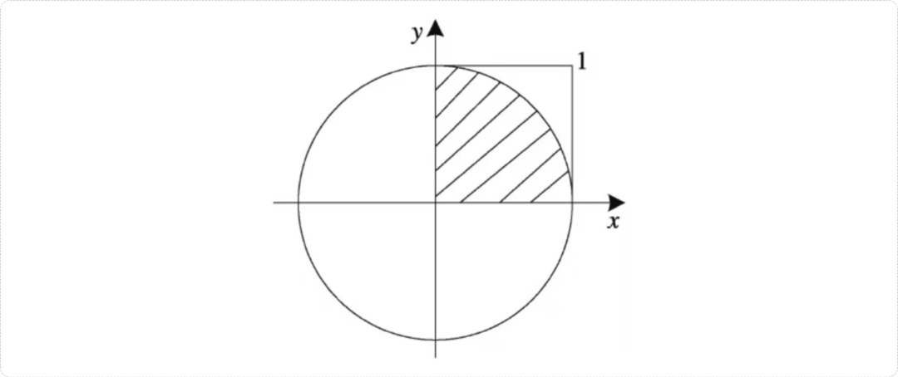
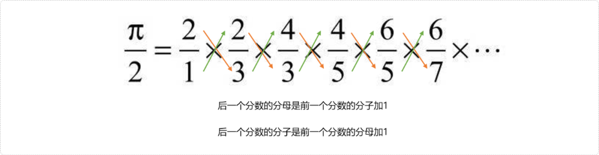
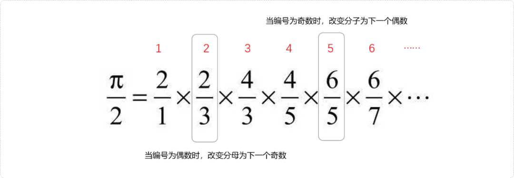
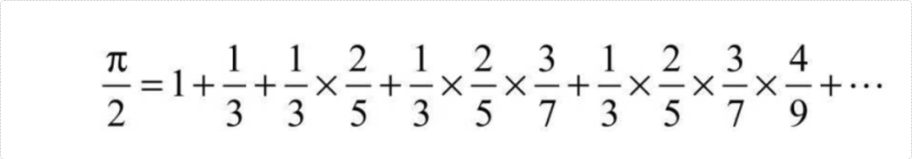
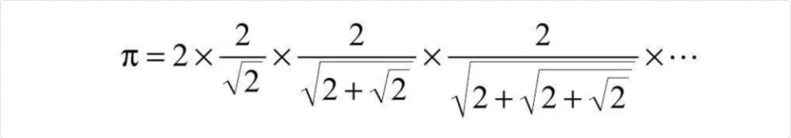

# C++ 圆周率的几种求解方法

。

## **1. 蒙特卡洛模拟算法**

假设有一个半径为`1`的圆，如图所示。先绘制一个半径为`1`的圆。则图中阴影部分（`1/4`圆）的面积就等于`π/4`。



再绘制出一个正方形，可以看出它的面积是 `1` 。通过这种方式，就能够获取到正方形面积和阴影部分面积的一个比例。如此可得到正方形和阴影面积的比例关系`1:π/4`。这是通过数学上提供的计算面积的公式，得到的一个比例。

另外的话呢，我们可以生成很多点。然后把它们随机、均均匀的把平铺到正方形里面去。这时候呢，我们可以认为这些点呢模拟出正方形的面积。另外我们需要计算出有哪些点落在了阴影部分。这种方式也能够获取到正方形和阴影部分面积的比例。这个比例和我们前面通过数学公式所求出的比例呢是一种恒等于的关系，我们利用这种恒等关系，就能够很轻松的获取到这个圆周率。

下面我们看一下这个代码应该如何实现？

第一步利用随机函数产生很多点（横坐标的值`x`和纵坐标的值`y`都在`0~1`之间）随机、均匀散满在正方形内。且统计出散落在阴影部分点的数量。获取正方形内点的数量和阴影部分点的数量的比例。显然，此比例和前面通过公式计算两者面积的比例具有恒等于关系。通过此关系便可计算出圆周率。

```cpp
#include <iostream>
#include <cstdlib>
#include <ctime>
#include <cmath>
using namespace std;
int main(int argc, char** argv) {
     //随机种子
     srand( time(0) );
     double num=10000000;
     double circle=0;
     //random 伪随机数（算法）
     for(int i=1; i<num; i++) {
          double x= rand() / double(RAND_MAX);
          double y=rand() / double(RAND_MAX);
          if( x*x+y*y <=1 ) {
            circle++;
          }
     }
     double pi=4*circle /  num;
     cout<<pi;
     return 0;
}
```

## **2. 割圆法**

例如，假设一个半径为`1`的圆，在圆中有一个内接`6`边形，如图所示。该内接六边形的弦长`y=1`，周长`d=6*y1`，则`π`的近似值`pi=6*y/2=3`。 可以通过内接 `12,24,48……`正多边形，求出精度更高的圆周率。

如下图，把圆切割成六边形：根据等边三角形的特征，可知，六边形的边长`y=1`。


如下图，把圆切割成正`12`边形。


因为`ABD`为直角三角形，可得`AB`2=`AD`2-`BD`2`=1-1/4=3/4`，所以`AB=sqrt(3/4)`。

又因为`BCD`也为直角三角形，可得`y`2=`BD`2+`CB`2`=1/4+(1-AB)`2=`1/4+1-2*sqrt(3/4)+3/4=2-sqrt(3)`。

所以：`pi=6*sqrt( 2-sqrt(3) )`。

```cpp
#include <bits/stdc++.h>
using namespace std;
int main () {
 int i,n,s=6;
 double y=1;
 cout<<"输入切割次数:"<<endl;
 cin>>n;
 for(int i=0; i<n; i++) {
  printf("第%d次切割,为%d边,PI=%.24f\n",i,s,s/2*sqrt(y));
  s*=2;
  //弦长的平方值 
  y=2-sqrt(4-y); 
 }
 return 0;
}
```

## **3. 公式法**

求解圆周率的公式常见的有如下三个：

### **3.1 公式一**


本质是累乘问题，关键是找到参与累乘数字的之间的规律。这里有两种规律。

- 通过观察可以发现，后一个分数的分母是前一个分数的分子加1，后一个分数的分子是前一个分数的分母加一。



代码实现

```cpp
#include <bits/stdc++.h>
using namespace std;
int main(int argc, char** argv) {
    double res=1;
    int n;
    cin>>n;
    double fm=1,fz=2;
    for(int i=0;i<n;i++){
     res*=fz/fm;
     //先存储前一个分数的分母
     int t=fm;
        //后一个分数的分母是前一个分数的分子加1
     fm= fz+1;
        //后一个分数的分子是前一个分数的分母加1
     fz=t+1; 
 }
 cout<<res*2;
 return 0;
}
```

- 给参与累乘的数字编号，会发现当累乘数字的编号为偶数时，改变分数的分母为下一个奇数，当编号为奇数时，改变分子为下一个偶数。



代码实现：

```cpp
#include <bits/stdc++.h>
using namespace std;
int main(int argc, char** argv) {
 double res=1;
 int n;
 cin>>n;
 double fm=1,fz=2;
 res*=fz/fm;
 for(int i=2; i<=n; i++) {
  if( i%2==0 )fm+=2;
  else fz+=2;
  res*=fz/fm;
 }
 cout<<res*2;
 return 0;
}
```

### **3.2 公式二**



我们可以把它当成一个累加的问题，但是在累加的时候，又包括有这个累乘的算法，这里我们有两种思考方案。

第一种方式，我们就把相乘当成雷加的一个内嵌的运算式子，就是说用循环嵌套。

```cpp
#include <bits/stdc++.h>
using namespace std;
int main(int argc, char** argv) {
 double res=1;
 int n;
 cin>>n;
 for(int i=1;i<=n;i++){
  double lc=1;
  double fm=3;
  for( int j=1;j<=i;j++ ){
   lc*=j/fm;
   fm+=2;
  }
  res+=lc;
 }
    cout<<res*2;
 return 0;
}
```

第二种方案，本质上还是一个累加的问题，累加的时候，它要获得一个累乘的效果。一个累乘的值在不停的变化，所以这里我就会声明一个变量。变量用来存储累乘的结果。

```cpp
#include <bits/stdc++.h>
using namespace std;
int main(int argc, char** argv) {
 double res=1,lc=1;
 int n;
 cin>>n;
 double fm=3; //分母
 for(int i=1;i<=n;i++){ //i 分子 
       lc*=1/fm;
    res+=lc;
    fm+=2;
 }
    cout<<res*2;
 return 0;
}
```

### **3.3  公式三**



此题也有两种方案，使用二层循环和一层循环。

- 二层循环。外层循环实现累乘问题，内层循环每次重次计算分母。

```cpp
#include <bits/stdc++.h>
using namespace std;
int main(int argc, char** argv) {
 double res=2;
 int n;
 cin>>n;
 for(int i=1;i<=n;i++){
  double fm=sqrt(2);
  for( int j=1;j<i;j++){
   fm=sqrt( 2+fm );
  }
  res*=2/fm;
 }
 cout<<res;
 return 0;
}
```

- 一层循环。下一次的分母为2减去上一次分母，然后开平方根。

```cpp
#include <bits/stdc++.h>
using namespace std;
int main(int argc, char** argv) {

 double res=2;
 int n;
 cin>>n;
 double fm=sqrt(2);
    for(int i=0;i<n;i++){
     res*=2/fm;
     fm=sqrt( 2+fm );
 }
    cout<<res; 
 return 0;
}
```


<iframe src="https://wxa.wxs.qq.com/tmpl/kx/base_tmpl.html" class="iframe_ad_container iframe_adv_ad_container" style="-webkit-tap-highlight-color: transparent; margin: 0px; padding: 0px; outline: 0px; width: 677px; height: 0px; border: none; box-sizing: border-box; display: block; left: 0px;"></iframe>

