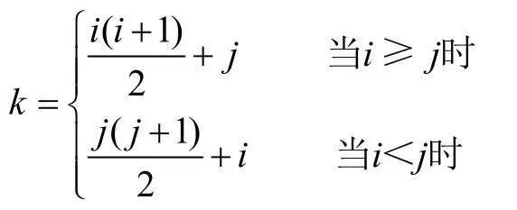
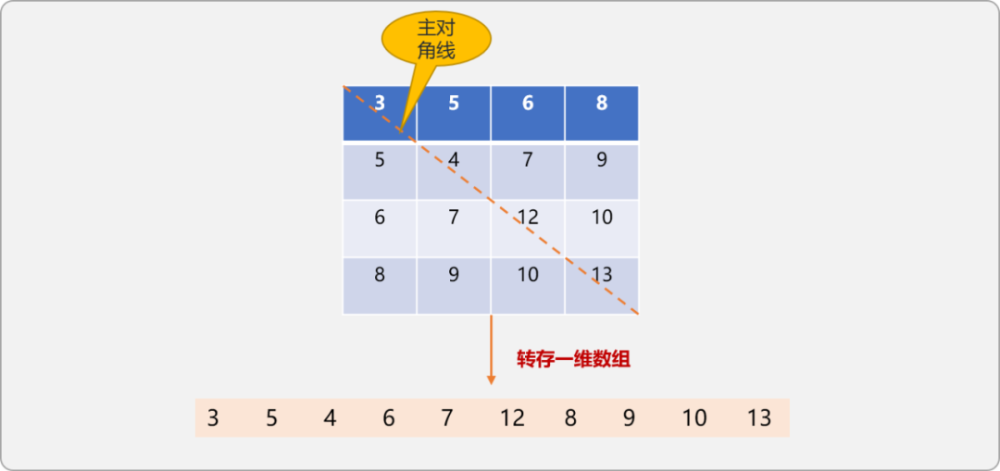
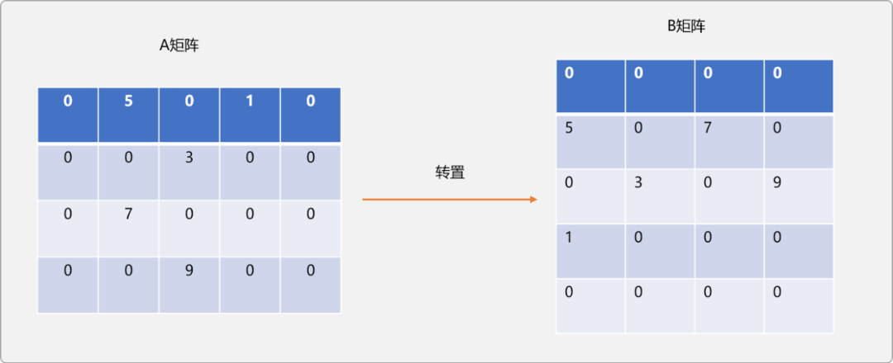
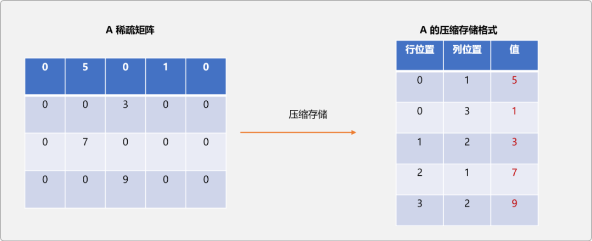
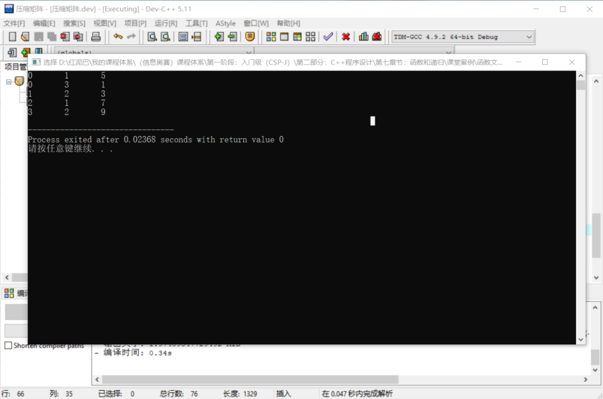
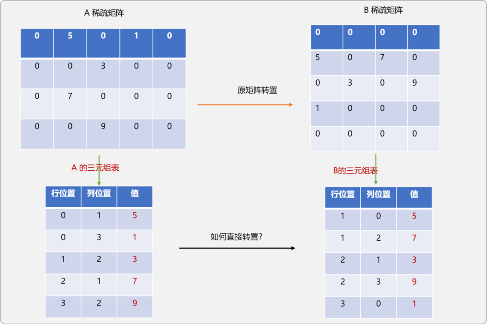
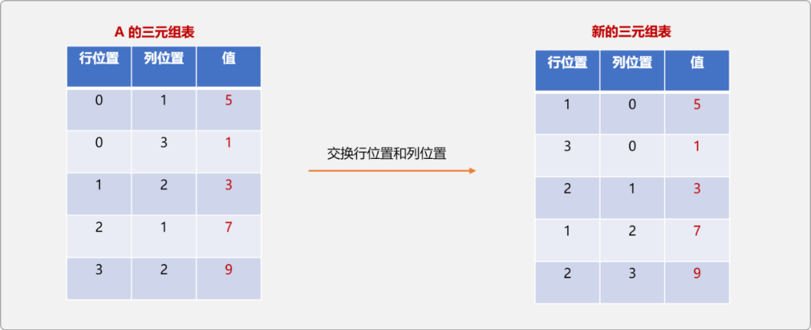
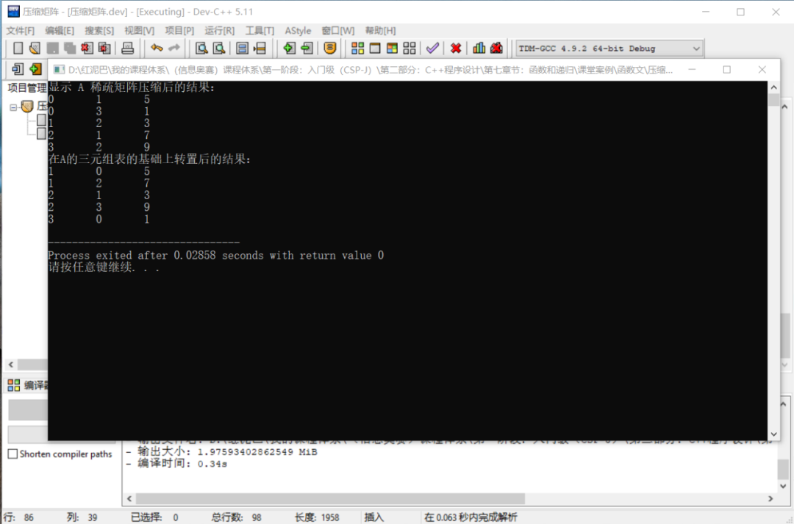
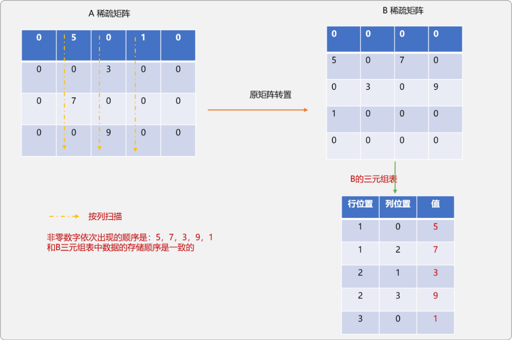
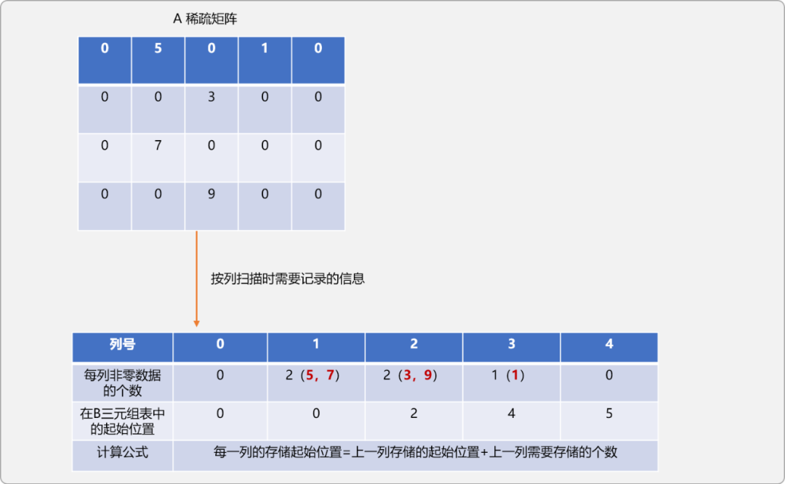

# C++ 特殊矩阵的压缩算法

## 1. 前言

**什么是特殊矩阵？**

计算机语言中，一般使用二维数组存储矩阵数据。在实际存储时，会发现矩阵中有许多值相同或许多值为零的数据，且分布有一定的规律，称这类型的矩阵为`特殊矩阵`。

为了节省存储空间，可以设计算法，对这类`特殊矩阵`进行压缩存储，让多个相同的非零数据只分配一个存储空间；对零数据不分配空间。

本文将聊聊如何压缩这类特殊矩阵，以及压缩后如何保证矩阵的常规操作不受影响。

## 2. 压缩对称矩阵

**什么是对称矩阵？**

在一个`n`阶矩阵`A`中，若所有数据满足如下述特性，则可称`A`为对称矩阵。

- `a[i][j]==a[j][i]`

  > `i`是矩阵中的行号。
  >
  > `j`是矩阵中的列号。

- `0<<i,j<<n-1`

在`n`阶对称矩阵 `a[i][j]`中，当`i==j(行号和列号相同)`时所有元素所构建成的集合称为主对角线。

如下图所示：


`对称矩阵`以主对角线为分界线，把整个矩阵分成 `2` 个三角区域，主对角线之上的称为`上三角`，主对角线之下的区域称为`下三角`。

对称矩阵的`上三角`和`下三角`区域中的元素是相同的，以`n`行`n`列的二维数组存储时，会浪费近一半的空间，可以采压缩机制，将 二维数组中的数据压缩存储在一个一维数组中，这个过程也称为`数据线性化`。

**线性过程时，一维数组的空间需要多大？**

`n`阶矩阵，使用二维数组存储，理论上所需要的存储单元应该为 n2。

`对称矩阵`以主对角线为分界线，`上三角`和`下三角`区域中的数据是相同的。注意，主对角线上的元素是需要单独存储的，主对角线上的数据个数为 `n`。

所以真正所需要的存储空间应该：`(理论上所需要的存储单位-主对角线上的数据所需单元) / 2 +主对角线上的数据所需单元`。

如下表达式所述：

(n2-n)/2+n=`n(n+1)/2`

所以，可以把`n`阶矩阵中的数据可以全部压缩在长度为 `n(n+1)/2` 的一维数组中，能节约近一半的存储空间。并且`n`阶矩阵和一维数组之间满足如下的位置对应关系：




> `i>=j表示矩阵中的` 下三角区域(包含主对角线上数据)。
>
> `i<j表示矩阵中的`上三角区域。

**转存代码：**

```cpp
#include <iostream>
using namespace std;
int main(int argc, char** argv) {
 //对称矩阵
 int nums[4][4]= { {3,5,6,8},{5,4,7,9},{6,7,12,10},{8,9,10,13} };
 //一维数组，根据上述公式，一维数组长度为 4*(4+1)/2=10
 int zipNums[10]= {0};
 for(int i=0; i<4; i++) {
  for(int j=0; j<4; j++) {
   if (i>=j) {
    zipNums[ i*(i+1)/2+j]=nums[i][j];
   } else {
    zipNums[ j*(j+1)/2+i]=nums[i][j];
   }
  }
 }
 for(int i=0; i<10; i++) {
  cout<<zipNums[i]<<"\t";
 }
 return 0;
}
```




## 3. 压缩稀疏矩阵

**什么是稀疏矩阵？**

如果`矩阵A`中的有效数据的数量远远小于矩阵实际能描述的元素的总数，则称`A为稀疏矩阵`。

现假设有 `m`行`n`列的矩阵，其中所保存的元素个数为 `c`，则稀疏因子为：`e=c/(m*n)`。当用二维数组存储稀疏矩阵中数据时，仅有少部分空间被利用，可以采用压缩机制来进行存储。

> 稀疏因子越小，表示有效数据越少。

稀疏矩阵中的非零元素的存储位置是没有规律的，在压缩存储过程中，除了需要记录非零元素本身外还需要记录其位置信息。所以需要一个三元组对象`（i,j,a[i][j]）`进行唯一性描述。

### 3.1 三元组表

为了便于描述，压缩前的矩阵称为`原稀疏矩阵`，压缩后的稀疏矩阵称`三元组表矩阵`。

`原稀疏矩阵`也好，`三元组表矩阵`也好。只要顶着`矩阵`的这个词，就应该能进行矩阵相对应的操作。矩阵的内置操作有很多，本文选择矩阵的转置操作来对比压缩前和压缩后的算法差异性。

**什么是矩阵转置？**

如有 `m`行`n`列的`A` 矩阵，所谓转置，指把`A`变成 `n`行`m`列的 `B`矩阵。`A`和`B`满足 `A[i][j]=B[j][i]`。即`A`的行变成`B`的列。如下图所示：




`A`稀疏矩阵转置成`B`稀疏矩阵的原生实现：

```cpp
//原矩阵
int aArray[4][5]= {{0,5,0,1,0},{0,0,3,0,0},{0,7,0,0,0},{0,0,9,0,0}};
//转置后矩阵
int bArray[5][4];
//转置算法 
for(int row=0; row<4; row++) {
 for(int col=0; col<5; col++) {
  bArray[col][row]=aArray[row][col];
 }
}
```

基于原生矩阵上的转置算法，其时间复杂度为 `O(m*n) `，即O(n2)。

从存储角度而言，`aArray`矩阵和其转置后的`bArray`矩阵都是稀疏矩阵，使用二维数组存储会浪费大量的空间。有必要对其以`三元组表`的形式进行压缩存储。

`三元组表`是一个一维数组，因其中的每一个存储位置需要存储原稀疏矩阵中非零数据的`3` 个信息（行，列，值）。`三元组表`名由此而来，也就是说数组中存储的是对象。

先来一个图示，直观上了解一下`A稀疏矩阵`压缩前后的差异性。




压缩算法实现：

```cpp
#include <iostream>
using namespace std;
typedef int DataType;
#define maxSize 100
//三元组结点
struct Node {
 //行号
 int row=-1;
 //列号
 int col=-1;
 //非零元素的值
 DataType val=0;
} ;

//维护三元组表的类
class Matrix {
 private:
  //存储位置编号
  int idx=0;
  //压缩前稀疏矩阵的行数
  int rows;
  //压缩前稀疏矩阵的列数
  int cols;
  //原稀疏矩阵中非零数据的个数
  int terms;
  //压缩存储的一维数组
  Node node;
  Node data[maxSize]= {node};
 public:
  //构造函数
  Matrix(int row,int col) {
   this->rows=row;
   this->cols=col;
  }
  //存储三元结点
  void setData(int row ,int col,int val) {
   Node n;
   n.row=row;
   n.col=col;
   n.val=val;
   this->data[idx++]=n;
             //记录非零数据的数量
             this->terms++;
  }
        //重载上面函数
     void setData(int index,int row ,int col,int val) {
   Node n;
   n.row=row;
   n.col=col;
   n.val=val;
   this->data[index]=n;
   this->terms++;
  }
  //显示三无组表
  void showInfo() {
   for(int i=0; i<maxSize; i++ ) {
    if(data[i].val==0)break;
    cout<<data[i].row<<"\t"<<data[i].col<<"\t"<<data[i].val<<endl;
   }
  }
  //基于三元组表的转置算法
  Matrix transMatrix();
};

int main(int argc, char** argv) {
 //原稀疏矩阵
 int aArray[4][5]= {{0,5,0,1,0},{0,0,3,0,0},{0,7,0,0,0},{0,0,9,0,0}};
 //实例化
 Matrix matrix(4,5);
 //压缩矩阵
 for(int row=0; row<4; row++) {
  for(int col=0; col<5; col++) {
   if (aArray[row][col]!=0) {
    matrix.setData(row,col,aArray[row][col]);
   }
  }
 }
 matrix.showInfo();
 return 0;
}
```

代码执行后的结果和直观图示结果一致：




压缩之后，则要思考，如何在`三元组表`的基础上实现矩阵的转置。或者说 ，转置后的矩阵还是使用`三元组表`方式描述。

先从直观上了解一下，转置后的`B`矩稀疏阵的三元组表的结构应该是什么样子。




是否可以通过直接交换`A的三元组表`中行和列位置中的值？至于可不可以，可以先用演示图推演一下：




从图示可知，如果仅是交换`A三元组表`的行和列位置后得到的新三元组表并不和前面所推演出现的`B三元组表`一致。

如果仔细观察，可发现得到的`新三元组表`的是对原`B稀疏表以列优先`遍历后的结果。

`B稀疏矩阵`的`三元组表`显然应该是以行优先遍历的结果。

### 3.2 以列为优先搜索

经过转置后，`A稀疏矩阵`的行会变成`B稀疏矩阵`的列，也可以说`A`的列变成`B`的行。如果在`A`中以列优先搜索，则相当于在`B`中以行优先进行搜索。可利用这个简单而又令人兴奋的逻辑实现基于`三元组表`的转置。

```cpp
Matrix Matrix::transMatrix(){
 //转置后的三元组表对象
 Matrix bMatrix(this->cols,this->rows);
 //对原稀疏矩阵以列优先搜索
 for(int c=0;c<this->cols;c++){
  //在对应的三元组表上查找此列上是否有非零数据
   for(int j=0;j<this->terms;j++ ){
    if(this->data[j].col==c){
     //如果此列上有数据，则转置并保存
    bMatrix.setData(this->data[j].col,this->data[j].row,this->data[j].val);  
    }
   } 
 }
 return  bMatrix;
}
```

测试代码：

```cpp
int main(int argc, char** argv) {
//原稀疏矩阵
int aArray[4][5]= {{0,5,0,1,0},{0,0,3,0,0},{0,7,0,0,0},{0,0,9,0,0}};
//实例化压缩矩阵
Matrix matrix(4,5);
//压缩矩阵
for(int row=0; row<4; row++) {
 for(int col=0; col<5; col++) {
  if (aArray[row][col]!=0) {
   matrix.setData(row,col,aArray[row][col]);
  }
 }
}
cout<<"显示 A 稀疏矩阵压缩后的结果："<<endl; 
matrix.showInfo();
cout<<"在A的三元组表的基础上转置后的结果："<<endl;
Matrix bMatrix= matrix.transMatrix();
bMatrix.showInfo();   
return 0;
}
```

输出结果：




代码执行后输出的结果，和前文推演出来的结果是一样的。

前文可知，基于原生稀疏矩阵上的转置时间复杂度为 `O(m*n)`。基于`三元组表`的 时间复杂度=`稀疏矩阵的列数乘以稀疏矩阵中非零数据的个数`。当稀疏矩阵中的元素个数为`n*m`时，则上述的时间复杂度会变成 O（m*n2）。

### 3.3 找出存储位置

上述算法适合于当稀疏因子较小时，当矩阵中的非零数据较多时，时间复杂度会较高。可以采用另外一种方案提升转置性能。

其核心思路如下所述：

- 在原`A稀疏矩阵`中按列优先进行搜索。
- 统计每一列中非零数据的个数。
- 记录每一列中第一个非零数据在`B`三元组表中的位置。




对`A稀疏矩阵`按列遍历时，可以发现，扫描时，数据出现的顺序和其在`B三元组表`中的存储顺序是一致的。

如果在遍历时，能记录每列非零数据在`B三元组表`中应该存储的位置，则可以实现`A三元组表`中的数据直接以转置要求存储在`B三元组表中`。



重写上述的转置函数。

```cpp
Matrix Matrix::transMatrix() {
 //保存转置后数据的压缩矩阵
 Matrix bMatrix(this->cols,this->rows);
 //初始化数组，用来保存A稀疏矩阵中第一列中非零数据的个数
 int counts[this->cols]= {0};
 //计算每一列中非零数据个数
 for(int i=0; i<this->terms; i++)
  counts[this->data[i].col]++;

 //初始化数组，用来保存A稀疏矩阵每列中非零数据在B三元组表中的起始位置
 int position[this->cols]= {0}; 
 for(int i=1;i<this->cols;i++ ){
        //上一列的起始位置加上上一列非零数据的个数
  position[i]=position[i-1]+counts[i-1];
 }
    
    //转置A三元组表
    for(int i=0;i<this->terms;i++){ 
     int col=this->data[i].col;
     int row=this->data[i].row;
     int val=this->data[i].val;
     //找到在B三元组中的起始存储位置
  int pos=position[col];
  bMatrix.setData(pos,col,row,val);
  position[col]++; 
 } 
 return  bMatrix;
}
```

测试代码不需要任何变化：

```cpp
int main(int argc, char** argv) {
 //原稀疏矩阵
 int aArray[4][5]= {{0,5,0,1,0},{0,0,3,0,0},{0,7,0,0,0},{0,0,9,0,0}};
 //实例化压缩矩阵
 Matrix matrix(4,5);
 //压缩矩阵
 for(int row=0; row<4; row++) {
  for(int col=0; col<5; col++) {
   if (aArray[row][col]!=0) {
    matrix.setData(row,col,aArray[row][col]);
   }
  }
 }
 cout<<"显示 A 稀疏矩阵压缩后的结果："<<endl;
 matrix.showInfo();
 cout<<"在A的三元组表的基础上转置后的结果："<<endl;
 Matrix bMatrix= matrix.transMatrix();
 bMatrix.showInfo();
 return 0;
}
```

输出结果：


## 4. 总结

使用二维数组存储矩阵中数据时，如果矩阵中的有效数据较小时，可以采用压缩的方式对其进行存储。本文着重讲解如何使用三元组表方式压缩存储稀疏矩阵。转存过程并不难，难点在于转存为三元组表后，如何在三元组表的基础上正常进行矩阵相关操作。


