# C++ 算法进阶系列之从 Brute Force 到 KMP 字符串匹配算法

原创 一枚大果壳 [编程驿站](javascript:void(0);) *2023年01月12日 21:13* *湖南*


**编程驿站**

《果壳信奥编程》纯专业技术公众号！学编程，走信奥，就找果壳信奥编程……

182篇原创内容


公众号

## 1. 字符串匹配算法

所谓字符串匹配算法，简单地说就是在一个目标字符串中查找是否存在另一个模式字符串。如在字符串 "**`ABCDEFG`**" 中查找是否存在 “**`EF`**” 字符串。

可以把字符串 "**`ABCDEFG`**"  称为**原始（目标）字符串**，“**`EF`**” 称为**子字符串**或**模式字符串**。

本文通过如下 `3` 种字符串匹配算法之间的差异性来探究 `KMP` 算法的本质。

- `BF（Brute Force，暴力检索算法）`
- `RK （Robin-Karp 算法）`
- `KMP （D.E.Knuth、J.H.Morris、V.R.Pratt 算法）`

## 2. BF(Brute Force，暴力检索)

**BF 算法是一种原始、低级的穷举算法。**

### 2.1  算法思想

**如下使用长、短指针方案描述 BF 算法：**

- **初始指针位置：** 长指针指向原始字符串的第一个字符位置、短指针指向模式字符串的第一个字符位置。这里引入辅助指针概念，并不是必须的。

> **Tips：** 辅助指针是长指针的替身，替长指针和短指针所在位置的字符比较。**每次初始化长指针位置时，让辅助指针和长指针指向同一个位置。**

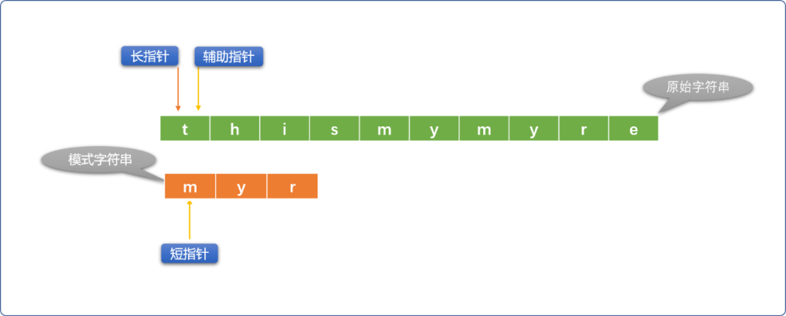

- 如果长、短指针位置的字符不相同，则短指针不动、长指针向右移动。如果长、短指针所指位置的字符相同，则用辅助指针替代长指针（长指针位置不动）和短指针位置的字符比较，如果比较相同，则同时向右移动辅助指针和短指针。

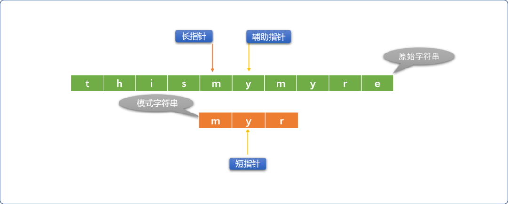

- 如果辅助指针和短指针位置的字符不相同，则重新初始化长指针位置（向右移动），短指针恢复到最原始状态。

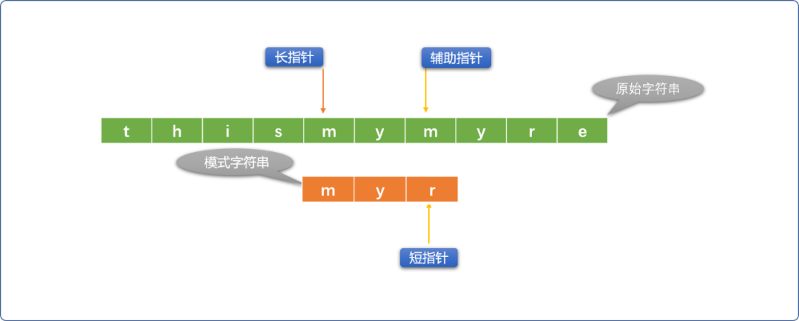

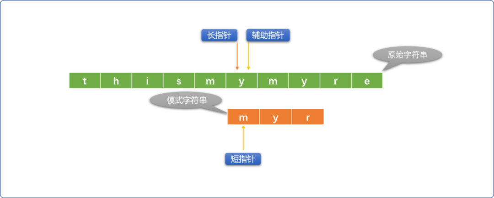

- 借助循环或者递归的方案重复上述流程，直到出口条件成立。

  **查找失败：**长指针到达了原始字符串的尾部。当 **长指针位置=原始字符串长度 - 模式字符串长度+1** 时就可以认定查找失败。

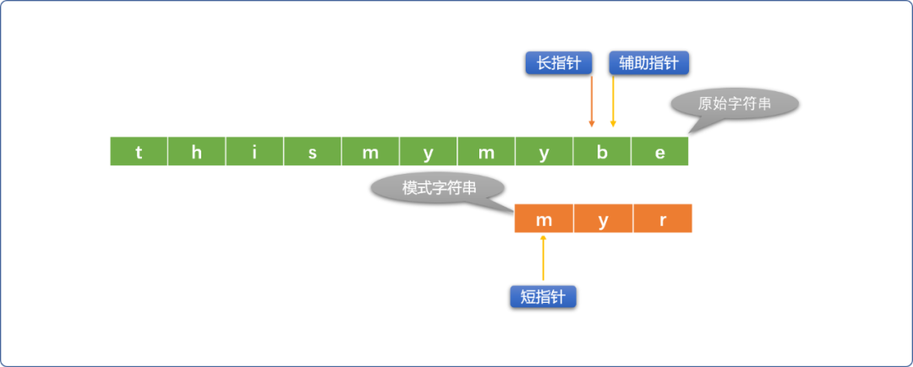

**查找成功：** 短指针到达模式字符串尾部。

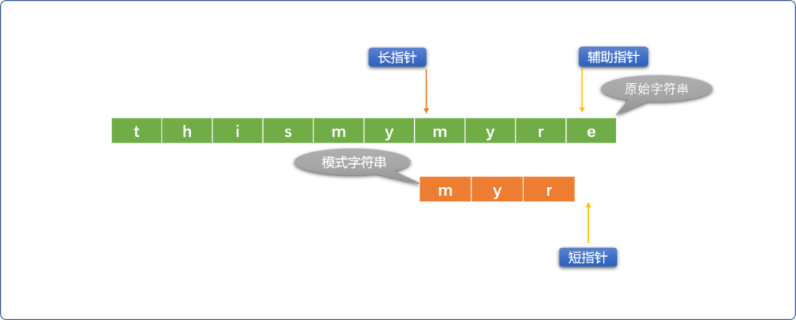

### 2.2 编码实现

#### 2.2.1  使用辅助指针

使用辅助指针替代长指针和短指针所在位置的字符进行比较。

```cpp
#include <iostream>
using namespace std;
/*
*  BF 字符串匹配算法
*  参数说明
*  srcStr  原始字符串
*  subStr  子（模式）字符串
*  返回值说明 -1 表示查找失败
*/
int  bruteForceMatch(string srcStr,string subStr) {
 // 长指针,在原始字符串上移动
 int long_index = 0;
 // 短指针,在模式字符串上移动
 int short_index = 0;
 // 辅助指针,初始和长指针位置相同
 int fu_index = long_index;
 // 原始字符串长度
 int str_len = srcStr.size();
 // 模式字符串的长度
 int sub_len = subStr.size();
 while (long_index < str_len-sub_len+1) {
  // 把长指针的位值赋给辅助指针
  fu_index = long_index;
  //初始短指针位置
  short_index = 0;
  while (short_index < sub_len && srcStr[fu_index] == subStr[short_index]) {
   //辅助指针向右
   fu_index ++;
   //短指针向右
   short_index ++;
  }
  if (short_index == sub_len) {
            //匹配成功
   return  long_index;
  }
  //匹配不成功，则长指针向右移动
  long_index ++;
 }
 return -1;
}
```

**测试：**

```cpp
int main(int argc, char** argv) {
 string srcStr="thismymyre";
 string subStr="myr";
 int res= bruteForceMatch(srcStr,subStr);
 cout<<res;
 return 0;
}
```

**输出结果：**

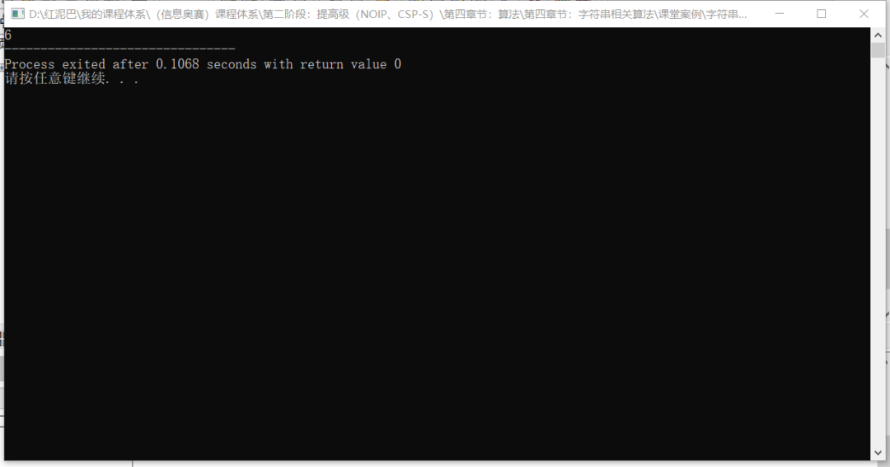

#### 2.2.2  使用增量

以长指针为参照起点，需要比较时，以相对增量位置和短指针位置字符比较。

```cpp
int  bruteForceMatch_(string srcStr,string subStr) {
 // 省略变量声明……
 while (long_index < str_len-sub_len+1) {
  //增量
        int i = 0;
     int short_index = 0;
  while (short_index < sub_len && srcStr[long_index + i] == subStr[short_index]) {
   i++;
   // 短指针向右
   short_index++;
  }
  if (short_index == sub_len)
   return long_index;
  long_index ++;
 }
 return -1;
}
```

#### 2.2.3 长指针和短指针直接比较

在原始字符串和模式字符串开始`齐头并进`逐一比较时，最好不要修改长指针的位置，否则，在比较不成功的情况下，重修正长指针的逻辑有点繁琐。

```cpp
int  bruteForceMatch_0(string srcStr,string subStr) {
    //省略变量声明……
 while (long_index < str_len) {
  short_index = 0;
  // 长指针和短指针位置的字符比较
  while (short_index < sub_len and srcStr[long_index] == subStr[short_index]) {
   long_index++;
   // 短指针向右
   short_index++;
  }
  if (short_index == sub_len)return long_index-short_index;
  // 修正长指针的位置
  long_index = long_index-short_index+1;
 }
 return -1;
}
```

### 2.3 BF 算法的时间复杂度

`BF` 算法直观，易于实现，但是缺少变通，是典型的穷举思想。

如果原始字符串的长度为 `m` ，模式字符串的长度为 `n`。时间复杂度则是 `O（m*n）`，时间复杂度较高。

## 3. RK（Robin-Karp 算法）

`RK`算法 ( 指纹字符串查找) 在 `BF` 算法的基础上做了些改进，基本思路：

如下图示，`模式字符串`和`原始字符串`比较 `3` 次后，才发现两者匹配不上，意味着前面的 `3` 次比较，除了浪费时间，无其它意义。能不能通过一种算法，快速判断出本次比较是否有必要进行。


### 3.1 RK 的算法思想

- 选定一个`哈希函数`（可自定义）。
- 使用哈希函数计算模式字符串的哈希值。如上计算 **`thia`** 的哈希值。
- 再从原始字符串的开始比较位置起，截取一段和模式字符串长度一样的子串，也使用哈希函数计算哈希值。如上计算 **`this`** 的哈希值。
- 如果两次计算出来的哈希值不相同，则可判断两段模式字符串不相同，没有开始比较的必要。
- 如果两次计算的哈希值相同，因存在哈希冲突，还是需要使用 `BF` 算法进行逐一比较。

`RK` 算法使用哈希函数算法杜绝了不必要的比较。

### 3.2 编码实现：

```cpp
/*
*自定义哈希函数
*累加字符串中字符的ASCII
*仅用于研究
*/
int myHash(string str) {
 int total=0;
 for(int i=0; i<str.size(); i++) {
  total+=int(str[i] );
 }
 return total;
}
/*
*
*/
int rkMatch(string srcStr,string subStr) {
 // 长指针
 int long_index = 0;
 // 短指针
 int short_index = 0;
 // 辅助指针
 int fu_index = 0;
 // 原始字符串长度
 int str_len = srcStr.size();
 //  模式字符串的长度
 int sub_len =subStr.size();
 while (long_index < str_len - sub_len + 1) {
  // hash 
  if ( myHash(subStr) != myHash( srcStr.substr(long_index,sub_len) ) ) {
   //哈希值一样
   long_index++;
   continue;
  }
  // 把长指针的位置赋给辅助指针
  fu_index = long_index;
  short_index = 0;
  while (short_index < sub_len && srcStr[fu_index] == subStr[short_index]) {
   //辅助指针向右
   fu_index ++;
   //短指针向右
   short_index ++;
  }
  if (short_index == sub_len)return long_index;
  long_index++;
 }
}
```

**RK 的时间复杂度：**

`RK` 的代码逻辑和 `BF` 一样，但内置了哈希判断。如果原始子符串长度为 `m`，模式字符串的长度为 `n`。时间复杂度为 `O(m+n)`，如果不考虑哈希冲突问题，理想状态下的时间复杂度可以为 `O(m)`。

很显然 `RK` 算法比 `BF` 算法要快很多。

## 4. KMP算法

算法的本质是穷举，这是由计算机的思维方式决定的。

我们谈论"好"、“坏” 算法时，所谓的`好`指能让穷举的次数少一些。比如前面的 **RK** 算法，通过一些特性提前判断是否值得比较，这样可以省掉很多不必要的内循环。

**KMP** 也是一样，也是尽可能减少比较的次数。

### 4.1 KMP 算法思想

**KMP** 的基本思路和 **BF** 是一样的（字符串逐一比较）。但在`BF` 算法做了性能上的优化。

让我们再次回到前面的`BF`比较流程中。如下图所示，在比较 `4` 次后，辅助指针和短指针对应位置字符不相同，说明匹配失败。

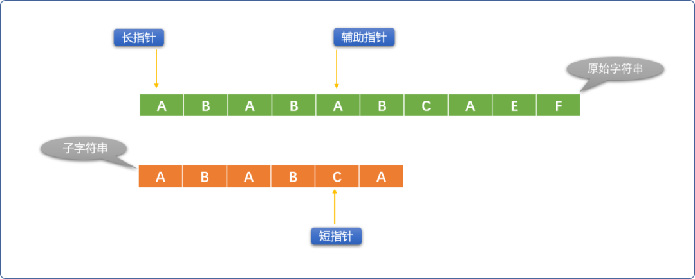

`BF`的做法是，让长指针向右移一位，短指针恢复原始状态。再重新逐一比较。

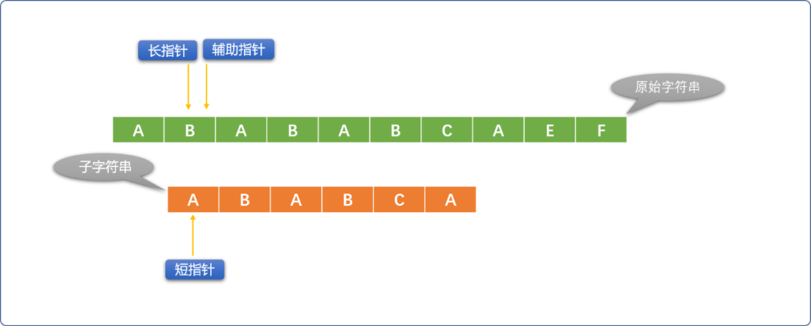

但是，这里应该会有一个思考？难道前面的 `4` 次成功的比较就没有一点可利用的价值吗？

那就再回放，仔细观察一番。


会发现一个有趣的地方。部分匹配成功的`ABAB`字符串，在原始字符串中的后面的`AB`字符和模式字符串的前面的`AB`字符是相同的。如下填充灰色区域。


直观告诉我们，长指针可以不用回到最初开始的位置，只需要让短指针稍微回一下。

如下图所示：


很明显示缩短了很多不必要的比较次数。

**那么这个现象有没有通用性？**

再分析如下  `2` 个字符串的比较，即使前面有 `4` 次比较成功，当匹配失败后，长指针确实可以不用移动，但是短指针必须回到最初位置，再重新开始。


那么在什么情况下可以让短指针只做稍微的移动？

说清楚这个问题之前，先理解几个概念：

- **前缀集合：**

  如： **`ABAB`** 的前缀（不包含字符串本身）集合` {A，AB，ABA}`。

- **后缀集合：**

  如：**`ABAB`** 的后缀（不包含字符串本身）集合 `{ BAB，AB，B }`。

- **PMT值：** 前缀、后缀两个集合的交集元素中最长元素的长度。

  如：先求  **`{A，AB，ABA}`** 和  **`{ BAB，AB，B }`** 的交集，得到集合  **`{AB}`** ，再得到集合中最长元素的长度， 所以  `ABAB` 字符串的  `PMT` 值是 `2` 。

一通前缀、后缀、交集概念说完后，但其结论很简单：仅当共同匹配成功的`字符串`，其`最前面`和`最后面`有相同的部分时，方可以减少短指针的移动量。当相同部分越多，短指针移动的量就越小。


这里就有 `2` 个问题又摆在面前。

- 如何知道已经匹配成功的字符串有公共的`前缀`和`后缀`以及最大相同长度值。
- 如何根据最大`PMT`值修正短指针的位置。

如上的 `2` 个问题，便是`KMP` 算法的核心。`KMP`会把这些信息存储中 “**`部分匹配表（PMT：Partial Match Table）`**”中，修改短指针的位置便是根据这个表中数据。

#### 4.2 PMT 的计算

**KMP** 算法中 的 "**部分匹配表（PMT）**" 是怎么计算出来的？

如前面图示，原始字符串和模式字符串逐一比较时，前 `4` 位即 **`ABAB`** 是相同的，而 **`ABAB`** 存在最大长度的前缀和后缀 **‘`AB`’** 子串。意味着下一次比较时，可以直接让**模式字符串的前缀**和原始字符串中**已经比较的字符串的后缀**对齐。

这些信息都是从`PMT`表中获取。所以，**`KMP`** 算法的核心是得到 **`PMT`** 表。


现使用手工方式计算 **`ABABCA`** 的 **`PMT`** 值：

- 当仅匹配第一个字符 `A` 时，`A` 没有前缀集合也没有后缀集合，所以 `PMT[0]=0`，短指针要移到模式字符串的 `0` 位置。
- 当仅匹配前二个字符 `AB` 时，`AB`的前缀集合`{A}`，后缀集合是`{B}`，没有交集。通俗理解，`AB`不存在前后相同部分。所以 `PMT[1]=0`，短指针要移到模式字符串的 0 位置。
- 当仅匹配前三个字符 `ABA` 时，`ABA` 的前缀集合`{A，AB}` ，后缀集合`{BA，A}`，交集`{A}`。所以 `PMT[2]=1`，短指针要移到模式字符串 `1` 的位置。
- 当仅匹配前四个字符 `ABAB` 时，`ABAB` 的前缀集合 `{A ，AB，ABA }`，后缀集合`{BAB，AB，B}`，交集`{AB}`，所以 `PMT[3]=2`，短指针要移到模式字符串 `2` 的位置。
- 当仅匹配前五个字符 `ABABC` 时，`ABABC` 的前缀集合`{ A,AB,ABA,ABAB }`,后缀集合`{ C，BC，ABC，BABC }`，没有交集，所以`PMT[4]=0`，短指针要移到模式字符串的 `0` 位置。
- 当全部匹配后，意味着匹配成功。所以 `PMT[5]=0`。


其实在 `KMP` 算法中，没有直接使用 `PMT` 表，而是引入了`next` 数组的概念，`next` 数组中的值是 `PMT` 的值向右移动一位。


**KMP算法实现：** 先不考虑 `next` 数组的算法，暂且用上面手工计算出来的值作为 `KMP` 算法的已知数据。

```cpp
#include <iostream>
using namespace std;
int kmp(string src_str,string sub_str) {
 // next 数组
 int p_next[] = {-1, 0, 0, 1, 2, 0};
 // 指向原始字符的第一个位置
 int long_index = 0;
 // 指向模式字符串的第一个位置
 int short_index = 0;
 // 原始字符串的长度
 int src_str_len = src_str.size();
 // 模式字符串的长度
 int sub_str_len = sub_str.size();
 // 查询条件
 while (long_index < src_str_len && short_index < sub_str_len) {
  // -1 是一个神奇的存在，能保证在没有任何一个比较成功时，也能让长指针向前移动至少一步。
  if (short_index == -1 || src_str[long_index] == sub_str[short_index]) {
   long_index ++;
   short_index ++;
  } else {
             //修正短指针
   short_index = p_next[short_index];
  }
 }
 if (short_index == sub_str_len)
  return long_index - short_index;
 return -1;
}
//测试
int main(int argc, char** argv) {
 string srcStr="ABABABCAEF";
 string subStr="ABABCA";
 int res= kmp(srcStr,subStr);
 cout<<res;
 return 0;
}
```

上面的代码没有通用性的，现在实现求解 `netxt` 数组的算法。

求 `next` 也可以认为是一个字符串匹配过程，只是原始字符串和模式字符串都是同一个字符串。本质是在匹配成功的字符串中查找`后面`和`前面`相同子字符串的数量。

- 当仅匹配一个 `A`。没前缀和后缀。则 `PMT[0]=0,next[0]=-1`。
- 当匹配 `2` 个。如下图，前缀、后缀没有相同的部分。则 `PMT[1]=0,next[0]=0`。


- 当匹配`3` 个。如下图，其前缀、后缀有一个字符 `A`相同。则 `PMT[2]=1,next[0]=0`。


- 当匹配`4` 个。如下图，其前缀、后缀 `AB`字符串相同。则 `PMT[3]=2,next[0]=1`。


- 当匹配`5` 个。如下图，其前缀、后缀没有相同。则 `PMT[4]=0,next[0]=2`。

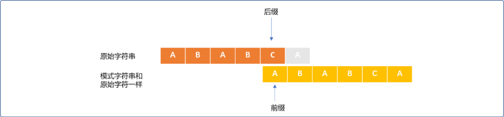

- 全部匹配，表示程序匹配成功。`PMT`值为 `0`。

编码实现：

```cpp
// 求解 next 的算法
int* getNext(string patter) {
 int mLen = patter.size();
 int* pnext=new int[mLen];
 for(int k=0; k<mLen; k++)pnext[k]=-1;
 int i=0;
 int j=-1;
 while (i < mLen - 1) {
  if (j == -1 || patter[i] == patter[j]) {
   i += 1;
   j += 1;
   pnext[i] = j;
  } else
   j = pnext[j];
 }
 return pnext;
}
//测试
int main(int argc, char** argv) {
 string srcStr="ABABABCAEF";
 string subStr="ABABCA";
 int * n= getNext(subStr);
 for(int i=0; i<subStr.size(); i++) {
  cout<<*(n+i)<<"\t";
 }
 return 0;
}
```

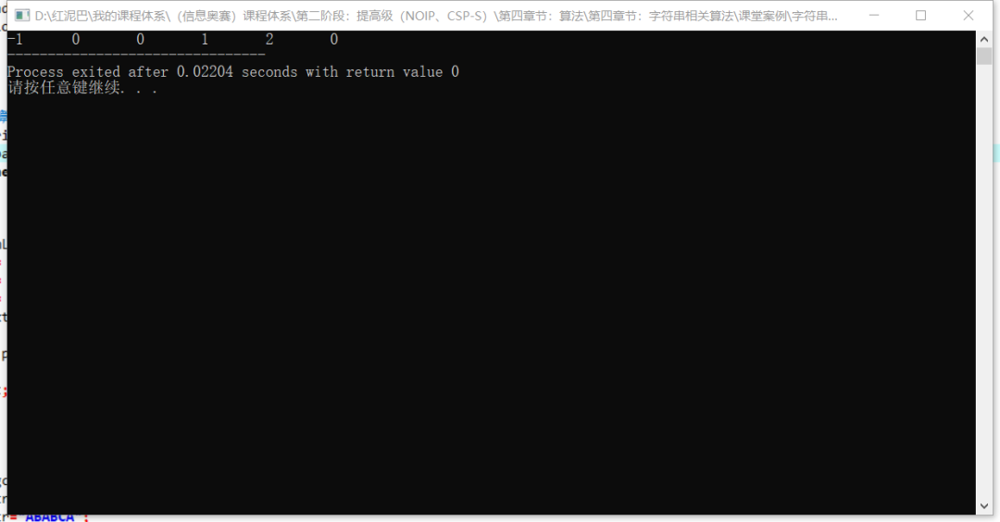

`KMP`算法的时间复杂度可以达到 `O（m+n）`。但是，如果模式字符串中不存在相同的前缀和后缀时，时间复杂度接近`BF`算法。

## 5. 总结

字符串匹配算法除了上述几种外，还有 `Sunday`等算法。

从暴力算法开始，其它算法都是在尽可能减少计算次数，提高算法的运行速度。


一枚大果壳

![赞赏二维码](https://mp.weixin.qq.com/s?__biz=MzU2NDgzNjgzNw==&mid=2247487890&idx=1&sn=d9d64c419c5b94c7197cb8b01b7a00d2&chksm=fc45b118cb32380e617da98fc26ed4a800db5ea61f595c912ace4dd2de0a4363e9107098db37&scene=126&sessionid=1729004179&subscene=7&clicktime=1729005371&enterid=1729005371&key=daf9bdc5abc4e8d0c96a7da98072c6435dd7f0555c34870d5cc1a9d95431a9a2583f8c44f9e46193106c25b5baaf32f6c03e7084fc108c6457dc74f9a138c7328a97d84d5fd37367221800d50f42e728a548d0fdeee57b8e21b232af99c37b264de286cca575d1009e6c47b8cd2fd39d66556b23ed78b1fa17052281f908501d&ascene=0&uin=NjUxMzM2MTA4&devicetype=Windows+10+x64&version=63090c11&lang=zh_CN&countrycode=CN&exportkey=n_ChQIAhIQZ8NDB91LLt2REChXbKXRMRLmAQIE97dBBAEAAAAAAJ5AGNe%2FahUAAAAOpnltbLcz9gKNyK89dVj0M7G3J1dyPk13pEHtdt%2FvgNXWfoQDRPV6NSfeVw%2BxzZeQoZdfuD%2BMniEN49fmafCS2mWxLOR3uig4Q4Dr1oih8wbZ7kMioWMV5gWbAIcQAC51TH3gDAIvOO2p9cTtY9cg0hdgwoUIDt4ICEPMnHasLqviHUjwlRpe%2BhtBUqWPOI%2B7wDl6u%2FzXhok%2FMAS0AkjM3R30%2BcBmkMnQN1tAt1LiDTI4O9Q00yFCxgIZMOZssdTnnzwELcsBfmG3b5WdCZXf&acctmode=0&pass_ticket=QJkjylZlBuAvax6yXbmMPVCpxuEfRx7nVkfO0UhKrMCgm5dB9Y%2FP1aHiCXlks6z%2F&wx_header=1&fasttmpl_type=0&fasttmpl_fullversion=7428020-zh_CN-zip&fasttmpl_flag=1)[喜欢作者](javascript:;)

阅读 104


<iframe src="https://wxa.wxs.qq.com/tmpl/kx/base_tmpl.html" class="iframe_ad_container iframe_adv_ad_container" style="-webkit-tap-highlight-color: transparent; margin: 0px; padding: 0px; outline: 0px; width: 677px; height: 0px; border: none; box-sizing: border-box; display: block; left: 0px;"></iframe>


编程驿站

172

[发消息](javascript:;)

