# C++启发式搜索算法（A*）


## **1. 前言**

给小孩子出一道数学题，在他不知所措，没有头绪时，你给他点提示。也许这点提示可以让他灵光一现，找到一点光亮，少一些脑回路，快速找到答案。这便是启发的作用。

启发式搜索`(Heuristically Search)`又称为有信息搜索`(Informed Search)`，是利用问题拥有的启发信息来引导搜索，达到减少搜索范围、降低问题复杂度的目的，这种利用启发信息的搜索过程称为启发式搜索。

启发式搜索的目的是减少搜索的不必要性，搜索的本质是无目地性的。对于原始搜索算法，搜索之初，并不知道搜索的目标具体在何方，所以，需要朝所有方向搜索，一旦找到便结束搜索。显然，必然会有些搜索是吃亏不讨好的。

> **Tips：**本文的原始搜索，指深度和广度搜索。

如下图的迷宫问题中，搜索目标在迷宫的右下角，如果原始搜索算法的设定是朝四个方向出发，则可以在编码时可以给搜索指引方向，也就是提供启发式引导，减少不必要的搜索范围。如下图中搜索时，可以只向南和东向搜索。

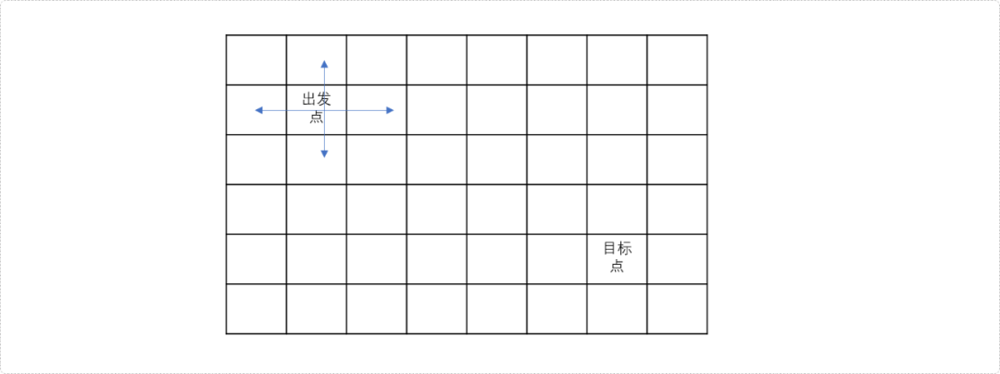

所以在搜索时，提供适当的指引，可以修正搜索一直朝最正确的方向进行，从而减少不必要的搜索。

那么如何设计指引方案，即如何设计启发式算法。

## **2. 启发式搜索**

原始搜索算法的本质是多状态的、且盲目的，启发式搜索就是在原始搜索算法基础之上提供一盏指引方向的灯，在多路口时，尽量朝目标路口前进。这盏灯在启发式搜索中称为**估价函数**。

**估价函数**

**估价函数**指的是为当前点到终点之间的所有状态做出一个估计值，代表选择不同状态时的要付出的代价。

如上图的迷宫问题。

- 如果从出发点的上方或左边方向搜索，离目标点越来越远。其估计值大于实际值（出发点到目标点的实际距离）。
- 如果从出发点的下方或右边方向搜索，离目标点会越来越近。其估计值会接近实际值。

如何对一个状态（选择）进行评估呢？

一个状态的当前代价最小，只能说明从初始状态到当前状态的代价最小，不代表总的代价最小，因为余下的路还很长，未来的代价有可能更高。因此评估需要考虑两部分：**当前代价和未来代价。**

评估函数`f(x)=g(x)+h(x)`，其中，`g(x)`表示从初始状态到当前状态`x`的代价，`h(x)`表示从当前状态到目标状态的估价，`h(x)`被称为启发函数。

**当前状态的代价是已知的，更多时候在意未来的路有多长，在估价函数的组成中，启发函数更具有指导性作用。**

**在设计估价函数时，需遵循一个基本原则：估计值必须比实际更优(估计代价<=实际代价)。**

如果估计值大于实际值，则在最优解搜索路径上的状态被错误指引，从而导致非最优解搜索路径上的状态不断扩展，直至在目标状态上产生错误的答案。如上述迷宫问题时，如果估计方向朝上，则会离目标越来越远。

如果估计值不大于实际值，这个值总会比最优解更早地被取出，从而得到修正。即使得不到最优解，无非就是算的状态多了，搜索时间长一些。

常用的启发式搜索算法有很多，如：

- `A*（A-Star）`算法，典型的启发式搜索算法。**是带有评估函数的优先队列式广度优先搜索算法；**是一种静态路网中求解最短路径最有效的直接搜索方法，也是解决许多搜索问题的有效算法。

  `A*`算法使用优先队列存储当前状态下可选择的所有后续状态，优先队列的优先策略由评估函数决定，即每次从优先队列中选择出估计值最少的状态。

  启发式函数的设计决定了`A*`算法的性能。

  启发函数`h(x)`越接近当前状态到目标状态的实际代价`h′(x)`，`A*`算法的效率就越高。

  启发函数的估值不能超过实际代价，即`h(x)≤h′(x)`。

  如果启发式函数的值为`0`，则变成普通的优先队列广度搜索。

- `IDA*`、模拟退火算法、蚁群算法、遗传算法等。

  `IDA*`算法是带有评估函数的迭代加深`DFS`算法。使用评估函数避免深度搜索无止境地向深处搜索，当到达一个阈值后，停止搜索，立即回溯。

**估价函数设计算法**

**无向图中：**

- 如果图形中只允许朝上下左右四个方向移动，则可以使用曼哈顿距离。

  曼哈顿距离公式=|x1-x2|+|y1-y2|

- 如果图形中允许朝八个方向移动，则可以使用对角距离。

  对角距离公式：

  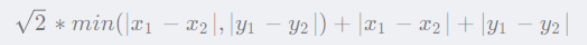

- 如果图形中允许朝任何方向移动，则可以使用欧几里得距离。

  欧几里得距离公式：

  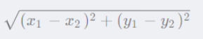

**有向图中一般对反向图求终点到源点的最短距离为启发函数。**

理论有了，现在开始实战。

### **2.1 `A*`算法**

**例题：第K短路**

给定一张 `N` 个点（编号 `1,2…N`），`M` 条边的有向图，求从起点 `S` 到终点 `T` 的第 `K` 短路的长度，路径允许重复经过点或边。

注意： 每条最短路中至少要包含一条边。

**输入格式**

第一行包含两个整数 `N` 和 `M`。

接下来 `M` 行，每行包含三个整数 `A,B` 和 `L`，表示点 `A` 与点 `B` 之间存在有向边，且边长为 `L`。

最后一行包含三个整数 `S,T` 和 `K`，分别表示起点 `S`，终点 `T` 和第 `K` 短路。

**输出格式**

输出占一行，包含一个整数，表示第 `K` 短路的长度，如果第 `K` 短路不存在，则输出 `−1`。

**问题分析**

**回顾迪杰斯特拉算法**

典型的单源最短路径问题。算法较多，性能较好的是迪杰斯特拉。但是本题是求第`k`短路径，是否可以使用此算法求解？

至于是否能否求解，暂且放一放。来回顾一下迪杰斯特拉算法的流程，且放大流程中的细节，看是否能找到一些解决问题的蛛丝马迹。

- 构建如下的图结构。如果`s=1、t=6`，即求解 `1-6`之间的最短路径。

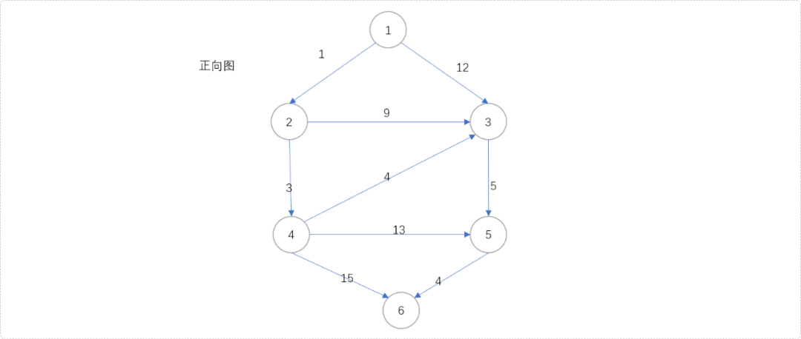

- 我这里直接使用迪杰斯特拉算法，不甚了解此算法的，可以翻阅相关文档。准备一个优先队列，用来存储节点，优先队列的策略以节点到源点的距离为参考；准备一个一张二维数组，用来存储当前节点到源点之间的最短距离。初始`dis[1][1]=0`。即源点到自身的最短距离为`0`。

  > **Tips：**熟悉迪杰斯特拉算法的可能要问，为什么要准备一张二维数组？不急，在讲解流程中慢慢揭晓。

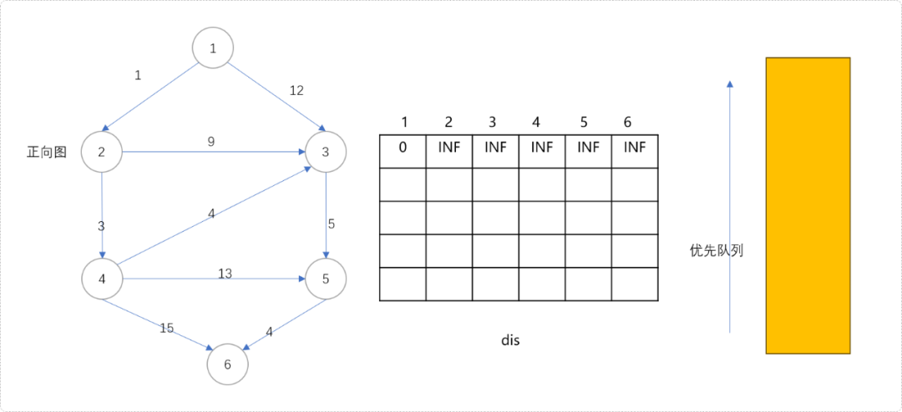

- 初始化队列。把源点`1`及其最短距离`0`组合成一个二无信息`(1,0)`一起入队列。

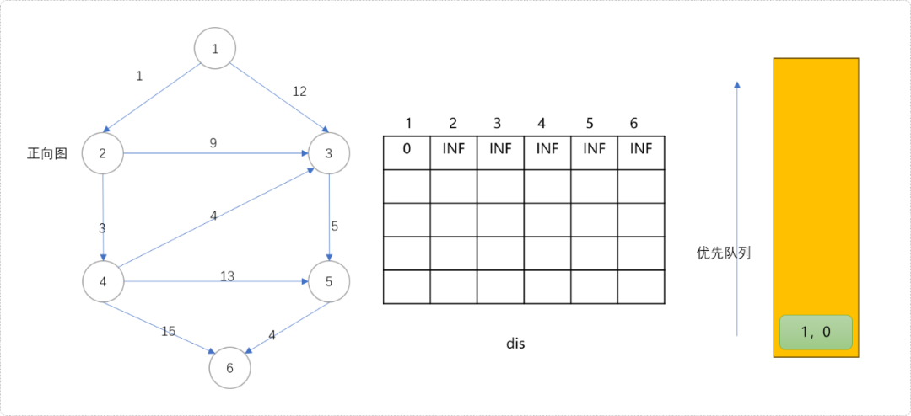

- 扩展队列，从队列中拿出头节点，扩展其子节点。扩展过程中更新子节点到源点的最短距离。节点`1`可以扩展节点`2`和`3`。因节点`2`和`3`原来到源点的距离是`INF`，现在分别被更新为`1`和`12`。这对于节点`2`和`3`来说，这是第一次更新（最短距离并不能一步到位）。

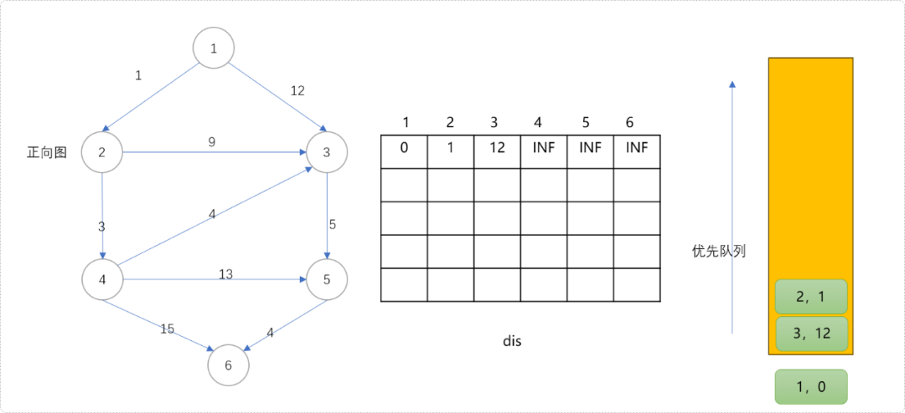

- 根据优先策略。从队列中拿出`(2,1)`节点。用此节点扩展`3`和`4`节点。节点`3`可以更新为更短距离`10`，这里节点`3`的第`2`次更新。节点`4`被更新为`4`，是此节点的第一次更新。如下图所示，相信大家明白了二维数组的作用，存储每一次更新的值。

  思考一下。每一次更新意味着什么？

  对！通过每一次更新，逐渐逼近最短距离，而每一次被更新的值，记录着次最短或说第`k`短距离。

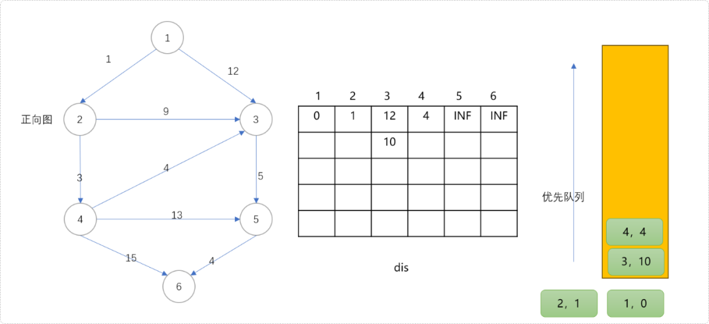

- 从队列中拿出`(4,4)`节点扩展其子节点。这里得到一个结论，当节点第一次从队列中拿出后，意味着最短距离已经找到。此时节点`3`更新为`8`，节点`5`更新为`17`，节点`6`更新为`19`。

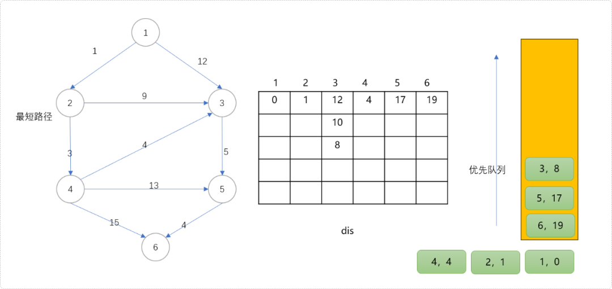

- 从队列中拿出`(3,8)`节点，意味着节点`3`到源点`1`的最短距离为`8`；次短距离为`10`，次次短距离为`12`。是不是惊讶到你了，那么是不是可以说，迪杰斯特拉算法不仅可以求解源点至任意点的最短距离，也可以求解出源点至任意点的第`K`短路径？

  从现在的情况来看，似乎可以这么认为，而事实是**这么说是有瑕疵的，但是至少能得到解决问题的一些线索。**

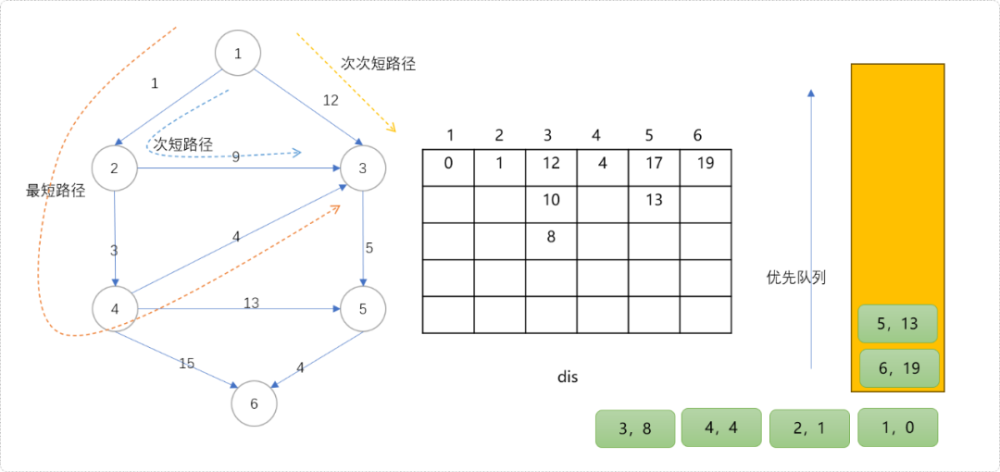

- 下图的二维数组中记录了任意点到源点的所有路径信息。

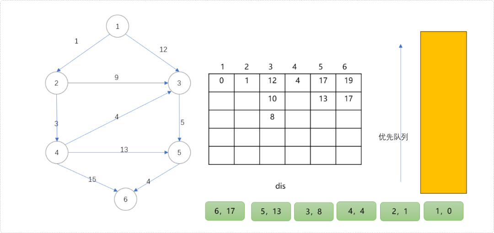

二维表上可以看出，源点至节点`3`有 `3` 条路径，直观而言，也只有`3`条路径。记录上看源点至节点`5`只有 `2` 条路径，而实际上不止。因为源点可以经过节点`3`到节点`5`，也就是说从源点到节点`5`至少有`3`条。

同理，源点也可以经过节点`4`到达节点`5`，至少有`1`条。粗算下来，源点到节点`5`至少应该有`4`条路径，距离分别为`17、15、13、17`。

**为什么二维数组中的记录节点`5`的路径只有`2`条？**

原因很简单，迪杰斯特拉算法每次试图做最优更新。如节点`5`当前值为`13`，当节点`3`值为`10`时，试图更新`5`号节点是不会成功的。也就得不到值为`15`的路径。

好了，借次机会详细介绍了迪杰斯特拉算法，仅使用此算法解决第`k`短路，不是说不行，感觉还是稍有些麻烦。分析到此结束，至于编码就看你的个人兴趣。

**A\*算法的实现流程**

回归正解，计解`A*`算法。

前文介绍过，`A*`算法是有带有估计函数的优先队列。估计函数包括两个子函数，一个是当前代价函数`g`和启发函数`h`。`f(x)=g(x)+h(x)`。

`g`函数计算当前点离源点的最小代价，`h`函数计算当前点离目标点的预估最小代价。在扩展子节点时，选择两者和最小的子节点扩展，或者说优先队列的优先策略。可以保证搜索过程的方向正确，避免少走不必要的路。

如下图，当选择节点`2`后，基于搜索的盲目性，即可以向节点`3`方向，也可以向节点`4`方向。选择那一条可以减少搜索量？

从`2`号到`3`号的`g`值很容易计算出，`1+9=10`。也就是从源点到节点`3`的当前代价是`10`。

从`2`号到`4`号的`g`值也容易计算出，`1+3=4`。也就是从源点到节点`4`的当前代价是`4`。

是不是理所当然的选择`4`号节点进行扩展，不能这么早下结论，也许当前的代价很少，但是未来的路很长。当前的最大化利益不能说明未来的利益也是最大化的。

可以用`3`号和`4`号节点到目标点`(即节点6)`的最短路径作为`h(x)`值。如此算出现在的当前代价和未来的代价之和，方可做为最佳启发值。道理很简单，知道当前代价，也知道未来代码，两者之和，一定是到达目标点的最小代价。

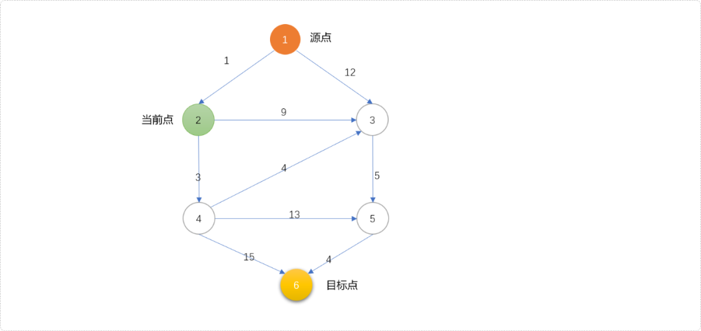

如果能计算出图中的节点到目标点的最短距离，便能得到任一点到目标点的`h(x)`值。这个实现简单，把原图进行反向，以目标点为源点，走一次迪杰斯特拉算法，便能计算出任意点到目标点的最短距离，用此值作为任意点到目标点的`h(x)`值。

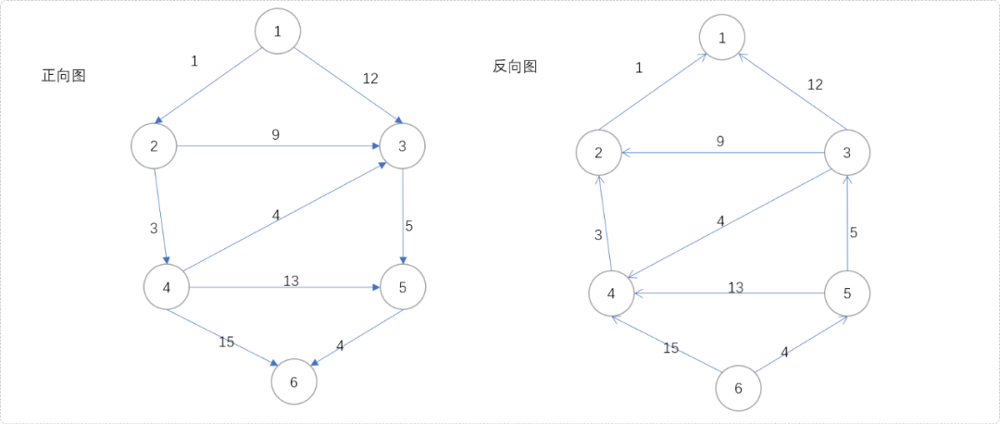

现在，让我们得到反向图中各节点到目标点之间的最短距离。

```cpp
#include <bits/stdc++.h>
#define MAX 300000 + 50
#define INF 0x3f3f3f3f
using namespace std;

/*
*顶点类型
*/
struct Ver {
 //编号
 int vid;
 //离终点的最短距离
 int toDis=INF;
 //离源点的最短距离
 int fromDis=INF;
 //正向图头指针
 int head=0;
 //反向图头指针
 int rhead=0;

 const bool operator<(const Ver & ver) const {
  return this->toDis>ver.toDis;
 }

} vers[MAX];
//顶点和边数
int n,m;
//边类型
struct Edge {
 //邻接点
 int to;
 //下一个边
 int nex;
 //权重值
 int val;
}  edges[MAX];

//边索引
int tot=0;

//添加边
void addEdge(int type,int f, int t, int w) {
 edges[++tot].to = t;
 edges[tot].val = w;
 if(type==0) {
        //正向边
  edges[tot].nex = vers[f].head;
  vers[f].head= tot;
 } else {
        //反向边
  edges[tot].nex = vers[f].rhead;
  vers[f].rhead= tot;
 }
}

//构建正向图和反向图
void buildGraph() {
 for( int i=1; i<=n; i++ )vers[i].vid=i;
 int f,t,w;
 for(int i = 1; i <= m; ++i) {
  cin >> f >> t >> w;
  addEdge(0,f,t,w);
  addEdge(1,t,f,w);
 }
}
/*
*
*对原图的反图求各节点到目标节点的最短距离
*/
void dijkstra(int s) {
 //优先队列
 priority_queue<Ver>  priQue;
 vers[s].toDis=0;
 //初如化队列
 priQue.push( vers[s] );
 while( !priQue.empty()  ) {
  //取头顶点
  Ver u=priQue.top();
  //删除头顶点
  priQue.pop();
  //扩展子节点
  for( int i=u.rhead; i!=0; i=edges[i].nex ) {
   Ver v=vers[  edges[i].to ];
   if( v.toDis> edges[i].val+u.toDis  ) {
    //更新
    v.toDis= edges[i].val+u.toDis;
    vers[ edges[i].to ]=v;
    priQue.push(v);
   }
  }
 }
}
void show() {
 for(int i=1; i<=n; i++) {
  cout<<vers[i].vid<<"\t"<<vers[i].toDis<<endl;
 }
}

int main() {
 cin>>n>>m;
 buildGraph();
 dijkstra(6);
 show();
 return 0;
}
```

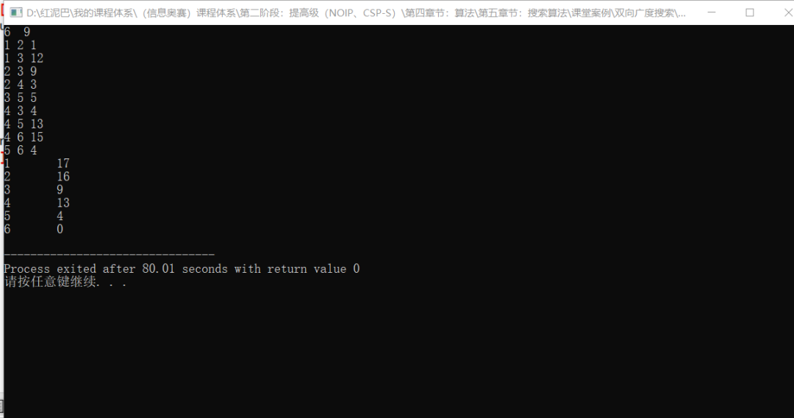

根据计算结果，可知节点`3`的`g(3)+h(3)=10+9=19`；节点`4`的`g(4)+h(4)=4+13=17`。显然，选择节点`4`更接近目标点。

知道了优先策略以及计算方式。下面具体演示，看如何得到最终结果。

- 准备好优先队列。用**节点、节点离源点距离、节点离目标点的距离**三元素构建一个三元信息组，存入队列。初始存入节点`1`的三元信息`(1,0,0)`。

  > **Tips：** 如果节点`1`到节点`6`的最短距离为`INF`，则表示两者之间没有路径。

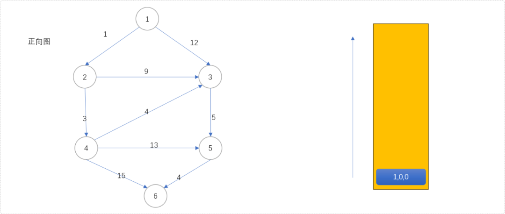

- `(1,0,0)`出队列，扩展`2、3号`节点，分别计算`2、3`号节点的三元组信息`(2,1,16)、(3,12,9)`且压入队列。

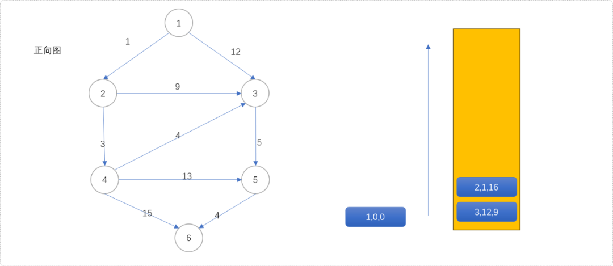

- 根据优先策略，`(2,1,16)`第一次出队列，其值`1+16=17`即为源点经过节点`2`到目标点的最短距离，扩展`(3,10,9)`和`(4,4,13)`。

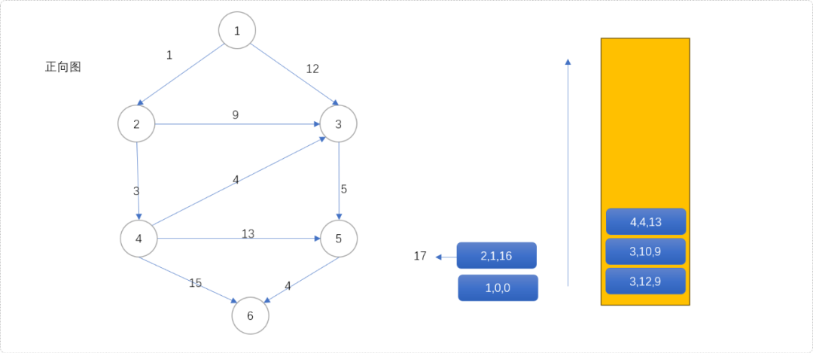

- `(4,4,13)`出队列，得到源点经过`4`到达目标点的最短距离为`17`。扩展`(3,8,9)、(5,17,4)、(6,19,0)`。从下图可知，节点`3`会入队列三次。因为节点`3`有三个入度，意味着有三个节点可以经过它进入下一个位置，即有三次扩展机会。

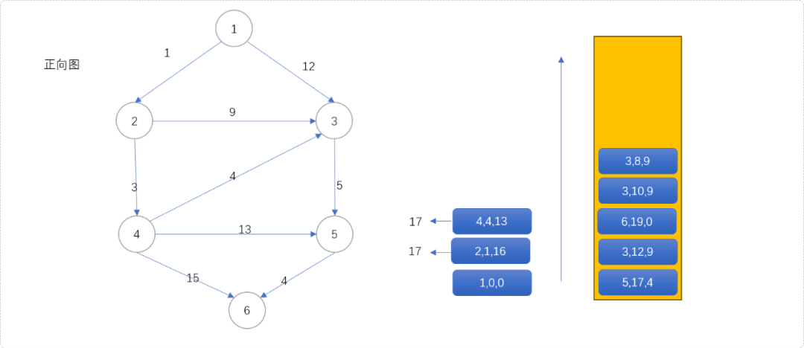

- `(3,8,9)`第一次出队列，意味着源点经过`3`号节点到达目标点的最短距离为`17`。原因很简单，根据队列的优先策略，只有当`g(x)+h(x)`值最小时，才有机会出队列，而这两个值，一个表示离源点最优值，一个是表示离目标点的最优值，两者之和一定是源点经过此点到达目标点的最优值。此时，扩展`(5,13,4)`入队列。

  观察可得，节点`3`会出队列三次，同时扩展节点`5`进入三次队列，这样，不会漏掉任何一条路径。在迪杰斯特拉算法中，如果节点`3`当前值为`15`，扩展后的值为`17`，是不会再入队列的，迪杰斯特拉算法中存储的永远是比上一次更优的值。

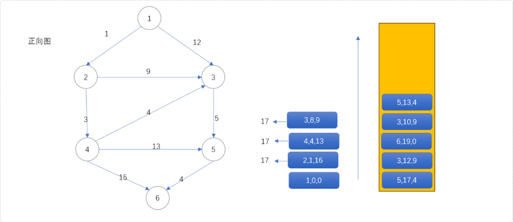

- `(5,13,4)`第一次出队列，得到源点经过`5`到达目标点的最短距离是`17`。同时扩展`(6,17,0)`入队列。

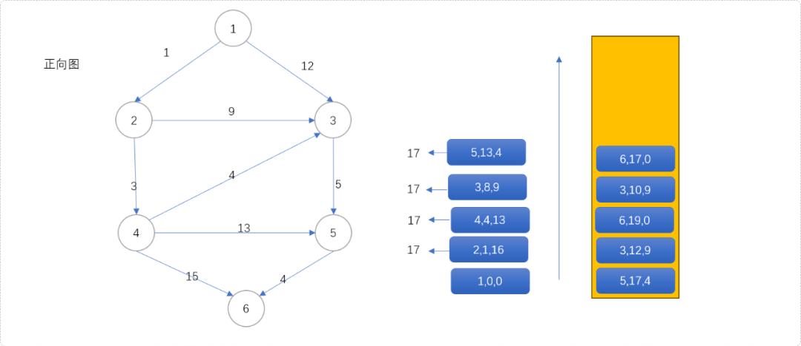

- `(6,17,0)`第一次出队列，源点到目标点的最短距离为`17`。

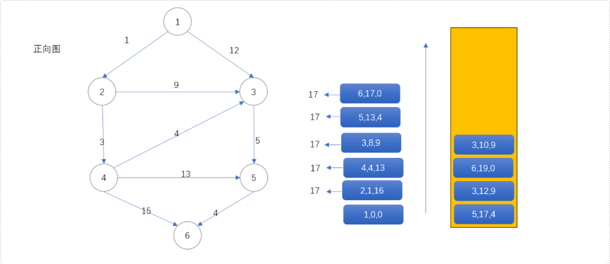

- `(3,10,9)`第二次出队列，则得到源点经过`3`到达目标点的**次短距离**为`19`。

  `(6,19,0)`第二次出队列时，得到源点到目标点次最短距离为`19`，其实和前分析迪杰斯特拉算法的更新信息是一致的。只是迪杰斯特拉算法会漏掉一些路径，`A*`算法不会。

  如下图是当整个算法结束后得到的出队结果，可以看到节点`5`入了4次队列，出了`4`次队列。说明源点经过节点`5`到少有4条不同路径到达目标点。分别是`1->3->5->6`、`1->2->3->5->6`、`1->2->4->3->5->6`、`1->2->4->5->6`。

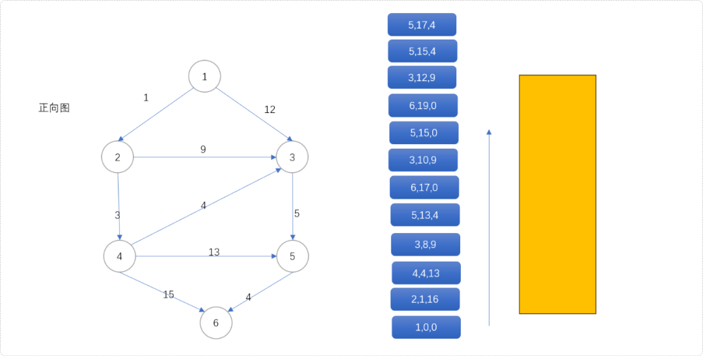

通过上述分析，可以得到一个结论：

**当目标节点从队列中第`i`次出队时，就是离源点的第`i`次最短距离。**

完整代码如下所示：

```cpp
#include <bits/stdc++.h>
#define MAX 300000 + 50
#define INF 0x3f3f3f3f
using namespace std;

/*
*顶点类型
*/
struct Ver {
 //编号
 int vid;
 //离终点的最短距离
 int toDis=INF;
 //离源点的最短距离
 int fromDis=INF;
 //正向图头指针
 int head=0;
 //反向图头指针
 int rhead=0;

 const bool operator<(const Ver & ver) const {
  return this->toDis>ver.toDis;
 }

} vers[MAX];
//顶点和边数
int n,m;
//边类型
struct Edge {
 //邻接点
 int to;
 //下一个边
 int nex;
 //权重值
 int val;
}  edges[MAX];

//边索引
int tot=0;

//添加正向边
void addEdge(int type,int f, int t, int w) {
 edges[++tot].to = t;
 edges[tot].val = w;
 if(type==0) {
  edges[tot].nex = vers[f].head;
  vers[f].head= tot;
 } else {
  edges[tot].nex = vers[f].rhead;
  vers[f].rhead= tot;
 }
}

//构建图
void buildGraph() {
 for( int i=1; i<=n; i++ )vers[i].vid=i;
 int f,t,w;
 for(int i = 1; i <= m; ++i) {
  cin >> f >> t >> w;
  addEdge(0,f,t,w);
  addEdge(1,t,f,w);
 }
}

/*
*
*对原图的反图求各节点到目标节点的最短距离
*/
void dijkstra(int s) {
 //优先队列
 priority_queue<Ver>  priQue;
 vers[s].toDis=0;
 //初如化队列
 priQue.push( vers[s] );
 while( !priQue.empty()  ) {
  //取头顶点
  Ver u=priQue.top();
  //删除头顶点
  priQue.pop();
  //扩展子节点
  for( int i=u.rhead; i!=0; i=edges[i].nex ) {
   Ver v=vers[  edges[i].to ];
   if( v.toDis> edges[i].val+u.toDis  ) {
    //更新
    v.toDis= edges[i].val+u.toDis;
    vers[  edges[i].to ]=v;
    priQue.push(v);
   }
  }
 }
}

template<typename T>
struct Cmp {
 bool operator()(T & ver1,T & ver2) {
  return ver1.fromDis+ver1.toDis>ver2.fromDis+ver2.toDis;
 }
};

//A* 算法
int nums[MAX]= {0};
int astar(int s,int e,int k) {
 //对反向图求最短距离 
 dijkstra(e);
 //初始化计时器 
 if(vers[s].toDis==INF)return -1;
 for(int i=1; i<=n; i++)nums[i]=0;
 priority_queue<Ver,vector<Ver>,Cmp<Ver>> myq;
 //初始化队列
 vers[s].fromDis=0;
 vers[s].toDis=0;
 myq.push(vers[s]);
 while( !myq.empty() ) {
  //出队列
  Ver u=myq.top();
  myq.pop();
  //计算节点出队列的次数
  nums[u.vid]++;
  //如果次数和k值相同，且当前出队列节点是目标节点 
  if( nums[u.vid]==k && u.vid==e ) {
   //找到答案 
   return u.fromDis+u.toDis;
  }
  //如果计数器值大于K 
  if( nums[u.vid]>k )continue;
  //扩展子节点
  for( int i=u.head; i!=0; i=edges[i].nex ) {
   Ver v=vers[  edges[i].to ];
   v.fromDis=edges[i].val+u.fromDis;
   vers[  edges[i].to ]=v;
   myq.push(v);
  }
 }
 return -1;
}

void show() {
 for(int i=1; i<=n; i++) {
  cout<<vers[i].vid<<"\t"<<vers[i].toDis<<endl;
 }
}

int main() {
 cin>>n>>m;
 buildGraph();
 int res= astar(1,6,3);
 cout<<res;
// show();
 return 0;
}
```

## **3. 总结**

本文讲解有向图如何使用`A*`算法。记住，当选择很多时，预估出每一个选择要付出的代价，可以减少不必要的损失。人生如此，代码如此。


