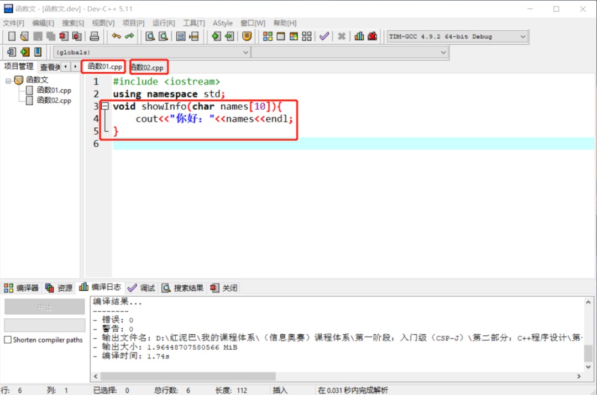
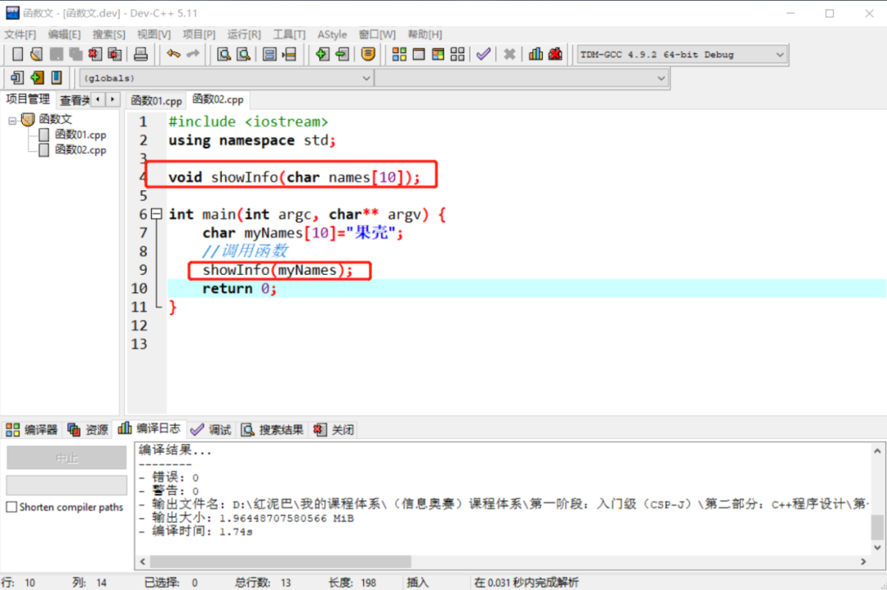
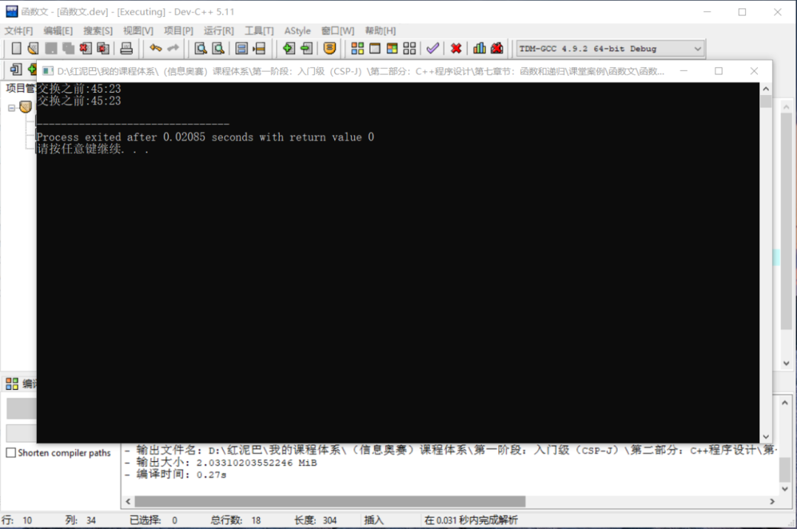
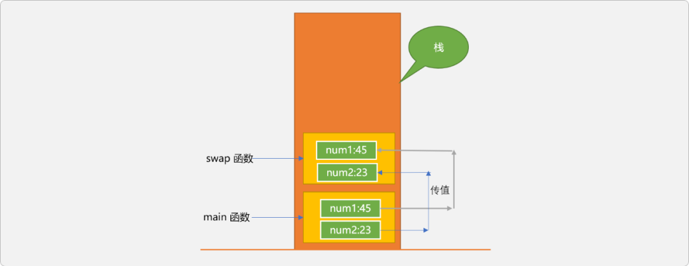
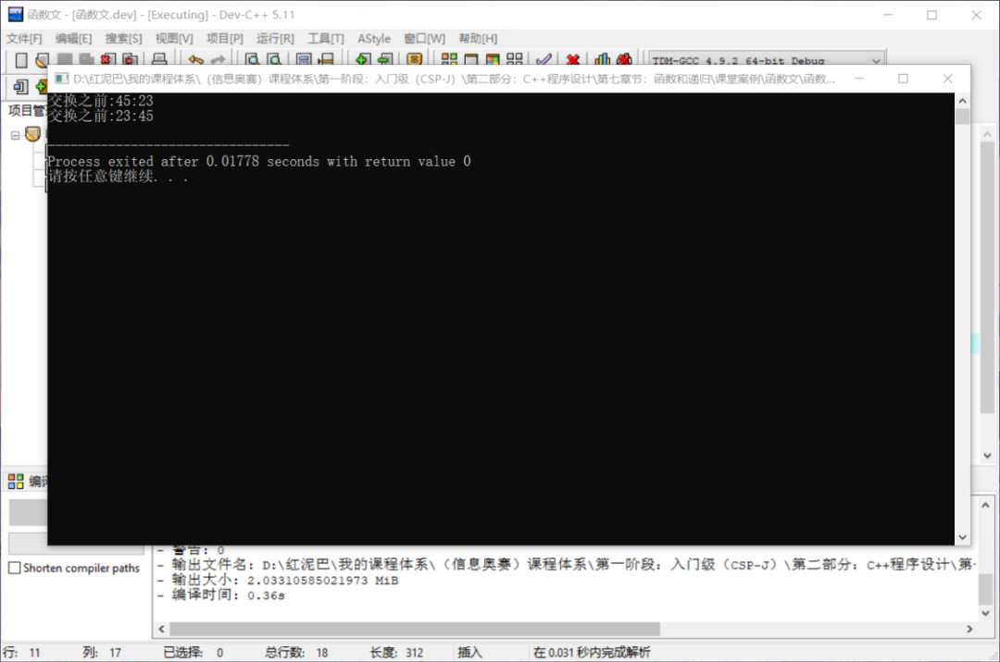
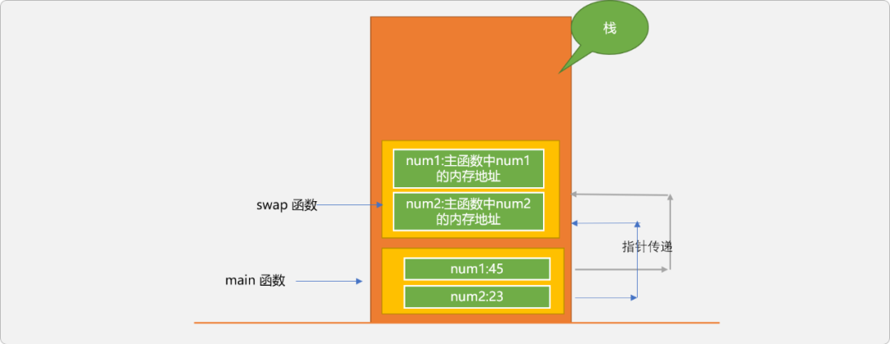
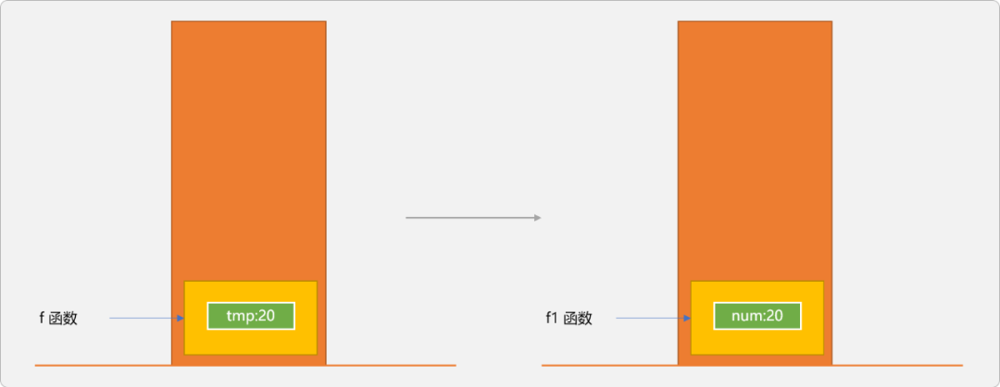
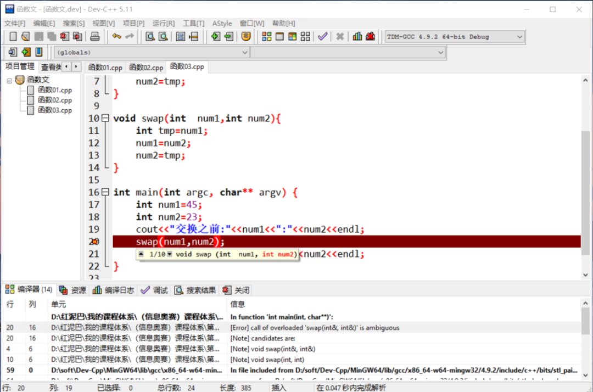
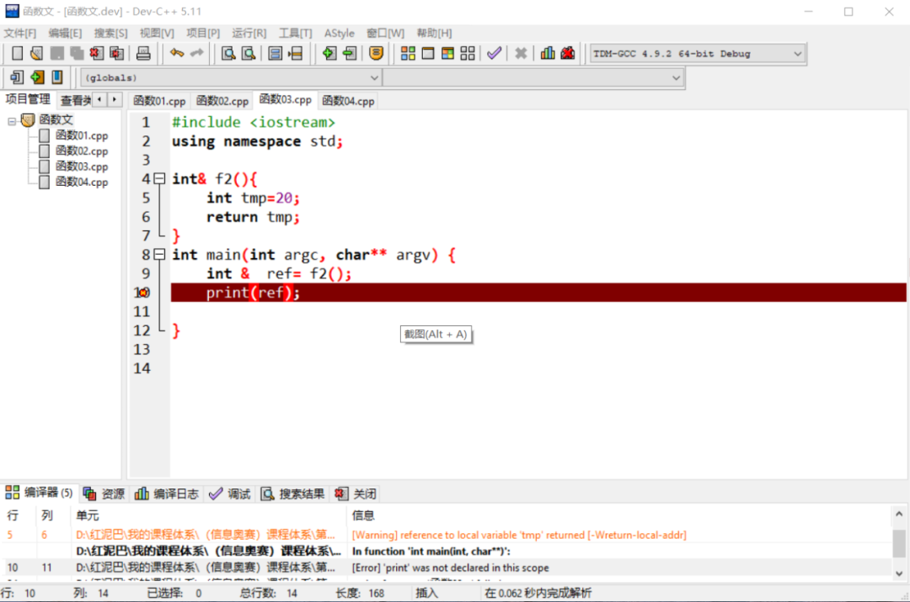
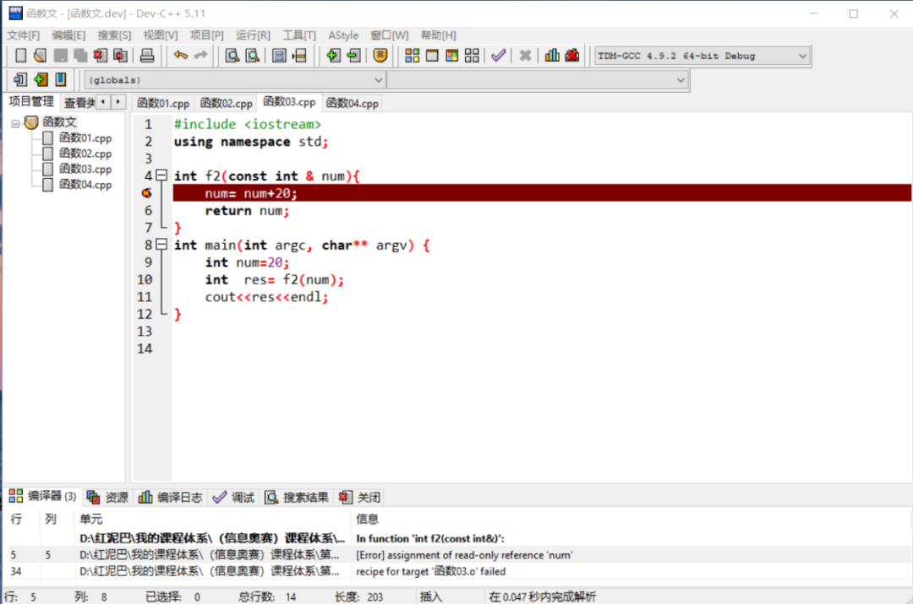

# C++ 练气期之解构函数


## 1. 函数

一个`C++`程序中，总是需要包含若干个`函数`，可以说`函数`是`C++`程序的基础组成元件，是程序中的头等公民。

如果要理解程序中使用`函数`的具体意义，则需要了解语言发展过程中致力要解决的 `2` 问题：

- 一是完善语言的内置功能库（`API`），让开发者不为通用功能所干扰。
- 另就是通过特定的代码组织方案提升代码的可伸缩性、可维护性、可复用性以及安全性。

随着项目规模的增大，分离代码，重构整体结构尤为重要。

函数的出现，从某种意义上讲，其首要任务便是分离主函数中的代码，通过构建有层次性的代码，从而提升程序的健壮性。当然，通过函数分离代码是有准则的，其准则便是以重用逻辑为核心。

> 分离是一个大前提，有了这个大前提，便是分离的方案。如函数设计理念、类设计理念、微服务设计理念……都是分离的思路。只是各自面对的是不同规模的项目。

### 1.1 **使用函数**

`C++`中使用函数分 `2` 步：

- **定义函数**：定义过程强调函数功能的实现。定义函数时，`C++`底层运行时系统并不会为函数中的变量分配空间。
- **调用函数**：调用函数也就是使用函数提供的功能。此期间运行时系统才会为函数中的变量分配空间。

`C++`对`定义`和`调用` 这 `2` 个过程有顺序要求，也就是必须先义再调用。

```cpp
#include <iostream>
using namespace std;
/*
* 定义函数：
* 侧重设计理念：此函数的功能是什么？或者说，通过使用此函数能获取到什么样的帮助 
* 如下设计一个显示个体信息的函数
* 当然在设计过程时，需遵循函数的语法要求   
*/ 
void showInfo(char names[10]){
 cout<<"你好："<<names<<endl; 
}

int main(int argc, char** argv) {
 char myNames[10]="果壳"; 
    //调用时，函数中的代码方被激活
 showInfo(myNames); 
 return 0;
}
```

如上代码，当在`main`函数中调用`showInfo`函数时，`showInfo`需要在主函数之前定义，否则编译器会抛出错误。

如果非要把函数的定义放在调用语法之后，也不是不可以。可通过把函数的设计过程再分拆成 `2` 个步骤实施：

- **声明函数原型**：函数原型只包含函数的基础说明信息，并不包含函数功能体。通过原型声明，提前告诉编译器，此函数是存在的。
- **函数功能定义**：功能实现。

如下所示：

```cpp
#include <iostream>
using namespace std;
//声明函数原型
void showInfo(char names[10]);
int main(int argc, char** argv) {
 char myNames[10]="果壳"; 
 //调用函数 
 showInfo(myNames); 
 return 0;
}
//函数定义可以放在函数调用之后
void showInfo(char names[10]){
 cout<<"你好："<<names<<endl; 
}
```

### 1.2 函数的作用域

函数和变量的区别：

- 变量中存储的是数据。变量的存储位置可能是在栈中（`stack area`）、堆中(`heap area`)或全局数据区域（`data area`）。
- 函数存储的是逻辑代码。函数的存储位置是在代码区(`code area`)。

函数的作用域与变量的作用域不同，变量因声明位置和存储位置不同，其作用域则会有多种情况。而函数只可能存储存在代码区，`C++`不允许函数嵌套定义，且只能在文件中声明和定义。从某种意义上讲，函数只有全局概念，而无局部概念。

> 本文是从广义角度讨论函数，并不涉及类中函数的作用域问题。因类可以对函数进一步封装，可以限制函数的使用范围。

意味着一个函数被定义后，此函数除了能在定义它的文件中使用外，在其它文件中同样能使用。如下在`函数01.cpp`文件中有 `showInfo`函数。




此函数可以在`函数02.cpp`中使用，但是需要有提前声明语句。




### 1.3 函数的基础特性

以`函数`为基础单元组织程序代码的方案，称为面向过程编程。面向过程指通过复用、严格规定函数的调用流程达到精简代码的目的。但面向过程是`轻数据，重逻辑`的。会导致各种不同语义的数据混乱在一起。

其原罪在于函数设计时的基本思想：

- 不在意数据来源、不区分数据具体语义。仅站在逻辑角度对代码进行重构。
- 并没有提出数据维护概念，这些因素导致程序中的数据分散在每一个角落，正因这种缺陷的存在，有了引入类管理机制的动机。

如下调用函数时，传递给函数的无论是一名学生或一只小狗的姓名，函数都能正常显示，函数本身并不对数据语义加以区分。函数把数据和逻辑是彻底分开，一个函数并不刻意关联某种语义的数据。

```cpp
int main(int argc, char** argv) {
 //显示学生信息 
 char names[10]="张三";
 showInfo(names);
 //显示小狗的信息 
 char dogNames[10]="小花" ;
 showInfo(dogNames); 
 return 0;
}
```

## 2. 函数中的参数

`C++`中给函数传递参数有 `3` 种方案。

### 2.1 值传递

如下定义了一个交换 `2` 个变量中数据的函数。

```cpp
#include <iostream>
using namespace std;
//交换函数
void swap(int num1,int num2){
 int tmp=num1;
 num1=num2;
 num2=tmp;
} 
int main(int argc, char** argv) {
 int num1=45;
 int num2=23;
 cout<<"交换之前:"<<num1<<":"<<num2<<endl; 
 swap(num1,num2);
 cout<<"交换之前:"<<num1<<":"<<num2<<endl; 
}
```

在主函数中调用`swap`函数时，参数传递采用值传递方案。执行程序后，主函数中的 `2` 个变量的值没有得到交换。




为什么没有交换成功？得先从值传递的特点说起：

- 在调用函数时，通过把数据（值）从一个变量复制到另一个变量的方式完成数据传输。当数据量较大时，对性能会有影响。
- 函数中对形参变量中数据的修改并不会影响到调用处实参变量中数据的变化 。

调用函数时，底层运行时系统会给函数在栈中分配一个运行空间，此空间称为栈帧。栈帧与栈帧之间是隔离的。如下图所示：




`swap`函数和`main`有各自的栈帧，`main`把自己的数据复制一份后交给`swap` 函数，`swap`的逻辑操作的是自己内部变量中的数据

### 2.2 传递指针

对于上述代码，能否做到通过调用`swap`函数达到交换主函数中变量的效果？

可以通过传递指针的方案，传递指针的特点：

- 调用函数时，传递变量在内存中的地址（指针），相当于把进入变量的钥匙传递过去。
- 函数中进行数据操作时，通过指针直接对原调用处变量中的数据进行修改。
- 通过传递指针可以实现函数之间数据的共享（长臂管辖）。

传递指针的优点：

- 通过减少数据的传输提升函数调用的性能。
- 适合于需要直接修改调用处数据的场合。

传递指针的缺点：

- 打破函数的封装性，让函数可以访问函数之外（另一个函数）中的变量。
- 因指针底层的复杂性。存在理解上的壁垒和操作上的易出错性。

```cpp
#include <iostream>
using namespace std;
//指针类型做为形参
void swap(int* num1,int* num2){
 int tmp=*num1;
 *num1=*num2;
 *num2=tmp;
}
 
int main(int argc, char** argv) {
 int num1=45;
 int num2=23;
 cout<<"交换之前:"<<num1<<":"<<num2<<endl; 
    //传递变量的地址（指针）
 swap(&num1,&num2);
 cout<<"交换之前:"<<num1<<":"<<num2<<endl; 
}
```




下面通过图示解释指针传递的过程。




主函数中的`num1`和`num2`保存的是具体的数据：`45`和`23`。是`int`数据类型。

`swap`函数中的`num1`和`num2`的类型是指针类型，分别存储了主函数中`num1`和`num2`的内存地址，或者说是拥有造访主函数中`num1`和`num2`变量的另一种途径。

> 本质上讲，变量名和变量的地址是`C++`提供的 `2` 种访问变量的方案。
>
> 变量名访问可认为是间接访问，指针访问可认为是直接访问。
>
> 理论上讲，指针访问要快于变量名访问。

指针是一类数据，除了可以作为函数的参数，也可以作为函数的返回值。但在使用时，请注意如下的问题。

```cpp
#include <iostream>
using namespace std;
//函数返回指针类型 
int * f(){
 int tmp=20;
 return &tmp;
} 
int ma3222in(int argc, char** argv) { 
 int* p=f();
 cout<<*p<<endl;
}
```

如上代码，调用 `f`函数时，返回 `f` 函数中 `tmp` 的地址。因 `tmp`是局部变量，其作用域只在函数内部有效，通过指针绕开了编译器检查。虽然能得到结果是 `20`，但务必不要这么使用。运行时系统也会显示警告。

```cpp
[Warning] address of local variable 'tmp' returned [-Wreturn-local-addr]
```

如下代码，可能就得不到函数调用后想要的结果：

```cpp
#include <iostream>
using namespace std; 
int * f(){
 int tmp=20;
 return &tmp;
} 
int f1(){
 int num=50;
 return num;
}
int main(int argc, char** argv) { 
 int* p=f();
 f1();
 cout<<*p<<endl;
}
```

如上输出结果是 `50`，而不是 `20`。原因是 `f`函数执行完毕后，其空间被回收，且分配给 `f1`继续使用，这时`p`所指向位置的数据是 `f1`执行后的结果。




所以，切记不要返回局部变量的地址。

### 2.3 引用传递

除了通过传递指针，`C++`还有一个传递引用的方案，同样可实现传递指针所能达到的效果。

使用指针有很多优势，也有明显的缺陷，指针有自己的内存空间，会给理解指针以及运用指针带来了难度。`引用`是`C++`的新概念，能提供指针能实现的效果，但比指针更轻量级。

引用和指针的区别：

- 引用是变量的别名，相当于给变量另起了一个名字，引用和变量名一样是标识符，在内存中没有实体存在。指针是一种类型，有自己的内存空间。
- 指针可以不赋值，而引用必须为其指定其引用的变量（必须初始化）。有空指针概念，没有空引用概念。
- 有多级指针的概念，而不存在多引用的概念，不能给一个引用再命名一个引用。

引用和指针一样，都会打破函数的封装性。如下代码，使用引用作为函数的参数。

```cpp
#include <iostream>
using namespace std;
//引用做为形参
void swap(int&  num1,int& num2){
 int tmp=num1;
 num1=num2;
 num2=tmp;
}
 
int main(int argc, char** argv) {
 int num1=45;
 int num2=23;
 cout<<"交换之前:"<<num1<<":"<<num2<<endl; 
    //调用时
 swap(num1,num2);
 cout<<"交换之前:"<<num1<<":"<<num2<<endl; 
}
```

调用时，和值传递是一样的，所以，在没有看到函数原型时，具体是引用、还是值传递会让人误判。

有一点要注意，引用不是数据类型，所以，下面的代码是有错误的。

```cpp
#include <iostream>
using namespace std;
void swap(int&  num1,int& num2){
 int tmp=num1;
 num1=num2;
 num2=tmp;
}
void swap(int  num1,int num2){
 int tmp=num1;
 num1=num2;
 num2=tmp;
}
 
int main(int argc, char** argv) {
 int num1=45;
 int num2=23;
 cout<<"交换之前:"<<num1<<":"<<num2<<endl; 
 swap(num1,num2);
 cout<<"交换之前:"<<num1<<":"<<num2<<endl; 
}
```

对于编译器而讲，认为这 `2` 个函数是一样的，不会当成函数重载。




可以使用引用作为函数的返回值。

当使用引用作为返回值时，是不能返回局部变量，引用必须是建立变量存在的基础之上。变量都不存在，给它起一个别名，是没有任何实际意义的。

```cpp
#include <iostream>
using namespace std;
//返回变量的引用
int& f2(){
 int tmp=20;
 return tmp;
}
int main(int argc, char** argv) {
    //引用失败，函数执行完毕后，其局部变量也回收
 int &  ref= f2();
 print(ref);
}
```




如果不希望函数内部修改引用所指向的变量中的值，可以使用 `const`限定引用。如下代码会提示，不能通过引用修改变量。




## 3. 函数指针

使用函数名调用函数，是常规调用方式。函数存储在代码区，也有其内存地址，函数名存储的就是函数在内存中的地址，也就是函数的指针。

```cpp
#include <iostream>
using namespace std;
int f1(int a){
 return a+1;
}
int main(int argc, char** argv) {
    //f1 中存储是函数地址
    cout<<f1<<endl;
    // f1()才是调用函数
    cout<<f1(7)<<endl;
 return 0;
}
```

所以，如上主函数中的两行代码本质上是不同的。

- `f1`中存储的是函数指针。
- `f1()`表示通过 `f1`找到函数在内存的位置，并执行其代码。

可以声明一个函数指针变量，用来存储函数的内存地址。

```cpp
#include <iostream>
using namespace std;

int f1(int a) {
 return a+1;
}

int main(int argc, char** argv) {
 //函数指针变量
 int (* f)(int);
    //存储函数地址
 f=f1;
    //通过函数指针调用函数
 cout<<f(10)<<endl;
    // f(10)和(*f)(10)是两种合法的调用方式
    cout<<(*f)(10)<<endl;
 return 0;
}
```

以上代码如果只用于普通函数调用，意义并不大。函数指针的意义可以让函数作为参数、作为函数的返回值。可以认为函数在`C++`是一类特殊类型，可以如数据一样进行传递。

### 3.1 函数作为参数

如下代码，让一个函数作为另一个函数的参数。

```cpp
#include <iostream>
using namespace std;
//f1 有 3 个参数，一个是函数指针，2 个int 类型
int f1(int (*f)(int ,int), int a,int b) {
    int res= f(a,b);
    return res;
}

int f2(int a,int b){
 return a+b;
}

int main(int argc, char** argv) {
    int num1=10;
    int num2=20;
    //把 f2 作为 f1 的参数
    int res= f1(f2,num1,num2);
 cout<<res<<endl;
 return 0;
}
```

输出结果：`30`。

### 3.2 函数作为返回值

把函数作为另一函数的返回类型，需要提前使用 `typedef`定义函数类型 。

```cpp
#include <iostream>
using namespace std;

int f2(int a,int b){
 return a+b;
}
//定义函数类型
typedef int (*ftype)(int ,int);
//返回函数类型
ftype f3(){
 return f2;
}

int main(int argc, char** argv) {
    int num1=10;
    int num2=20;
    int (*f)(int ,int);
    f= f3();
 cout<<f(num1,num2)<<endl;
 return 0;
}
```

输出结果：`30`。

## 4. 总结

本文主要讲解函数的参数传递问题和函数指针。

参数传递有 3 种方案：

- 值传递。
- 指针传递。
- 引用传递。

只要涉及到内存存储，就会有地址一说，函数指针指函数在内存中的存储位置，`C++`允许开发者使用函数指针传递函数，这是非常了不起的特性。

