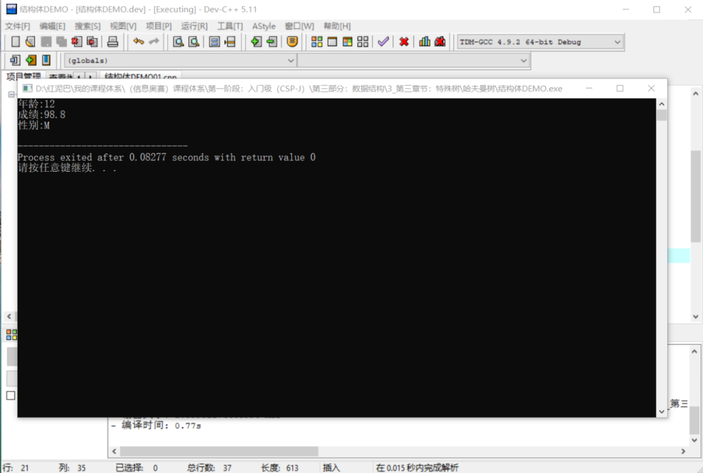
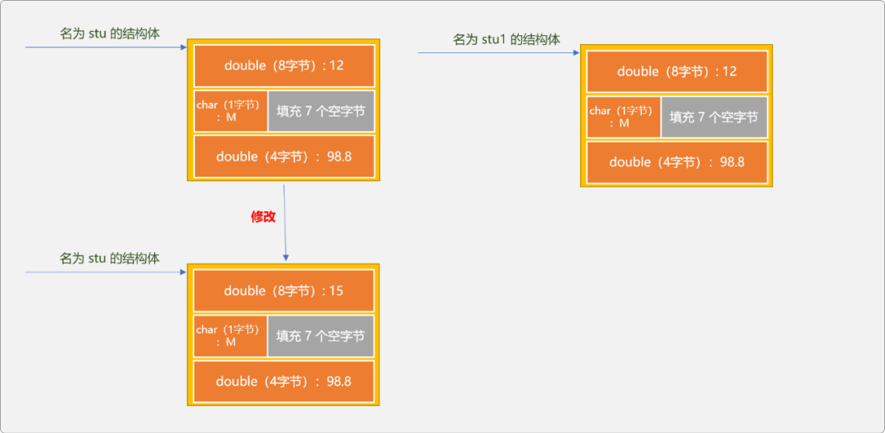
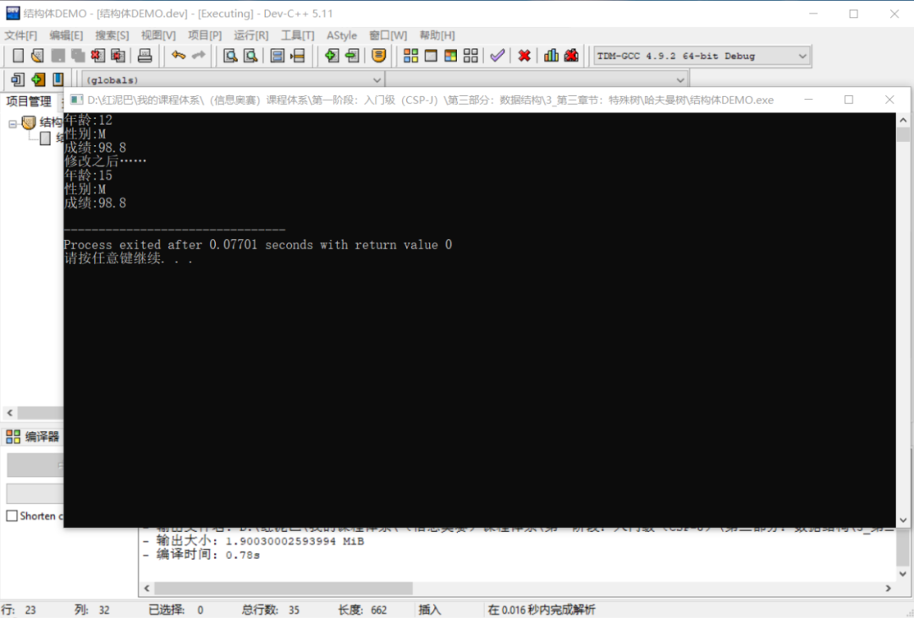
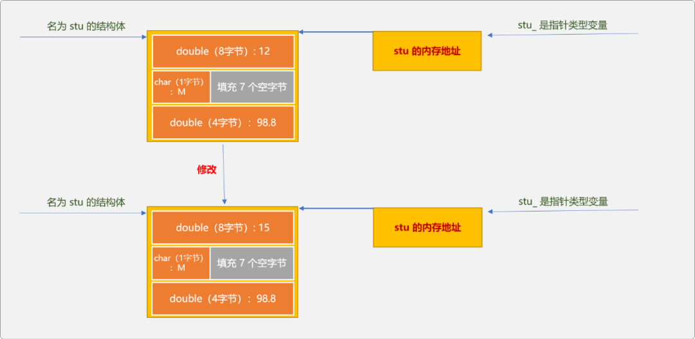
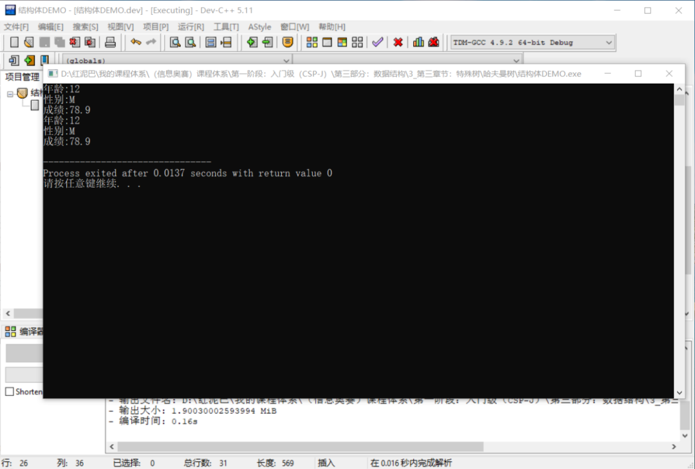
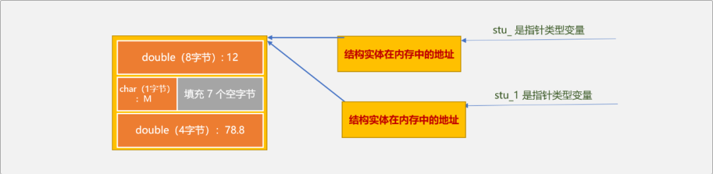
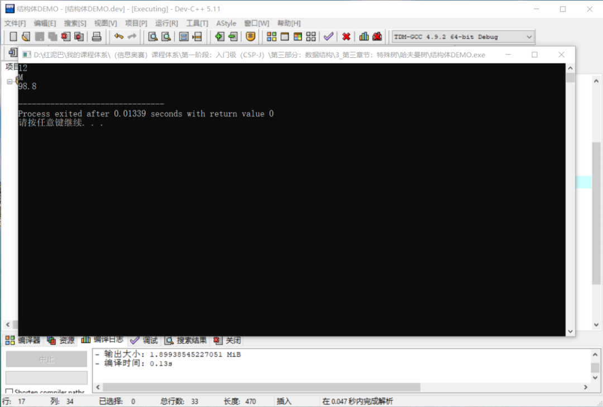
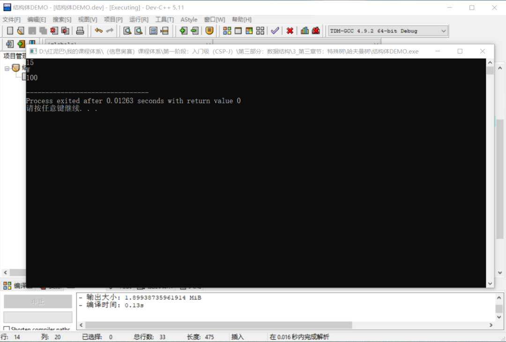
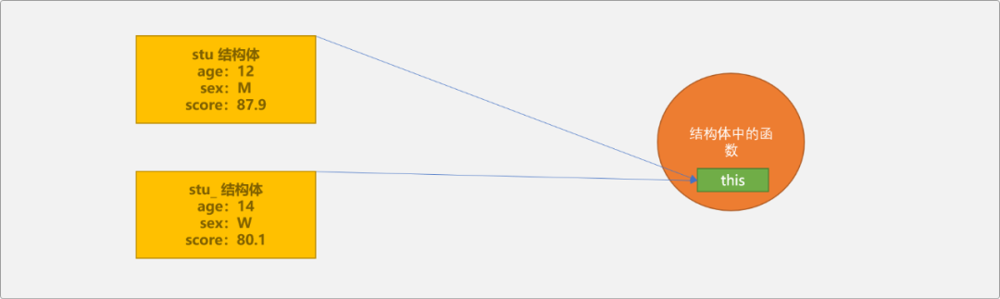

# C++ 炼气期之结构体


## 1. 前言

`计算机`早期以`数值`计算为主，强调的是`计算`。

随着`计算机`向着不同领域的延伸，`数据`的概念已经不仅局限于数值型数据，计算机需要处理大量的非数值类型数据。如在企业级程序的开发过程中所涉及到的`工作流`信息，几乎都是`非数值型数据`。

为了能抽象地描述这些非数值类型的数据，`C++`引入了复合数据类型的概念。

`C++`数据类型分基本（原生）`数据类型`和`复合数据类型`，`结构体`就是一种复合数据类型。可认为`复合数据类型`是通过组合基本数据类型得到的一种`新类型`，`新类型`用来描述问题域中的特定数据。

本文所用到的`分量`一词指的是复合数据类型中的某一个子类型。

## 2. 结构体

现有一个开发学生`管理系统`的需求，系统需要一个`学生信息`管理模块，包含`添加`、`删除`、`更新……`学生信息功能。解决这个问题之前，则需要考虑如何存储学生的个人信息以及一个学校的所有学生信息。

学生的个人信息包含学生的`年龄`、`性别`、`成绩……`

如果仅存储一个学生信息，这个问题很好解决，定义 `3` 个变量即可。

如果需要存储全校学生信息，可以考虑使用`数组`，因受限于数组只能存储同类型数据的特点。为了完成这个需求，则需要 `3` 个数组，一个用来存储`年龄`、一个用来存储`性别`一个用来存储`成绩`。显然，在编码时，需要随时随地同步 `3` 个数组，稍有不慎，便会出现错误。

此时，可能会有一个想法，能不能创建一个`学生类型`，然后使用一个数组保存，数组中不再存储基本数据类型，而是一种新的`学生类型`，如同二维数组一样，一维数组中存储一维数组，且不是一件很开心的事情 。

于是诞生出了一种设计理念：组合基本类型，设计出一种新的数据类型。可以理解为结构体是一个打包的数据类型,里面可以存放多个数据

复合的方式有很多种，`结构体`仅是其中之一。

### 2.1 结构体语法

```c
//学生结构体：复合了 3 种基本数据类型
struct Student{
    //学生年龄
 int age;
    //学生性别
 char sex;
    //学生成绩
 float score;
}; 
```

`结构体`是一种数据类型，使用语法和基本类型一样。

```cpp
数据类型名  变量名;
```

一旦在语法上承认了这种`数据类型`，和其它类型的区别就在于编译器为之所分配的内存大小。

`结构体`和`数组`类似。创建`数组`和`结构体`时，都是开辟了一个连续区域， 这个连续区域是多个变量的集合。`数组`这个连续区域只能保存类型相同的数据，`结构体`这个连续区域则可以存储不同类型的数据。

也就是说，在定义结构体之后，`C++`运行时系统为之分配的是一个连续区域。那么这个区域有多大？是不是由组成此结构体的子数据类型的大小之和？

下面来求证一下。

首先使用`c++`的`sizeof`函数计算一下结构体的大小：

```cpp
int main(int argc, char** argv) {
    //创建结构体类型变量
 Student stu;
    //计算结构体的大小
    int size= sizeof(stu);
 cout<<size<<endl; 
 return 0;
}
```

输出结果：`12`。也就是说在使用此结构体时，运行时系统分配的空间是`12`。

`Student`结构体由一个`int`、一个`char`、一个`float`复合而成。理论上所需要的存储空间大小应该是`4+1+4=9`。

> `int`是 4 字节
>
> `char` 是 `1` 字节
>
> `float` 是 `4` 字节

通过对比，可以推翻前面的结论：运行时系统为`结构体`所分配的内存`空间大小`并不一定是构建这个结构体的所有子数据类型的大小之和。

**原因何在？**

这是因为`内存对齐`的缘故，内存对齐并不是本文的主题。这里只粗略说一下，运行时为结构体分配内存时，并不是我们所想象的简单地按顺序依次分配，实际上是为了提高内存的访问速度，以首地址为起始点，后续的内存空间地址尽可能是首地址的倍数。


如上图所示，在为`char`类型的变量分配空间时，为了保证访问`float`时的地址能被 `4` 整除，会为 `char`类型变量填充 `3` 个空字节，导致结构体最后被分配到的空间是 `12`。

如下结构体类型：

```cpp
struct Student {
 double age;
 char sex;
 double score;
};
```

在内存中占用 `24`个字节，原由和上述是一样的。

对结构体有了一个大致了解后，再看一下使用结构体的 `2` 种语法结构：

- 静态声明。
- 动态声明。

`2` 种语法结构的区别在于数据存储的位置有差异性。当然，从字面意思而言，动态创建更有灵活性，事实也是如此。

### 2.2 静态声明

静态声明的特点：数据存储在栈中，变量中保存的是结构体本身。

如下代码：

```cpp
#include <iostream>
using namespace std;
//学生结构体
struct Student {
    //年龄
 double age;
    //性别
 char sex;
    //成绩
 double score;
};

int main(int argc, char** argv) {
    //静态声明
 Student stu;
 return 0;
}
```

和使用其它的变量一样，声明后需要给结构体初始化数据，常用初始化方式有 `3` 种：

- 使用`{}`进行初始化，`{}`称为列表初始化。优点是，一次到位，简洁明了。

```cpp
Student stu={12,'M',99.5};
```

- 使用`.`运算符访问结构体的各个分量，对结构体进行初始化和使用。

  > 数组是同类型变量的集合，数组会为每一个存储单元指定一个唯一编号 。结构中的类型差异性很大，编号策略并不合适。但`.`运算符本质和编号是一样，都是通过移动指针来寻找变量。

```cpp
Student stu;
//初始化
stu.age=12;
stu.score=98.8;
stu.sex='M';
```

给结构体赋值后，方能使用结构体中保存的数据，可以使用`.运算符`使用结构体中的每一个分量。

```cpp
cout<<"年龄:"<<stu.age<<endl;
cout<<"成绩:"<<stu.score<<endl;
cout<<"性别:"<<stu.sex<<endl; 
```

- 使用另一个结构体中的数据。静态声明的结构体之间，采用的是`值复制`策略，即把一个结构体中的值赋值给另一个结构体。

```cpp
//原结构体
Student stu;
stu.age=12;
stu.score=98.8;
stu.sex='M';
//通过静态创建的结构体之间可以直接赋值
Student stu1=stu;
cout<<"年龄:"<<stu1.age<<endl;
cout<<"成绩:"<<stu1.score<<endl;
cout<<"性别:"<<stu1.sex<<endl;
//输出结果
//年龄：12
//成绩：98.8
//性别：M
```

这里做一个测试，如果更改第一个结构体中某个分量的值，是否会影响第二个结构体中同名分量的值。

```cpp
Student stu1=stu;
//修改 stu 结构体中的年龄信息
stu.age=15;
//输出 stu1 中的数据
cout<<"年龄:"<<stu1.age<<endl;
cout<<"成绩:"<<stu1.score<<endl;
cout<<"性别:"<<stu1.sex<<endl;
```

**输出结果：**




答案是不会，因为 `2` 个结构体有各自独立的内存区域，一旦完成最初的赋值之后，`2` 者之间就没有多大联系了。如下图，修改 `stu`的数据，不可能影响到 `stu1`的数据。




### 2.3 动态声明

动态创建的结构体的特点：数据存储在堆中，结构体变量存储的是结构体在内存中的地址。如下语句：

```cpp
Student * stu_=new Student(); 
```

`new`运算符会在堆中为结构体开辟一个内存区域，并且返回此内存区域的首地址，然后保存在 `stu_`指针变量中。所以 `stu_`变量存储的是指针类型数据，可以随时更改所指向的结构体实体。

- 初始化结构体：动态声明的结构体可以使用 `->`运算符(指针引用运算符)为结构体中的每一个分量赋值，也可以使用 `.` 运算符访问结构体中的分量。

```cpp
//初始化结构体
stu_->age=13;
stu_->sex='W';
stu_->score=99.7;
//使用结构体中的数据
cout<<"年龄:"<<stu_->age<<endl;
cout<<"成绩:"<<stu_->score<<endl;
cout<<"性别:"<<stu_->sex<<endl;
//也可以使用 . 运算符访问动态结构体中的数据。
cout<<"年龄:"<<(* stu_).age<<endl;
cout<<"成绩:"<<(* stu_).score<<endl;
cout<<"性别:"<<(* stu_).sex<<endl;
```

- 使用另一个静态结构体中的数据。

因为动态声明的结构体变量保存的是地址，需要使用 `&`取地址运算符，才能把静态结构体的地址赋值给动态声明的结构体类型变量。

```cpp
//静态声明结构体
Student stu;
stu.age=12;
stu.score=98.8;
stu.sex='M';
//把静态结构体的地址赋值给结构体指针变量
Student * stu_=&stu;
cout<<"年龄:"<<stu_->age<<endl; 
cout<<"性别:"<<stu_->sex<<endl; 
cout<<"成绩:"<<stu_->score<<endl; 
```

如果修改静态结构体中分量的值，动态引用会不会受影响？如下测试一下，便可知答案是`会`。

```cpp
Student stu;
stu.age=12;
stu.score=98.8;
stu.sex='M';
Student * stu_=&stu;
cout<<"年龄:"<<stu_->age<<endl;
cout<<"性别:"<<stu_->sex<<endl;
cout<<"成绩:"<<stu_->score<<endl;
//修改静态结构体中的年龄 
stu.age=15;
cout<<"修改之后……"<<endl;
cout<<"年龄:"<<stu_->age<<endl;
cout<<"性别:"<<stu_->sex<<endl;
cout<<"成绩:"<<stu_->score<<endl;
```

输出结果：




**为什么？**

其实 `stu`是才是真正的结构体实体，存储了结构体的所有分量数据。而`stu_`是指针实体，存储的是真正结构体所在的地址。也就是使用 `stu`和`stu_`访问的是同一个`结构体内存空间`。

> 结构体实体只有一个，结构体变量名和结构体指针只是 `2` 种不同的访问入口。




- 使用另一个动态声明的结构体中的数据。因为动态声明结构体的变量都是指针类型，直接赋值即可。

```cpp
Student * stu_=new Student();
stu_->age=12;
stu_->sex='M';
stu_->score=78.9;
cout<<"年龄:"<<stu_->age<<endl;
cout<<"性别:"<<stu_->sex<<endl;
cout<<"成绩:"<<stu_->score<<endl;
//直接赋值
Student * stu_1=stu_;
cout<<"年龄:"<<stu_1->age<<endl;
cout<<"性别:"<<stu_1->sex<<endl;
cout<<"成绩:"<<stu_1->score<<endl;
```

输出结果：




此种方案和上面的引用静态结构体的方案本质是一样的，真正的结构体实体只有一个，但有 `2` 个结构体指针变量引用此结构体。无论使用哪一个结构体指针变量修改结构体，都是可以的。




## 3. 结构体和函数

`结构体`可以作为函数的参数类型，也可以作为函数的返回类型。

**作为函数的参数：**

```cpp
#include <iostream>
using namespace std;
//结构体
struct Student {
 double age;
 char sex;
 double score;
};

void updateStudent(Student stu){
 stu.age=15;
 stu.sex='W';
 stu.score=100;
}

int main(int argc, char** argv) {
    //结构体 
 Student stu;
 //初始化 
 stu.age=12;
 stu.sex='M';
 stu.score=98.8;
 //调用函数修改
 updateStudent(stu);
 //输出
 cout<<stu.age<<endl;
 cout<<stu.sex<<endl;
 cout<<stu.score<<endl;
 return 0;
}
```

输出结果：




如上代码，试图通过调用函数修改原结构体中的数据信息，结论是修改不了的。`main`函数中调用`updateStudent`函数时，是把主函数中结构体中的值复制给`updateStudent`函数的结构体参数。默认情况下，以结构体作参数，采用的是值传递。

只有当形式参数的类型是指针或引用时，才可以影响主函数中的结构体中的数据。

```cpp
//结构体指针作为参数
void updateStudent(Student *stu){
 stu->age=15;
 stu->sex='W';
 stu->score=100;
}
//结构体引用
void updateStudent_(Student & stu){
 stu.age=15;
 stu.sex='W';
 stu.score=100;
}
int main(int argc, char** argv) {
    //结构体 
 Student stu;
 //初始化 
 stu.age=12;
 stu.sex='M';
 stu.score=98.8;
 //调用 updateStudent_(stu) 能达到相同效果
 updateStudent(&stu);
 //输出
 cout<<stu.age<<endl;
 cout<<stu.sex<<endl;
 cout<<stu.score<<endl;
 return 0;
}
```




**结构体作为函数的返回值。**

- 返回静态结构体，如下代码，本质是把`createStudent`函数中创建的结构中的数据复制给主函数中名为`stu`的结构体。函数调用完毕后，`createStudent`函数中的结构体所使用的内存空间会被自动回收。

```cpp
Student createStudent() {
 //结构体
 Student stu;
 //初始化
 stu.age=12;
 stu.sex='M';
 stu.score=98.8;
 return stu;
}
int main(int argc, char** argv) {
 Student stu=createStudent();
 cout<<stu.age<<endl;
 cout<<stu.score<<endl;
 cout<<stu.sex<<endl;
 return 0;
}
```

- 返回结构体指针。

  > 注意，返回结构体指针时，不能是指向局部变量的指针。

```cpp
Student stu;
Student * createStudent() {
 //初始化
 stu.age=12;
 stu.sex='M';
 stu.score=98.8;
 return &stu;
}
int main(int argc, char** argv) {
 Student *stu=createStudent();
 cout<<stu->age<<endl;
 cout<<stu->score<<endl;
 cout<<stu->sex<<endl;
 return 0;
}
```

- 返回结构体引用，不能返回局部变量的引用。因为局部变量在函数调用结束后就会被回收，返回的引用就没有任何意义可言。

```cpp
Student stu;
Student & createStudent() {
 //初始化
 stu.age=12;
 stu.sex='M';
 stu.score=98.8;
 return stu;
}

int main(int argc, char** argv) {
 Student stu=createStudent();
 cout<<stu.age<<endl;
 cout<<stu.score<<endl;
 cout<<stu.sex<<endl;
 return 0;
}
```

## 4. 再论结构体

一旦确定一种数据类型后，同时也确定了在此数据类型上所能做的操作。结构体类型是由开发者遵循语法规则自定义的一种新数据类型，对于这种数据类型的内置操作也只能由开发者自己决定。

结构体中除了可以指定组合了哪几种子数据类型，还可以提供相应的函数。

```cpp
#include <iostream>
using namespace std;
//结构体
struct Student {
 double age;
 char sex;
 double score;
 //初始化函数，此函数没有返回类型说明
 Student(double age, char sex,double score) {
  this->age=age;
  this->sex=sex;
  this->score=score;
 }
 //自我显示函数
 void showSelf() {
  cout<<"年龄:"<<this->age<<endl;
  cout<<"性别:"<<this->sex<<endl;
  cout<<"成绩:"<<this->score<<endl;
 }
    //其它函数……
};

int main(int argc, char** argv) {
    //调用初始化函数
    Student stu(12,'M',87.9);
    stu.showSelf();
    Student stu_(14,'W',80.1);
    stu_.showSelf();
 return 0;
}
```

上述代码中出现了一个`this`关键字，此关键字的含义是什么？

`this`是结构体函数的隐式变量，用来存储已经分配了内存空间的结构体实体。因为无论创建多少个结构体，结构体中的函数代码都只有一份，保存在代码区。当某个结构体需要调用函数时，则需要把自己的地址传递给这个函数，以便让此函数知道处理的数据源头。




如上图示，如果 `this`中保存的是 `stu`的地址，，函数会处理 `stu`的数据。如果`this`中保存的是 `stu_`的地址，函数会处理 `stu_`的数据。

## 5. 总结

结构体虽然是`C++`中最基础的知识，但是，只有熟练掌握后，才能构建起宠大的体系。


