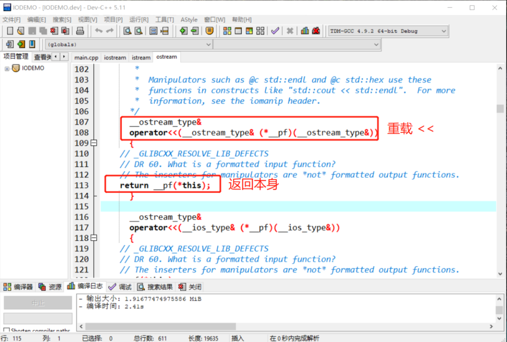
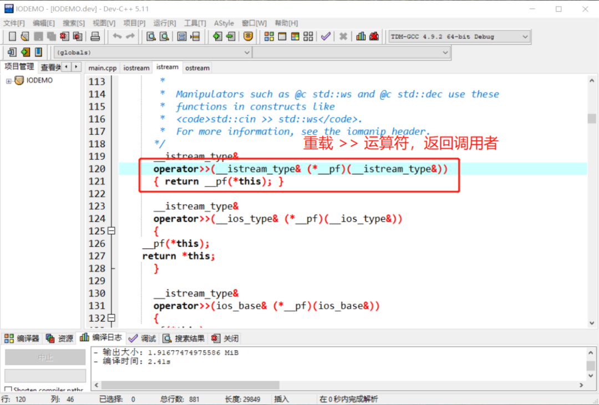
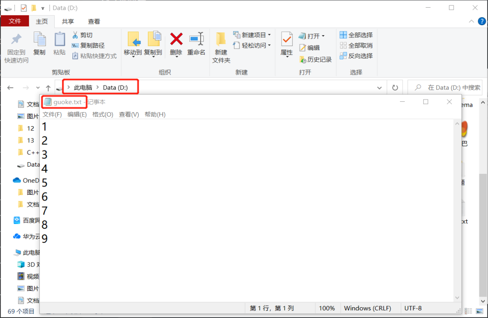
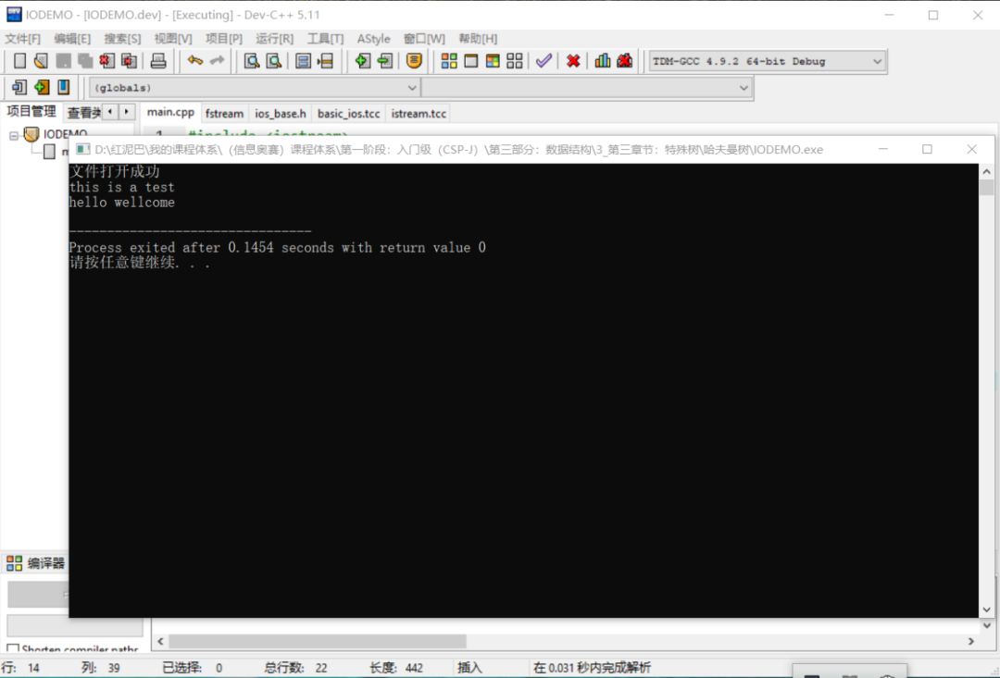
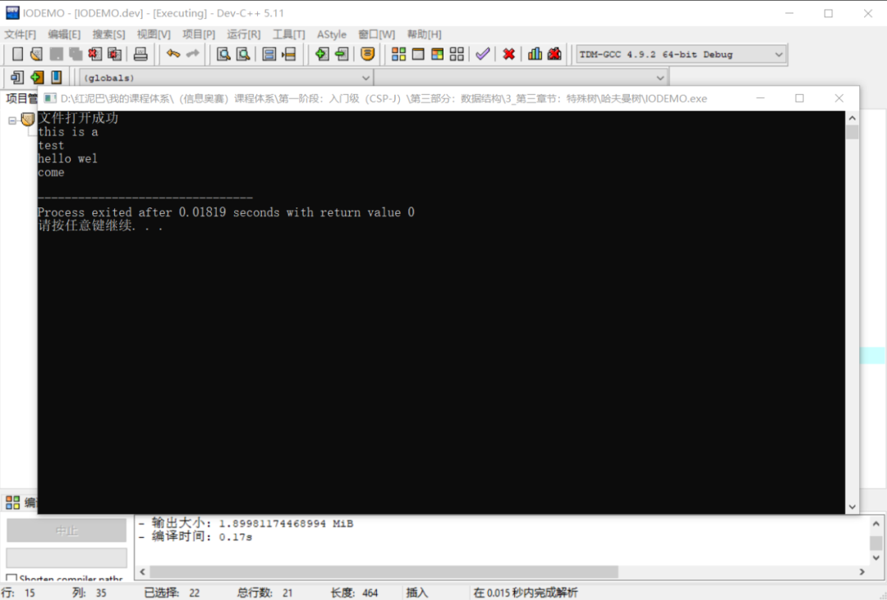
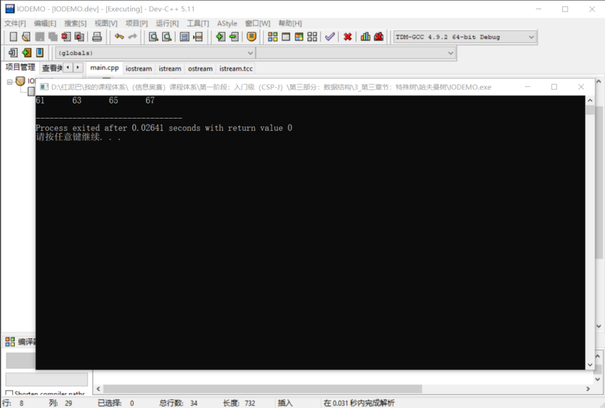

# C++ IO流_数据的旅行之路

## 1. 前言

程序中的数据总是在流动着，既然是流动就会有方向。数据从程序的外部流到程序内部，称为输入；数据从程序内部流到外部称为输出。

`C++`提供有相应的`API`实现程序和外部数据之间的交互，统称这类`API`为 `IO` 流`API`。

> `流`是一个形象概念，数据从一端传递到另一端时，类似于水一样在流动，只是流动的不是水，而是`数据`。

概括而言，流对象可连接 `2` 端，并在两者之间搭建起一个通道 ，让数据通过此通道流过来、流过去。

## 2. 标准输入输出流

初学`C++`时，会接触 `cout`和`cin` 两个流对象。

### 2.1 简介

`cout`称为标准输出流对象，其一端连接程序，一端连接标准输出设备（`标准输出设备一般指显示器`），`cout`的作用是把程序中的数据显示在显示器上。


除了`cout`，还有`cerr`，其作用和 `cout`相似。两者区别：

- `cout`带有数据缓存功能，`cerr`不带缓存功能。

  > `缓存`类似于`蓄水池`，输出时，先缓存数据，然后再从缓存中输出到显示器上。

- `cout`输出程序通用数据（测试，逻辑结果……），`cerr`输出错误信息。

> 另还有一个 `clog`对象，和 `cerr`类似，与`cerr`不同之处，带有缓存功能。

`cin` 称为标准输入流对象，一端连接程序，一端连接标准输入设备（标准输入设备一般指键盘），`cin`用来把标准输入设备上的数据输入到程序中。


使用 `cout`和`cin`时需要包含 `iostream`头文件。

```cpp
#include <iostream>
```

打开 `iostream` 源代码，可以看到 `iostream`文件中包含了另外 `2` 个头文件：

```cpp
#include <ostream>
#include <istream>
```


且在 `iostream`头文件中可以查找到如下代码：

```cpp
extern istream cin;  /// Linked to standard input
extern ostream cout; /// Linked to standard output
extern ostream cerr; /// Linked to standard error (unbuffered)
extern ostream clog; /// Linked to standard error (buffered)
```

`cout`、`cerr`、`clog`是 `ostream`类的实例化对象，`cin`是 `istream` 类的实例化对象。

### 2.2 使用

`ostream`类重载了`<<` 运算符，`istream`类重载了`>>`运算符，可以使用这 `2` 个运算符方便、快速地完成输入、输出各种类型数据。打开源代码，可以查看到 `<<`运算符返回调用者本身。意味着使用 `cout<<数据`时，返回 `cout`本身，可以以`链式方式`进行数据输出。




```cpp
#include <iostream>
using namespace std;
int main(int argc, char** argv) {
 string name="果壳"; 
 int age=12;
    //链式输出格式
 cout<<"姓名:"<<name<<"年龄："<<age; 
 return 0;
}
```

`istream`类重载了 `>>`运算符，返回调用者（`即 istream` 对象）本身，也可以使用链式方式进行输入。




```cpp
#include <iostream>
using namespace std;
int main(int argc, char** argv) {
 char sex; 
 int age;
    //链式输入
 cin>>sex>>age; 
 return 0;
}
```

`cout`、`cin` 流对象的其它方法暂不介绍，继续本文的重点文件流。

## 3. 文件流

文件流 `API`完成程序中的数据和文件中的数据的输入与输出，使用时，需要包含 `fstream`头文件。

```cpp
#include <fstream>
```

### 3.1 文件输入流

`ifstream`从 `istream`类派生，用来实现把文件中的数据l输入（读）到程序中。

> 输入操作对程序而言，也称为`读`操作。

文件输入流对象的使用流程：

#### 3.1.1  建立流通道

使用 `ifstream`流对象的 `open`方法建立起`程序`和`外部存储设备`中的文件资源之间的流通道。

> 文件类型分文本文件和二进制文件，本文以读、写文本文件为主。


使用之前，了解一下 `open`方法的原型说明。打开`ifstream`头文件，可查看到 `ifstream `类中有如下的信息说明：

```cpp
template<typename _CharT, typename _Traits>
class basic_ifstream : public basic_istream<_CharT, _Traits>
{
       /**
       *  @brief  Opens an external file.
       *  @param  __s  The name of the file.
       *  @param  __mode  The open mode flags.
       *
       *  Calls @c std::basic_filebuf::open(s,__mode|in).  If that function
       *  fails, @c failbit is set in the stream's error state.
       *
       *  Tip:  When using std::string to hold the filename, you must use
       *  .c_str() before passing it to this constructor.
       */
      void  open(const char* __s, ios_base::openmode __mode = ios_base::in)
      {
  if (!_M_filebuf.open(__s, __mode | ios_base::in))
    this->setstate(ios_base::failbit);
  else
    // _GLIBCXX_RESOLVE_LIB_DEFECTS
    // 409. Closing an fstream should clear error state
    this->clear();
      }
      #if __cplusplus >= 201103L
      /**
       *  @brief  Opens an external file.
       *  @param  __s  The name of the file.
       *  @param  __mode  The open mode flags.
       *
       *  Calls @c std::basic_filebuf::open(__s,__mode|in).  If that function
       *  fails, @c failbit is set in the stream's error state.
       */
      void  open(const std::string& __s, ios_base::openmode __mode = ios_base::in)
      {
        if (!_M_filebuf.open(__s, __mode | ios_base::in))
          this->setstate(ios_base::failbit);
        else
          // _GLIBCXX_RESOLVE_LIB_DEFECTS
          // 409. Closing an fstream should clear error state
          this->clear();
      }
 #endif
    }
```

`ifstream`重载了 `open`方法，`2` 个方法参数数量一致，但第一个参数的类型不相同。调用时需要传递 `2` 个参数：

- 第一个参数，指定文件的路径。第一个`open`方法通过 `const char* __s`类型（字符串指针）接受，第二个`open`方法通过`const std::string& __s`类型（字符串对象）接受。
- 第二个参数，指定文件的打开方式。打开方式是一个枚举类型，默认是 `ios_base::in(输入)`模式。打开模式如下所示：

```cpp
enum _Ios_Openmode 
{ 
      _S_app   = 1L << 0,
      _S_ate   = 1L << 1,
      _S_bin   = 1L << 2,
      _S_in   = 1L << 3,
      _S_out   = 1L << 4,
      _S_trunc   = 1L << 5,
      _S_ios_openmode_end = 1L << 16 
 };
  typedef _Ios_Openmode openmode;
    /// 以写的方式打开文件，写入的数据追加到文件末尾
    static const openmode app =  _S_app;
    /// 打开一个已有的文件，文件指针指向文件末尾
    static const openmode ate =  _S_ate;
    /// 以二进制方式打开一个文件，如不指定，默认为文本文件方式
    static const openmode binary = _S_bin;
    /// 以输入（读）方式打开文件
    static const openmode in =  _S_in;
    /// 以输出（写）方式打开文件，如果没有此文件，则创建，如有此文件，此清除原文件中数据
    static const openmode out =  _S_out;
    /// 打开文件的时候丢弃现有文件里边的内容
    static const openmode trunc = _S_trunc;
```

**打开文件实现：**

```cpp
#include <iostream>
#include <fstream>
using namespace std;
int main(int argc, char** argv) {
    ifstream inFile;
    //文件路径保存在字符数组中
    char fileName[50]="d:\\guoke.txt";
    inFile.open(fileName,ios_base::in);   
    //文件路径保存在字符串对象中
 string fileName_="d:\\guoke.txt" ;
 inFile.open(fileName_,ios_base::in);   
 return 0;
}
```

除了直接调用 `open`方法外，还可以使用 `ifstream`的构造函数，如下代码，本质还是调用 `open`方法。

```cpp
char fileName[50]="d:\\guoke.txt";
//构造函数
ifstream inFile(fileName,ios_base::in);
```

或者：

```cpp
string fileName_="d:\\guoke.txt" ;
ifstream inFile(fileName_,ios_base::in);
```

可以使用`ifstream`的 `is_open`方法检查文件是否打开成功。

#### 3.1.2 读数据

打开文件后，意味着`输入流通道`建立起来，默认情况下，文件指针指向文件的首位置，等待读取操作。

> 读或写都是通过移动文件指针实现的。

读取数据的方式：

- 使用 `>>` 运算符。

`ifstream`是`istream`的派生类，继承了父类中的所有公共方法，如同 `cin`一样可以使用 `>>`运算符实现对文件的读取操作。

> `cin`使用 `>>` 把标准输入设备上的数据输入至程序。
>
> `ifstream` 使用 `>>` 把文件中的数据输入至程序。
>
> 两者的数据源不一样，目的地一样。

提前在 `guoke.txt`文件中写入如下内容，也可以用空白隔开数字。




```cpp
#include <iostream>
#include <fstream>
using namespace std;
int main(int argc, char** argv) {
 //用来存储文件中的数据
 int nums[10];
    //文件输入流对象
 ifstream inFile;
    //文件路径
 char fileName[50]="d:\\guoke.txt";
    //打开文件
 inFile.open(fileName,ios_base::in);
 if(inFile.is_open()) {
         //检查文件是否正确打开
  cout<<"文件打开成功"<<endl;
  //读取文件中的内容
  for(int i=0; i<5; i++){
            //读取
            inFile>>nums[i];
            //输出到显示器
            cout<<nums[i]<<endl;
  } 
 }
 return 0;
}
```

如上代码，把文件中的 `5` 个数字读取到 `nums` 数组中。

> 用 `>>`运算符读取时，以换行符、空白等符号作为结束符。

- 使用`get`、`getline`方法。

`ifstream`类提供有 `get`、`getline`方法，可用来读取文件中数据。`get`方法有多个重载，本文使用如下的 `2` 个。`getline`方法和`get`方法功能相似，其差异之处后文再述。

```cpp
//以字符为单位读取
istream &get( char &ch );
//以字符串为单位读取
istream &get( char *buffer, streamsize num );
```

先在 `D`盘使用记事本创建` guoke.txt`文件，并在文件中输入以下 `2` 行信息：

```cpp
this is a test
hello wellcome
```

编写如下代码，使用 `get`方法以`字符类型`逐个读取文件中的内容。

```cpp
#include <iostream>
#include <fstream>
using namespace std;
int main(int argc, char** argv) {
 //用来存储文件中的数据
 int nums[10];
 ifstream inFile;
 char fileName[50]="d:\\guoke.txt";
 inFile.open(fileName,ios_base::in);
 char myChar;
 if(inFile.is_open()) {
  cout<<"文件打开成功"<<endl;
  //以字符为单位读取数据
  while(inFile.get(myChar)){
   cout<<myChar;
  }  
 }
 return 0;
}
//输出结果
this is a test
hello wellcome
```

读取时，需要知道是否已经达到了文件的末尾，或者说如何知道文件中已经没有数据。

- 如上，使用 `get` 方法读取时，如果没有数据了，会返回`false`。

- 使用 `eof`方法。`eof`的全称是 `end of file`， 当文件指针移动到文件无数据处时，`eof`方法返回 `true`。建议使用此方法。

```cpp
  while(!inFile.eof()){
   inFile.get(myChar);
   cout<<myChar;
  } 
  ```

使用 `get`的重载方法以`字符串`类型读取。

```cpp
#include <iostream>
#include <fstream>
using namespace std;
int main(int argc, char** argv) {
 //用来存储文件中的数据
 int nums[10];
 ifstream inFile;
 char fileName[50]="d:\\guoke.txt";
 inFile.open(fileName,ios_base::in);
 char myChar[100];
 if(inFile.is_open()) {
  cout<<"文件打开成功"<<endl;
  while(!inFile.eof() ) {
             //以字符串为单位读取
   inFile.get(myChar,100);
   cout<<myChar<<endl;
             //为什么要调用无参的 get 方法？
   inFile.get();
  }
 }
 return 0;
}
```

**输出结果：**




上述 `get`方法以`字符串`为单位进行数据读取，会把读出来的数据保存在第一个参数 `myChar`数组中，第二个参数限制每次最多读 `num-1`个字符。

如果把上述的

```cpp
inFile.get(myChar,100);
```

改成

```cpp
inFile.get(myChar,10);
```

则程序运行结果如下：




第一次读了 `9` 个字符后结束 ，第二次遇到到换行符后结束，第三行读了 `9` 个字符后结束，第四行遇到文件结束后结束 。

**为什么在代码要调用无参 `get`方法？**

因为`get`读数据时会把`换行符`保留在缓存器中，在读到第二行之前，需要调用无参的 `get`方法提前清除（读出）缓存器。否则后续数据读不出来。

`getline`和 `get`方法一样，可以以`字符串`为单位读数据，但不会缓存换行符（结束符）。如下同样可以读取到文件中的所有内容。

```cpp
while(inFile.eof()){
    inFile.getline(myChar,100)
 cout<<myChar<<endl;
}
```

- 使用 `read` 方法。

除了`get`和`getline`方法还可以使用 `read`方法。方法原型如下：

```cpp
istream &read( char *buffer, streamsize num );
#include <iostream>
#include <fstream>
using namespace std;
int main(int argc, char** argv) {
 //用来存储文件中的数据
 int nums[10];
 ifstream inFile;
 char fileName[50]="d:\\myinfo.txt";
 inFile.open(fileName,ios_base::in);
 char myChar[100];
 if(inFile.is_open()) {
  cout<<"文件打开成功"<<endl;
  inFile.read(myChar,100);
  cout<<myChar; 
 }
 return 0;
}
```

`read`一次性读取到`num`个字节或者遇到 `eof（文件结束符）`停止读操作。这点和 `get`和`getline`不同，后者以换行符为结束符号。

#### 3.1.3 关闭文件

读操作结束后，需要关闭文件对象。

```cpp
inFile.close(); 
```

### 3.2 文件输出流

`ofstream`称为文件输出流，其派生于`ostream`，用于把程序中的数据输出（写）到文件中。和使用 `ifstream`的流程一样，分 `3` 步走：

- **打开文件。**

使用 `ofstream`流对象的 `open`方法（和 `ifstream`的 `open`方法参数说明一样）打开文件，因为写操作，打开的模式默认是`ios_stream::out`，当然，可以指定其它的如`ios_stream::app`模式。

```cpp
#include <iostream>
#include <fstream>
using namespace std;
int main(int argc, char** argv) {
 //输出流对象 
 ofstream outFile;
 char fileName[50]="d:\\guoke.txt";
 outFile.open(fileName,ios_base::out);
 if (outFile.is_open()){
  cout<<"打开文件成功"<<endl;  
 }
 return 0;
}
```

- **写操作和读操作一样，有 `2` 种方案：**

1. 使用 `<<`运算符。

```cpp
#include <iostream>
#include <fstream>
using namespace std;
int main(int argc, char** argv) {
 //输出流对象 
 ofstream outFile;
 char fileName[50]="d:\\guoke.txt";
 outFile.open(fileName,ios_base::out);
 if (outFile.is_open()){
  cout<<"打开文件成功"<<endl;  
  for(int i=0;i<10;i++){
            //向文件中写入 10 个数字
   outFile<<i;
  }  
 }
 return 0;
}
```

输出结果：


1. 使用 `put `、`write`方法。

`put`方法以字符为单位向文件中写入数据，`put`方法原型如下：

```cpp
ostream &put( char ch );
#include <iostream>
#include <fstream>
using namespace std;
int main(int argc, char** argv) {
 //输出流对象 
 ofstream outFile;
 char fileName[50]="d:\\guoke.txt";
 outFile.open(fileName,ios_base::out);
 if (outFile.is_open()){
  cout<<"打开文件成功"<<endl; 
  for(int i=0;i<10;i++){
            //写入 10 个大写字母
   outFile.put(char(i+65) ); 
  } 
 }
 return 0;
}
```

`write`可以把`字符串`写入文件中，如下为`write`方法原型：

```cpp
ostream &write( const char *buffer, streamsize num );
```

参数说明：

- 第一个参数：`char`类型指针。
- 第二个参数：限制每次写入的数据大小。

```cpp
#include <iostream>
#include <fstream>
using namespace std;
int main(int argc, char** argv) {
 //输出流对象 
 ofstream outFile;
 char fileName[50]="d:\\guoke.txt";
 outFile.open(fileName,ios_base::out);
 char infos[50]="thisisatest";
 if (outFile.is_open()){
  cout<<"打开文件成功"<<endl;  
  outFile.write(infos,50);
 }
 return 0;
}
```

文件中内容：

```cpp
thisisatest
```

如果把

```cpp
outFile.write(infos,50);
```

改成

```cpp
outFile.write(infos,5);
```

则文件中内容为

```cpp
thisi
```

- **关闭资源。**

操作完成后，需要调用`close`方法关闭文件。

```cpp
outFile.close();
```

## 4. 随机访问文件

随机访问指可以根据需要移动`二进制文件`中的文件指针，随机读或写二进制文件中的内容。

> 随机访问要求打开文件时，指定文件打开模式为 `ios_base::binary`。

随机读写分 `2` 步：

- 移动文件指针到读写位置。
- 然后读或写。

随机访问的关键是使用`文件指针`的定位方法进行位置定位：

```cpp
gcount() 返回最后一次输入所读入的字节数
tellg() 返回输入文件指针的当前位置
seekg(文件中的位置) 将输入文件中指针移到指定的位置
seekg(位移量，参照位置) 以参照位置为基础移动若干字节
tellp() 返回输出文件指针当前的位置
seekp(文件中的位置) 将输出文件中指针移到指定的位置
seekp(位移量，参照位置) 以参照位置为基础移动若干字节
```

如下代码，使用文件输出流向文件中写入数据，然后随机定位文件指针位置，再进行读操作。

```cpp
#include<fstream>
#include<iostream>
using namespace std;
int main() {
 int i,x;
 // 以写的模式打开文件
 ofstream outfile("d:\\guoke.txt",ios_base::out | ios_base::binary);
 if(!outfile.is_open()) {
  cout << "open error!";
  exit(1);
 }
 for(i=1; i<100; i+=2)
        //向文件中写入数据
  outfile.write((char*)&i,sizeof(int));
 outfile.close();
     
    //输入流
 ifstream infile("d:\\guoke.txt",ios_base::in|ios_base::binary);
    
 if(!infile.is_open()) {
  cout <<"open error!\n";
  exit(1);
 }
 //定位 
 infile.seekg(30*sizeof(int));
 for(i=0; i<4 &&!infile.eof(); i++) {
         //读数据
  infile.read((char*)&x,sizeof(int));
  cout<<x<<'\t';
 }
 cout <<endl;
 infile.close();
 return 0;
}
```

原文件中内容：


代码执行后的运行结果，并没有输入文件中的所有内容。




## 5. 总结

本文讲述了标准输入、输出流和文件流对象。


